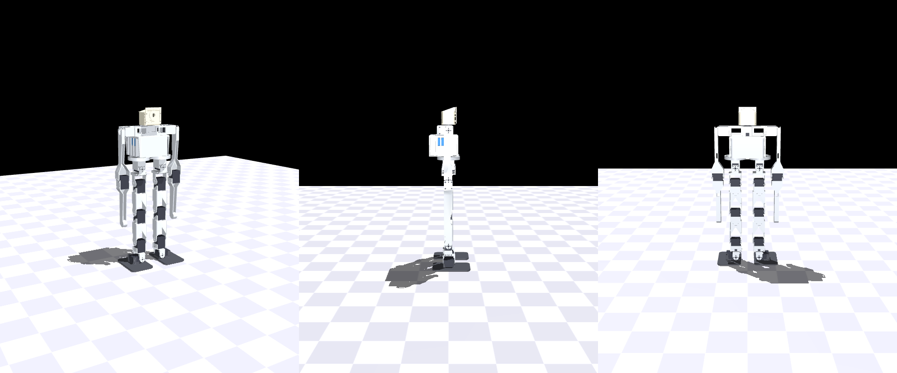

# Design

The current design of the robot: what it is, why each choice was made, what
has been validated and how, and what is still open. Dated records and the
evidence behind these numbers are in [docs/design-v6/](docs/design-v6/README.md);
the project's earlier history is in [docs/archive/](docs/archive/README.md).

**State:** the CAD is complete and passes its swept-ROM interference gate
(armless and with arms); the design passes simulation Gates A–D under the
servo plan below. Nothing has been printed or bought. The first step is a bench
measurement on one servo (issue #73), which gates the servo purchase.

## 1. Goal and requirements

A small 3D-printed biped that **walks by lifting one foot completely off the
ground**, gets itself up after a fall, and carries an onboard computer and a
head camera for navigation. Walking and get-up come from the body and an
open-loop gait first; a learned policy comes last, once the hardware has shown
its margins.

Each requirement traces to a measurement on the earlier 10-joint prototype
(see [lessons learned](docs/archive/2026-09-13-lessons-learned-walking.md)):

| | requirement | how the design meets it |
|---|---|---|
| R1 | A **static single-foot stance** must exist, with margin | ankle roll: a 6th joint per leg (Gate A: 30 mm CoM margin on one foot) |
| R2 | Margins are measured on the body **before any policy** | Gates A–D in simulation, then the same open-loop script on the bench; the policy (Gate E) is last |
| R3 | The **roll chains must be stiff** | every roll joint double-supported (horn + idler); servo stiffness is the one gated assumption (§4) |
| R4 | **Speed and torque margin** under load: ≥ 2× speed, ≥ 1.5× torque at 11.1 V | met at the design cadence (§8) |
| R5 | Contact realism made adversarial | every gate runs μ 0.3–1.0, full self-collision, free play on the rolls, and the deployed actuation chain |
| R6 | An onboard computer and camera | Raspberry Pi 4B in the torso, Camera Module 3 Wide in a head on a neck servo |
| R7 | Keep what is proven | hip yaw (decisive for turning in place), the "servo is the axle" leg link, one-print torso, the 50 Hz ESP32 control loop, the General Driver board, a 3S pack |
| R8 | Size may grow to ~45 cm and a bigger pack | deck top 460 mm, head top 555 mm |

## 2. The robot at a glance

| | |
|---|---|
| joints | **17**: per leg hip yaw, hip roll, hip pitch, knee, ankle pitch, ankle roll (12); neck yaw (1); per arm shoulder pitch, elbow (4) |
| servos | 15 × Feetech STS3215 (12 V, ST-3215-C018), with a raised position-loop gain on the ankle rolls and knees, and 2 × STS3250 at the hip rolls (§4) |
| height | deck top 460 mm, camera 530 mm, head top 555 mm |
| mass | ≈ 2.21 kg as drawn (§7) |
| controller | Waveshare General Driver for Robots (ESP32, onboard QMI8658C IMU), 1 Mbaud half-duplex servo bus |
| compute | Raspberry Pi 4B (vision, navigation), talking to the ESP32 |
| camera | Raspberry Pi Camera Module 3 Wide (102° HFOV) in the head, ±90° neck yaw |
| power | 3S LiPo 2200–2600 mAh (≤ 105 × 36 × 26 mm, ~170 g), protection board, inline fuse, 5 V / 5 A buck for the Pi |
| structure | PETG prints, TPU 95A soles; M2.5 flat-head self-tappers into printed pilots, M3 screws on the servo horns and idler discs |

## 3. Kinematics

Frames: +X forward, +Y left, +Z up. Leg chain from the pelvis down: yaw → roll →
pitch → knee → ankle pitch → ankle roll.

| joint | axis | range as drawn | servo placement |
|---|---|---|---|
| hip yaw | Z | ±45° | in a cell under the pelvis's battery layer, horn down; the yaw carrier (the whole leg) bolts to the horn |
| hip roll | X | ±55° swept (sim: 30° adduction, 45° abduction) | in the yaw carrier's bay, output forward |
| hip pitch | Y | −120° … +90° | at the thigh top, 50 mm below the roll axis, gripped by the leg link |
| knee | Y | 0 … 130° flexion | at the shin top; relief cuts on the leg link allow the deep flexion the get-up needs |
| ankle pitch | Y | ±40° | hangs in the ankle link's grip channel |
| ankle roll | X | ±25° | lies across the foot, output axis fore-aft; the ankle link forks onto its horn (front) and idler (rear) |
| neck yaw | Z | ±90° | stands on the deck, horn up; the head bolts to the horn |
| shoulder pitch | Y | −90° … +200° (0 = hanging, 90 = straight back, 180 = up along the torso) | lies fore-aft inside the shoulder girdle, horn outboard |
| elbow | Y | −100° … +10° | in the forearm's grip channel; the upper arm forks round it on both discs |

**Axis stack** above the sole: ankle roll 18.4 → ankle pitch 76.4 → knee 186.4 →
hip pitch 296.4 → hip roll 346.4 → hip yaw 386.5 → deck top 460.3 → shoulder
476.6 mm. Thigh and shin are 110 mm each (the same printed part); ankle pitch to
roll 58 mm.

**Why these numbers** (Gate A/D sweeps, `docs/design-v6/gateA_geometry_sweep.txt`):

- **Hip separation 84 mm.** The one-foot CoM margin is half the foot width
  whatever the hips do, so the foot is the margin budget and the hips set roll
  torque: narrower is stiffer (3.4× torque margin at 70 mm, 1.0× — stalled — at
  96 mm). At 72 mm the swing foot, which sags 12–15 mm inward while it hangs,
  lands on the stance foot. 84 mm leaves 24 mm between the soles and room for
  the pack between the yaw servos.
- **Legs 110 + 110 mm.** Longer levers lower the joint rates for the same step:
  the swing knee's speed margin goes 1.1× → 1.64× from 90 to 110 mm links.
- **Feet 130 × 84 mm, sole centreline 12 mm outboard of the ankle-roll axis**
  (30 mm inboard half, 54 mm outboard; 75 mm toe, 55 mm heel). The open-loop walk
  fails outward — the pelvis swings inward in single support and the closed
  chain throws it out at touchdown — so the sole extends outboard; the inboard
  half is sized for the swing-phase inward drift. 4 mm PETG plate, 2 mm TPU 95A
  sole glued flat; mirrored left/right.
- **Forward knee.** A backward knee is the forward knee with time reversed in
  the sagittal plane; it gains nothing here and needs ±55° of ankle pitch.
- **Hip yaw on every leg.** It is what makes turning work (the walk turns up to
  20° per step, §8).

## 4. Actuation: STS3215s, with an STS3250 at each hip roll

Fifteen joints are STS3215s. The two **hip rolls are STS3250s**: same case,
horn and screw rows, +19.5 g, and ≈ 4× the STS3215's stiffness in the model.
The walk and get-up are limited by **roll-chain compliance, not torque or
speed**: under single-support load a soft hip or ankle roll sags, the pelvis
drifts toward the swing side, and the closed chain springs it outward at
touchdown. With stock STS3215s at the rolls and knees the design walks 0/4
gate cases and gets up 0/12 (`docs/design-v6/no3250_*.txt`). Nothing that
leaves joint stiffness alone moves that — cadence, lift, CoM aim, landing
offsets, a lighter torso or shorter legs.

**The plan: STS3250s at the hip rolls, and a raised position-loop P
(register 21, default 32) on the ankle-roll and knee STS3215s.** The bench
(#73, [experiments/plan-b-bench/](experiments/plan-b-bench/README.md)) found
P 96 / D 0 the smoothest high-gain setting at walking speeds, at ≈ 2.8× the
stock stiffness; P 128 (≈ 3.5×) shakes more, and P 160 (≈ 4.8×) limit-cycles
under a rigid inertia. With the tuned STS3215s at 2.8×, the extra stiffness
matters at the hip rolls, and two STS3250s there match the six-STS3250
assignment (design record §14.4a; on the robot's plant with the arms,
`docs/design-v6/no3250_mixsweep28_arms_bearingA.txt` and
`no3250_mixsweep28rolls_arms_bearingA.txt`):

| servo set (the other rolls and knees: STS3215 at 2.8×) | adversity matrix (18 cases × 3 seeds) |
|---|---|
| 6 STS3250, rolls + knees | 18/18 |
| no STS3250 | 15/18 |
| 2 STS3250 at the knees | 15/18 |
| 2 STS3250 at the ankle rolls | 15/18 |
| **2 STS3250 at the hip rolls** | **18/18** (17/18 on the 74.5 g plant) |
| 4 STS3250 at all four rolls | 17/18 |

The plant builder gives the sweep one servo mass for all six roll and knee
places, so a mixed set runs on the 55 g plant and is bracketed by the 74.5 g
one. The model does not represent the bench's sweep roughness at P ≥ 96.

**What raising P buys, in the model.** The walk loads (≤ 1.2 N·m, under 45 %
of stall) sit in the servo's linear region, so P raises static stiffness
roughly in proportion. At P × 4 on rolls and knees, above what the bench could
hold smoothly, the STS3215 matches the STS3250 case for case:

| | walk, CAD plant (4 cases) | adversity matrix (18 × 3 seeds) | walk with arms (5 cases) | get-up, as drawn |
|---|---|---|---|---|
| stock STS3215 | 0/4 | 0/18 | 0/5 | 0/12 |
| **P × 4, rolls + knees** | **4/4**, CoM margin 7.5–12.2 mm, clearance 15–20 mm | **15/18** | **4/5** | **robust 6/6** |
| P × 3, rolls + knees, ≤ 1° roll play | 4/4, margin 14.1–14.7 mm | — | — | — |
| STS3250 at rolls + knees | 4/4 | 15/18 | 5/5 | robust 6/6 |

Envelope under P × 4 at the design cadence: torque margins 2.7× (hip roll),
3.2× (knee), 2.3× (ankle roll); speed 6.0×, 2.3×, 2.2×. The STS3215 knee is
under the 2× speed rule at a 1.2 s swing (1.7×), so **the gait keeps a ≥ 1.6 s
swing**. Torque is not what binds: "servos −30 %" still passes.

**Still to measure:** the STS3250's ≈ 4× is a third-party figure that the
model adopts. The two on order go on the #73 rig first, for a direct comparison
with the STS3215 data, and the per-ID P/D table follows from that. If they fall
short, the fallbacks in order are the I term (register 23), one STS3235 (same
case, metal gears) to see whether the gears are what is soft, the ST-3025
(brushless, different case: a CAD redo), and last a Dynamixel XC430 (new bus
and board). Verified STS3250 sources and its Model_Number (2825) are in
[docs/bom.md](docs/bom.md).

The gain is a register, so it can silently revert: a factory reset or a
swapped spare comes back at 32 and the robot falls at its first crossover. The
firmware reads registers 21/22 at boot and before every arm and refuses to arm
on a mismatch with its per-ID table, which is recorded in
[docs/servo-map.md](docs/servo-map.md) §4 (factory values until the bench sets
them).

**Deploy servo model** used by every gate: kp 12 N·m/rad fitted to the
STS3215 (the bench measured ≈ 17), a torque–speed clamp at 11.1 V, the
bench-measured actuation response as a 2 Hz lag plus 80 ms dead time (the
firmware's 10 Hz command shaper and the servo's own response), integer goal
ticks, 5 ms bus latency, 1° gear backlash and 3° of free play on the four roll
joints. P × N is modelled as N × the fitted stiffness on the same envelope.
Measured STS3215 facts: no-load speed 4.04 rad/s at 12 V (14 % under the
datasheet), stall ≈ 2.94 N·m, dead time ≈ 85 ms plus a first-order lag.

**The shoulder** is the most heavily loaded servo in the get-up: 1.77 N·m (65 %
of stall) on the recommended sequence. STS overload protection drops a servo to
20 % torque after > 80 % of stall for 2 s (registers 34–36), so the margin is
real but not large; the bench should confirm it.

## 5. The body

All parts are parametric build123d under `cad/v6/`, driven by
`cad/v6/dimensions_v6.py`, which takes every servo-interface number (case,
discs, screw rows, idler face, countersinks, fits) from `cad/dimensions.py` —
measured from the vendor's STEP model (`cad/vendor/ST3215.step`). Print list:
[cad/PRINT_LIST.md](cad/PRINT_LIST.md); code map: [cad/README.md](cad/README.md).

### 5.1 Legs

- **`leg_link_v6`** (×4, thigh = shin): the servo is the axle — a grip channel
  holds one servo's case, and a fork at the other end straddles the next
  servo's horn and idler discs. Closed box section, 110 mm, relief cuts for
  130° of knee flexion and for −120° of hip flexion.
- **`ankle_link`** (×2): grips the ankle-pitch servo and forks fore/aft onto the
  ankle-roll servo's discs.
- **`foot_L` / `foot_R`**: the roll servo lies across the foot plate in a
  cradle with two screwed retention tabs; `sole_tpu_L/R` in TPU 95A for edge
  compliance and grip.

### 5.2 Hip

- **Yaw carrier** (×2): hangs from the yaw servo's horn and carries the hip-roll
  servo in its bay.
- **Hip-yaw bearing: a 6810-2RS** (50 × 65 × 7 mm, sealed deep-groove,
  52 g) per hip. Without it the yaw servo's horn and four M3 screws would be
  the only connection between a 0.335 m leg and the pelvis (single-support
  thrust ~15 N, roll moment ~0.65 N·m). The bearing moves thrust and moment
  into the pelvis and leaves the servo shaft carrying torque only.
  - The inner race sits on a round hub on the carrier (Ø50.08, +0.08 mm), the
    outer race in a recess in the pelvis skirt (Ø64.96, −0.04 mm) against a
    shoulder that takes the thrust. Both seats get retaining compound: the
    fits are inside the printer's error band.
  - The bearing band is the top 7 mm of the carrier, so the hip stack is no
    taller. The bore is sized to clear the roll servo's case inside the band
    (22.23 mm corner reach, with a 1.5 mm wall).
  - The pelvis shoulder is sized to an *estimated* outer-ring ID: measure a
    real bearing before printing the pelvis.
  - Load margin > 100×. Selection, alternatives (a 6811-2RS wrapping the
    rectangular carrier; screwed race retention) and checks:
    [study-yaw-bearing.md](docs/design-v6/study-yaw-bearing.md) (option A,
    #75).
- **`hip_yoke_v6`** (×2): the hip-roll clevis and hip-pitch clevis fused into
  one print, straddling the roll servo's discs and the pitch servo's discs. No
  flange bolts or inserts.

### 5.3 Torso

**`pelvis_v7`**, one print, deck-top-down (190 g with the bearing seats, §5.2):

- two yaw cells at y = ±42 mm, each with a ceiling carrying the yaw servo's four
  stator screws;
- a 31 mm battery layer above them: the pack lies transverse, belted with a
  15 mm hook-and-loop strap, and goes in through the deck aperture (which
  also runs under the neck servo, so the deck does not seat it: §5.5);
- the General Driver vertical on the front wall and the Pi 4B vertical on the
  aft wall, both sliding down guide channels through deck slots (16 mm of
  component depth behind the Pi: low-profile heatsink, no fan);
- a 60 × 8.4 × 25 mm pocket for the protection board and 5 V buck;
- side windows for the Pi's USB/Ethernet and the driver's service edge.

The pelvis carries ten deck pilots for the girdle. The code's `ARMS=0`
variant (no girdle, no arms, `neck_collar` for the neck) builds it without
them; that variant is kept for the CAD checks and is not a print target.

### 5.4 Arms and shoulder girdle

- **`shoulder_girdle_v6`** (one print, 77 g, 200 × 58 × 33 mm) sits on the
  deck and holds both shoulder servos in open-top pods plus the neck servo's
  tube, whose side walls carry four bosses for the neck floor (§5.5). Ten
  M2.5 × 8 flat-heads into deck pilots on two edge rails. **The pack goes in
  before the girdle**: it cannot pass the neck tube or the neck floor
  afterwards, so the neck is built into the girdle on the bench first.
- **Shoulder axis in the hip plane** (x = 0), 16 mm above the deck top, arm
  planes at y = ±103.35 mm.
- **Upper arm 160 mm, forearm 160 mm.** The 0.32 m reach is a measured
  threshold: the hand must reach the floor behind the hips at hip level; 0.30 m
  never stands.
- Hand: a 12 mm-radius knuckle, bare PETG.
- **Idle pose while walking: shoulders held 15° back** — hanging straight, the
  forearms touch the swinging legs.

### 5.5 Neck and head

The neck STS3215 stands on its idler face in the girdle's neck tube, horn up,
±90° yaw. The deck cannot seat it (its battery aperture runs under the whole
servo), so its seat is **`neck_floor`**: a 2 mm plate, its own print (4 g),
screwed up into four bosses on the tube's side walls with M2.5 × 8
flat-heads, dropping into the aperture with its top 3 mm below the deck top.
Four pads rise from it to the case's idler face, trimmed clear of the turning
idler disc and hub and of the moulded back-cover platform, and take the four
stator screws (M2.5 × 8 up through the floor, 4 mm of bite). The plate sits
4.5 mm over the pack, so the neck goes in on the bench: plate into the tube,
servo down onto the pads (leads plugged first, out through a window in the
floor under the connector trench), stator screws from below; then the girdle
goes onto the deck. The head (`head_shell` +
`head_face`, ~35 g) bolts to its horn with 4 × M3 and carries the Camera
Module 3 Wide on M2 bosses; the ribbon runs through a slot beside the axis.
A stereo alternative from one camera and four mirrors is proposed in PR #71
(not merged).

## 6. Electronics and power

Detail: [docs/wiring.md](docs/wiring.md), [docs/sensor-expansion.md](docs/sensor-expansion.md).

- **One servo bus**: all 17 servos on the General Driver's 1 Mbaud half-duplex
  TTL bus. Bus timing is not expected to bind: 12 servos take ≈ 3.4 ms of the
  20 ms tick; the 17-servo figure has not been computed.
- **Current is open**: the board's servo power path is rated 5 A continuous,
  and the servos can draw more than that in transients. The fuse, the bulk
  capacitor and a current budget from simulated walk and get-up traces are
  required before the first powered floor run.
- **Power path**: pack → protection board (≥ 15 A, over-discharge cut-off) →
  10–15 A fuse → switch → board inlet; bulk capacitor (1000 µF, ≥ 25 V) at the
  board; Pololu D24V50F5-class 5 V / 5 A buck for the Pi.
- **The ESP32 runs the 50 Hz control loop** and the servo bus; the Pi does
  vision and navigation and talks to the ESP32. How the Pi gets bus voltage and
  current for a low-battery shutdown is open.

## 7. Mass

The robot as drawn, from the CAD-inertial plant
(`sim/bimo_biped_v6ar.xml`) and the rollup
(`docs/design-v6/parts_v6_rollup.txt`):

| | |
|---|---|
| robot | ≈ 2.25 kg (the plant: 2.245 kg) |
| servos | 15 × 55 g + 2 × 74.5 g = 974 g |
| printed PETG + TPU | ≈ 0.77 + 0.05 kg: pelvis 190 g, girdle 77 g, arm links 134 g, legs from the yaw carriers down ≈ 0.33 kg, head 35 g, neck floor 4 g |
| hip-yaw bearings | 104 g (2 × 6810-2RS) |
| pack / boards + wiring | 170 g / ≈ 180 g |

With STS3215s at the hip rolls too it is 39 g lighter, and with STS3250s at
all six roll and knee joints 78 g heavier. The P × 4 table in §4 and the gates
in §8 and §9 were run on earlier plants: the armless CAD-inertial plant (1.67 kg) for the
walk, the lumped as-drawn get-up plant (2.10 kg, no bearings) for the arms. On
this plant with STS3215s at the hip rolls (2.205 kg), P × 4 on the rolls and
knees walks the four gate cases 4/4, with 32–37 mm of CoM margin, and stock
STS3215s still fall 0/4 (`docs/design-v6/no3250_walk_bearingA.txt`). With the
arms held at 15° and self-collision on, P × 4 stays up in 4 of 5 cases with no
arm-to-leg contact (the μ 0.9 turn falls), measured on a plant with 83 g
bearings, 79 g heavier (`no3250_arms_walk_plant17.txt`).

The plant carries every part at its CAD inertia (`sim/build_v6_inertia.py`):
the printed parts from their STLs, each servo on its case mock at its CAD
place, the bearing as two rings split between the pelvis and the carrier, the
pack and boards as boxes. It is replaced by weighed masses once the parts
exist.

## 8. Walking

**First walk is open-loop**: `sim/static_gait.py` shifts the whole-robot CoM 5 mm
*inboard* of the stance sole centreline (so any drift falls toward the incoming
foot), swings the other foot on a sine arc, settles, and crosses over; joint
targets from the analytic IK (`sim/v6_kin.py`) at 50 Hz, min-jerk transitions
throughout. On hardware the same keyframes stream through the firmware's
`pose` path.

- **Cadence**: shift 1.6 s per 60 mm, swing 1.6 s, land 0.5 s — 5.25 s per 6 cm
  step. A step command is a fall; the swing leg lags its command ~0.3 s through
  the actuation lag and dead time, so the 0.5 s settle before the next shift is what
  separates a walk from a fall at the crossover. A 4 cm commanded lift gives
  15–25 mm of real clearance.
- **Turning** is walking in an arc: each swing foot is placed in a frame
  rotated from the stance foot and each leg is solved in its own yawed frame.
  Up to 20° of heading per step holds the same margins; the achieved heading
  is 10–15 % short of commanded (yaw-chain compliance), which a heading-aware
  controller closes.
- **Limits the gates found**: 5° of roll play fails at some friction values —
  hence the ≤ 3° requirement and ≤ 1° target per roll joint; a faster 1.2 s
  cadence loses the low-friction case.

**The policy comes after** the open-loop gait works on the floor (Gate E): trained
on the measured plant with the measured masses, stiffness and play in it —
[docs/training.md](docs/training.md).

## 9. Get-up

**Backward falls (supine) → the seat push with the arms**, a scripted sequence:
sit up with the arms folded up along the torso, plant the hands behind the
hips, tuck to hip −120° / knee −130°, and push (shoulder 90° → 0°, elbow −90° →
0°) while the ankles dorsiflex. On the as-drawn robot it stands, robust 6/6
(play 5°, μ 0.3–1.0, servos at 65–100 %), with 1° of margin on hip flexion (the
tuck needs ≥ 119°; the leg link's relief gives 120°). Config
`r5_asdrawn_rom120` in `sim/getup_v6_shoulder.py`.

**Forward falls (prone) are open.** The legs-only roll prone → side → supine
works on the bare body, but with the arms folded it fails 0/6 for every servo
choice — the arms block the roll. Candidates: an arm stow that clears the roll,
catching a forward fall on the hands, a one-arm roll.

**Paths that do not work**, each measured (full record in
[getup-decision-2026-09-17.md](docs/design-v6/getup-decision-2026-09-17.md) and
[getup-noappendage-2026-09-14.md](docs/design-v6/getup-noappendage-2026-09-14.md)):

| path | why not |
|---|---|
| legs only (≈ 150 sequences + continuous searches, deep flexion, kneel, pincer) | legs (0.335 m) are shorter than torso + head (0.55 m): every pivot on a leg contact lands the head, and below pelvis ~0.33 m no grounded pose puts the CoM over a sole |
| arms with reach ≤ 0.30 m | they push on the torso, not the floor behind the hips; the body pivots over the head |
| a third shoulder DOF; a one-arm side push; a prone push-up | 0 of hundreds of variants |
| no appendage at all: kip, bear, crow, bridge, rock-rise, a pelvis skid or rear bumper | the pelvis only lifts with a push from far behind the hips; a kip is bandwidth-bound under the deploy servo, not torque-bound. A hip −90…−100° crouch does keep the CoM 33–69 mm over the feet (full −125° flexion parks it behind the heel) — the target if a learned rise is ever tried |
| a tail at the hips | works in sim, rejected for the robot |
| a flat "bird" chassis with side-mounted hips | stands up in sim and is the documented fallback if the arm path fails on hardware, but needs a new chassis, hip and gait; most falls end on an edge |
| RL (PPO) reward shaping | reaches the kneel, never the rise (≈ 1.3 B steps) |

**Rules for get-up work**: search continuously before declaring a path dead;
verify a winner at 3× slower and across play, μ and servo strength; always run
with full self-collision; gate every idle pose of a hanging part in a walk; on
hardware, only with a sim margin, one motion per go, on the floor.

## 10. Validation method

Simulation can prove a design's capability before anything is ordered. The
gates, in order:

| gate | question | tool |
|---|---|---|
| A — kinematic capability | does a static single-foot stance exist, with margin, inside every joint limit and without self-contact? | `sim/design_gates.py` |
| B — actuator envelope | do the needed motions leave ≥ 2× speed and ≥ 1.5× torque at 11.1 V? | `sim/design_gates.py` |
| C — contact realism | does it survive μ 0.3–1.0, play as free travel, self-collision, the measured actuation lag and dead time? | built into D |
| D — open-loop capability | does the scripted walk (and get-up) hold across the adversity matrix? then: the same script on the bench | `sim/static_gait.py`, `sim/gate_no3250.py walk|sweep|envelope|arms|getup`, `sim/getup_v6_shoulder.py` |
| E — policy | only after D passes on hardware | [docs/training.md](docs/training.md) |

`tests/test_v6_design_gates.py` pins the plant, the IK and Gates A/B in the
pre-push suite.

**CAD gates** (`sh cad/run_checks.sh`): `cad/v6/check_assembly_v6.py` poses the
articulated assembly through every joint's range for every pair of pieces that
move relative to each other, checks the relatively fixed pairs that must keep
their distance (the neck floor over the pack) and every disc screw's thread
engagement, on the robot's build and the `ARMS=0` variant (results in
`docs/design-v6/cad_rom_check.txt`); printability audits report bridges,
ceilings and islands for the slicer's support settings; `cad/v6/animate_v6.py`
flies the parts in along their insertion paths to prove they assemble.

**Plants**: `sim/gen_plant_v6.py` builds a parametric plant (`DesignParams`) for
design sweeps; `sim/build_v6_inertia.py` builds the CAD-inertial plant of the robot as
drawn (17 actuators, arms at rest at the 15° walking hold, the servo set's masses,
the hip-yaw bearings split between the pelvis and the carriers); `sim/bimo_biped_v6ar.xml` is the committed plant,
pinned by the tests.

## 11. Software

The software stack runs on hardware today and is shared by every body:

- **Firmware** (`firmware/`): the 50 Hz control loop on the ESP32 with the policy
  network in flash, a 250 Hz IMU sampler and attitude fusion, the command
  shaper, calibration in NVS, arming, fall and battery guards —
  [firmware/README.md](firmware/README.md), [docs/firmware-design.md](docs/firmware-design.md).
- **Link** (`link/`): a UDP protocol over Wi-Fi with a failsafe, and the
  consoles (`bimo_gui`, `bimo_tui`, `link/commander.py`) —
  [docs/control-channel.md](docs/control-channel.md).
- **Training** (`sim/mjx/`, `sim/walker_env.py`): brax PPO on MuJoCo MJX,
  graded by a CPU referee, distilled into the firmware —
  [docs/training.md](docs/training.md).
- **SIL** (`sim/sil/`): the real firmware code against the simulated plant —
  [docs/sil-harness.md](docs/sil-harness.md).

**The deployed policy is the 10-joint prototype's** (5 DOF per leg, no arms
or neck; plant `sim/bimo_biped_v5body.xml`, servo IDs 1–10). The training
envs and the referee also run on the robot's plant (12 leg joints driven, neck
and arms held, per-servo stiffness; [docs/training.md](docs/training.md) §13).
The firmware's bus side is the robot's 17 servos (calibration, `pose`,
telemetry, SIL ABI; the proposed ID map in
[docs/servo-map.md](docs/servo-map.md) §2.1), and the obs-spec generator
handles a robot run; a 17-servo bench test and a policy trained on the robot's
plant are open work (#81, #86).

## 12. Open decisions and open work

Everything open is a GitHub issue.

| decision | issue |
|---|---|
| servo set: the STS3250s' bench comparison and the per-ID gains | #73, then the purchase #74 |
| head: mono camera, or the stereo periscope | PR #71, #87 |
| make the code's defaults the robot to print: arms, the servo set, the 6810-2RS bearing, rollup and plant are done; the head follows PR #71 | #76 |

| work | issue |
|---|---|
| servo ID map, wiring, current budget | #77 |
| non-servo parts order | #78 |
| first print and fit check | #79 |
| assembly guide with figures | #80 |
| firmware port to 17 joints (with the register-21 check at boot) | #81 |
| measured plant, then the open-loop floor sequence | #82 |
| shoulder overload margin | #83 |
| scripted get-up on hardware | #84 |
| get-up from prone | #85 |
| training stack port (Gate E) | #86 |
| Pi and head camera integration | #87 |
| goal-conditioned locomotion | #88 |
| servo model: overload cutoff, sag, thermal | #6 |
| exteroceptive observation | #11 |

## 13. Build sequence

0. **Bench, no purchase** (#73, [experiments/plan-b-bench/](experiments/plan-b-bench/)): one spare STS3215 — read registers 21/22/23;
   torque off, write P 32 → 64 → 96 → 128 → 160 with D scaled (128 is exactly
   4 × 32, so 160 shows which side of the line it falls); measure stiffness from
   Present Position with 0.5 / 1.0 / 1.5 N·m on a lever; hold a leg-like
   inertia and watch for buzz; confirm the protections don't trip.
1. **Stance test**: that servo in a hip-roll mount, 8° of roll with a planted
   foot; pass ≤ 0.3° short at load 120 (≤ 0.4° on the 3× route).
2. **Buy** the STS3215s (15 needed, 12 on hand, plus spares), the two
   STS3250s for the hip rolls (ordered 2026-10-02, #74), the two 6810-2RS
   bearings (+ 2 spares), and the non-servo parts ([docs/bom.md](docs/bom.md)).
3. **Configure** P and D per ID; record them in `docs/servo-map.md`.
4. **Print and assemble** ([cad/PRINT_LIST.md](cad/PRINT_LIST.md),
   [docs/assembly.md](docs/assembly.md)); weigh every part; measure play per roll
   joint (≤ 3° required, ≤ 1° target).
5. **Put the measurements in the plant** and re-run the gates
   (`gate_no3250.py walk | sweep | arms | getup`).
6. **Floor sequence, over the tether, one motion per go**: stand → crouch →
   shift → one-foot → step in place → six steps; each step a margin, clearance
   and slip number against the sim's. Then the scripted get-up.
7. **Gate E**: train a policy on the measured plant.

## 14. Design principles

- The servos are the skeleton: geometry comes from the vendor's STEP and
  datasheet, never from photos.
- Bench before policy. Measure a margin on the body before asking a policy to
  find it.
- Model a term only after the bench has measured it; a guessed
  domain-randomization range makes a policy robust to a thing the robot does
  not do.
- Calibrate the simulation where the question lives, and run the deployed
  actuation chain (lag, dead time, ticks, play) inside every gate.
- Stiffness of the roll chains is the whole game: double-support every roll
  joint, thread-lock horn screws, measure play per joint before the first walk.
- Every relatively-moving pair is enumerated and swept; a pair that is not
  listed is a pair that was never checked.
- Supports are the slicer's job; model printable geometry, not support slabs.
- Dynamic tests on hardware need the sim margin first and a go per attempt.

## Source-of-truth files

| what | file |
|---|---|
| every CAD dimension | `cad/v6/dimensions_v6.py` (servo interface from `cad/dimensions.py`) |
| the parts | `cad/v6/*.py`, exported to `cad/v6/stl`, `cad/v6/step` by `cad/v6/parts_v6.py` |
| the assembly and ROM gate | `cad/v6/assembly_v6.py`, `cad/v6/check_assembly_v6.py` |
| the plant | `sim/gen_plant_v6.py`, `sim/build_v6_inertia.py` → `sim/bimo_biped_v6ar.xml` |
| gait, IK, gates | `sim/static_gait.py`, `sim/v6_kin.py`, `sim/design_gates.py`, `sim/gate_no3250.py` |
| get-up | `sim/getup_v6_shoulder.py` (with `sim/getup_v6.py`) |
| records and evidence | `docs/design-v6/` |
