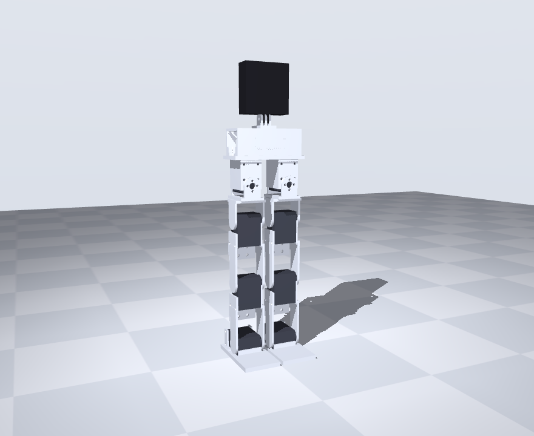

# Bimo-like Biped

A small (~34 cm, ~0.9 kg) 3D-printed **bipedal robot** built around 8× Feetech
STS3215 serial-bus servos (4 DOF per leg: hip-roll, hip-pitch, knee, ankle),
developed through an LLM-assisted loop:

> parametric CAD → MuJoCo physics sim → RL walking policy → print → sim-to-real

Inspired by (not a clone of) the open-source [Bimo Project](https://github.com/mekion/the-bimo-project);
the geometry is anchored to servo datasheet dimensions rather than
reverse-engineered parts. Full design history, decisions, and experiment logs
live in [DESIGN.md](DESIGN.md).



## Where it stands

- **Simulation & RL** — a Gymnasium env wraps the CAD-true MuJoCo model
  (mesh visuals + contacts, measured inertia, honest STS3215 torque–speed
  actuators, sub-step latency, IMU-realizable observations); PPO
  (Stable-Baselines3, CPU) trains it. Recommended policies (all v2 model):
  **`dash_11v1_hardlat3`** — the benchmark runner: 2 m dash in ~2.7 s,
  16/16 with the GoPro payload on rough ground at realistic control
  latency; **`dash_11v1_imu_hard`** / **`cmd_11v1c`** — the sim-to-real
  candidates (encoders + noisy IMU observations only; the command policy
  also stands on command and pivots). Historical single-skill policies
  (`terrain_v4` etc.) predate the honest actuator model — see DESIGN.md
  for the full lineage and per-policy gauntlets.
- **Printable CAD** — a complete parametric part set (build123d): 7 unique
  parts, 13 prints, support-free, ~257 g of plastic, verified by 46
  interference checks including multi-axis worst-case poses (knee+ankle
  folded, hip+knee mid-stride). The STS3215's rear idler disc closes every
  joint's far side (alignment comes from the 4× M3 pattern, not the boss —
  see cad/README.md). BOM and print settings in
  [cad/README.md](cad/README.md).
- **Visual training log** — `sim/runs/night_summary.html` (self-contained
  page with gait filmstrips), rebuilt after every training round by
  `sim/build_report.py`.
- **Open items** — the gait has a flight phase (jog-like; may need grounding
  for real servos), the policy is terrain-blind (no height scan yet), and
  shove-recovery is unsolved. Next stages: MJX/GPU training and goal-seeking
  (waypoint-conditioned) locomotion.

## Quickstart

```bash
# once: venv + deps (direnv auto-activates via .envrc)
python -m venv .venv && source .venv/bin/activate
pip install -r requirements.txt

cd sim
python smoke_test.py                                   # env sanity check
python eval_policy.py --run-name terrain_v4 --render   # watch it walk -> walk.gif
python eval_policy.py --run-name terrain_v4 --render --terrain-amplitude 0.015
python compare_runs.py                                 # rank all trained runs

# train something new (see --help for reward/DR/terrain/warm-start flags)
python train_ppo.py --steps 2_000_000 --n-envs 8 --run-name my_run

# regenerate CAD outputs after editing cad/dimensions.py
cd .. && python cad/parts.py            # STLs + bed-fit/mass checks
python cad/check_assembly.py            # joint-sweep interference checks
python cad/export_step.py               # STEP solids for FreeCAD/Onshape
python cad/export_assembly.py           # assembled-robot STEP
python cad/render_assembly.py           # assembly PNG (used by the report)
python sim/build_report.py              # rebuild the visual training log
```

Trained policies live under `sim/runs/<run-name>/` (gitignored — local only):
`model.zip`, `vecnormalize.pkl`, TensorBoard logs, and rendered gifs.

## Directory structure

```
robot/
├── README.md                     # you are here
├── DESIGN.md                     # working doc: decisions, experiments, results
├── requirements.txt              # pinned Python deps (MuJoCo, SB3, build123d, ...)
├── .envrc                        # direnv: auto-activate .venv
├── docs/
│   ├── cad-and-printer-recommendations.md   # CAD software & 3D printer picks
│   ├── hardware-order.md         # order checklist + 2S/3S decision + reconciliation
│   ├── bom-sourced.md            # sourced BOM: live links & prices (reconciled)
│   └── wiring.md                 # circuit + block diagrams, servo IDs, bring-up
├── cad/                          # parametric CAD (code is the source of truth)
│   ├── dimensions.py             # every dimension, incl. measured STS3215 data
│   ├── parts.py                  # the 6 printable parts -> stl/ + mass/bed checks
│   ├── check_assembly.py         # boolean interference checks across joint ranges
│   ├── export_step.py            # per-part STEP exports
│   ├── export_assembly.py        # assembled robot -> step/assembly.step
│   ├── render_assembly.py        # MuJoCo render of the assembly -> renders/
│   ├── README.md                 # BOM, print settings, assembly order
│   ├── bimo_like_biped.scad      # original OpenSCAD massing/pose model (concept)
│   ├── stl/                      # print-ready meshes (generated)
│   ├── step/                     # STEP solids incl. assembly.step (generated)
│   └── renders/                  # concept renders + assembly_mujoco.png
└── sim/                          # MuJoCo + RL
    ├── bimo_biped.xml            # MJCF physics model (current training target)
    ├── bimo_biped_v2.xml         # proposed CAD-true update (masses/ankle/foot)
    ├── sim_biped.py              # Stage-1 validation: stand + coordinated squat
    ├── walker_env.py             # Gymnasium env: reward shaping, DR, hfield terrain
    ├── smoke_test.py             # env contract + stand/random/scripted checks
    ├── train_ppo.py              # SB3 PPO trainer (reward/DR/terrain/warm-start flags)
    ├── eval_policy.py            # metrics + gif rendering for a trained run
    ├── compare_runs.py           # evaluate & classify every run in a table
    ├── build_report.py           # rebuild runs/night_summary.html (visual log)
    ├── renders/                  # Stage-1 sim renders
    └── runs/                     # (gitignored) trained policies, logs, gifs
        └── night_summary.html    # visual training log (committed)
```

## Hardware (planned)

8× Feetech STS3215 (~55 g, ~30 kg·cm @ 12 V) · Waveshare bus-servo driver
(ESP32) · 2S LiPo · PLA/PETG prints + TPU foot pads · M3 heat-set inserts.
See [cad/README.md](cad/README.md) for the full BOM and
[docs/cad-and-printer-recommendations.md](docs/cad-and-printer-recommendations.md)
for tooling.
