# Assembly

How the robot goes together, written from the CAD in `cad/v6/`. **Nothing has
been built yet**: the first build (#79) will correct this guide.

**The figures** in each section are rendered from the CAD
(`cad/v6/render_steps_v6.py`, into `docs/assembly/v6_*.png`): installed parts
in their own colours, the part going in orange, backed off along its insertion
path, with a ghost at its seat. They show the left leg and arm; the right side
is built the same way. The hip-yaw bearing is not drawn: its option is open
(#75).

**Other visual references:**

- **Fly-in filmstrips.** Every part flies in along its insertion path in
  `cad/v6/animate_v6.py`; the second row of each strip closes in on the parts
  that build is about:
  - [the robot](../cad/v6/renders/assembly_v6_flyin_arms_strip.png)
    (and the armless variant's [strip](../cad/v6/renders/assembly_v6_flyin_strip.png))
  - bearing options [A](../cad/v6/renders/assembly_v6_flyin_optA_arms_strip.png)
    and [E](../cad/v6/renders/assembly_v6_flyin_optE_arms_strip.png)

  The `.mp4`s are gitignored; regenerate them with the script.
- **STEP models to open in FreeCAD:** `cad/v6/step/assembly_v6_arms.step` (the
  robot) and the per-part STEPs ([cad/README.md](../cad/README.md)).

The fly-in is a feasibility check that builds the robot in place, bottom-up.
It is not the bench order; the figures and this text are. The differences:

- **Legs and hip stack:** the strip builds each leg up from the foot under the
  pelvis; on the bench the leg is a subassembly offered up onto the hip-roll
  servo (§8).
- **Hip-roll servo:** the strip brings it in from the front; on the bench it
  goes up into its bay from below (§7c).
- **Neck:** the strip lowers the girdle with its floor, then drops the neck
  servo in; on the bench the servo is screwed to the floor before the girdle
  goes on (§11a).

**Companion docs:**

- [Print list](../cad/PRINT_LIST.md) and [BOM](bom.md)
- [Wiring](wiring.md), [servo map and calibration](servo-map.md), and
  [bring-up](bringup.md)
- **Read [AGENTS.md](../AGENTS.md)'s bench-safety rules before any powered
  step.**

**Order at a glance:**

1. Prepare the servos (§2).
2. Build each leg from the foot up (§3–§6).
3. Build the hip stack into the pelvis (§7), then hang the legs on it (§8).
4. Fit the boards and power parts (§9).
5. Put the pack in (§10).
6. Build the neck into the girdle on the bench, then fit the girdle,
   shoulders, arms and head (§11).
7. Cable it (§12), power it up and calibrate (§13), then test the play (§14).

---

## 1. The joint: the servo is the axle

Every servo carries its joint on **both** ends of its output:

- a driven metal **horn** on one face;
- a **free-spinning idler disc** on the other face.

Both are Ø19.2 discs with 4 × M3 tapped on a Ø14 bolt circle. The case also has
mounting holes on both faces. They take **M2.5, not M3**. The rows sit 8.30 and
29.00 mm behind the axis on the horn face, and 8.30 and 32.75 mm on the idler
face, at ±10.25 mm across the width. So two printed parts meet at every servo:

1. **The distal link forks onto the output.** One plate bolts to the horn and
   the other to the idler disc: a two-sided joint with no separate bearing.
   This link turns with the horn.
2. **The proximal link grips the case.** It uses six M2.5 × 8 flat-head
   self-tappers: four on the horn-side face and two on the idler face.
   - **The heads must sit flush** in their 90° countersinks. On the prototype,
     proud heads on the grip plates rode the sweeping fork arms and skewed the
     links.

[`assembly/joint_anatomy.svg`](assembly/joint_anatomy.svg) shows this
arrangement. **Its screw callouts are not the current ones; use the tables
below.**

**Rules at every joint:**

- **Horn side first**, with the servo at mechanical zero and the limb in the CAD
  standing pose. Then do the idler side.
- **The idler boss is a locator, not a seat.** The printed Ø20 boss inside the
  case's Ø25 recess has about 3 mm of radial clearance. Concentricity comes from
  the four screws, so snug the idler screws at zero and check runout before the
  final torque.
- **Thread-lock the M3 disc screws** with a medium-strength thread-locker, kept
  off the plastic. Loose horn screws cost the prototype its zeros.
- **Watch the idler threads.** The idler disc's moulded M3 threads carry the
  far-side bending load, so inspect them after the first hours of walking. If
  they wear, the upgrade is a shoulder bolt through the disc or a thin washer
  bearing under the arm.

### Disc screws: length by stack, no washers

The discs are tapped through a thin flange:

- **2.5 mm on the horn and 2.1 mm on the idler**, measured on the bench and
  confirmed by sectioning `cad/vendor/ST3215.step` (`HORN_THREAD`,
  `DISC_THREAD` in `cad/dimensions.py`);
- an M3 × 6 has **5.6 mm** of thread (measured).

A disc screw has to engage **at least 1.5 mm and no deeper than the flange**. A
longer screw bottoms out and jacks the joint apart instead of clamping it, so a
washer is never the fix. The length therefore follows the stack under the head:

| stack under the head | where | screw | engagement |
|---|---|---|---|
| 3.0 mm: a 3 mm plate straight on the **horn** | leg-link fork horn pads; ankle-link front tine; hip-yoke pitch horn arm; yaw carrier; upper arm at the elbow horn | **M3 × 5** | ≈ 1.6–2.0 of 2.5 |
| 3.0 mm: a 3 mm plate straight on the **idler** | ankle-link rear tine | **M3 × 5** | ≈ 1.6–2.0 of 2.1 |
| 3.6 mm: plate + 0.6 mm locating boss, **idler** | leg-link fork idler pads; hip-yoke pitch idler; upper arm at the elbow idler | **M3 × 6** | 2.0 of 2.1 |
| 4.0 mm: plate on a 1 mm boss, or the head's 4 mm base, **horn** | hip-yoke roll horn arm; upper arm at the shoulder horn; head | **M3 × 6** | ≈ 1.6 of 2.5 |
| 5.8 mm: the pad sunk 1.35 mm behind the carrier's bay wall, **idler** | hip-yoke roll idler | **M3 × 8** | 1.8 of 2.1 |

**What this table rests on:**

- The stacks come from each part's CAD. The part modules' `SCREWS()` lists
  take their lengths from the stack (`dimensions_v6.disc_screw`), and
  `cad/v6/check_assembly_v6.py` checks every disc screw's engagement against
  its flange (the `discscrew` rows of
  [cad_rom_check.txt](design-v6/cad_rom_check.txt)).
- The M3 × 5's thread length (taken as 4.6 mm, the same 0.4 mm short of
  nominal as the measured M3 × 6) is not measured. **Confirm on the first
  joint of each kind before torquing the rest.**

### Fasteners by step

The numbers are totals for the robot (both legs, both arms), from each module's
`SCREWS()`.

| step | fastener | total |
|---|---|---|
| §3 foot tabs | M2.5 × 8 flat-head self-tap | 8 |
| §4 grip channels (4 leg links, 2 ankle links) | M2.5 × 8 flat | 36 |
| §5 ankle roll (ankle-link tines) | M3 × 5 | 16 |
| §5 ankle pitch, knee (leg-link forks) | M3 × 5 horn / M3 × 6 idler | 16 / 16 |
| §6 hip pitch (hip-yoke pitch clevis) | M3 × 5 horn / M3 × 6 idler | 8 / 8 |
| §7a yaw-servo stators | M2.5 × 8 flat | 8 |
| §7b carrier to the yaw horn | M3 × 5 | 8 |
| §7b option E only: cap / retainer | M2.5 × 6 flat / M2.5 × 8 flat | 6 / 6 |
| §7c hip-roll servo into the carrier bay | M2.5 × 8 flat | 16 |
| §8 hip roll (hip-yoke roll clevis) | M3 × 6 horn / M3 × 8 idler | 8 / 8 |
| §9a–b Pi and General Driver | M2.5 × 10 pan (lower row) / M2.5 × 6 pan (upper row) | 4 / 4 |
| §9c power-pocket bosses | M2.5 × 8 pan | 2 |
| §11a neck floor to the tube / neck-servo stators | M2.5 × 8 flat | 4 / 4 |
| §11b girdle to deck | M2.5 × 8 flat | 10 |
| §11c shoulder servos | M2.5 × 8 flat | 8 |
| §11d shoulder horns | M3 × 6 | 8 |
| §11d elbow grips (forearms) | M2.5 × 8 flat | 12 |
| §11d elbows (upper-arm forks) | M3 × 5 horn / M3 × 6 idler | 8 / 8 |
| §11e head to neck horn / head face / camera | M3 × 6 / M2.5 × 8 flat / M2 × 4 self-tap | 4 / 4 / 4 |

The robot has no heat-set inserts and no washers.

## 2. Servo prep (before any plastic)

1. **Incoming check** on every servo: weight, label and Model_Number
   ([bom.md §1](bom.md#1-servos)).
2. **IDs, one servo at a time.** Servos ship as ID 1, and two servos with the
   same ID do not enumerate. Assign each ID alone on the bus and label the
   case.
   - The ID map for the 17 joints is **not yet assigned** (#77).
     [servo-map.md](servo-map.md) holds the prototype's IDs 1–10 and the
     procedure (`tools/servo_tool.py`).
3. **Centre each servo at 2048, then fit its horn** with the centre screw.
   - The horn seats on discrete splines, so a mechanical zero is never exact.
     Calibration (§13) records the residual offset.
   - Centring first keeps each joint's travel clear of the encoder's 0/4095
     wrap. On the prototype, a zero at 3273 capped a hip's backward pitch at
     +72°.
4. **Gains (Plan B).** On the six hip-roll, ankle-roll and knee servos, write
   the position-loop P (register 21) and D (register 22) that the bench test
   (#73) settled. They are EEPROM registers: clear the lock flag (register 55)
   first.
   - **Do it with torque off. Every bus write is a motion command.**
   - Record the values per ID in servo-map.md.
   - A factory reset or a swapped spare comes back at P = 32.
5. **Orientation rules:**
   - **Legs are translations, not mirrors.** Leg links, ankle links, hip yokes
     and carriers are identical left and right, and every pitch-joint horn faces
     +Y (robot left) on both legs.
   - **Ankle-roll servos:** horn forward, cable end outboard.
   - **Hip-roll servos:** horn forward, cable end up.
   - **Yaw servos:** horn down. **Neck:** horn up.
   - **Feet and arms are mirror pairs.** The shoulder horns face outboard on
     both sides.

## 3. Feet ×2

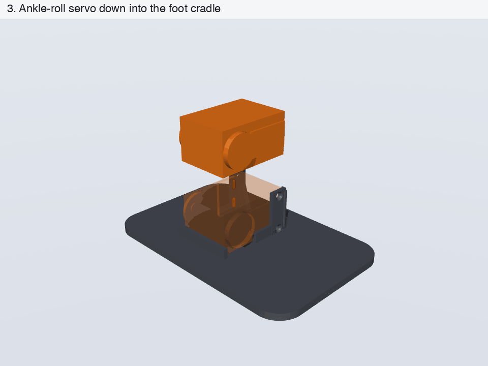

1. **Glue the TPU sole** (`sole_tpu_L/R`) to the foot plate's flat underside.
   The underside is pocketed inside a 6 mm perimeter for the bond.
2. **Drop the ankle-roll servo into the cradle** from above.
   - Its output axis runs fore-aft, with the horn forward.
   - Its output end sits against the inboard end stop, and the cable end points
     outboard. The lead leaves through the notch in the rear rail.
3. **Screw the two retention tabs:** the front tab onto the horn-side case face,
   the rear tab onto the idler face. Each takes **2 × M2.5 × 8 flat-heads** into
   the far hole rows.

## 4. Grip channels: ankle link, shin, thigh

- **Which link grips which servo:**
  - `ankle_link` grips the **ankle-pitch** servo;
  - the shin (`leg_link_v6`) grips the **knee** servo;
  - the thigh (the same part) grips the **hip-pitch** servo.
- **Slide the link on from the case's cable end.** The case enters the grip
  channel lengthwise, from below. Sliding a link on "from the front" instead
  drives the horn disc into the grip plate.
- **6 × M2.5 × 8 flat-heads** per link: 4 on the horn-side face (rows 8.30 and
  29.00) and 2 on the idler face (row 32.75). All heads flush.

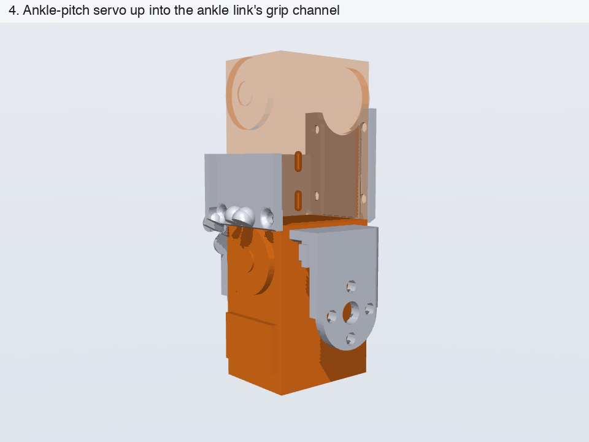

## 5. Close the leg joints: fork onto horn and idler

Each fork closes on the next servo's two discs. Work horn first at zero, then
the idler, with thread-locker, and check runout.

| joint | fork | horn side | idler side |
|---|---|---|---|
| ankle roll | the `ankle_link`'s two tines, lowered onto the roll servo in the foot: front tine to the horn, rear tine to the idler | 4 × M3 × 5 | 4 × M3 × 5 |
| ankle pitch | the shin's lower fork onto the ankle-pitch servo in the ankle link: horn +Y, idler −Y | 4 × M3 × 5 | 4 × M3 × 6 |
| knee | the thigh's lower fork onto the knee servo in the shin | 4 × M3 × 5 | 4 × M3 × 6 |

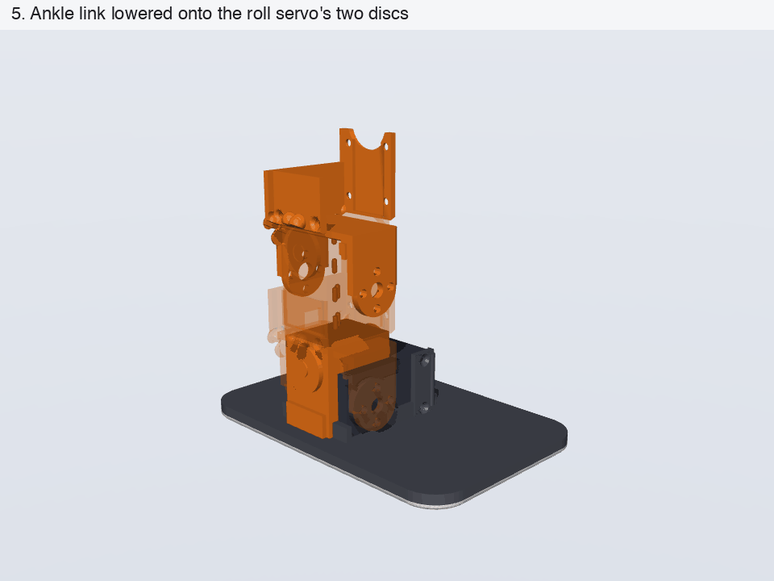
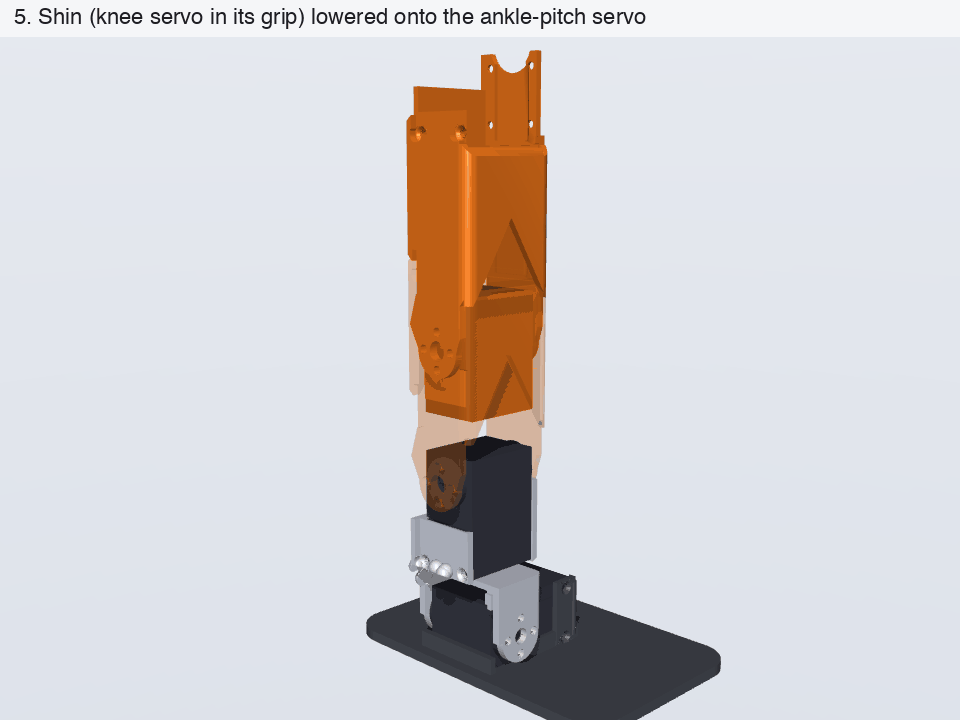
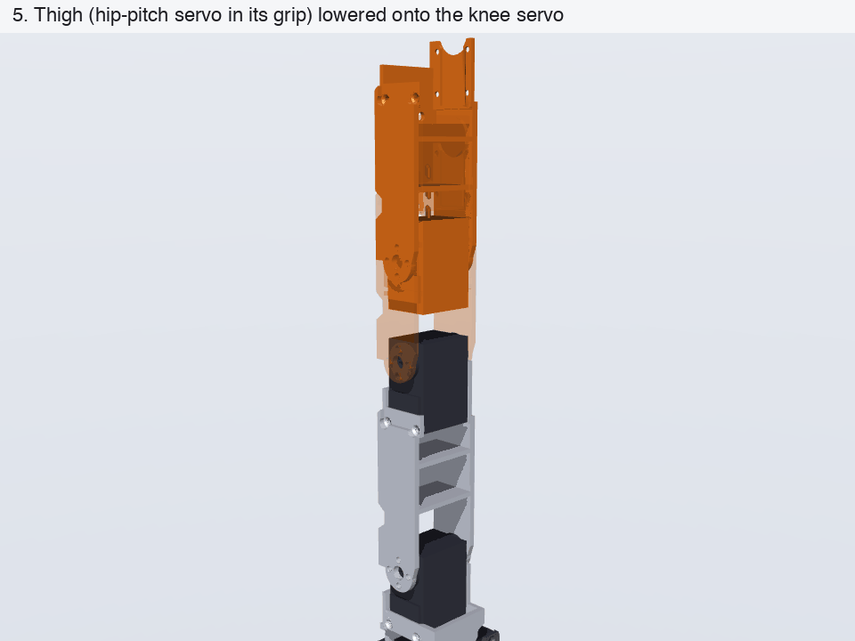

## 6. Hip yoke onto the hip-pitch servo

- **Pitch clevis.** Lower `hip_yoke_v6` onto the hip-pitch servo in the thigh.
  - Its pitch clevis (the lower half) straddles the servo's two discs: a horn arm
    on +Y (4 × M3 × 5) and an idler hub on −Y (4 × M3 × 6).
  - The yoke is one print, so there are no flange bolts.
- **Roll clevis.** The upper half waits for §8.

The leg is now a subassembly from the hip yoke down to the foot.

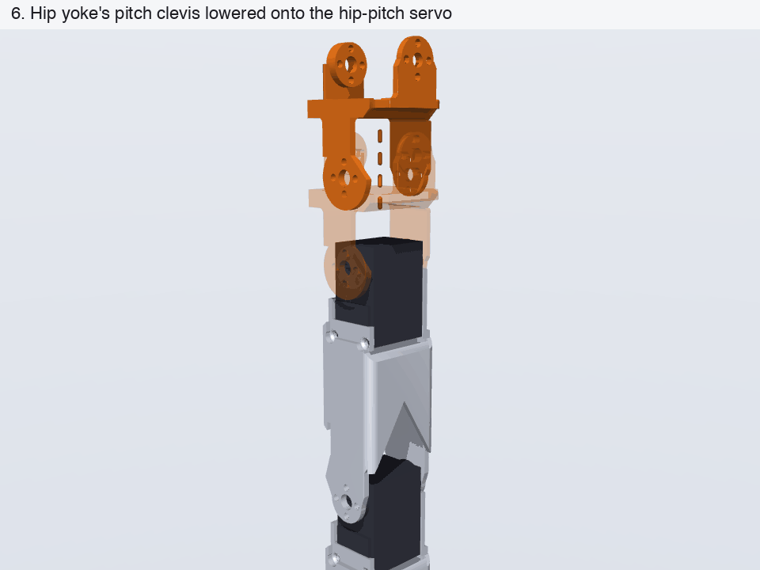

## 7. Hip stack in the pelvis (×2)

Work with the pelvis upright on a stand, so that the leg hangs below it later.
Everything in the battery layer is done **before the pack goes in** (§10).

### 7a. Yaw servo into its cell

1. **Offer the servo up into its cell from below** (the mouth has a 1.2 mm
   lead-in).
   - Output axis vertical, **horn down**, case length fore-aft.
   - The idler face goes up against the cell ceiling, landing on 1.5 mm pads
     over the case's recessed screw bosses.
2. **Plug its leads first.** The bus ports sit in the connector trench on the
   idler face. A riser through the ceiling opens over the trench into the
   battery layer, so plug the leads in from above. From there they run through
   the battery layer to the deck's leg-bus slot.
3. **Drive 4 × M2.5 × 8 flat-heads down through the cell ceiling** into the
   idler-face rows (8.30 and 32.75). Reach them from above, through the deck's
   battery aperture, with the pack out.

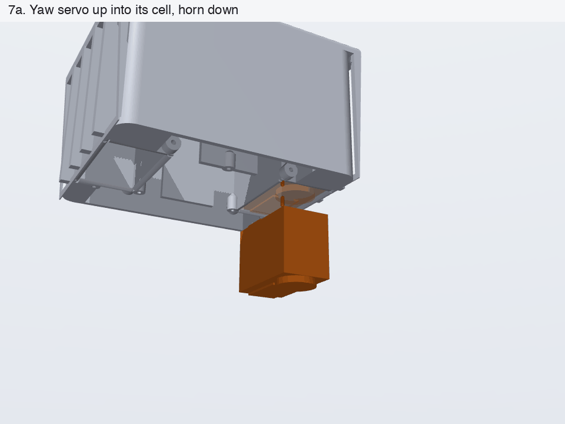

### 7b. Yaw carrier and the hip-yaw bearing

**The bearing option is not selected (#75).** The code builds option C as a
placeholder, so the pelvis and carriers are provisional. What goes between
carrier and pelvis depends on the choice (details in
[study-yaw-bearing.md](design-v6/study-yaw-bearing.md)). The same steps hold
for every option:

1. **Seat the carrier on the yaw horn** with the yaw servo at mechanical zero.
   Its horn plate mates the horn disc and its roll bay opens downward. **Square
   it before torquing**: a clocked carrier is a permanent yaw offset.
2. **Drive 4 × M3 × 5 up into the horn** through the bay ceiling, from inside
   the bay. Do this before the roll servo goes in.

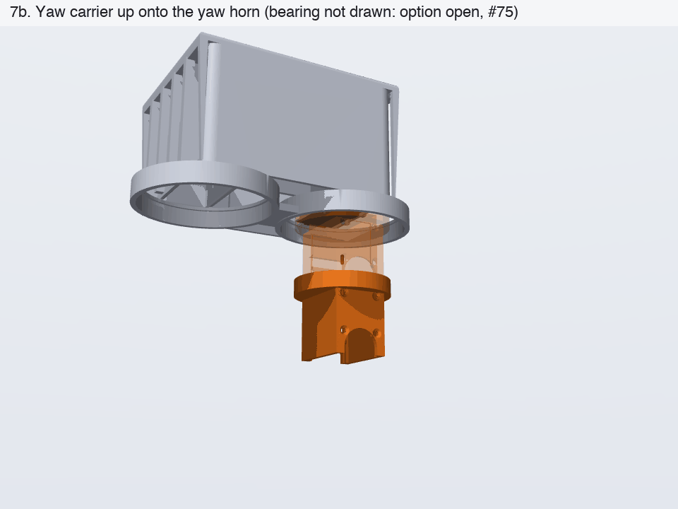

The bearing depends on the option:

- **A (6810-2RS, round hub).**
  - The inner race goes on the carrier's round hub (Ø50.08, +0.08 mm
    interference); the outer race goes into the pelvis recess (Ø64.96,
    −0.04 mm), under a shoulder.
  - Those fits are inside the printer's error band, so print at nominal,
    measure, and fit both seats with **retaining compound** (Loctite 641).
  - The shoulder is the only positive stop.
- **E (A plus positive retention).**
  - **Carrier side, on the bench, with the carrier out of the pelvis** (there
    is no driver access in the gap afterwards):
    1. Slide the race down over the hub from the horn-face side onto the printed
       lip.
    2. Screw the 1 mm cap over it with 3 × M2.5 × 6 flat-heads at r 22 mm
       (an × 8 would bottom out in the hub's pilots).
  - **Pelvis side,** after the carrier is on: offer the retainer up under the
    skirt and drive 3 × M2.5 × 8 flat-heads up into the skirt bosses.
  - **Preload 0.2 mm.** The cap and the retainer bottom on the races with a
    0.2 mm gap to the print behind them, so tightening clamps the race, not the
    plastic. Take up the radial fits with retaining compound.
- **C (6811-2RS).** The bearing wraps the carrier's plate and upper bay walls
  (a boss of Ø55.08) and sits in a Ø71.96 recess in the pelvis skirt. Press
  fits only.

**For every option:**

- **Never heat-set a bearing into PETG.** PETG must reach about 230 °C to flow,
  and a 2RS bearing's seals and grease are good to roughly 100 °C.
- **Measure the real bearing's rings before printing the pelvis.** The shoulder,
  cap and retainer are sized to an estimated inner-ring OD and outer-ring ID.

### 7c. Hip-roll servo up into the carrier bay

1. **Slide the servo up into the downward-open bay**, cable end first: output
   end down, horn forward.
   - The rear wall carries an idler seat with a detent channel for the case's
     moulded back-cover platform, so the servo should feel **snug against the
     rear wall** before any screw goes in. If it does not, check that the
     platform is running in the channel rather than sitting on top of it.
2. **Plug both leads.** Its bus ports face rearward through the window in the
   bay's rear wall (the trench band, just above the idler bore). Plug both
   leads there and route them out of the bay's open rear.
3. **Drive 8 × M2.5 × 8 flat-heads:** 4 through the front (horn) wall and 4
   through the rear (idler) wall, into the case.

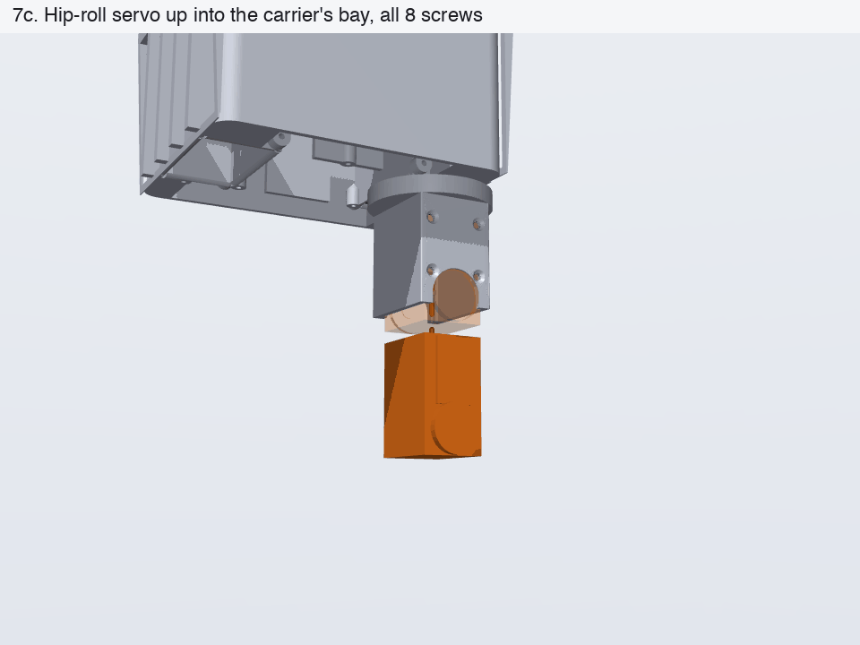

## 8. Legs onto the roll servos

Offer each leg up so that the hip yoke's roll clevis straddles its roll servo:

- **Front:** the roll horn arm (on a 1 mm boss) bolts to the roll horn with
  **4 × M3 × 6**, at zero, with the leg hanging straight.
- **Rear:** the idler arm's long boss reaches through the slot in the carrier's
  rear wall to the idler disc, and takes **4 × M3 × 8**.
  - The heads land in a pad sunk 1.35 mm into the arm's outer face. That sink
    is what brings the screws into thread, so do not fill or file it.
  - Snug at zero, then check runout.

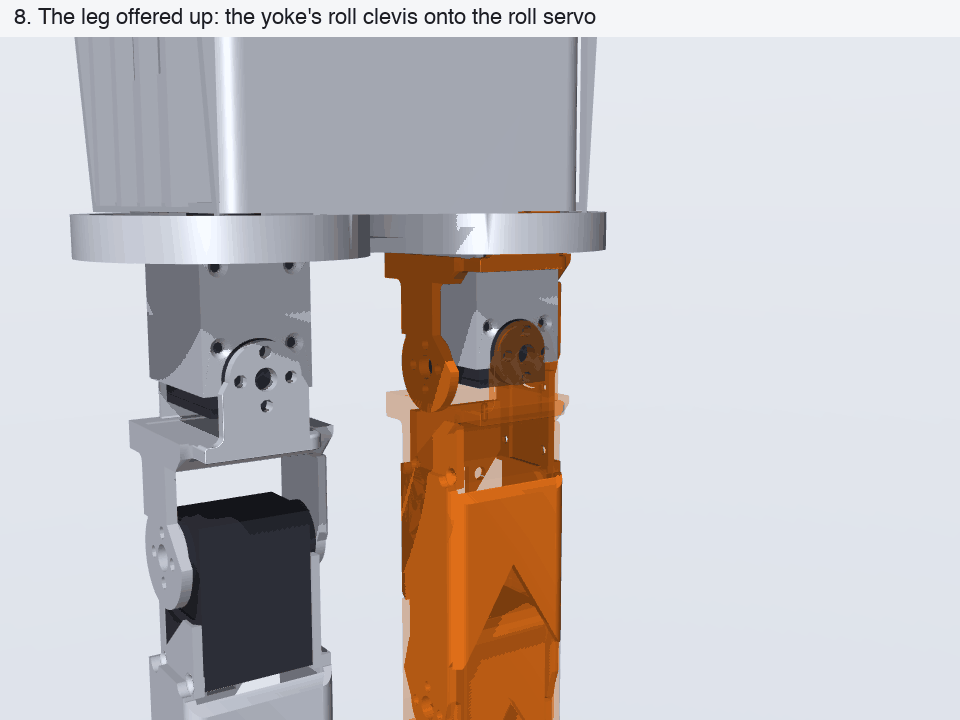

## 9. Torso electronics

The Pi and the General Driver stand vertically in their own columns, fore and
aft of the yaw cells. Each slides straight down its guide channel through its
own slot in the deck.

- **Screws, each board:** the lower row takes **M2.5 × 10 pan** screws into
  standoff bosses; the upper row takes **M2.5 × 6 pan** screws into wall pilots.
  A boss in the upper row would block the slide.
- **Driver:** a few of these screws sit close to walls and need a slim driver.

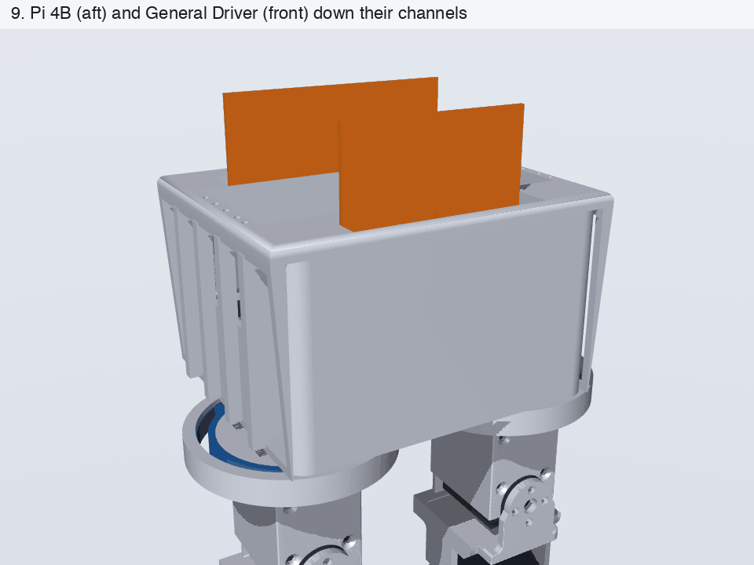

### 9a. Raspberry Pi 4B (aft wall)

- Fit the low-profile heatsink first. The column has 16 mm of depth behind the
  board.
- The USB/Ethernet stack faces +Y, through the side window. The USB-C, HDMI and
  camera edge faces up under the deck.
- Connect the camera cable at the top edge and route it toward the neck.

### 9b. General Driver (front wall), and its IMU

- The board's bus edge faces up under its deck slot, so the servo leads drop
  straight onto its two bus ports, H5 and H6. Both ports carry the same nets.
- **The IMU is the board's onboard QMI8658C.** The board's mounting fixes the
  IMU's axes. The firmware applies a mounting rotation (`imu::Mount`), which has
  to be set for this orientation as part of the 17-joint port (#81).

### 9c. Power pocket

- **Protection board and 5 V buck.** Both stand on edge in the pocket just
  forward of the pack (one 60 × 25 mm face, 8.4 mm deep), reachable through the
  deck aperture. There are two M2.5 bosses; **how the boards are fixed is open**
  (the buck's holes take M2).
- **Power path:** pack lead → protection board → fuse → switch → XH pigtail to
  the board's inlet. Check polarity against the silkscreen "− +".
- **Bulk capacitor:** solder it across the servo bus at the board, observing
  polarity.
- **Buck output:** it feeds the Pi's USB-C.
- The current budget and the inlet are open (#77; [bom.md §3](bom.md#3-power)).

## 10. The pack (before the girdle)

1. **Finish everything in the battery layer first:** the yaw stators (§7a),
   the yaw leads, the power pocket (§9c).
2. **Lower the pack through the deck aperture.** It lies transverse on the
   cell ceilings.
3. **Belt it** with the 15 mm hook-and-loop strap through the belt slots.

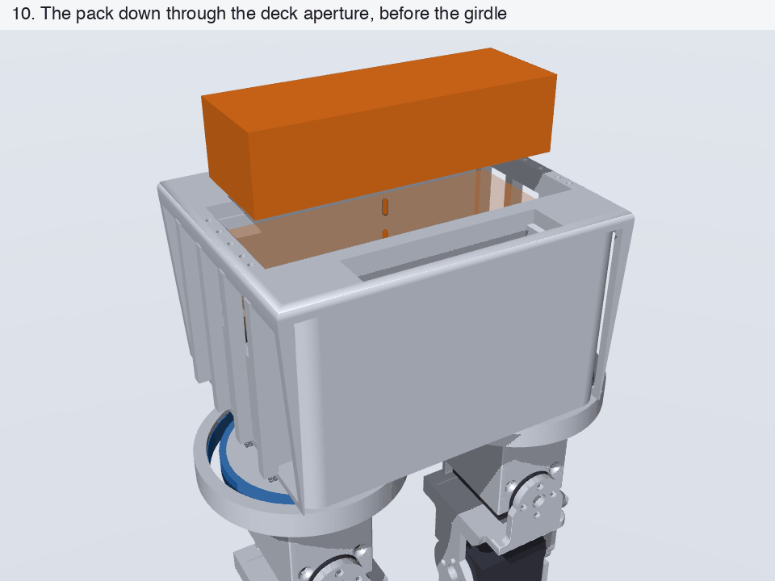

The girdle's neck tube, the neck floor under it and the aft tie span the
aperture, so **the pack cannot come out while the girdle is on**. Swapping it
means lifting the girdle, which is held by ten deck screws; the neck stays in
the girdle.

## 11. Girdle, neck, shoulders, arms, head

The bench order, girdle first. The neck floor sits 4.5 mm over the pack, so
the neck is built into the girdle before the girdle goes onto the robot.

### 11a. Neck into the girdle (on the bench)

1. **Neck floor into the tube.** Offer `neck_floor` up into the bottom of the
   girdle's neck tube, pads up, and drive **4 × M2.5 × 8 flat-heads** up
   through its lugs into the four bosses on the tube's side walls.

   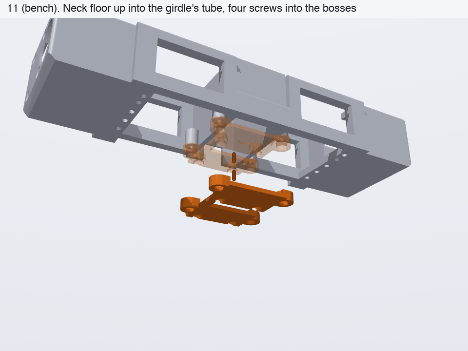

2. **Plug the neck servo's leads first.** The bus ports face down, in the
   connector trench on the idler face. The floor has a window under the trench,
   open toward the robot's left (+Y), so the plugs pass it and the leads leave
   sideways at floor level.
3. **Drop the neck servo into the tube from above**, horn up, case length
   fore-aft with the cable end aft. Its idler face lands on the floor's four
   pads; the turning idler disc and hub clear the floor by 0.6 mm.
4. **Drive 4 × M2.5 × 8 flat-heads up through the floor and the pads** into
   the idler-face rows (8.30 and 32.75). The heads seat in 1 mm counterbores,
   so each screw bites 4 mm into the case.

   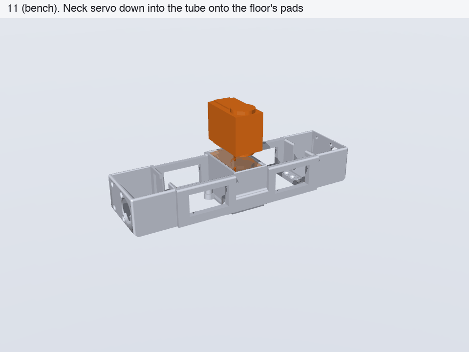

### 11b. Girdle onto the deck

- **Lower the girdle onto the deck**, the neck floor passing down into the
  battery aperture over the pack. Lead the neck's bus leads up beside the tube.
- **Screw it down with 10 × M2.5 × 8 flat-heads** from above into the deck
  pilots on the two edge rails (x −27, −18, −9, 0, +6 mm at y ±57 mm). The
  rail pilots are clear of the pods, so the shoulder servos can go in before
  or after.

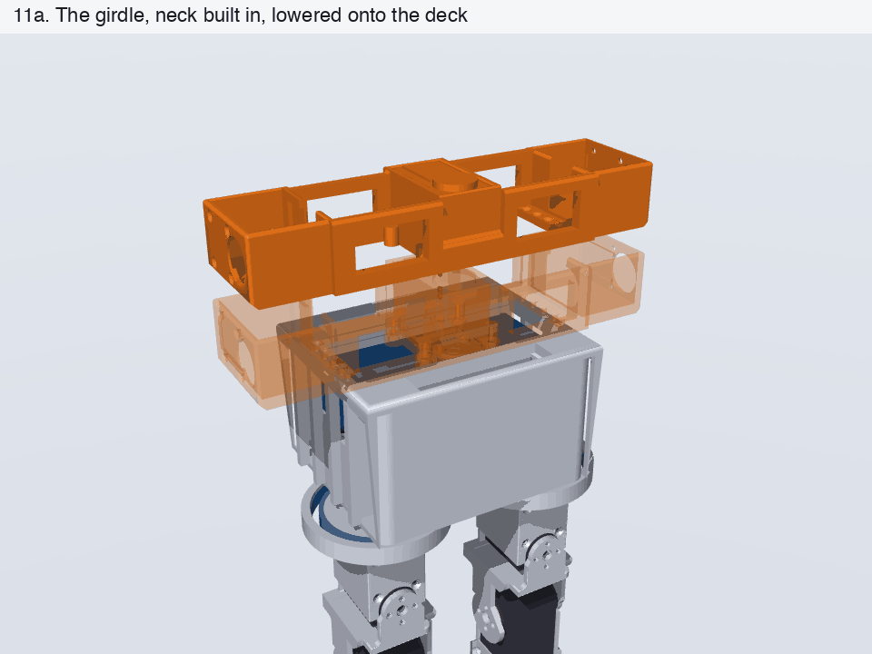

### 11c. Shoulder servos

- **Drop each servo straight into its open pod** from above: case length
  fore-aft, width vertical, horn outboard.
- **Screw it with 4 × M2.5 × 8 flat-heads into the horn-side case face, from
  outboard.** The inboard face sits 1.24 mm off the housing skin, where no
  driver fits.

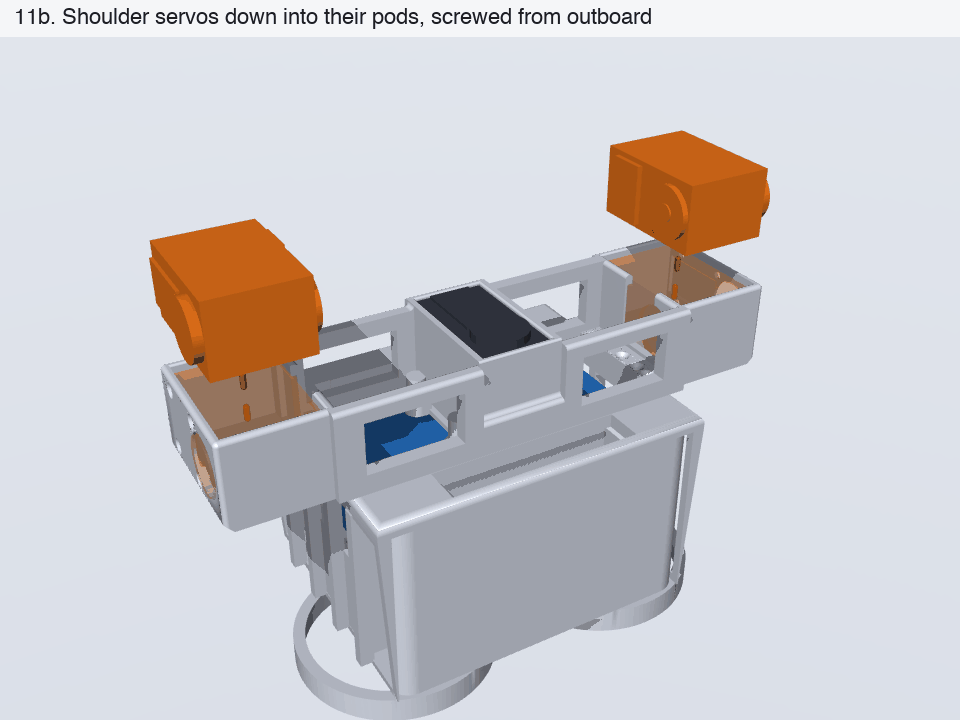

### 11d. Arms (a mirror pair)

1. **Upper arm onto the shoulder horn.** Offer it straight in along the joint
   axis, with the shoulder at zero (arm hanging). It is a single-sided horn
   joint.
   - **4 × M3 × 6** (the horn plate sits on a 1 mm seating boss: a 4.0 mm
     stack), driven through the access bore in the arm's outboard face.

   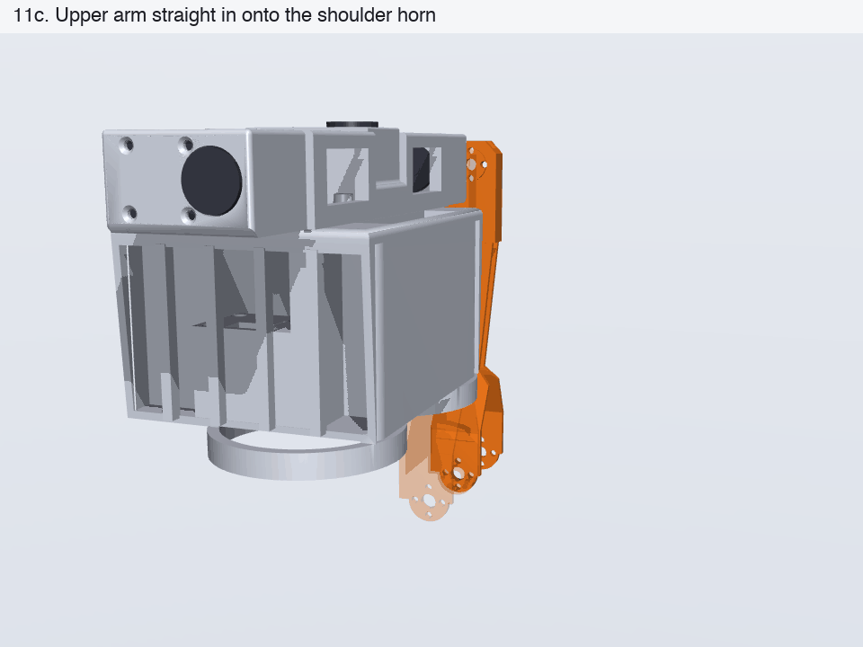

2. **Elbow servo into the forearm.** Slide it into the forearm's grip channel,
   with **6 × M2.5 × 8 flat-heads**.

   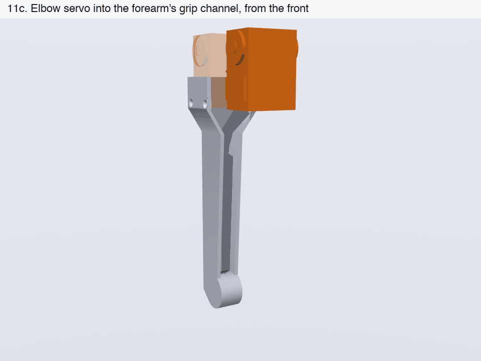

3. **Forearm onto the upper arm.** Lift it up between the upper arm's fork
   tines onto the elbow's two discs, with the elbow straight:
   - horn side **4 × M3 × 5**;
   - idler side **4 × M3 × 6**.

   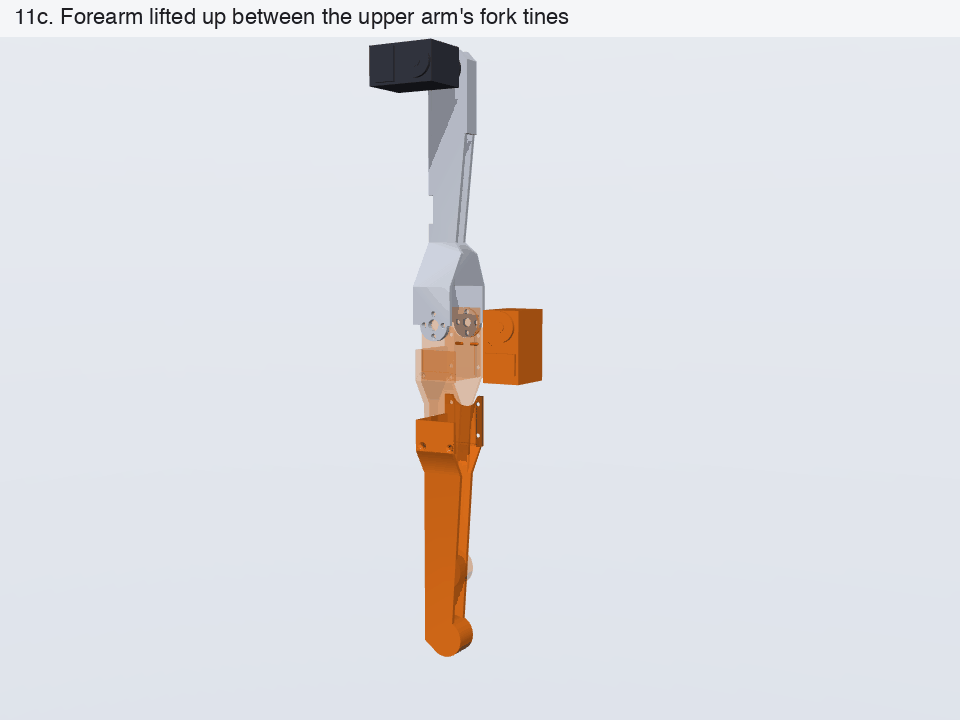

### 11e. Head and camera

1. **Camera onto the face.** Fit the Camera Module 3 to the four M2 bosses on
   the inside of `head_face` (4 × M2 × 4 self-taps), lens through the aperture.
2. **Route the camera cable** through the slot in the head's base beside the
   neck axis. Leave a slack loop for ±90° of yaw.
3. **Shell onto the neck horn.** Seat `head_shell` on the neck horn with the
   neck at zero and the head facing forward. Drive **4 × M3 × 6** through the
   4 mm base plate, from inside the open shell.
4. **Close the face** with **4 × M2.5 × 8 flat-heads**.

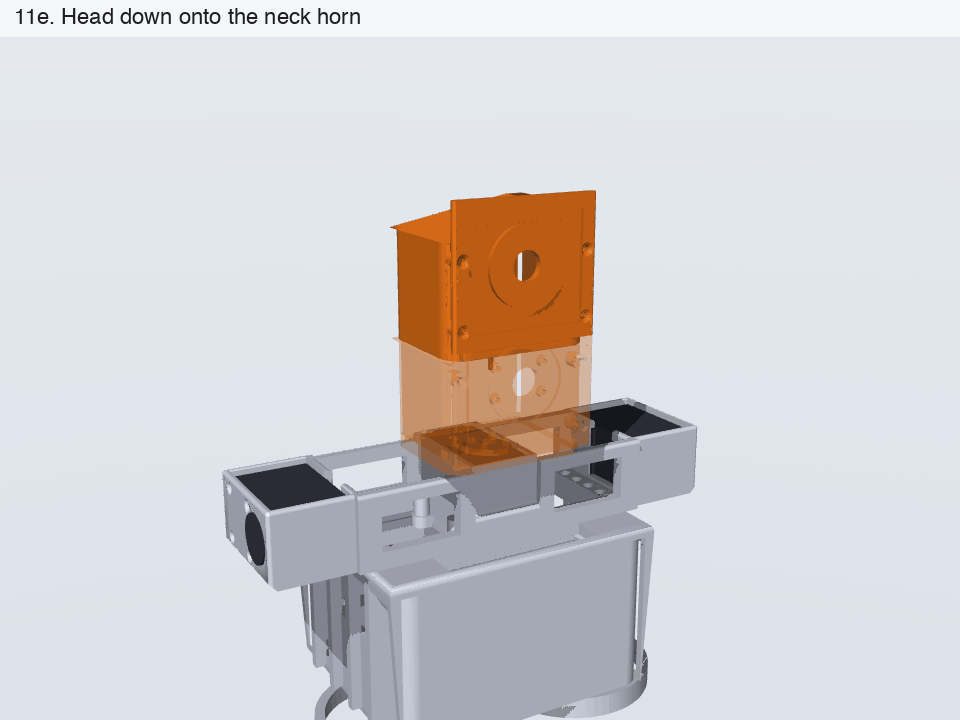

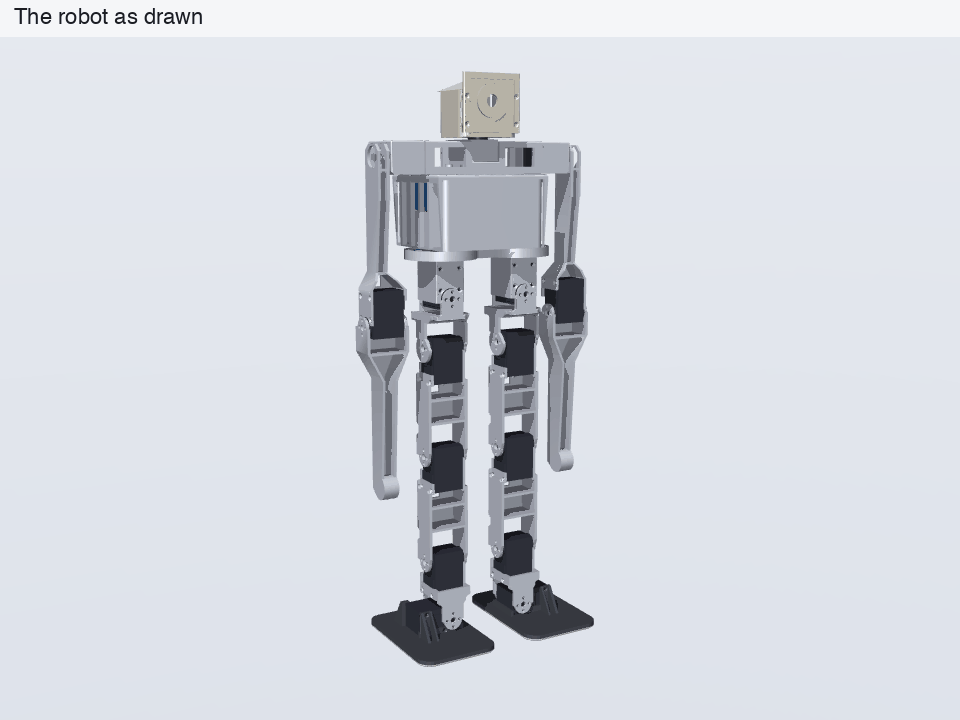

## 12. Cabling

**The harness is not drawn yet** (#77): no 17-joint ID map, no per-hop lead
lengths, and no current budget.

**What the CAD provides for it:**

- **Yaw servos:** a lead riser through each cell ceiling into the battery layer.
- **Deck:** two 12 × 6 mm leg-bus slots at y = ±42 mm.
- **Roll servos:** their ports face rearward through the carrier's rear-wall
  window.
- **Boards:** the General Driver's bus edge faces up under its deck slot, and
  the Pi's camera edge faces up under the deck.
- **Neck:** the leads leave the plugs through the neck floor's window, toward
  +Y, and rise through the deck aperture beside the tube; the tube also has a
  window at the servo's cable end.

**Rules:**

- **Daisy-chain.** Each servo has two paralleled ports, so the bus hops from case
  to case. Each servo ships with a 150 mm lead; where a hop needs more, use an
  extension lead.
- **Leave a slack loop across every joint, sized at full flexion.**
  - That means knee 130°, hip pitch −120°, and the shoulder through its whole
    −90° … +200°: its lead crosses a joint that folds 290°.
  - Fold each joint to its limit before cinching the zip ties.
- **Strain relief for the arm leads is not designed yet.**

## 13. First power-up and zero calibration

**Before anything powered,** read AGENTS.md's bench-safety rules:

- any bus write is a motion command;
- opening the serial port reboots the board and eats the first command;
- check torque before a bench run;
- disarming does not lower the robot.

Bare board to first arm: [bringup.md](bringup.md).

**The firmware currently drives the prototype's 10 joints.** The 17-joint port
(IDs, calibration blob, observation spec, and the register-21 check at boot) is
open (#81). The procedure is the one the prototype uses:

1. **Zero.** Standing is angle zero for every joint.
   - Hold the robot in the CAD standing pose on a stand, then run `cal zero` and
     `cal save`. The zeros are stored in NVS.
   - The table lives in [servo-map.md](servo-map.md); update it and
     `firmware/main/asbuilt_cal.h` in the same commit.
   - **Re-zero after any mechanical work on a joint.** Tightening loose horn
     screws moved the prototype's zeros by up to 4.7°.
2. **Directions.** Verify every joint's sign against the simulation at low
   torque limit and slow speed before trusting any gait. A wrong knee sign
   drives the knee into hyperextension.
3. **Gains.** Read registers 21 and 22 back on the six Plan B servos.
4. **Pack.** Land the robot by 3.5 V/cell (10.5 V).

## 14. Play test, per roll joint

Measure play on every roll joint (both hip rolls, both ankle rolls) on the
assembled robot, **before the first walk**. Do the knees and hip yaws too.

- **The requirement:** ≤ 3° per roll joint, with ≤ 1° as the target. At ≤ 1°, a
  3× gain is enough (DESIGN.md §4).
- **The method is tilt hysteresis.** The encoders sit on the shaft side of any
  slop, so they cannot see it; the IMU can.
  - With the robot standing, step one joint slowly out and back: 0.5° steps to
    ±4°, slow slew, 1 s settle.
  - Read the torso tilt from the IMU at each step. The dead band at reversal is
    the play.
- **Tools.** `tools/joint_sweep.py` runs this on the prototype; its ID and zero
  table is the prototype's. For hip yaw, `tools/yaw_probe.py` yaws both hips
  together and reads the pelvis's yaw from the gyro.
- **On the prototype** this test found 2–3° at a hip roll.
- **If a joint is over the limit,** check the disc screws, the idler seating and
  the grip screws, then re-zero.

## Open

| item | where |
|---|---|
| hip-yaw bearing option; the pelvis and yaw carriers wait on it | #75 |
| ID map, harness, lead lengths, current budget, fixing of the power boards | #77 |
| 17-joint firmware: calibration, IMU mounting rotation, register-21 check | #81 |
