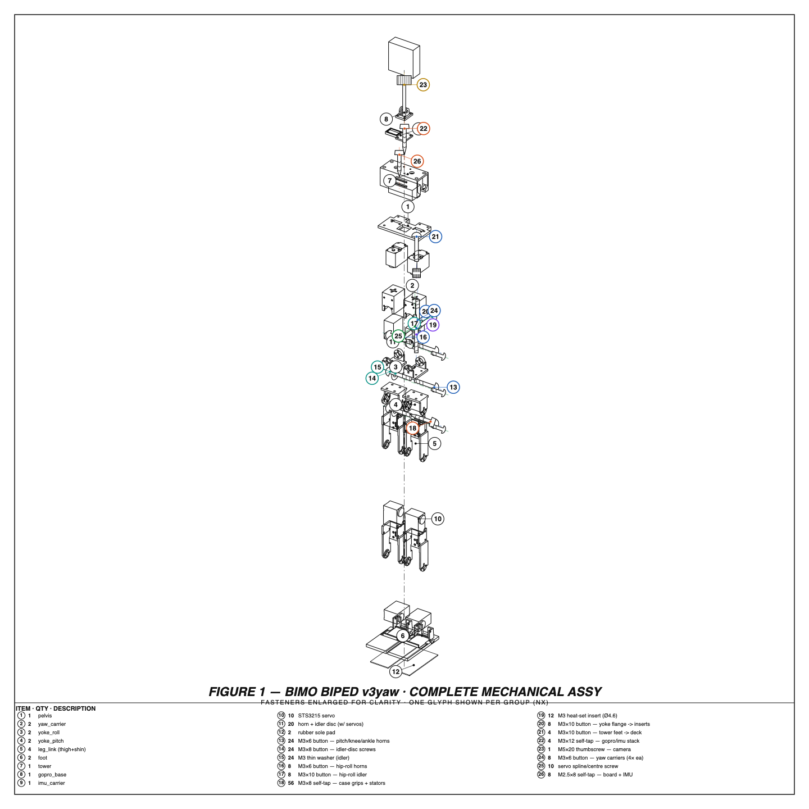
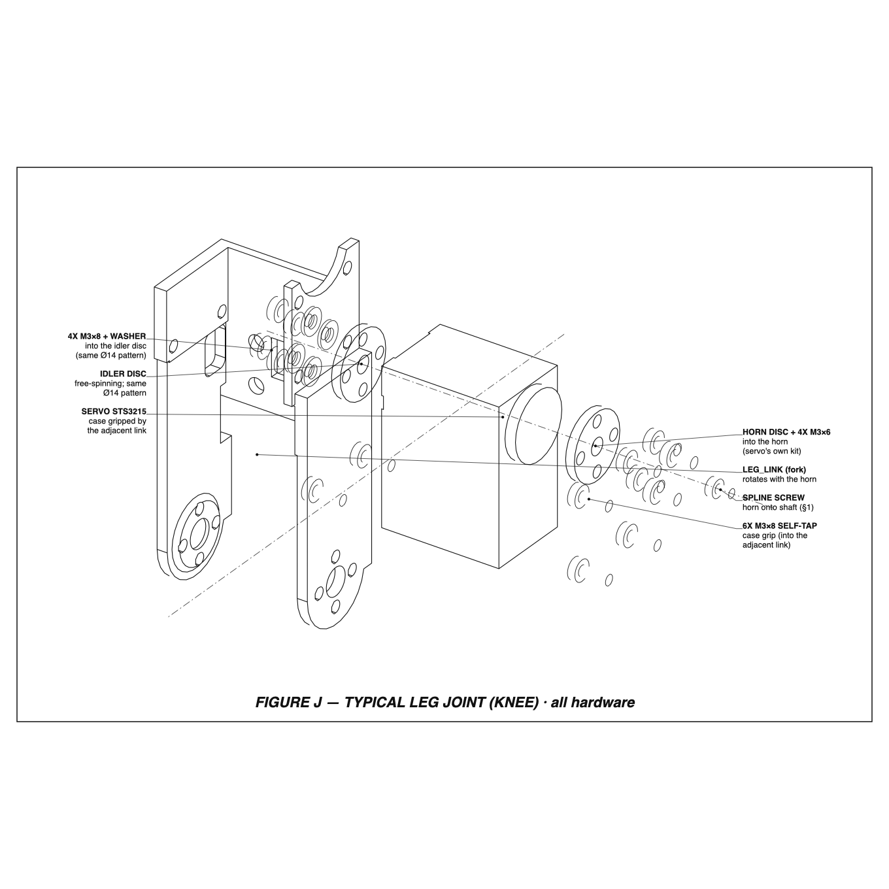
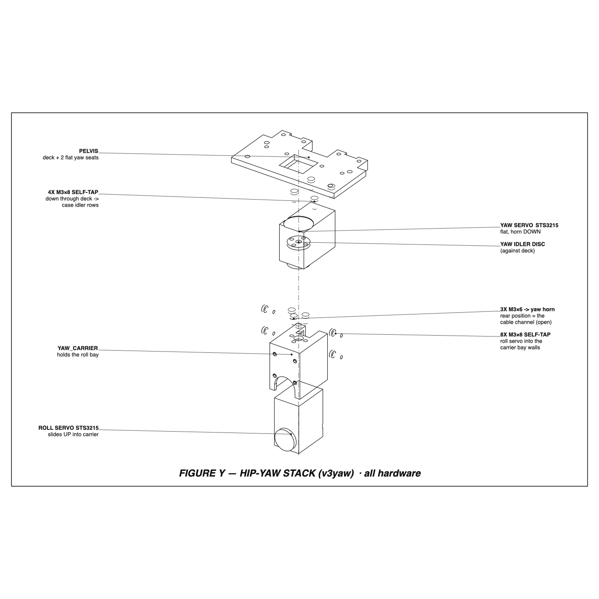
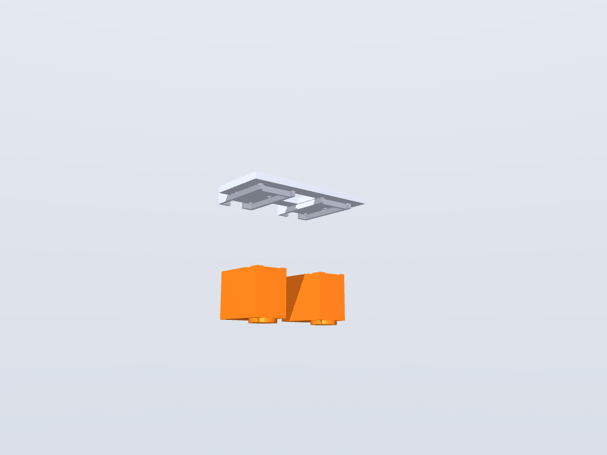
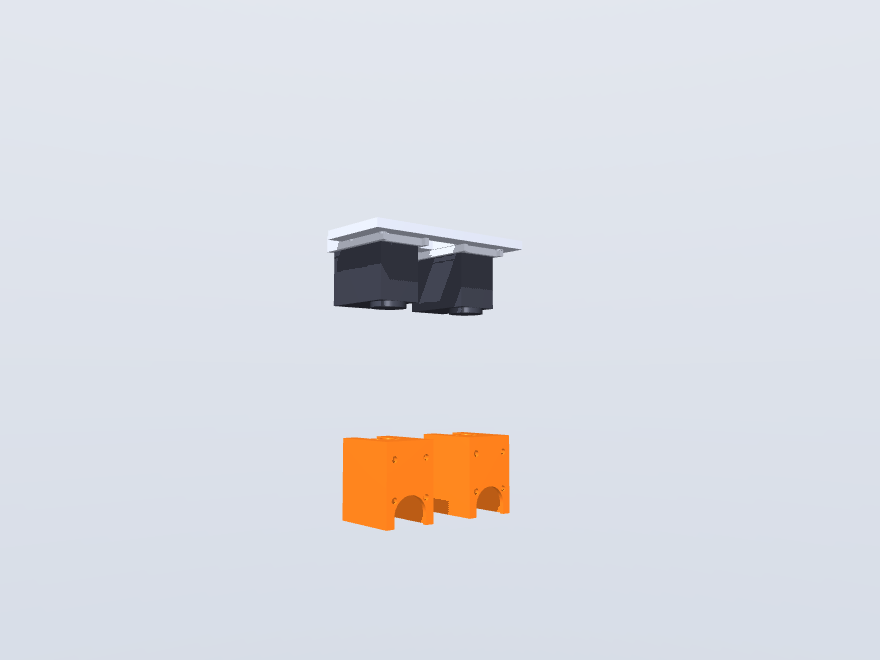
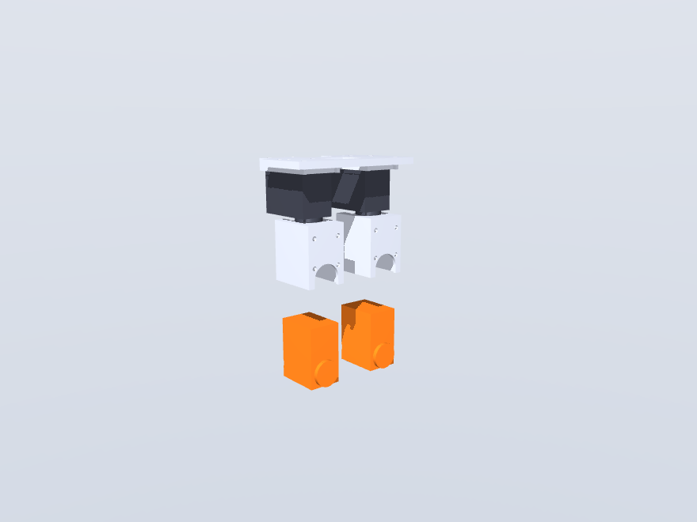
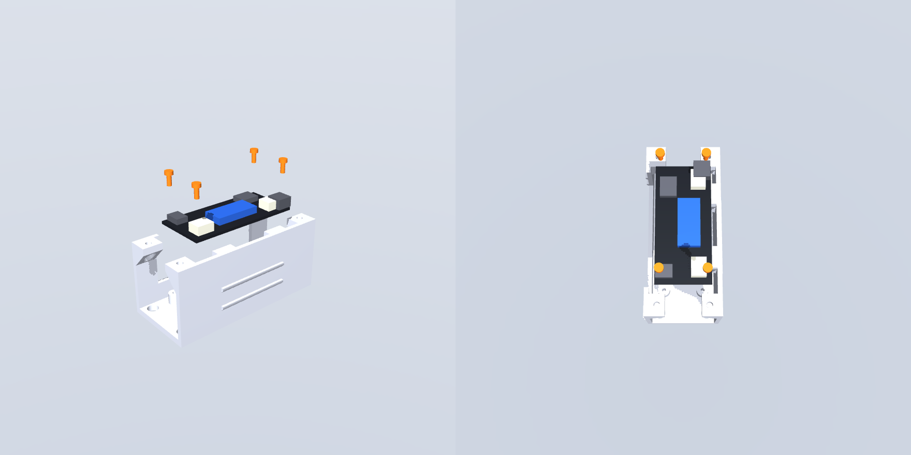
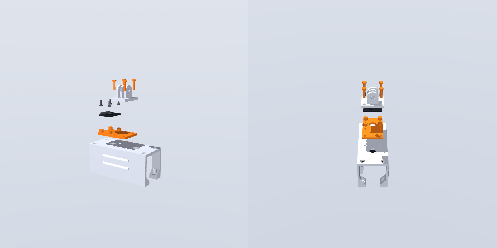

# Assembly instructions — Bimo-like biped

*Step-by-step build guide with figures. Figures are rendered from the real CAD
(`cad/render_assembly_steps.py`): parts already installed are shown in their
natural colors, the part being installed is **orange**, offset along its real
insertion direction — the same paths the fly-in feasibility animation
([`cad/renders/assembly_flyin.gif`](../cad/renders/assembly_flyin.gif)) proves
out. Regenerate after any CAD change.*

Companion docs: [print list](../cad/PRINT_LIST.md) ·
[BOM with links/prices](bom-sourced.md) · [hardware order + verify-on-arrival](hardware-order.md) ·
[wiring & bring-up](wiring.md) · [CAD readme](../cad/README.md)

| Exploded                                       | Complete                                           |
| ---------------------------------------------- | -------------------------------------------------- |
|  |  |

**Master exploded drawing** (isometric, generated from the CAD by
`cad/render_exploded_drawing.py`):

> ⚠️ **Hip redesign in flight (2026-07-15).** The get-up study fixed the CAD
> target at **−110°/+60° hip-pitch flexion**; `yoke_pitch` is being re-cut for
> it and is on **HOLD** — don't print the final pair, and hold the 2 thigh
> `leg_link`s until it lands (details in the [print list](../cad/PRINT_LIST.md)).
> Everything else in this guide is final geometry. The joint steps are
> identical either way; only the yoke part changes.

> 🆕 **Hip yaw added (v3yaw, 2026-07-23).** The robot now has **10 servos**:
> a tenth axis per hip — a **hip-yaw** servo that lies flat under the deck with
> a printed **`yaw_carrier`** bolted to its horn, and the whole hip-roll bay
> (unchanged geometry) now hangs off the carrier instead of the pelvis. The
> `pelvis` lost its bays and gained two flat yaw-servo seats. Everything above
> the hip rises **+41 mm** (`YAW_STACK_DROP`). See the
> [hip-yaw study](hip-yaw-study.md#6-as-designed-cad-2026-07-23) and the new
> **§7** below; the leg build (steps 1–6) is untouched.

---

## 0. What you need

**Printed parts** (16 prints, 9 unique — PETG, no supports; orientations and
settings in the [print list](../cad/PRINT_LIST.md)):

| Part          | Qty | Note                                                                                                        |
| ------------- | --- | ----------------------------------------------------------------------------------------------------------- |
| `pelvis`      | 1   | v3yaw: deck + two flat yaw-servo seats (no bays); print deck-top down                                       |
| `yaw_carrier` | 2   | bolts to the yaw-servo horn, carries the hip-roll bay; horn-plate face on bed, bay walls rise — **slice `yaw_carrier_print.stl`** and snap the 3 break-away columns out of the cable window |
| `yoke_roll`   | 2   | **printed as a WALL, on edge** (2026-07-30, for arm strength) — slice `yoke_roll.stl` with **slicer supports ON**; the modelled fins were deleted, see `cad/PRINT_LIST.md` |
| `yoke_pitch`  | 2   | ⚠️ on hold (hip redesign)                                                                                   |
| `leg_link`    | 4   | 2 thighs (⚠️ hold) + 2 shins — **slice `leg_link_print.stl`** and peel the 3 break-away fins after printing |
| `foot`        | 2   | v3 (heel bulkhead), sole down                                                                               |
| `tower`       | 1   | print top-plate down (support-free — the battery window is open to the deck)                                |
| `gopro_base`  | 1   | prongs up; the sacrificial crash fuse                                                                       |
| `imu_carrier` | 1   | flat, bosses up; sandwiches under the gopro_base                                                            |

**Everything else:** 10× ST3215 servos (12 V version — 8 leg + 2 hip-yaw) with
their horns, idler discs and included screws/leads · Waveshare Servo Driver with ESP32 · BNO055
IMU breakout · 3S 850 XT30 pack · XT30 pigtail + inline switch · 20 mm
hook-loop belt ~250 mm + pull ribbon · 2 self-adhesive rubber sole pads
(~0.5 mm, trimmed to ~90×46) · zip ties. Full list with links:
[BOM](bom-sourced.md).

### Fasteners & heat-set inserts

Every screw in the robot, robot-total counts, what it threads into, and which
steps consume it. Totals reconcile with the per-step callouts below (each step
also states its own fasteners inline). **Every joint bolt is driven with the
servo at mechanical zero** (see §1).

| Fastener                                             | Qty                  | Threads into                                                                                                                                                                                                                                                              | Consumed in                                                                                                                |
| ---------------------------------------------------- | -------------------- | ------------------------------------------------------------------------------------------------------------------------------------------------------------------------------------------------------------------------------------------------------------------------- | -------------------------------------------------------------------------------------------------------------------------- |
| **M3×6** button head *(the servos' own horn screws)* | 40 used (40 bundled) | the servo's metal **horn disc** — M3 on the Ø14 bolt circle, **4× per horn everywhere** (the yaw horns went back to 4× after the 2026-07-24 connector correction — the "cable channel" the dropped rear bolt served aligned with nothing). Bundled with each ST3215 (10 × 4 = 40 on hand → 0 spares). | §5 (knee + ankle horns, 16), §6 (hip-pitch horn, 8), §7b (yaw carriers onto the yaw horns, 8), §8 (hip-roll horn, 8)       |
| **M3×6** button head, **NO washer**                  | 24                   | the servo's free-spinning **idler disc** — same Ø14 circle. **Was M3×8 + thin washer**; see the disc-thread note below. *(Pre-2026-07-23 prints: hand-drill the Ø3.4 idler holes through the arm — see Anatomy note.)*                            | §5 (knee + ankle idlers, 16), §6 (hip-pitch idler, 8)                                                                      |
| **M3×8** button head, **NO washer**                  | 8                    | the **hip-roll idler disc** only, reached through the bay-wall slot by the long boss. This joint is the one exception to the M3×6 above: the `yaw_carrier` rear bay wall sits between disc and yoke arm, so its stack cannot go below 6.15 mm and needs the longer screw into a **sunk pad** (2026-07-30). **Was M3×10 + washer.** *(Pre-2026-07-23 prints need the idler holes drilled through, per §5.)*             | §8 (roll idler, 8)                                                |
| **M3×10** button head                                | **12**               | two jobs: the **yoke_pitch flange heat-sets** that make the hip universal (8), and the **deck heat-sets** the tower feet pull down onto (4).             | §6 (flange → inserts, 8), §9c (tower feet → inserts, 4)                                                |
| **M2.5×8 FLAT-head self-tapping** *(countersunk, to buy)* | **32**          | printed Ø2.9 clearances into the **servo case holes** — heads sit **flush** in 90° countersinks. **BENCH TRUTH 2026-07-28: the case holes take M2.5, not the M3 previously listed** ("3 mm is too wide"). Flush is mandatory here: proud heads on the grip plates rode the sweeping yoke/fork arms and skewed the links.  | §3 (feet, 8), §4 (leg_link grips, 24)                                                                                      |
| **M2.5×8 pan-head self-tapping** *(uxcell B01KXTTSCI, 50 on hand)* | 24     | printed Ø2.9 clearances into the **servo case holes**, where the head lives in free space or a counterbore (the 8 deck stators sink sub-flush — the battery sits on them).                                                                                                | §7a (yaw stators down through the deck, 8), §7c (roll servos into the carriers, 16)                                        |
| **M3×12 self-tapping**                               | 4                    | Ø2.8 pilots in the **tower-top bosses**, through the `imu_carrier` + `gopro_base` stack (the M3×8 is too short with the 3 mm carrier added).                                                                                                                              | §11                                                                                                                        |
| **M2.5×8 self-tapping**                              | 8                    | Ø2.2 printed pilots — 4 in the tower standoffs, 4 in the `imu_carrier` bosses.                                                                                                                                                                                            | §9a (driver board, 4), §9b (BNO055, 4)                                                                                     |
| **M3 heat-set insert** (Ø4.6 pilot, ~5 mm)           | 12                   | brass inserts **pressed into printed plastic** to receive the M3×10 machine screws above.                                                                                                                                                                                 | **installed in §2**: 8 in the two `yoke_pitch` flanges, 4 in the `pelvis` deck                                             |
| **M5×20 thumbscrew**                                 | 1                    | the GoPro three-prong clamp bore (or use the camera's own thumbscrew).                                                                                                                                                                                                    | §11                                                                                                                        |
| servo spline/center screw                            | 10                   | each servo's output shaft — holds the metal horn on (bundled with the servo).                                                                                                                                                                                             | §1                                                                                                                         |

> **Disc-screw lengths were re-derived 2026-07-30 — the old ones were sized
> against the wrong number.** Bench-measured (user) and confirmed by sectioning
> `cad/vendor/ST3215.step`: the idler disc is *not* a flat 3.35 mm slab. It is a
> 3.1 mm hub inside a **2.1 mm flange**, and the Ø14 bolt circle taps the
> **flange**. So every disc screw has 2.1 mm of thread to work with, and the
> thin washers were padding out screws chosen against the 3.35 mm body. Washers
> are gone (24 of them). `cad/check_assembly.py` is the authority and asserts
> each engagement lands in 1.5–2.1 mm:
>
> | joint | screw | stack | engagement |
> |---|---|---|---|
> | horn discs (arm straight on the horn) | M3×5 | 3.00 | 2.00 |
> | knee / ankle / hip-pitch idlers | M3×6 | 3.60 | 2.00 |
> | hip-roll idler (sunk pad, past the bay wall) | M3×8 | 5.80 | 1.80 |
>
> **Still open:** the *horn*-side quantities in the table below have not been
> re-counted against the M3×6 → M3×5 change (the hip-roll horn keeps M3×6 — its
> 1.0 mm boss makes a 4.0 stack — and the yaw horns are unverified), so the "40
> bundled → 0 spares" line is stale. Recount before ordering.

Notes: the **40 M3×6 are the servos' included horn screws**; only the idler
(M3×6 / M3×8) and the M3×10, self-tapping, M2.5 and heat-set hardware is separately
sourced (the KADRICK M3 kit covers the machine screws, washers and inserts —
[BOM](bom-sourced.md) items 8–15). Case self-tappers are **M2.5** (bench truth
2026-07-28): 24 pan heads come from the uxcell B01KXTTSCI pack already on
hand; the **32 flat-head M2.5×8 self-tappers must still be bought** (any
90°-countersunk stainless pack). The old 56× M3×8 self-tap line is RETIRED —
M3 does not fit the case holes. **Heat-set inserts total 12** — see §2.

> The [BOM](bom-sourced.md) still lists the pre-yaw counts (32 M3×6, 52 M3×8
> self-tap, 16 M3×10). The v3yaw truth is **40 M3×6 / 20 M3×10 / 32 flat +
> 24 pan M2.5×8 self-tap** — order accordingly.

**Tools:** soldering iron with heat-set tip, M3/M2.5 hex drivers, PH1
Phillips for the M2.5 self-tappers.

**Before committing plastic or torque**, run the verify-on-arrival checks from
[hardware-order.md](hardware-order.md#verify-on-arrival-before-committing-plastic):
~~servo case holes really take M3 self-tappers~~ **RESOLVED 2026-07-28: they
don't — the case holes take M2.5** (uxcell M2.5×8 driven on the bench); idler screws don't bottom
(**RESOLVED 2026-07-30**: the flange is 2.1 mm, not 3.35 — screws re-sized,
washers dropped; see the disc-screw note in the fastener table); driver-board holes
match the tower (Ø2.75 on 58×23); GoPro fingers fit the 3.2 mm slots (print
`gopro_base` alone first); the real battery passes the tower window.

---

## 1. Servo prep — IDs, centering, horns (do this FIRST)

Servos ship as ID 1, and two same-ID servos on the bus fail to enumerate — so
this happens before any plastic goes on:

1. Bench-power the bare driver board, confirm OLED + web UI (AP mode,
   `192.168.4.1`).

2. Connect servos **one at a time**, assign IDs, and label each case:
   
   | Left leg (bus port A) | Right leg (bus port B) |
   | --------------------- | ---------------------- |
   | 1 hip roll            | 5 hip roll             |
   | 2 hip pitch           | 6 hip pitch            |
   | 3 knee                | 7 knee                 |
   | 4 ankle               | 8 ankle                |
   | 9 hip yaw             | 10 hip yaw             |
   
   The 1–8 order matches the current 8-DOF sim action vector
   (`sim/walker_env.py`) — no permutation table in firmware. **Hip yaw (9/10)
   is the new v3yaw axis**; append it in whatever slot the v3yaw sim
   (`bimo_biped_v3yaw.xml`) action vector uses when that lands, and keep the
   firmware map matching it. The 9/10 IDs above are a convenient default (yaw
   servos wire last on each bus), not yet pinned to a sim slot.

3. Center every servo (**position 2048** / "Set Middle Position").

4. Bolt the metal horn onto each servo **at center** with its **included
   spline/center screw** (10 servos → 10 screws; the 4 M3×6 that clamp a
   printed part to each horn face come later, in the joint steps). Every joint
   is later assembled at this mechanical zero = the CAD neutral standing pose;
   a horn clocked off-center becomes a permanent joint offset.

**Orientation rule for everything below:** the two legs are *translations,
not mirrors* — identical parts, and **every pitch-joint horn faces +Y (robot
left)**. Build two identical legs; nothing is handed.

## 2. Heat-set inserts (12) — bench work, before any joint

All 12 are **M3 brass inserts** (Ø4.6 pilot, ~5 mm). Press each with a
soldering-iron heat-set tip until the surface sits **flush and square** —
melt, seat, let it cool before loading. Every one receives an **M3×10**
machine screw later.

- **8 into the two `yoke_pitch` flanges** (4 each) — on the ±10 mm bolt square,
  pressed from the **flange top face** (the face that mates `yoke_roll`). The
  hip universal-joint bolts (§6) thread down into these.
- **4 into the `pelvis` deck** — pressed from the **deck top face** at
  (x ±14, y ±42), no raised bosses; the pilots run straight down through the
  5 mm deck into the **yaw-seat collar side-wall** material below (~9 mm total
  engagement). The tower feet (§9c) pull down onto these. *(v3yaw: same x/y
  positions as before, but they now thread into the yaw-seat collars — the old
  hip-roll bay cheeks are gone.)*

## 3. Feet ×2

Drop the ankle servo into the foot pocket: **output end forward, cable aft**
— the cable exits through the window in the heel bulkhead. **4× M2.5×8
FLAT-head self-tapping** (2 per rear tab), heads flush in the tab
countersinks, through the two heel retention tabs into the
ankle servo's case holes (horn-face row −29, idler-face row −32.75). The
**low screw row drives through the top-side divots** in the sole shelf
(design-review fix 2026-07-23 — pre-fix feet block the driver on the low
row; reprint or hand-carve). Stick the
rubber sole pad onto the flat underside (trim to fit; keep it ~0.5 mm thin —
a thicker pad raises the whole robot; the divots are top-side only, so the
adhesive area is unchanged).

## Anatomy of a typical joint (both sides of the servo)

*Read this once — it's the same pattern at every leg joint (hip pitch, knee,
ankle), and it answers "shouldn't there be mounting holes on **both** sides of
the servo?"*

**The servo is the axle.** Each STS3215 carries a joint on *both* ends of its
output shaft — a driven metal **horn** on one face and a **free-spinning idler
disc** on the opposite face (same Ø14 four-bolt circle) — plus **case mounting
holes on both faces**. Two different printed parts meet at each servo:

1. **The distal link forks onto the OUTPUT.** Horn side: **4× M3×6** into the
   horn (the servo's own screws). This link rotates with the horn — the moving
   side of the joint (§5).
2. **The proximal link clamps the CASE**: **6× M2.5×8 flat-head self-tapping**
   into the servo's case holes — 4 on the horn-side face, 2 on the idler face,
   all heads FLUSH in countersinks. This holds the servo body — the fixed
   side (§4).

> **Idler side is bolted too** (both faces). The idler disc has the same Ø14
> four-bolt pattern, and the fork bolts to it for a two-sided, bearingless
> joint: **4× M3×6, no washer** into the idler disc. *(Decided 2026-07-23:
> through-holes are the design intent. `leg_link`/yoke prints made **before**
> that date have the idler bolt-circle only relieved on the servo-facing side —
> **hand-drill the Ø3.4 idler holes through the outer face** on those, or
> reprint from the corrected CAD.)*

> **Always at mechanical zero.** Drive the horn-side screws *first*, with the
> servo centered (§1) and the limb in the CAD-neutral pose. A screw driven
> off-center becomes a permanent joint offset.

*(A simpler colour schematic of the same idea is kept at
[`joint_anatomy.svg`](assembly/joint_anatomy.svg).)*

## 4. Leg links ×4 — grip a servo case

`leg_link` is both thigh and shin (same part). Slide the grip channel onto
the servo case **from the front**, just below the horn — the horn-side plate
has a circular relief that clears the Ø19.6 output boss. **6× M2.5×8 FLAT-head
self-tapping** per link — 4 on the horn-side face (rows 8.3 / 29), 2 on the
idler face (row 32.75) — heads FLUSH in the countersinks. Flush is not
cosmetic: the yoke/fork arm of the joint above sweeps 0.7 mm off the
horn-plate face, and proud pan heads there skewed the links on the bench
(2026-07-28). The shin grips the **knee** servo; the thigh grips the
**hip-pitch** servo.

## 5. Close each joint — fork to horn + idler

The link's fork closes on the *next* servo's output on **both** sides — metal
horn on +Y, free-spinning idler disc on −Y (same Ø14 bolt circle; no extra
bearings):

1. **Horn side first**: **4× M3×6 into the horn** (Ø14 bolt circle) — use the
   servo's **own bundled M3×6**, with the servo at center and the limb at the
   CAD-neutral pose. Check the mechanical zero before moving on.
2. **Idler side**: **4× M3×6, no washer** into the idler disc (same Ø14
   circle) — 2.00 mm into the disc's 2.1 mm flange. *(Pre-
   2026-07-23 prints: drill the Ø3.4 idler holes through the arm's outer face
   first — see the Anatomy note.)* The printed Ø19 boss inside the Ø25 recess is a
   locator, not a precision seat — concentricity comes from the screw
   pattern, so **snug the idler screws with the joint at mechanical zero and
   check runout before final torque**.

Repeat at ankle (shin fork → ankle servo, shown) and knee (thigh fork → knee
servo), both legs.

## 6. Hip yokes — the universal joint

| yoke_pitch onto the thigh servo                                | yoke_roll on top, rotated 90°                               |
| -------------------------------------------------------------- | ----------------------------------------------------------- |
|  |  |

1. `yoke_pitch` is a clevis over the hip-pitch (thigh) servo's horn + idler:
   same pattern as §5 — **4× M3×6** (servo's own) horn side, **4× M3×6, no washer**
   idler side (pre-2026-07-23 prints need the idler holes drilled through, as
   in §5), horn first at mechanical zero.
2. `yoke_roll` bolts on top of the `yoke_pitch` flange, **rotated 90°**
   (that crossing is the hip universal joint): **4× M3×10 into the 4 heat-set
   inserts** you pressed into this flange in §2.

## 7. Pelvis — the hip-yaw stack (v3yaw)

Everything below builds **upward** under the deck: yaw servo first, then its
carrier, then the roll servo into the carrier. Do both hips (×2). Working with
the pelvis **upside down** (deck top on the bench) makes every insertion a
downward drop and every screw run vertical.

### 7a. Yaw servos seat against the deck underside

Each yaw servo lies **flat**, output axis **vertical, horn DOWN**, its **case
length fore-aft** (output/near end forward at +10, cable end aft over the deck
rear edge). Press it **up** into its collar on the deck underside — the collar
wraps the top of the case and keys it against the yaw reaction torque. The
idler-side case face lands flat on the deck. Fix the stator with **4× M2.5×8
pan self-tapping down through the deck** (heads sink into the deck-top
counterbores — the battery sits on that surface) into the idler-side case-hole rows — 2 into
row 8.30 (through the deck), 2 into row 32.75 (through the local rear tab that
overhangs the case cable end). The seat is **not flat** (measured from the
vendor STEP + a physical servo, 2026-07-24): a **Ø21.5 pocket** in the deck
underside clears the rotating idler disc and its free-hub post, four **Ø7
pads** descend to land on the recessed stator screw bosses, and the servo's
**two bus ports face UP** out of their trench (12–16 mm behind the axis) into
the **connector hole through the deck** — plug the board lead and the
yaw→roll lead in **down through that hole from above**.

### 7b. Carriers onto the yaw horns

With each yaw servo at **mechanical zero** (centered horn), offer the
`yaw_carrier` up so its horn plate mates the horn disc and its roll bay opens
downward. **4× M3×6 into the yaw horn** (Ø14 bolt circle — the yaw servo's own
bundled M3×6; connector correction 2026-07-24: the roll servo's ports are on
its idler face beside the disc, NOT under the horn plate, so the rear bolt
position is back in use) — horn-only, no idler side at this axis (see the
[study](hip-yaw-study.md#6-as-designed-cad-2026-07-23)
for why). Confirm the carrier is square before torquing — a clocked carrier
becomes a permanent yaw offset.

### 7c. Hip-roll servos slide UP into the carrier bays

The carrier's roll bay is the **same downward-open U-slot** as the old pelvis
bay, just relocated: slide each hip-roll servo **up** into it — **output end
down, horn facing forward**. Its two bus ports then face **rearward through
the window in the rear wall** (the measured connector trench, 12–16 mm above
the roll axis, just above the idler-disc bore) — plug both leads there and
route them out the open bay rear (connector correction 2026-07-24; the old
ceiling slot is gone).

> **Clear the window first.** `yaw_carrier_print.stl` prints with **three
> break-away columns** across that window: printed horn-plate-down the window's
> ceiling is a 1 mm bar bridging 22.8 mm with the U-slot void above it, so it
> needs propping. Snip or twist the columns out and trim the nubs flush enough
> to clear the plug bodies — nothing seats on that bar. If a carrier came off
> the plain `yaw_carrier.stl`, check that bar for sag before plugging in.

> **The rear wall now seats on the servo (2026-08-01).** It used to stand at
> the *mirrored* case face and cleared the real idler side by **2.60 mm**, so
> the two rear retention screws were tightening onto a wall that touched
> nothing. The wall now carries an **idler seat** that comes in to 0.15 mm off
> the real case face — the same standoff the horn side has — with a **detent
> channel** down the middle for the moulded back-cover platform. The channel is
> open at the bottom because the servo slides up past it, and its side walls
> straddle the platform by 0.4 mm a side, so the servo is now *located* across
> the bay instead of rattling in it. **The servo should now feel snug against
> the rear wall before you put a screw in.** If it does not, check that the
> platform is running in the channel and not sitting on top of it.

**8× M2.5×8 pan self-tapping per bay** — 4 through the front
(horn) wall, 4 through the rear (idler) wall — into the roll servo's
case holes (heads proud of the walls; the audit clears them through the
full roll ROM).

## 8. Legs onto the carriers

Offer each completed leg up to its roll servo (now carried under the pelvis on
the yaw stack), clevis over the servo:

- **Front**: yoke_roll horn arm to the roll-servo horn, **4× M3×6** (servo's
  own) — at mechanical zero, leg hanging straight.
- **Rear**: the idler arm's long boss reaches through the bay's rear-wall slot
  into the idler disc, **4× M3×8, no washer** (the extra length over the other
  idlers spans the long boss). The heads seat in a **Ø20 pocket sunk 1.35 mm**
  into the arm's outer face — that pocket is what brings the screw into thread,
  so do not fill or file it. Same snug-at-zero, check-runout drill.

## 9. Electronics + tower

**Bench bring-up first, board second, tower third** — the board is
unreachable once the tower is on, and its OLED is unreadable once it's
mounted (face-down), so anything that needs the display happens on the
bench **before** this step: bare-board power-up, web UI check, and servo ID
assignment ([wiring.md](wiring.md) checklist). In operation the same bus
voltage arrives in the radio telemetry — the OLED is a bench tool.
(A viewing window for it is filed as a future tower improvement.)

### 9a. Driver board — 4× M2.5×8 into the standoffs

With the tower **upside down on the bench** (as it comes off the printer),
drop the board in **components up** — that's face-*down* once the tower is
righted — USB-C/connector edges toward the open ends. Drive **4× M2.5×8
self-tappers** (orange in the figure) through the board's corner holes into
the standoffs; the holes sit on the 58 × 23 mm pattern. Snug only — they
thread into plastic.

### 9b. IMU carrier — bench prep

The BNO055 breakout rides a printed **`imu_carrier`** that sandwiches
between the tower top and the `gopro_base` on the **same four screws** (now
**M3×12** — the stack grew 3 mm). No tape anywhere. On the bench, before
the tower goes on:

1. Solder the breakout's header (comes loose in the bag), pins **down**,
   on the edge that will face the **rear**.
2. Screw the BNO055 onto the carrier's four bosses, component side up:
   **4× M2.5×8 self-tap** into the printed pilots (pattern 21.59 × 15.24 —
   the classic 26.67 × 20.32 board; the carrier note in
   `cad/dimensions.py` has the swap for the STEMMA QT variant). Snug only.
3. Wire 4× female-female jumpers: 3V3 / GND / SDA / SCL, hanging off the
   rear header edge.
4. **Axes**: mounted long-axis-on-x; at bring-up set the BNO055
   `AXIS_MAP_CONFIG`/`AXIS_MAP_SIGN` to whichever standard placement (P0–P7)
   matches the silkscreen arrows against the robot frame (+x forward,
   +z up). I2C address **0x28** (no conflict with the OLED at 0x3C).

### 9c. Tower down, power in

1. Bolt the tower: **4× M3×10** through the feet tabs into the **4 deck
   heat-set inserts from §2**. The heads seat down inside the Ø6.6 wells in the
   gusset wedges — drive them with a long hex key through the Ø6.4 access holes
   in the top plate (one at each corner, x ±14 y ±42).
2. Route the XT30 pigtail + inline switch to the board's power input now,
   while the tower interior is still easy to reach.
3. Plug the IMU's four jumpers onto the board's headers now too
   (3V3/GND/SDA GPIO21/SCL GPIO22) and leave their free ends poking out of
   the tower's open rear end — the carrier arrives in step 11.

## 10. Battery — goes in LAST, swaps tool-free

Lay the pull ribbon across the deck first. Tilt the 3S pack in through the
rear-wall window — over the two 2.5 mm corner detents, onto the far-wall
rails — **lead end toward the XT30 pigtail's pocket**. Close the 20 mm
hook-loop belt around the tower in its guide ribs: **the belt is the
retention** (the window has no sill — the detents only park the pack while
the belt is off). To swap: peel the belt, tug the ribbon, tilt out.
No screws, ever.

## 11. GoPro mount + camera

| gopro_base onto the tower top                                | Camera into the prongs                                         |
| ------------------------------------------------------------ | -------------------------------------------------------------- |
|  |  |

Stack, in order: the **`imu_carrier`** (tongue rearward, IMU already on it
from step 9b — connect its jumpers hanging from the rear end first), then
the `gopro_base` on top, and drive **4× M3×12 self-tapping** through both
into the four tower-top bosses (Ø2.8 pilots — the old M3×8 is too short with
the 3 mm carrier in the stack). Fold the camera's two mount fingers down into
the 3.2 mm slots and clamp with the **1× M5×20 thumbscrew** (or the camera's own), **lens
axis fore-aft**. If the fingers bind, ream the slots (`GP_SLOT = 3.5`
fallback). The gopro_base is the deliberate crash fuse — cheap to reprint,
so let it break instead of the tower (the carrier hides under it, out of
the crash path).

## 12. Wiring

Full pinouts, current budget and diagrams: [wiring.md](wiring.md).

Daisy chain, board → distal (every servo has two paralleled ports; hop case
to case with the included 150 mm leads): **board port A → left hip roll →
hip pitch → knee → ankle**, port B likewise down the right leg. Connectors
for the roll servos are inside the torso. Route down the **back** of each
leg, zip ties through the leg-link web holes, and leave a slack loop across
each joint **sized at full flexion** (fold the knee to −95° before cinching).
The shin→ankle hop is the longest run — if a 150 mm lead comes up short, use
the extension leads from the order list.

## 13. First power-up

1. OLED shows bus voltage; both legs should enumerate as IDs 1–4 / 5–8.

2. **Torque-off ("Release") all servos**, stand the robot in the CAD-neutral
   pose, then "Set Middle Position" — this pins mechanical zero = sim zero.

3. Verify each joint's direction against the sim before trusting any gait,
   at low torque limit and slow speed. Ranges (`sim/bimo_biped_v2.xml`):
   
   | Joint     | Range                                 | Sign gotcha                           |
   | --------- | ------------------------------------- | ------------------------------------- |
   | hip yaw   | ±45°                                  | v3yaw; turn strides only need ±20–30° |
   | hip roll  | ±25°                                  |                                       |
   | hip pitch | −60/+60° (→ −110/+60° after redesign) | **flexion is NEGATIVE**               |
   | knee      | −95/+5°                               | deep half is the get-up range         |
   | ankle     | ±40°                                  |                                       |

4. Land the robot by **10.5 V** on the OLED (3.5 V/cell).

*Assembled (v3yaw): ~37 cm to the tower top, ~1.05 kg bare / ~1.2 kg with the
camera. Cross-check any step against the fly-in animation:
[`assembly_flyin.mov`](../cad/renders/assembly_flyin.mov).*
