# Assembly instructions — Bimo-like biped

*Step-by-step build guide with figures. Figures are rendered from the real CAD
(`cad/render_assembly_steps.py`): parts already installed are shown in their
natural colors, the part being installed is **orange**, offset along its real
insertion direction — the same paths the fly-in feasibility animation
([`cad/renders/assembly_flyin.gif`](../cad/renders/assembly_flyin.gif)) proves
out. Regenerate after any CAD change.*

Companion docs: [print list](../cad/PRINT_LIST.md) ·
[BOM with links/prices](bom-sourced.md) · [hardware order + verify-on-arrival](hardware-order.md) ·
[wiring & bring-up](wiring.md) · [CAD readme](../cad/README.md)

| Exploded | Complete |
|---|---|
|  | 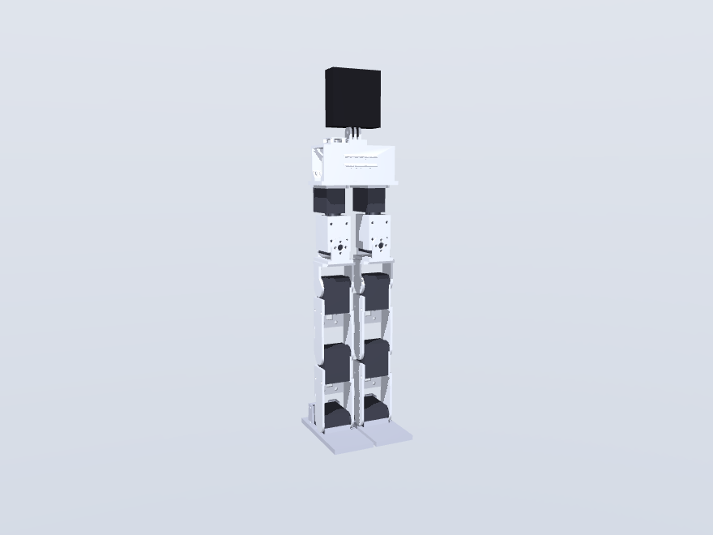 |

> ⚠️ **Hip redesign in flight (2026-07-15).** The get-up study fixed the CAD
> target at **−110°/+60° hip-pitch flexion**; `yoke_pitch` is being re-cut for
> it and is on **HOLD** — don't print the final pair, and hold the 2 thigh
> `leg_link`s until it lands (details in the [print list](../cad/PRINT_LIST.md)).
> Everything else in this guide is final geometry. The joint steps are
> identical either way; only the yoke part changes.

---

## 0. What you need

**Printed parts** (13 prints, 7 unique — PETG, no supports; orientations and
settings in the [print list](../cad/PRINT_LIST.md)):

| Part | Qty | Note |
|---|---|---|
| `pelvis` | 1 | print deck-top down |
| `yoke_roll` | 2 | flange on bed |
| `yoke_pitch` | 2 | ⚠️ on hold (hip redesign) |
| `leg_link` | 4 | 2 thighs (⚠️ hold) + 2 shins — **slice `leg_link_print.stl`** and peel the 3 break-away fins after printing |
| `foot` | 2 | v3 (heel bulkhead), sole down |
| `tower` | 1 | print top-plate down (support-free — the battery window is open to the deck) |
| `gopro_base` | 1 | prongs up; the sacrificial crash fuse |

**Everything else:** 8× ST3215 servos (12 V version) with their horns, idler
discs and included screws/leads · Waveshare Servo Driver with ESP32 · BNO085
IMU breakout · 3S 850 XT30 pack · XT30 pigtail + inline switch · 20 mm
hook-loop belt ~250 mm + pull ribbon · 2 self-adhesive rubber sole pads
(~0.5 mm, trimmed to ~90×46) · zip ties. Full list with links:
[BOM](bom-sourced.md).

**Fasteners** (all counts robot-total):

| Fastener | Qty | Where |
|---|---|---|
| M3×6 button/socket head | 32 | horn pads, 4 per joint × 8 joints |
| M3×8 + thin washer | 24 | idler pads at hip-pitch, knee, ankle (4 × 6) |
| M3×10 | 16 | yoke_roll idler arms (4×2) + hip flange bolts into inserts (4×2) |
| M3×8 self-tapping | 52 | case grips: 6 per leg_link (24), 8 per pelvis bay (16), 4 per foot (8), 4 gopro_base |
| M3 heat-set insert Ø4.6 | 12 | 4 per yoke_pitch flange (8) + 4 pelvis deck (tower) |
| M2.5×8 self-tapping | 4 | driver board onto tower standoffs |
| M5×20 thumbscrew | 1 | camera clamp (or the GoPro's own) |

**Tools:** soldering iron with heat-set tip, M3/M2.5 hex drivers, small
phillips/hex bit for self-tappers.

**Before committing plastic or torque**, run the verify-on-arrival checks from
[hardware-order.md](hardware-order.md#verify-on-arrival-before-committing-plastic):
servo case holes really take M3 self-tappers; idler screws don't bottom
(M3×8 + washer assumes the disc's 3.35 mm thread depth); driver-board holes
match the tower (Ø2.75 on 58×23); GoPro fingers fit the 3.2 mm slots (print
`gopro_base` alone first); the real battery passes the tower window.

---

## 1. Servo prep — IDs, centering, horns (do this FIRST)

Servos ship as ID 1, and two same-ID servos on the bus fail to enumerate — so
this happens before any plastic goes on:

1. Bench-power the bare driver board, confirm OLED + web UI (AP mode,
   `192.168.4.1`).
2. Connect servos **one at a time**, assign IDs, and label each case:

   | Left leg (bus port A) | Right leg (bus port B) |
   |---|---|
   | 1 hip roll | 5 hip roll |
   | 2 hip pitch | 6 hip pitch |
   | 3 knee | 7 knee |
   | 4 ankle | 8 ankle |

   This order matches the sim's action vector (`sim/walker_env.py`) — no
   permutation table in firmware.
3. Center every servo (**position 2048** / "Set Middle Position").
4. Bolt the metal horn onto each servo **at center** with its spline screw.
   Every joint is later assembled at this mechanical zero = the CAD neutral
   standing pose; a horn clocked off-center becomes a permanent joint offset.

**Orientation rule for everything below:** the two legs are *translations,
not mirrors* — identical parts, and **every pitch-joint horn faces +Y (robot
left)**. Build two identical legs; nothing is handed.

## 2. Heat-set inserts (12)

Press with the soldering iron, flush and square:

- 4 into each `yoke_pitch` flange (8 total) — the hip flange bolts land here.
- 4 into the pelvis deck (through-deck pilots into the bay-cheek material) —
  the tower feet bolt here.

## 3. Feet ×2

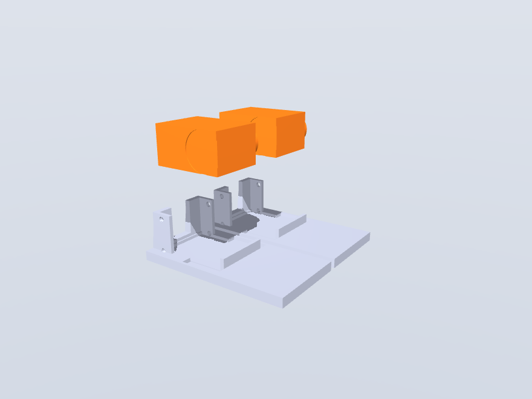

Drop the ankle servo into the foot pocket: **output end forward, cable aft**
— the cable exits through the window in the heel bulkhead. 4× M3×8
self-tappers through the rear retention tabs into the case holes. Stick the
rubber sole pad onto the flat underside (trim to fit; keep it ~0.5 mm thin —
a thicker pad raises the whole robot).

## 4. Leg links ×4 — grip a servo case

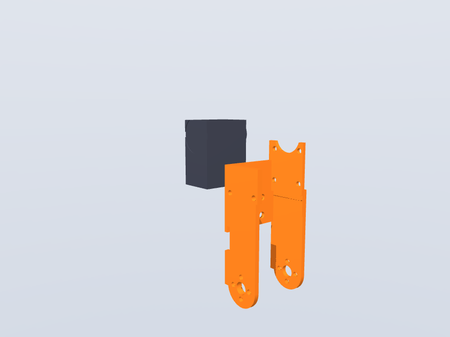

`leg_link` is both thigh and shin (same part). Slide the grip channel onto
the servo case **from the front**, just below the horn — the horn-side plate
has a circular relief that clears the Ø19.6 output boss. 6× M3×8 self-tappers
into the case holes. The shin grips the **knee** servo; the thigh grips the
**hip-pitch** servo.

## 5. Close each joint — fork to horn + idler

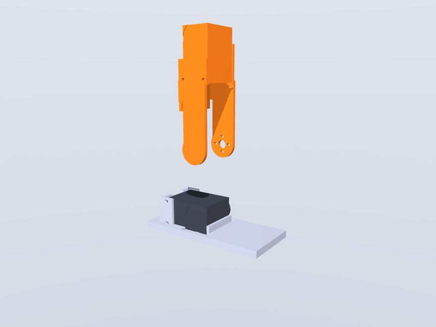

The link's fork closes on the *next* servo's output on **both** sides — metal
horn on +Y, free-spinning idler disc on −Y (same Ø14 bolt circle; no extra
bearings):

1. **Horn side first**: 4× M3×6 into the horn, with the servo at center and
   the limb at the CAD-neutral pose. Check the mechanical zero before moving on.
2. **Idler side**: 4× M3×8 **+ thin washer** (stops the tip short of the
   gear behind the disc). The printed Ø19 boss inside the Ø25 recess is a
   locator, not a precision seat — concentricity comes from the screw
   pattern, so **snug the idler screws with the joint at mechanical zero and
   check runout before final torque**.

Repeat at ankle (shin fork → ankle servo, shown) and knee (thigh fork → knee
servo), both legs.

## 6. Hip yokes — the universal joint

| yoke_pitch onto the thigh servo | yoke_roll on top, rotated 90° |
|---|---|
| 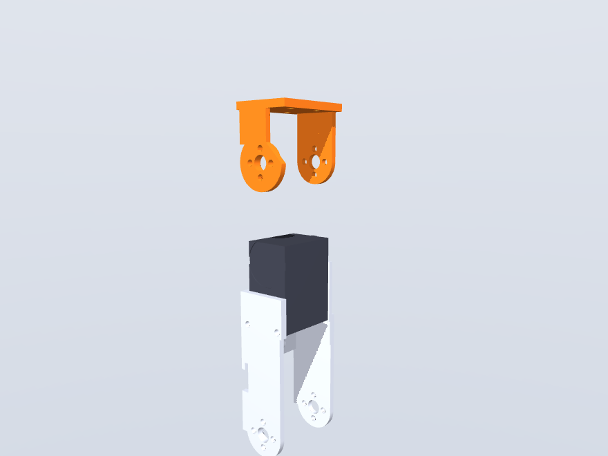 | 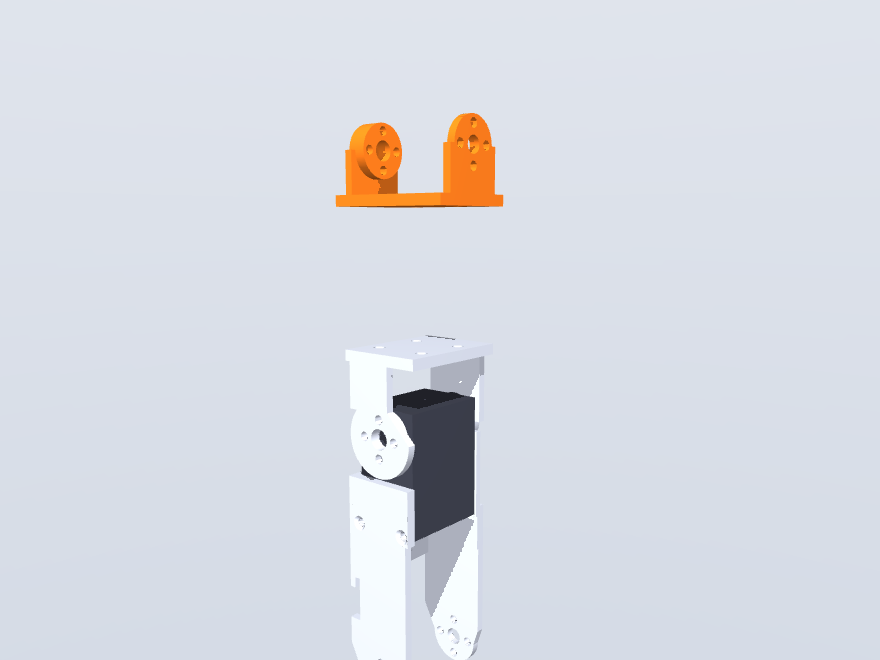 |

1. `yoke_pitch` is a clevis over the hip-pitch (thigh) servo's horn + idler:
   same pattern as step 5 — 4× M3×6 horn side, 4× M3×8+washer idler side,
   horn first at mechanical zero.
2. `yoke_roll` bolts on top of the `yoke_pitch` flange, **rotated 90°**
   (that crossing is the hip universal joint): 4× M3×10 into the heat-set
   inserts.

## 7. Pelvis — hip-roll servos slide UP into the bays

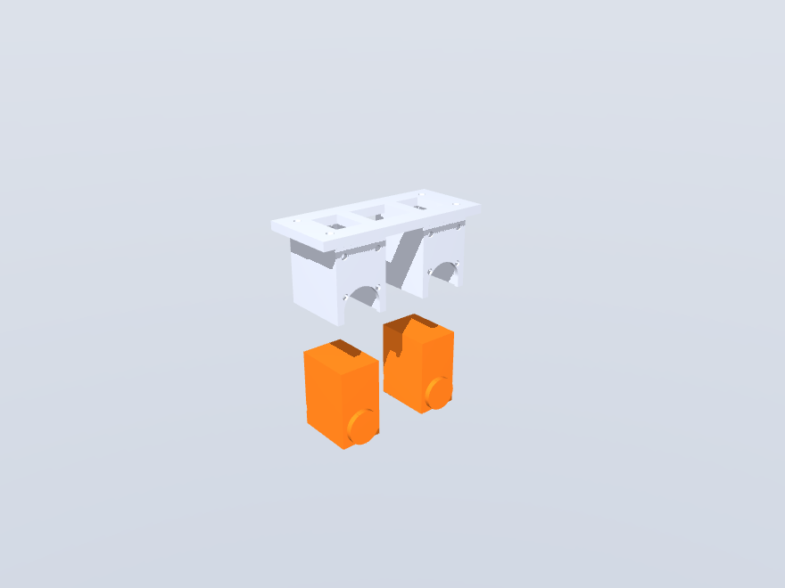

The bay bore is a downward-open U-slot: slide each hip-roll servo **up** into
its bay — **output end down, horn facing forward, cable up through the deck
cutout**. 8× M3×8 self-tappers per bay, through the bay walls into the case
holes.

## 8. Legs onto the pelvis

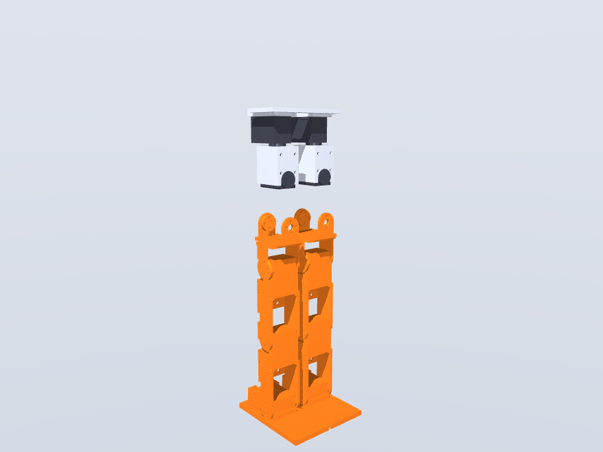

Offer each completed leg up to its roll servo, clevis over the servo:

- **Front**: yoke_roll horn arm to the roll-servo horn, 4× M3×6 — at
  mechanical zero, leg hanging straight.
- **Rear**: the idler arm's long boss reaches through the bay's rear-wall slot
  into the idler disc, 4× M3×10. Same snug-at-zero, check-runout drill.

## 9. Electronics + tower

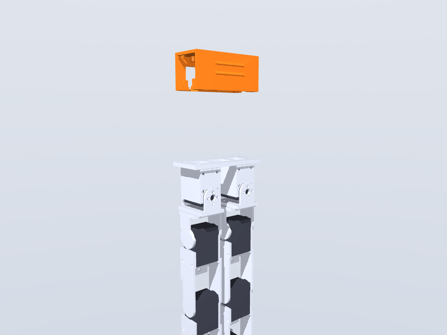

**Board first, tower second** — the board is unreachable once the tower is on:

1. Screw the driver board **face-down** onto the standoffs under the tower's
   top plate, 4× M2.5×8 from below, connectors toward an open end (driver
   access holes are in the top plate).
2. Mount the BNO085 IMU flat on the tower deck near the board, **axes aligned
   to the robot frame (+X forward)**; 4 wires to the ESP32's I2C
   (3V3/GND/SDA GPIO21/SCL GPIO22 — shared with the OLED, no address conflict).
3. Bolt the tower down: 4× M3 through the feet tabs into the deck inserts.
4. Route the XT30 pigtail + inline switch to the board's power input now,
   while the tower interior is still easy to reach.

## 10. Battery — goes in LAST, swaps tool-free

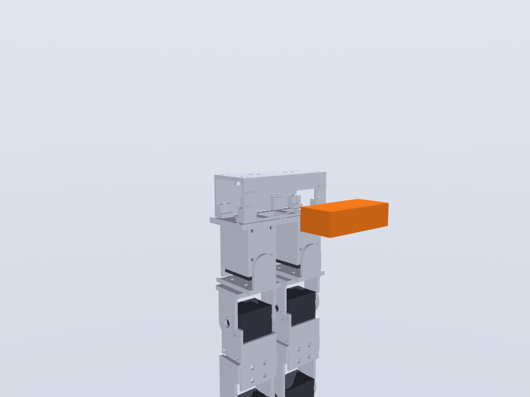

Lay the pull ribbon across the deck first. Tilt the 3S pack in through the
rear-wall window — over the two 2.5 mm corner detents, onto the far-wall
rails — **lead end toward the XT30 pigtail's pocket**. Close the 20 mm
hook-loop belt around the tower in its guide ribs: **the belt is the
retention** (the window has no sill — the detents only park the pack while
the belt is off). To swap: peel the belt, tug the ribbon, tilt out.
No screws, ever.

## 11. GoPro mount + camera

| gopro_base onto the tower top | Camera into the prongs |
|---|---|
| 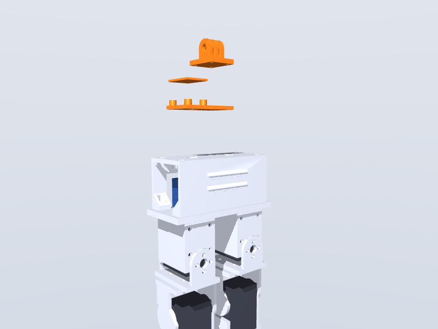 | 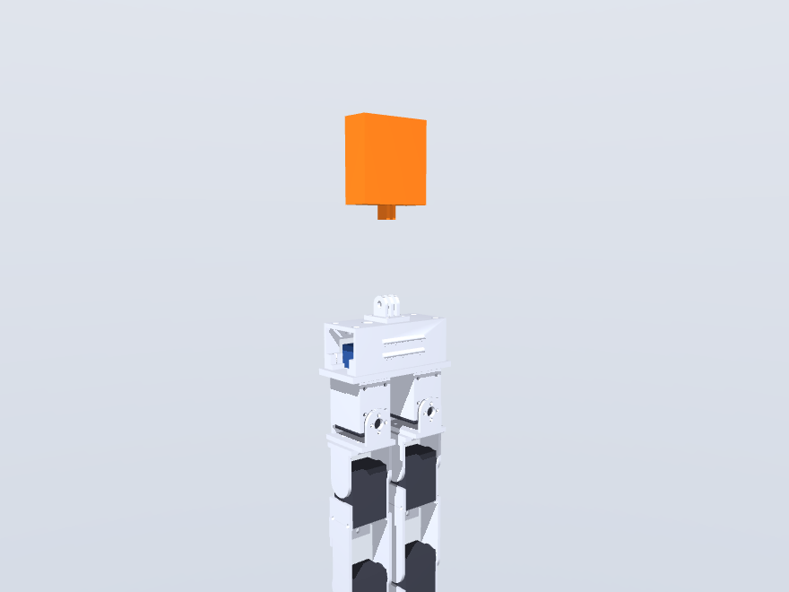 |

Screw the `gopro_base` onto the tower-top bosses (4× M3×8 self-tappers). Fold
the camera's two mount fingers down into the 3.2 mm slots and clamp with the
M5×20 thumbscrew (or the camera's own), **lens axis fore-aft**. If the
fingers bind, ream the slots (`GP_SLOT = 3.5` fallback). This part is the
deliberate crash fuse — cheap to reprint, so let it break instead of the tower.

## 12. Wiring

Full pinouts, current budget and diagrams: [wiring.md](wiring.md).

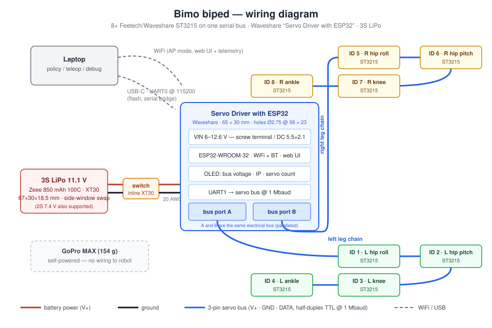

Daisy chain, board → distal (every servo has two paralleled ports; hop case
to case with the included 150 mm leads): **board port A → left hip roll →
hip pitch → knee → ankle**, port B likewise down the right leg. Connectors
for the roll servos are inside the torso. Route down the **back** of each
leg, zip ties through the leg-link web holes, and leave a slack loop across
each joint **sized at full flexion** (fold the knee to −95° before cinching).
The shin→ankle hop is the longest run — if a 150 mm lead comes up short, use
the extension leads from the order list.

## 13. First power-up

1. OLED shows bus voltage; both legs should enumerate as IDs 1–4 / 5–8.
2. **Torque-off ("Release") all servos**, stand the robot in the CAD-neutral
   pose, then "Set Middle Position" — this pins mechanical zero = sim zero.
3. Verify each joint's direction against the sim before trusting any gait,
   at low torque limit and slow speed. Ranges (`sim/bimo_biped_v2.xml`):

   | Joint | Range | Sign gotcha |
   |---|---|---|
   | hip roll | ±25° | |
   | hip pitch | −60/+60° (→ −110/+60° after redesign) | **flexion is NEGATIVE** |
   | knee | −95/+5° | deep half is the get-up range |
   | ankle | ±40° | |

4. Land the robot by **10.5 V** on the OLED (3.5 V/cell).

*Assembled: ~33 cm to the tower top, ~0.89 kg bare / ~1.05 kg with the
camera. Cross-check any step against the fly-in animation:
[`assembly_flyin.mov`](../cad/renders/assembly_flyin.mov).*
