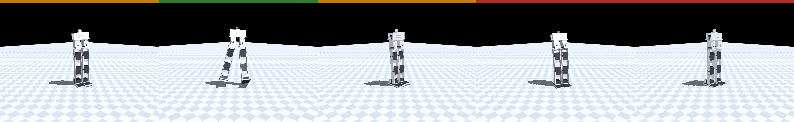

# Wireless command channel

*Status 2026-07-15. Untethered by design. No parts change: the ESP32 already
on the order sheet does this. Specified in `link/protocol.py`, exercised
against MuJoCo over real UDP by `sim/udp_agent.py`, tested in `tests/`.*

The USB-C tether stays for flashing and debug ([wiring.md](wiring.md)), but
nothing about running the robot needs it.

## The idea: the radio carries intent, not the control loop

This is the whole design, and everything else follows from it.

The 50 Hz policy loop runs **on the ESP32**, next to the 1 Mbaud servo bus —
already the plan of record, because an 8-servo command+readback cycle at
115200 baud eats most of a 20 ms tick (DESIGN.md's latency work). So the
radio does not carry joint angles at 50 Hz. It carries the **2-vector
`(vx, yaw_rate)`** that `walker_env.set_command()` already takes, at 20 Hz.

Consequences worth being explicit about:

- **A lost packet costs staleness, never a bad joint angle.** The worst a
  dropped frame can do is leave the robot tracking the previous intent for
  another 50 ms. Compare a radio in the control loop, where a dropout is a
  gap in the servo command stream.
- **The failsafe is a trained behavior, not an emergency pose.** When the
  link goes stale the command decays to `(0, 0)` — and `walker_env` draws a
  stand command 30 % of the time during training (`cmd_stand_prob`). The
  robot's response to losing its radio is the single most-practiced thing it
  knows. Nothing bespoke to write, tune, or trust.
- **Bandwidth is a non-issue.** 14 bytes at 20 Hz is 2.2 kbit/s. The link
  budget stops being an engineering problem.

## Wire format

Little-endian (ESP32 and host are both LE, so the firmware can memcpy).
Identical framing over UDP and over UART0 for tethered debug — one encoder,
both paths.

**Command** — laptop → robot, 14 B, UDP port 4210, 20 Hz:

| off | size | field | notes |
|---|---|---|---|
| 0 | 2 | magic | `"BM"` |
| 2 | 1 | version | 1 |
| 3 | 1 | flags | bit0 `ENABLE`, bit1 `ESTOP` |
| 4 | 4 | seq | u32, monotonic |
| 8 | 2 | vx | i16, mm/s, body-frame forward |
| 10 | 2 | wz | i16, mrad/s, yaw rate |
| 12 | 2 | crc16 | CCITT-FALSE over bytes 0–11 |

**Telemetry** — robot → laptop, 20 B, UDP port 4211, 10 Hz: magic `"BT"`,
version, link state, echoed seq, bus millivolts, torso up-z, estimated vx/wz,
a per-servo fault bitmask, and the percentage of control ticks that overran
20 ms. The OLED shows bus voltage too, but telemetry is what a laptop can log.

Fixed-point milli-units rather than float32 so the frame is byte-identical
across the Python sender and a C firmware. ±32.7 m/s of headroom on a plant
that does 1.0.

**Why a CRC when UDP already checksums?** Not bit rot. It (a) rejects stray
traffic that hits the port — in AP mode the robot's network is open — and (b)
lets the same frame ride UART0, where there is no transport checksum at all.
`crc16_ccitt(b"123456789") == 0x29B1`, the standard check value, so a C port
can be diffed against a number rather than against "whatever Python said".

## Link states (the failsafe)



*Real UDP, real policy, commander killed mid-stride. Stripe colour is the
watchdog's own per-tick state: amber `STAND` (powered up, no commander yet) →
green `LIVE` (walking under command) → amber `STAND` (radio dead, decayed to
the trained zero command) → red `RELAX` (torque released). Regenerate with
`.venv/bin/python sim/render_link_demo.py --run-name cmd_11v1`.*

`link/protocol.py:Watchdog` is the reference implementation. It takes its
clock as an argument, so link loss is tested exactly and instantly rather
than slept through.

| state | entered when | robot does |
|---|---|---|
| `LIVE` | valid frame < 250 ms ago | track the command |
| `STAND` | no valid frame for 250 ms | command `(0,0)` — the trained stand |
| `RELAX` | no valid frame for 5 s | **torque off**; servos release |
| `ESTOP` | operator flag; latching | torque off immediately |
| `VLAND` | pack ≤ 9.9 V for 0.5 s | stop travelling, crouch down under control |
| `VSAFE` | 1.5 s after `VLAND` | **torque off**, latched until a pack swap |

The first four come from the watchdog and describe the *link*. The last two
come from `battguard::Guard` and describe the *pack* — they are decided by the
robot, outrank anything the operator sends, and no command clears them (see
[wiring.md](wiring.md#battery-protection)). They are appended to the enum, so
the existing four keep their wire encoding.

- **250 ms** is 5 missed packets at 20 Hz — long enough that one ordinary
  WiFi hiccup is invisible, short enough that a runaway is brief.
- **5 s → RELAX** exists because holding a stand forever on a dead link
  cooks eight servos and drains the pack to hold a pose nobody wants. Limp
  is the right state for an unattended 28 cm robot; it falls better than it
  overheats. (`walker_env.set_torque_enabled()` — the sim analogue of the
  STS3215's torque-enable register, i.e. the "Release" in wiring.md's
  bring-up checklist.)
- **Before the first packet ever arrives** the state is `STAND`, not
  `RELAX`: a robot powered up on its feet with no commander yet should stand,
  not flop.
- **E-stop latches** and clears only via a frame with `ENABLE` *off*, so a
  released dead-man cannot re-arm straight back into motion.
- **The real E-stop is the inline battery switch.** No flag that has to
  arrive over a radio can be a safety guarantee; the watchdog is the property
  that holds when the radio is gone, and the switch is what holds when
  everything is gone.

Reordered and duplicate frames are dropped by sequence number, and — subtly —
**a stale frame must not pet the watchdog**. If it did, a reordered burst
could hold the robot `LIVE` on a command from the past. A backwards seq jump
larger than 1000 is read as "the commander restarted", not "ancient packet",
so a restarted sender at seq 0 resyncs instead of being ignored forever.

## The training envelope is part of the protocol

`walker_env` draws commands from a stand `(0,0)` or a walk in
**[0.3, 1.0] m/s**. The band **(0, 0.3) was never trained** — it is a hole in
the distribution, not a slow walk. A gamepad stick nudged to 20 % asking for
0.2 m/s is an out-of-distribution query whose behavior is undefined.

So `clamp_to_envelope()` snaps that band to a stand, and it runs **robot-side**
— the robot eats the bad command, and we do not control every future sender.
Turn-in-place (`vx=0, wz≠0`) *is* trained, so the snap preserves yaw.
`sources.stick_to_speed()` maps stick travel onto `[0.3, 1.0]` for the same
reason. If `cmd_v_range` changes in training, `V_MIN_WALK`/`V_MAX` in
`protocol.py` must change with it.

## Topology

Station mode (robot joins your WiFi) is the default; the laptop keeps its
internet and can drive the robot from anywhere on the network. AP mode (robot
hosts its own SSID, `192.168.4.1`) is the fallback for testing away from a
router — the board's stock web UI already uses it, so it is known-good. The
ESP32-WROOM-32 supports STA, AP, and both at once; it is a config choice, not
a hardware fork.

## Commanders

All three live laptop-side, so the robot learns exactly one wire format and a
fourth commander is a class in `link/sources.py`, not a firmware change.

- **`script`** — time-scripted sequences (`walk`, `dash_stop`, `turn`,
  `pivot`, `square`). The on-hardware twin of `sim/eval_commands.py`, so a
  real run and a sim eval are the same shape of test.
- **`gamepad`** — sticks via pygame, **held** dead-man (letting go must stop
  the robot; a toggle fails that test), B/circle for E-stop.
- **`goal`** — proportional goal-seeker; the seam the goal-conditioning work
  plugs into. **Sim-only today**: it needs world `(x, y, yaw)`, which MuJoCo
  hands over for free but the robot cannot produce — the BNO085 gives
  attitude, and torso linear velocity/height have no direct sensor at all.
  `sources.PoseFeed` isolates that gap to one swappable object; closing it
  (encoder dead-reckoning, or the GoPro) is its own piece of work.

**Aim at the middle of the trained distribution, not its edge.** The obvious
goal-seeker — high yaw gain, turn-to-face, then sprint at `V_MAX` — measurably
does not work. It asks for pivots at `wz=1.0`, the exact upper bound of
`cmd_w_range` and a regime `eval_commands` only ever validates at ±0.5, and
`cmd_11v1` falls over repeatedly instead of arriving. Every value it commands
is legal; the policy is simply worst there. Backing off to a mid-band 0.6 m/s
cruise, yaw capped at 0.8, and arcing toward the goal (walking-while-turning
is the best-trained regime there is — 60 % of `walker_env`'s moving commands
pair a `v` with a `w`) reaches a goal 2.5 m away, closest approach 0.18 m.
Pivot in place only when the goal is genuinely behind you. This generalizes
to any future commander: legal ≠ reliable, and the envelope has a *shape*,
not just bounds.

## Verification

The robot-side protocol half is ordinary Python, so it runs against MuJoCo
over a real UDP socket. Every byte, timeout, and stale-sequence rejection is
exercised before a part is ordered:

```
.venv/bin/python sim/udp_agent.py --run-name cmd_11v1 --render &
.venv/bin/python link/commander.py --host 127.0.0.1 --source gamepad
```

`--drop` and `--delay-ms` inject WiFi loss and latency. Measured, commanding
`walk` at 20 Hz for 8 s (`cmd_11v1`):

| packet loss | dropouts to `STAND` |
|---|---|
| 0 % | 0 |
| 30 % | 0 |
| 60 % | 5 |
| 85 % | 16 |

30 % loss is invisible; real WiFi is typically under 5 %. At 60 % the count
matches the `0.6^5`-per-5-packet-window prediction, and even at 85 % the
failure mode is benign — brief stands, then resume.

Killing the commander mid-stride decays exactly as specified:
`live -> stand` at +250 ms, `stand -> relax` at +5.0 s.

**A note on watching RELAX:** a released robot in the straight-legged
standing pose is a column at a symmetric equilibrium — on a flat plane with
no perturbation it keeps standing, torque or no torque. Torque release is
therefore *not* visible as a slump in a clean sim render. Verify it by torque
(`tests/test_torque_release.py` asserts exactly 0.000 N·m), not by watching.

## Porting to firmware

The C side is a transcription of a debugged module, not a design job.

1. `crc16_ccitt`, `encode/decode_command` — direct ports. Check against
   `0x29B1`, then against `tests/test_protocol.py`'s vectors.
2. `Watchdog` — direct port. It has no I/O and takes `now_ms`, so feed it
   `millis()`. The bit-flip and reordering tests transfer as-is.
3. `clamp_to_envelope` — must match `V_MIN_WALK`/`V_MAX`/`W_MAX` in the
   training config the deployed policy came from.
4. The loop: `recv` non-blocking → decode → `accept()` → `state()` →
   `command()` → policy → servo bus at 50 Hz. `sim/udp_agent.py:run()` is
   that loop in Python, in order.
5. `RELAX`/`ESTOP` → STS3215 torque-enable (register 40) off on IDs 1–8.

Not yet modeled anywhere: WiFi's real jitter distribution, and ESP32 socket
behavior under load.
