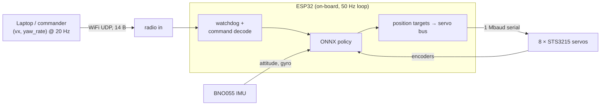
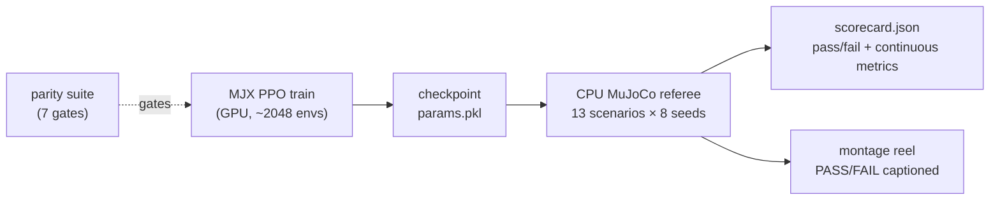

# Controls & Training — high-level overview

*A big-picture map of how this biped is controlled and how its policies are
trained. It summarizes the working docs (training-plan-v2, precision-progress,
control-channel, wiring, DESIGN §6–8) and the env/trainer source; those remain
the source of truth for numbers and rationale. Written 2026-07-22.*

The robot is a ~0.9 kg, ~0.34 m-tall biped with 8 leg joints (hip-roll,
hip-pitch, knee, ankle × 2 legs), each an STS3215 serial servo. It has no
joystick-per-joint controller and no scripted gait. A single neural-network
**policy** decides all 8 joint targets 50 times a second from what the robot
can actually sense. Everything below is about that policy: what it reads, what
it emits, how it gets to the servos, and how it is trained and graded.

---

## 1. Control architecture

### The command-conditioned policy

The policy is not "walk forward." It is a function that, given a **command** and
the robot's current state, produces motion that *tracks that command*. You steer
the robot by changing the command; the same trained weights stand, walk, turn,
sidestep, crouch, or balance on one leg depending on what you ask.

The command is a small vector of *intent*, not joint angles. Two layouts exist:

- **2-channel (locomotion, deployment default):** `(vx, yaw_rate)` — forward
  speed and turn rate. This is what the radio carries to hardware.
- **7-channel (`ext_cmd`, the precision curriculum):**
  `(vx, vy, wz, crouch_height, foot_lift, swing_dx, swing_dz)` — adds sideways
  speed, a crouch-height target, a one-leg-balance selector (lift left/right),
  and a swing-foot trajectory target (used to trace circles in the air). The
  extra channels are how the "precision skills" are expressed as commands to one
  policy rather than as separate behaviors.

Training draws commands from a defined envelope — walk speeds in **0.3–1.0 m/s**,
turn rate up to **1.0 rad/s**, and a **stand `(0,0)` command 30% of the time**.
The band `(0, 0.3) m/s` is deliberately never trained: it is a hole in the
distribution, so the deployment code snaps such requests to a stand rather than
feeding the policy an undefined query. The trained envelope *is* part of the
control contract (see control-channel.md).

### The 50 Hz loop and what the policy observes

Every 20 ms the policy consumes an **observation vector** built only from
signals the real robot can produce (`env_mjx.py:_obs`):

- **8 joint positions + 8 joint velocities** — servo encoders.
- **Torso up-vector (3) + angular velocity (3)** — the IMU (BNO055) fused
  on-chip.
- **Previous action (8)** — closes the loop on its own last command.
- **Gait clock (sin/cos of phase)** — a metronome so the policy can time a
  periodic gait; in plan-v2 this is a real per-episode gait frequency
  (~1.25–1.75 Hz) rather than a fraction of the episode.
- **The command itself** (2 or 7 channels).
- **A short history** — the last 3 observation frames stacked (plan-v2). History
  substitutes for state the robot cannot measure instantaneously.

**What it deliberately does NOT observe:** torso **linear velocity** and
**height** are zeroed out (`imu_obs=True`). No sensor on the robot measures
them — the IMU gives attitude, not translation — and every working small biped
surveyed (Open Duck Mini and three others) runs the same IMU-only, no-odometry,
command-conditioned way. Rather than fake a velocity estimate, the policy learns
to infer motion from the observation history, exactly matching field practice.
(Linear velocity/height may return later as *critic-only* privileged signals —
used to train the value network, never fed to the deployed actor.)

The IMU input is corrupted during training with mounting-misalignment,
gyro-bias, and per-step noise, so the policy never overtrusts it.

### What the policy outputs, and how it reaches the servos

The policy emits **8 values in [-1, 1]**, interpreted as **position targets
around the standing pose**: action 0 means "hold the neutral standing angles,"
and each channel deflects one joint within its range from there. This residual
framing means a zero/failed policy still stands, and small outputs are small,
safe motions.

Those targets travel to the servos through the planned deployment path:

The key deployment decision: **the 50 Hz policy loop runs on the ESP32 itself**,
next to the 1 Mbaud servo bus. The radio therefore carries only the low-rate
`(vx, yaw_rate)` *intent* (14 bytes at 20 Hz), never joint angles. Consequences:

- A dropped packet costs *staleness* (act on the last intent for 50 ms), never a
  corrupt joint target.
- The **failsafe is a trained behavior**: a stale link decays the command to
  `(0,0)`, which is the stand the policy already practices 30% of the time — the
  single most-rehearsed thing it knows. After 5 s of silence the servos release
  (limp is safer than cooking motors on a dead link). No bespoke emergency pose.

The policy will deploy as an **ONNX** export run by the ESP32's control loop.
IDs 1–8 on the bus already match the sim's joint order, so the action vector maps
to servos with no permutation table. Sim-to-real has not yet been attempted;
this path is specified and sim-verified over real UDP but not yet on hardware.

---

## 2. The simulation stack

Training happens entirely in simulation, on a physics model built to be *honest*
about the real actuators rather than optimistic.

### Dual-engine: MJX for scale, CPU MuJoCo for truth

- **MJX (JAX)** — `sim/mjx/env_mjx.py`. A pure-functional, GPU-vectorized port
  that runs thousands of robots in parallel for training throughput.
- **CPU MuJoCo** — `sim/walker_env.py`. The original single-robot Gymnasium env,
  used as the **referee**.

The two share physics and reward arithmetic exactly (verified — see the parity
suite below), but MJX numbers are **never trusted alone**: every trained policy
is re-run and scored in the CPU env before any claim is believed.

### The honest actuator model

Each servo is not an ideal position source. Per physics sub-step, the model
(`env_mjx.py:step`) computes a PD torque `kp·err − kd·qd` and then **clamps it to
the STS3215's DC-motor torque-speed envelope** — available torque falls to zero
as joint speed approaches the no-load limit (`cap = stall·(1 − |qd|/w0)`), scaled
by supply voltage (11.1 V, 3S). On top of that:

- **Gear backlash** — a deadzone (~0.5–1.0°) so small target changes do nothing,
  as real gear lash does.
- **Sub-step action latency** — the new target only takes effect after a few
  sub-steps (0–8 ms), modeling the serial-bus command delay. This latency was
  once a sim-to-real cliff; modeling it sub-step is what closed it.
- **Frictionloss + armature** — Coulomb stiction and reflected rotor inertia
  (BAM-identified values from Open Duck's STS3215 fit: ~0.05 N·m, ~0.028 kg·m²).
  The torque-speed envelope covers viscous loss but not stiction, so these were
  genuinely missing until plan-v2 added them.

DESIGN §7 records that ideal-actuator policies were *physically unbuildable*
(they demanded ~3 N·m at 4.4 rad/s, outside the envelope at any voltage). The
honest model is what makes a trained gait a candidate for real hardware.

### Domain randomization (DR)

Every training episode/batch perturbs the plant so no single policy overfits one
robot: mass/inertia/friction/payload (batch-level, per parallel env), and
per-episode servo gains, latency, backlash, IMU error, and random velocity
kicks/pushes. The policy that survives thousands of slightly-different robots is
the one likely to survive the one real robot. Training uses the **as-built
plant** (`bimo_biped_v2_asbuilt.xml`, printed 100 mm feet, true camera CG at
+94.5 mm), not the CAD ideal.

### The CPU-referee rule and the parity suite (one paragraph)

MJX and CPU MuJoCo agree to ~1e-11 on synced single steps — actuator envelope,
latency, backlash, reward, and settled-stance contacts are arithmetically
identical. The **one** semantic difference is the contact-manifold generator:
MJX emits only contact points near the deepest penetration, CPU MuJoCo emits
every penetrating corner, so they diverge chaotically at *impact instants* and
foot-on-foot clipping (like any tiny perturbation would). `parity_test.py`
encodes this as a 7-gate suite: airborne parity (validates the whole
actuator/reward/obs port with no contacts), grounded matched-manifold parity
(contacts where they agree), and an informational float32 drift check. Because
impacts are where the engines legitimately differ, **DR + the CPU referee** are
the mitigation: a policy is only as good as its CPU-refereed scorecard.

---

## 3. The training method

**Algorithm:** brax **PPO** (Proximal Policy Optimization) at GPU scale on Mira's
RTX 4070 Ti — ~2048 parallel envs, hundreds of millions of environment steps per
run (~200× CPU throughput). Networks are (512,256,128) for the precision policies.
Checkpoints save as `params.pkl` + `config.json` per run.

The interesting part is not the optimizer but the **reward** — a layered economy
designed so that the *only* profitable behavior is the one we want. The layers:

**(a) Command tracking — the dominant layer.** Kernels reward matching the
commanded velocity/yaw: `exp(−((vx − cmd_v)/0.5)²)`. But a pure kernel has a
fatal flaw (see below), so the primary term is **dense directional progress**:
it pays proportionally for real progress toward the command, **zero for
standing**, and **negative for wrong-way motion**. Height-tracking, one-leg-lift,
and swing-foot kernels extend this to the precision channels.

**(b) Gait shaping.** A **phase clock** term rewards each foot for being at the
right swing height at the right moment in the cycle (feet half a cycle apart) —
the strongest natural-gait term. Plus **feet-slip** penalty (no skating),
**feet-air-time** reward, **single-support** bonus, and a **swing-symmetry**
penalty matching left/right swing durations (the software counterweight to a
mechanical left/right yaw bias from identical parts).

**(c) Skill terms with compliance gating.** One-leg lift (must clear ≥3 cm —
a 2 mm hover does not count), crouch-height hold, swing-foot circle tracking,
and fall recovery. The crucial trick is **compliance gating**: the base tracking
reward is *scaled down* when the policy ignores a skill command. Before gating,
a "lift your foot" command was answered with calm standing because the tracking
kernels still paid full value for `vel = 0`. Gating made answering the skill the
only way to collect — and the skills unlocked (one-leg balance 0% → ~92% real
clearance).

**(d) Procedural reference-gait imitation (the new layer, plan-v2 Phase B).** A
small **reference generator** produces target joint angles for any command from
sinusoidal stride/roll amplitudes, knee-bend-during-swing, and level ankles — a
"textbook" gait computed by construction. The policy earns a mimic reward
`exp(−Σ(q − q_ref)²/s²)` for staying near it. **Why imitation instead of more
reward shaping?** Two locomotion skills — backward and sideways walking — never
converged under hand-tuned shaping, but they exist *for free* in the reference
generator (just negate/rotate the stride). Imitation supplies a dense,
always-available "this is roughly what the joints should do" signal that reward
kernels alone could not. The **precedent is Open Duck Mini** — same STS3215
servos, same MJX+brax stack, working sim-to-real — whose natural gait comes from
exactly this procedural-reference + phase-locked-imitation recipe (not AMP, not
motion capture). It is the lowest-risk route to a natural gait on our morphology.

**(e) Safety & regularization.** A severe **fall cost** (6, or 10 in precision)
plus episode termination; energy, electrical-power, action-rate, and
torso-pitch-rate penalties (smoothness); pose regularization toward neutral;
soft joint-limit penalties; quadratic orientation and angular-velocity costs.

### The do-nothing-optimum — the single most instructive lesson

The first precision run (`precision_v1`, 150M steps) achieved **zero falls in
112 episodes — by never moving.** With severe fall penalties and forgiving
tracking kernels, *standing still* banked ~84% of the perfect-tracking reward at
zero risk. Motion could only lose points (falls) or, at best, match what standing
already earned. The policy correctly found that the safest, highest-value
behavior was to do nothing. Every skill command was answered with a serene stand.

This is a **reward-economics** failure, not a training bug. The fix was to change
the economics so standing *cannot* pay:

1. **Dense directional progress** replaced the standing-friendly kernel as the
   primary term: it pays **zero** for standing and **negative** for wrong-way
   motion, so inaction is no longer break-even — it is a forfeit.
2. **Compliance gating** (layer c) removed the fallback of collecting tracking
   reward while ignoring a skill.
3. **Wide-enough kernels** so a struggling-but-improving policy still feels a
   gradient (a 3 cm foot-target kernel paid ~0 gradient at a 15 cm foot error;
   widening to 6 cm restored the pull — the same lesson recurred three times).

The meta-lesson threaded through the whole project: **the policy optimizes the
reward you wrote, not the behavior you wanted.** If standing pays, it stands.

---

## 4. The evaluation layer

Training optimizes continuous signals; **grading is separate, honest, and on the
CPU referee** (`sim/mjx/eval_precision.py`, 13 scenarios).

- **Scenario referee.** Each user-specified skill is a scenario with a scripted
  command (line_1m, stand_10s, balance_L/R, circle_air, crouch_hold,
  sidestep/backward, square/circle_return, recover_fallen). Each runs **8 seeds**
  under **hardware-claim conditions** (GoPro payload, 4 ms bus latency, 0.7°
  backlash, model-error DR, IMU-only observations).
- **Pass/fail *and* continuous metrics.** Every seed records endpoint error,
  tracking error (mm), clearance %, drift RMS, time-to-target, plus a smoothness
  panel (wobble RMS, electrical watts, cost-of-transport, foot slip, L/R
  swing symmetry) into `scorecard.json`. Pass/fail is just a threshold view over
  the continuous truth.
- **Honest-grading principles.** (1) **Matched conditions** — a hardware claim is
  only graded under hardware conditions. (2) **Real minimums** — the referee once
  "passed" air-circles the foot never actually traced, and "balance" that was a
  2 mm hover; both were re-graded with real geometric minimums (≥3 cm traced
  radius + full sweep; ≥3 cm clearance) and correctly flipped to fail. (3)
  **Best-take labeling** — the montage shows the first *passing* seed, else the
  best non-fall attempt, captioned PASS/FAIL, so a demo can never launder a
  cherry-picked take. Claims are read with the caveat that falls/wobble *rise*
  when a policy starts attempting hard skills instead of dodging them.

---

## 5. Specialist policies & the nightly pipeline

Plan-v2 splits training into **specialist policy families** (the `--family` flag)
rather than forcing one policy to master everything at once:

- **loco** — walk/backward/sidestep/turn/pivot/stand, with the procedural-gait
  imitation prior on (`w_mimic=1.5`).
- **skills** (balance-family) — stand/crouch/one-leg/air-circles/march/sway; the
  command mix never draws walk commands, so it specializes in static-balance
  precision.
- **getup** — every episode starts from a settled fall; recovery reward carries
  the whole gradient.

**Nightly pipeline (brief):** a cron job arms a training window on Mira at
**23:00** (waits for free VRAM, unloads only *idle* ollama models, never starts
after 05:00, hard-stops at **07:00** with a checkpoint-safe SIGTERM —
`infra/night_arm.sh`). Morning: `infra/night_collect.sh` pulls the checkpoint and
runs the CPU referee. Everything is one command; RunPod burst compute is the
retired fallback. **Always render after training** — the gait montage refreshes
to the same artifact URL each round.

---

## 6. Known limitations / open problems

- **Turn asymmetry.** Turn authority is roughly half of commanded; return-to-
  start evals (square/circle) miss by 1–2 m. Candidates: a heading-error reward
  term, or a mechanical mirrored-horn fix for the identical-parts yaw bias. The
  swing-symmetry penalty is the current software counterweight.
- **Recovery-to-stand.** The robot *fights* to rise (visible effort, ~13 W) and
  can sit/kneel, but does not yet complete a stand from a fallen ragdoll. The
  rise is a narrow balance corridor; the literature recipe (head-height term,
  rise-jerk penalties, then a two-stage discover-then-temporally-stretch get-up)
  is queued but not yet landed.
- **Sidestep & backward gaits** — attempted, not yet converged under reward
  shaping alone; the procedural-imitation prior (§3d) is the bet to crack them.
- **Odometry gap.** The robot has no pose estimate — the IMU gives attitude only.
  Return-to-start and goal-seeking evals use sim ground truth; on hardware that
  seam (`sources.PoseFeed`) is unfilled (encoder dead-reckoning or the GoPro are
  the candidates).
- **Sim-to-real not yet attempted.** The honest actuator model, DR, ONNX export,
  and ESP32 control loop are all specified and sim-verified, but no policy has
  run on the physical robot. That is the next real milestone.
</content>
</invoke>
