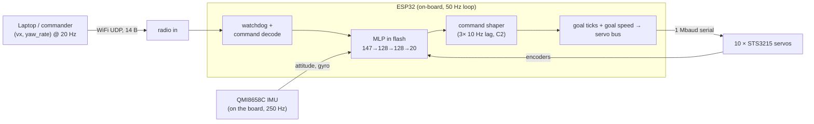
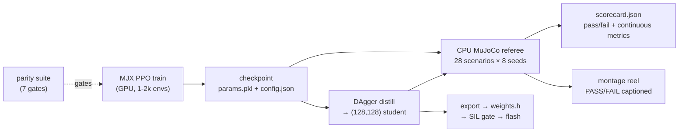

# Controls & Training — high-level overview

*A big-picture map of how this biped is controlled and how its policies are
trained. It summarizes the working docs (training-plan-v2, precision-progress,
control-channel, wiring, DESIGN §6–8) and the env/trainer source; those remain
the source of truth for numbers and rationale. Written 2026-07-22, updated
2026-09-03.*

> **For the training pipeline in depth — plant, observation contract, reward,
> domain randomization, the referee, distillation and deployment — see
> [training.md](training.md).** This document is the shorter map of the control
> architecture around it.

The robot is a ~1.1 kg, ~0.34 m-tall biped with **10 leg joints** (hip-yaw,
hip-roll, hip-pitch, knee, ankle × 2 legs), each an STS3215 serial servo. It has
no joystick-per-joint controller and no scripted gait. A single neural-network
**policy** decides all 10 joint targets 50 times a second from what the robot
can actually sense. Everything below is about that policy: what it reads, what
it emits, how it gets to the servos, and how it is trained and graded.

---

## 1. Control architecture

### The command-conditioned policy

The policy is not "walk forward." It is a function that, given a **command** and
the robot's current state, produces motion that *tracks that command*. You steer
the robot by changing the command; the same trained weights stand, walk, turn,
sidestep, crouch, or balance on one leg depending on what you ask.

The command is a small vector of *intent*, not joint angles. Two layouts exist:

- **2-channel (locomotion, deployment default):** `(vx, yaw_rate)` — forward
  speed and turn rate. This is what the radio carries to hardware.
- **7-channel (`ext_cmd`, the precision curriculum):**
  `(vx, vy, wz, crouch_height, foot_lift, swing_dx, swing_dz)` — adds sideways
  speed, a crouch-height target, a one-leg-balance selector (lift left/right),
  and a swing-foot trajectory target (used to trace circles in the air). The
  extra channels are how the "precision skills" are expressed as commands to one
  policy rather than as separate behaviors.

Training draws commands from a defined envelope — walk speeds in **0.3–1.0 m/s**,
turn rate up to **1.0 rad/s**, and a **stand `(0,0)` command 30% of the time**.
The band `(0, 0.3) m/s` is deliberately never trained: it is a hole in the
distribution, so the deployment code snaps such requests to a stand rather than
feeding the policy an undefined query. The trained envelope *is* part of the
control contract (see control-channel.md).

### The 50 Hz loop and what the policy observes

Every 20 ms the policy consumes an **observation vector** built only from
signals the real robot can produce (`env_mjx.py:_obs`):

- **10 joint positions + 10 joint velocities** — servo encoders, quantized to
  the STS3215's 4096-tick word exactly as the bus delivers them.
- **Torso up-vector (3) + angular velocity (3)** — the IMU (the board's own
  QMI8658C), sampled at 250 Hz and fused by `imu::Fusion`, with the gyro
  tick-averaged into the 50 Hz control loop.
- **Previous action (10)** — closes the loop on its own last command.
- **Gait clock (sin/cos of phase)** — a metronome so the policy can time a
  periodic gait; in plan-v2 this is a real per-episode gait frequency
  (~1.25–1.75 Hz) rather than a fraction of the episode.
- **The command itself** (2 or 7 channels).
- **A short history** — the last 3 observation frames stacked (plan-v2). History
  substitutes for state the robot cannot measure instantaneously.

One frame is **49** wide and the network reads 3 of them, so the deployed
observation is **147**. The layout is *generated* from the sim into
`firmware/components/obs/include/obs/obs_spec.h` by `tools/gen_obs_spec.py`, so
it cannot drift between the two by hand.

**What it deliberately does NOT observe:** torso **linear velocity** and
**height** are zeroed out (`imu_obs=True`). No sensor on the robot measures
them — the IMU gives attitude, not translation — and every working small biped
surveyed (Open Duck Mini and three others) runs the same IMU-only, no-odometry,
command-conditioned way. Rather than fake a velocity estimate, the policy learns
to infer motion from the observation history, exactly matching field practice.
(Linear velocity/height may return later as *critic-only* privileged signals —
used to train the value network, never fed to the deployed actor.)

The IMU input is corrupted during training with mounting-misalignment,
gyro-bias, and per-step noise, so the policy never overtrusts it.

### What the policy outputs, and how it reaches the servos

The policy emits **10 values in [-1, 1]**, interpreted as **position targets
around the standing pose**: action 0 means "hold the neutral standing angles,"
and each channel deflects one joint within its range from there. This residual
framing means a zero/failed policy still stands, and small outputs are small,
safe motions.

Those targets travel to the servos through the deployed path:

The key deployment decision: **the 50 Hz policy loop runs on the ESP32 itself**,
next to the 1 Mbaud servo bus. The radio therefore carries only the low-rate
`(vx, yaw_rate)` *intent* (14 bytes at 20 Hz), never joint angles. Consequences:

- A dropped packet costs *staleness* (act on the last intent for 50 ms), never a
  corrupt joint target.
- The **failsafe is a trained behavior**: a stale link decays the command to
  `(0,0)`, which is the stand the policy already practices 30% of the time — the
  single most-rehearsed thing it knows. After 5 s of silence the servos release
  (limp is safer than cooking motors on a dead link). No bespoke emergency pose.

**Deployment, as actually built:** the network is not ONNX. It is distilled to
(128, 128) and compiled into the firmware as a `constexpr` living in flash
DROM, evaluated by `policy/mlp.cpp` — normalize, swish hidden layers, linear
`2·act_dim` head, `tanh` of the first half, which is brax's arithmetic
reproduced exactly and checked against numpy golden vectors.

Two corrections to the original plan: the action vector needs a **real
permutation table** (`obs::kServoId`) — the sim's action order puts `L_hip_yaw`
at index 0 while the bus numbered the yaw servos 9 and 10 after IDs 1–8 were
assigned, and the two bus chains went onto the opposite legs from the plan. And
the raw 50 Hz targets are not written straight to the bus: `obs::CommandShaper`
puts three cascaded 10 Hz first-order lags on them (a C2 trajectory, finite
jerk) and every SYNC WRITE carries a per-servo goal speed sized to close the
measured gap in one tick. Without that, every tick was a max-speed slam-and-stop
— a velocity square wave on every joint.

This path is live: the robot walked under it, untethered, on 2026-09-01.

---

## 2. The simulation stack

Training happens entirely in simulation, on a physics model built to be *honest*
about the real actuators rather than optimistic.

### Dual-engine: MJX for scale, CPU MuJoCo for truth

- **MJX (JAX)** — `sim/mjx/env_mjx.py`. A pure-functional, GPU-vectorized port
  that runs thousands of robots in parallel for training throughput.
- **CPU MuJoCo** — `sim/walker_env.py`. The original single-robot Gymnasium env,
  used as the **referee**.

The two share physics and reward arithmetic exactly (verified — see the parity
suite below), but MJX numbers are **never trusted alone**: every trained policy
is re-run and scored in the CPU env before any claim is believed.

### The honest actuator model

Each servo is not an ideal position source. Per physics sub-step, the model
(`env_mjx.py:step`) computes a PD torque `kp·err − kd·qd` and then **clamps it to
the STS3215's DC-motor torque-speed envelope** — available torque falls to zero
as joint speed approaches the no-load limit (`cap = stall·(1 − |qd|/w0)`), scaled
by supply voltage (11.1 V, 3S). On top of that:

- **Gear backlash** — a deadzone (~0.5–1.0°) so small target changes do nothing,
  as real gear lash does.
- **Sub-step action latency** — the new target only takes effect after a few
  sub-steps (0–8 ms), modeling the serial-bus command delay. This latency was
  once a sim-to-real cliff; modeling it sub-step is what closed it.
- **Frictionloss + armature** — Coulomb stiction and reflected rotor inertia
  (BAM-identified values from Open Duck's STS3215 fit: ~0.05 N·m, ~0.028 kg·m²).
  The torque-speed envelope covers viscous loss but not stiction, so these were
  genuinely missing until plan-v2 added them.

DESIGN §7 records that ideal-actuator policies were *physically unbuildable*
(they demanded ~3 N·m at 4.4 rad/s, outside the envelope at any voltage). The
honest model is what makes a trained gait a candidate for real hardware.

### Domain randomization (DR)

Every training episode/batch perturbs the plant so no single policy overfits one
robot: mass/inertia/friction/payload (batch-level, per parallel env), and
per-episode servo gains, latency, backlash, IMU error, and random velocity
kicks/pushes. The policy that survives thousands of slightly-different robots is
the one likely to survive the one real robot. Training uses
**`bimo_biped_v5body.xml`** — the pelvis-v6, 10-DOF plant with the camera at its
true mount (−24 mm x, +60 mm above the torso centre) rather than floating on the
retired tower. Two DR terms were added later from bench measurements: an
**actuation-lag pole** (2–12 Hz, three-stage cascade) and **free-travel joint
play**. See [training.md](training.md) §6 for why the sim only gets a hardware
term after the bench measures it.

### The CPU-referee rule and the parity suite (one paragraph)

MJX and CPU MuJoCo agree to ~1e-11 on synced single steps — actuator envelope,
latency, backlash, reward, and settled-stance contacts are arithmetically
identical. The **one** semantic difference is the contact-manifold generator:
MJX emits only contact points near the deepest penetration, CPU MuJoCo emits
every penetrating corner, so they diverge chaotically at *impact instants* and
foot-on-foot clipping (like any tiny perturbation would). `parity_test.py`
encodes this as a 7-gate suite: airborne parity (validates the whole
actuator/reward/obs port with no contacts), grounded matched-manifold parity
(contacts where they agree), and an informational float32 drift check. Because
impacts are where the engines legitimately differ, **DR + the CPU referee** are
the mitigation: a policy is only as good as its CPU-refereed scorecard.

---

## 3. The training method

*Summary only — the full account, including the hyperparameters, the warm-start
lineage, distillation and the deploy path, is in [training.md](training.md).*

**Algorithm:** brax **PPO** (Proximal Policy Optimization) at GPU scale on the
RTX 4070 Ti box — 1–2k parallel envs, tens to hundreds of millions of
environment steps per run (~200× CPU throughput). Networks are (512,256,128) for
the precision policies, distilled to (128,128) for the firmware. Checkpoints
save as `params.pkl` + `config.json` per run; runs usually **warm-start** from
their predecessor rather than starting cold.

The interesting part is not the optimizer but the **reward** — a layered economy
designed so that the *only* profitable behavior is the one we want. The layers:

**(a) Command tracking — the dominant layer.** Kernels reward matching the
commanded velocity/yaw: `exp(−((vx − cmd_v)/0.5)²)`. But a pure kernel has a
fatal flaw (see below), so the primary term is **dense directional progress**:
it pays proportionally for real progress toward the command, **zero for
standing**, and **negative for wrong-way motion**. Height-tracking, one-leg-lift,
and swing-foot kernels extend this to the precision channels.

**(b) Gait shaping.** A **phase clock** term rewards each foot for being at the
right swing height at the right moment in the cycle (feet half a cycle apart) —
the strongest natural-gait term. Plus **feet-slip** penalty (no skating),
**feet-air-time** reward, **single-support** bonus, and a **swing-symmetry**
penalty matching left/right swing durations (the software counterweight to a
mechanical left/right yaw bias from identical parts).

**(c) Skill terms with compliance gating.** One-leg lift (must clear ≥3 cm —
a 2 mm hover does not count), crouch-height hold, swing-foot circle tracking,
and fall recovery. The crucial trick is **compliance gating**: the base tracking
reward is *scaled down* when the policy ignores a skill command. Before gating,
a "lift your foot" command was answered with calm standing because the tracking
kernels still paid full value for `vel = 0`. Gating made answering the skill the
only way to collect — and the skills unlocked (one-leg balance 0% → ~92% real
clearance).

**(d) Procedural reference-gait imitation (the new layer, plan-v2 Phase B).** A
small **reference generator** produces target joint angles for any command from
sinusoidal stride/roll amplitudes, knee-bend-during-swing, and level ankles — a
"textbook" gait computed by construction. The policy earns a mimic reward
`exp(−Σ(q − q_ref)²/s²)` for staying near it. **Why imitation instead of more
reward shaping?** Two locomotion skills — backward and sideways walking — never
converged under hand-tuned shaping, but they exist *for free* in the reference
generator (just negate/rotate the stride). Imitation supplies a dense,
always-available "this is roughly what the joints should do" signal that reward
kernels alone could not. The **precedent is Open Duck Mini** — same STS3215
servos, same MJX+brax stack, working sim-to-real — whose natural gait comes from
exactly this procedural-reference + phase-locked-imitation recipe (not AMP, not
motion capture). It is the lowest-risk route to a natural gait on our morphology.

**(e) Safety & regularization.** A severe **fall cost** (6, or 10 in precision)
plus episode termination; energy, electrical-power, action-rate, and
torso-pitch-rate penalties (smoothness); pose regularization toward neutral;
soft joint-limit penalties; quadratic orientation and angular-velocity costs.

### The do-nothing-optimum — the single most instructive lesson

The first precision run (`precision_v1`, 150M steps) achieved **zero falls in
112 episodes — by never moving.** With severe fall penalties and forgiving
tracking kernels, *standing still* banked ~84% of the perfect-tracking reward at
zero risk. Motion could only lose points (falls) or, at best, match what standing
already earned. The policy correctly found that the safest, highest-value
behavior was to do nothing. Every skill command was answered with a serene stand.

This is a **reward-economics** failure, not a training bug. The fix was to change
the economics so standing *cannot* pay:

1. **Dense directional progress** replaced the standing-friendly kernel as the
   primary term: it pays **zero** for standing and **negative** for wrong-way
   motion, so inaction is no longer break-even — it is a forfeit.
2. **Compliance gating** (layer c) removed the fallback of collecting tracking
   reward while ignoring a skill.
3. **Wide-enough kernels** so a struggling-but-improving policy still feels a
   gradient (a 3 cm foot-target kernel paid ~0 gradient at a 15 cm foot error;
   widening to 6 cm restored the pull — the same lesson recurred three times).

The meta-lesson threaded through the whole project: **the policy optimizes the
reward you wrote, not the behavior you wanted.** If standing pays, it stands.

---

## 4. The evaluation layer

Training optimizes continuous signals; **grading is separate, honest, and on the
CPU referee** (`sim/mjx/eval_precision.py`, now **28 scenarios**).

- **Scenario referee.** Each user-specified skill is a scenario with a scripted
  command (line_1m, stand_10s, stand_off, balance_L/R, circle_air, crouch_hold,
  sidestep/backward, turn_180, square/circle_return, goal_home, line_rough,
  push_gauntlet, speed_ladder, pursuit, reversal, metronome, squat_reps,
  weight_shift, recover_sit/fallen). Each runs **8 seeds** under
  **hardware-claim conditions** (GoPro payload, bus latency, backlash,
  model-error DR, IMU-only observations). A `--family` run is scored on its own
  family's scenarios — hence the **/144** totals (18 locomotion scenarios × 8
  seeds) used to rank the fleet.
- **Three columns, not one.** The same scenarios run (1) on the exported policy
  in the CPU env, (2) with `--sil`, driving the plant through the *real C++
  firmware code*, and (3) with `--act-lag-hz 2.0`, at the bench-measured servo
  lag. They are not interchangeable: adding the lag column in 2026-09
  **inverted the fleet ranking** — the sim champion fell from 96/144 to 16 with
  77 % falls. Treat a column as a ranking under a stated plant, never as a
  prediction of hardware behaviour.
- **Pass/fail *and* continuous metrics.** Every seed records endpoint error,
  tracking error (mm), clearance %, drift RMS, time-to-target, plus a smoothness
  panel (wobble RMS, electrical watts, cost-of-transport, foot slip, L/R
  swing symmetry) into `scorecard.json`. Pass/fail is just a threshold view over
  the continuous truth.
- **Honest-grading principles.** (1) **Matched conditions** — a hardware claim is
  only graded under hardware conditions. (2) **Real minimums** — the referee once
  "passed" air-circles the foot never actually traced, and "balance" that was a
  2 mm hover; both were re-graded with real geometric minimums (≥3 cm traced
  radius + full sweep; ≥3 cm clearance) and correctly flipped to fail. (3)
  **Best-take labeling** — the montage shows the first *passing* seed, else the
  best non-fall attempt, captioned PASS/FAIL, so a demo can never launder a
  cherry-picked take. Claims are read with the caveat that falls/wobble *rise*
  when a policy starts attempting hard skills instead of dodging them.

---

## 5. Specialist policies & the nightly pipeline

Plan-v2 splits training into **specialist policy families** (the `--family` flag)
rather than forcing one policy to master everything at once:

- **loco** — walk/backward/sidestep/turn/pivot/stand, with the procedural-gait
  imitation prior on (`w_mimic=1.5`).
- **skills** (balance-family) — stand/crouch/one-leg/air-circles/march/sway; the
  command mix never draws walk commands, so it specializes in static-balance
  precision.
- **getup** — every episode starts from a settled fall; recovery reward carries
  the whole gradient.

**Nightly pipeline (brief):** cron opens the training window on the GPU box at
**22:00** and `infra/night/night_run.sh` works a **queue** of job files in
sorted order — multiple runs per night, sequentially. No new job starts after
05:00; hard stop at **07:00**. A job file moves to `queue/done/` at *launch*, so
an interrupted job does not silently re-run the next night (its checkpoint is
collectible either way). Idle ollama models are unloaded, live inference is
never evicted. Morning: `infra/night_collect.sh` pulls the checkpoints and runs
the CPU referee. The training tree on that box is a **git clone that pulls
before every job** — uncommitted code does not get trained (an rsync of a
hand-curated file list once missed a plant XML for two days). RunPod burst
compute is the retired fallback. **Always render after training** — the gait
montage refreshes into `sim/runs/night_summary.html` each round.

---

## 6. Known limitations / open problems

- **Turn authority.** Historically roughly half of commanded, with return-to-
  start evals missing by 1–2 m. Since addressed in software — a heading-error
  integral term (`w_heading`), sustained-turn emphasis in the command draw, and
  the swing-symmetry penalty — and the hip-yaw joints exist precisely for this.
  Still graded every round by `turn_180` / `square_return` / `circle_return`.
- **Recovery-to-stand.** The robot *fights* to rise and can sit/kneel, but does
  not complete a stand from a fallen ragdoll. The rise is a narrow balance
  corridor and PPO did not find it in 11 rounds. **Parked by decision**
  (2026-07-28): assist-to-kneel on hardware, GPU nights go to locomotion.
- **Odometry gap.** The robot has no pose estimate — the IMU gives attitude only.
  Return-to-start and goal-seeking evals use sim ground truth; on hardware that
  seam is unfilled (encoder dead-reckoning or the GoPro are the candidates), and
  it is what gates goal-conditioned locomotion.
- **The armed robot oscillates itself over — root cause found 2026-09-03.** With
  a zero (stand) command it held a quiet stand for ~1 s, then grew alternating
  hip-pitch swings at 1–2 Hz until the torso passed 25–40°, with a time-to-fall
  (2.4–6 s) that read as chance. The SIL twin stood dead still under the same
  policy and the referee scored it 8/8 under lag — so it was never a policy that
  could not stand. An obs-freeze ablation on the robot (`obsfreeze up|gyro|imu`)
  showed the loop closing through the IMU observation: `up` frozen at nominal
  and it stood 8 s; live and it fell at 3.8 s. A signed bench test against the
  same move in sim found the gyro integral matching but the `up` change rotated
  **66°**.
  The cause is a **semantic mismatch in the observation contract**: `up` is the
  torso z-axis in the *world* frame, which turns with yaw. Sim episodes reset at
  yaw ≈ 0 so it never mattered there; the robot's fused yaw is a free gyro-z
  integral drifting ~0.07°/s, so the policy's tilt feedback was rotated by an
  angle that grew over minutes. The firmware now strips yaw from the quaternion
  before taking the up-vector. **Not yet re-armed under the fix.**
  Still open alongside it: ~3° of *free* hip-roll play (sim "backlash" is a
  command deadzone, while the real joint moves freely under load inside the
  slop), and an 18 % pitch-gyro over-read now corrected by a per-axis NVS scale.
- **Left/right asymmetry on the real machine.** Weight sits on the right foot;
  right-leg joints move the torso 2–4× more than the left, and the right ankle
  has a ~5° coupling gap. The sim stands symmetric.
- **Rhythm under the measured servo lag** is poor across the whole fleet. That
  is the current era's problem statement.
- **Terrain blindness.** No height scan; rough ground is handled by DR and the
  terrain mosaic, not by seeing it.
