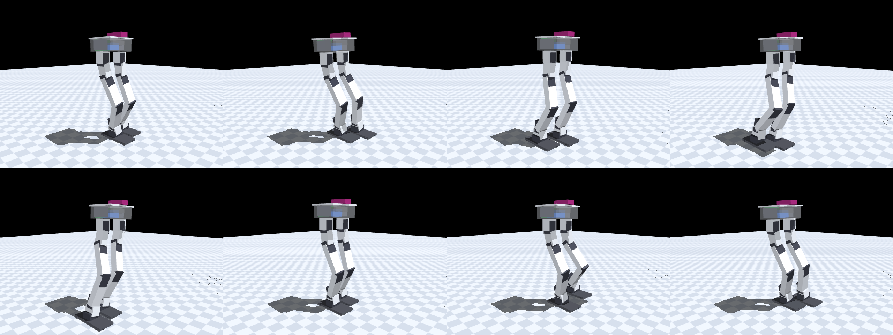
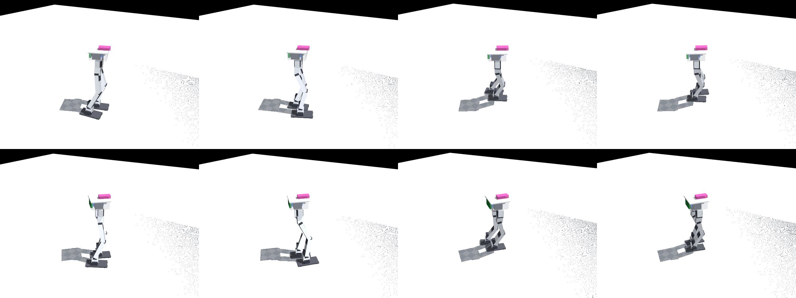

# v6 body: a biped that can stand on one foot — sim-validated design spec (2026-09-13)

**Status: kinematic design validated in simulation through Gates A–D; awaiting Tom's sign-off before CAD.** No part has been drawn, printed or ordered. Everything below is reproducible from `sim/gen_plant_v6.py`, `sim/design_gates.py` and `sim/static_gait.py`; the raw tables are in `docs/design-v6/`.

Goal (Tom, 2026-09-13): *a new physical robot design able to walk by lifting one foot completely off the ground*; consider a backward-bent knee, different or more servos; no GoPro; room for an onboard Raspberry Pi + camera later.

## 0. The design in one screen

| item | v5 (current, broken) | **v6 (this spec)** |
|---|---|---|
| DOF per leg | 5: hip yaw, hip roll, hip pitch, knee, ankle pitch | **6: + ankle roll** |
| servos | 10 × STS3215 | **6 × STS3215 (hip yaw, hip pitch, ankle pitch) + 6 × STS3250 (hip roll, ankle roll, knee)**; same case, drop-in. Minimum viable: STS3250 at the 4 roll joints only |
| hip separation | 66 mm | **84 mm** (24 mm gap between the feet; a 32 mm battery channel between the yaw servos) |
| thigh / shank | 90 / 90 mm | **110 / 110 mm** |
| ankle | pitch axis 18 mm above the sole | **roll axis 18 mm, pitch axis 50 mm above the sole** (32 mm ankle block) |
| foot | 116 × 52 mm rigid + silicone | **130 × 60 mm, 75 mm toe / 55 mm heel, TPU sole** |
| knee | forward (human) | **forward** — the backward knee was evaluated and gives nothing (§4.6) |
| height | 0.34 m to the deck | **0.41 m to the deck** (~0.43 m with the Pi bay) |
| mass (estimate) | 1.08 kg (1.23 with GoPro) | **≈ 1.25 kg** (servos 0.66 + 0.12 for the six STS3250, print ≈ 0.40, battery 0.10, board + wiring 0.06) |
| standing CoM | 0.18 m | 0.21 m |
| static single-foot stance | **does not exist** (Gate A fail, measured 09-13) | **exists with 30 mm of margin**, reached by a 14° hip/ankle roll shift with both soles flat |
| open-loop walk in the deploy-model plant | 1 cm shuffle, feet never leave the ground | **6–12 steps of 6 cm, swing foot 22–25 mm off the ground for 0.7 s per step, CoM margin ≥ 20 mm, μ 0.3–1.0, ±15 % mass, 3° roll play; arcs at up to 20° of heading per step** |

Cost of the servo change: 6 × STS3250 at $43–65 from US stock ($48–55 on AliExpress) = **≈ $260–390**; the 12 STS3215 on hand cover the other seven joints with five spares. (First estimate of $25–30 each was wrong; corrected 2026-09-14 against live listings.)

## 1. What the record says, and what it asks of a new body

Read for this design: `lessons-learned-2026-09-13-walking.md`, `design-stage-simulation-gates.md`, `hw_sessions/2026-09-13/notes.md`, `hip-yaw-study.md`, `servo-map.md`, `DESIGN.md` §2/§6 and the dated log, the BOM and camera docs, `cad/dimensions.py`, `sim/bimo_biped_v5body.xml`, `walker_env.py`'s servo model. The requirements that fall out, each traceable to a measurement:

- **R1 — a static single-foot stance must exist** (Gate A). v5 has none: with no ankle roll a planted foot pins the pelvis level, the roll servos slide the feet (loads 88–168) or stall (1.2° short at load 120), and shortening a leg tips the body *toward* the lifted side (8.0° = atan(1.1 cm / 8 cm)). The only regime was a dynamic edge-rock with no margin; the attempt put the robot off the table.
- **R2 — margins measured on the body, before any policy** (process changes §5 of the lessons doc): bench before policy; calibrate the sim where the question lives; dynamic tests need a per-attempt go. This spec is Gates A–D on the kinematics and the deploy servo model; Gate E (a policy) is deliberately last.
- **R3 — the roll chains must be stiff.** Measured on v5: 1–2° of play in the yaw/roll chains, 2–3° free at the hip roll by tilt hysteresis, horn screws that work loose, a right ankle that lurches on load reversal, 2–3° of hardware-only adduction at the stand. Everything lateral rides on these joints.
- **R4 — the actuator must have speed margin under load**: a "200 ms" pose took 600 ms on the bench (peak 130°/s = ⅓ of the no-load speed); Gate B asks ≥ 2× on speed and ≥ 1.5× on torque at 11.1 V.
- **R5 — contact realism made adversarial**: μ swept 0.3–1.0, self-collision on for every pair that can touch, play modelled as free travel, the 2 Hz actuation shaper and 80 ms dead time in the loop.
- **R6 — no GoPro** (154 g at 56 mm over the deck was "the worst item on the machine for balance"); **reserve a Pi + camera volume** on the deck front, mass covered by payload DR (Tom: volume only, no mass budget).
- **R7 — keep what works**: hip yaw (decisive for turning, 7/8 vs 1/8 on turn_180), the pelvis-side yaw/roll/pitch hip stack, the leg_link "servo is the axle" pattern, one-print torso, the 50 Hz ESP32 loop, the General Driver board, the 3S pack.
- **R8 — the robot may grow to ~45 cm and a bigger pack** (Tom).

## 2. Kinematics

Chain per leg, pelvis down (+X forward, +Y left, sim conventions of `bimo_biped_v5body.xml`):

| joint | axis | range | where the servo body sits | servo |
|---|---|---|---|---|
| hip yaw | Z | ±45° | under the deck, horn down (v5 carrier) | STS3215 |
| hip roll | X | 30° adduction / 45° abduction | in the yaw carrier, output +X (v5) | **STS3250** |
| hip pitch | Y | −125 … +90° (was −110; §11.3) | thigh top (v5 yoke pair, 50 mm below the roll axis; `yoke_pitch_v6` flange chamfer) | STS3215 |
| knee | −Y | −130 … +5° (flexion negative; was −95, §11.3) | shin top (leg_link_v6 with the flexion relief cuts) | **STS3250** |
| ankle pitch | Y | ±45° | ankle link, case *rising* above the axis between the shin's fork tines | STS3215 |
| ankle roll | X | ±30° | **lying across the foot, output axis fore-aft**, case bottom on the sole plate; the ankle link forks onto horn (front) and idler (rear) | **STS3250** |

Axis stack above the sole bottom: ankle roll 18.4 → ankle pitch 50.4 → knee 160.4 → hip pitch 270.4 → hip roll 320.4 → hip yaw 361.4 → deck top 409.4 mm. Hip separation 84 mm; feet 60 wide → 24 mm between the soles at the neutral stance.

The ankle block reuses the leg pattern: a `leg_link`-like part that grips the ankle-pitch servo case and forks in X onto the ankle-roll servo in the foot; the foot is a re-pocketed v3 foot with the servo turned 90° in yaw. Both roll joints are closed on both sides (horn + idler) — see R3.

**Mass model** (`gen_plant_v6.py`, estimates until CAD): every servo as its real 45.2 × 24.7 × 34.7 mm case at its real place in the chain (this is 55–60 % of the robot and dominates the inertia), printed parts as lumps at the masses today's parts weigh (`cad/PRINT_LIST.md`), battery 100 g in the channel between the yaw servos, board 30 g vertical on the aft wall, 30 g of wiring, Pi bay 65 × 30 × 16 mm at x +28 mm on the deck front with **mass 0** (payload DR covers 0–120 g). Total 1.251 kg, CoM 0.212 m. When the CAD exists, `sim/build_v2_inertia.py` replaces the lumps, as it did for v5.

## 3. Why these numbers (the sweeps)

`design_gates.py --sweep` over hip separation {70, 84, 96} × foot width {56, 64, 72} × leg {90, 100, 110} × knee {fwd, bwd} (`docs/design-v6/gateA_geometry_sweep.txt`):

- **The one-foot CoM margin is exactly half the foot width**, whatever the hips do (the lateral shift is solved to the sole centreline). Fore-aft never limits. So foot width is the margin budget, and its ceiling is `hip_sep − gap`.
- **Narrower hips cut roll torque**: torque margin 3.4× at 70 mm, 2.7× at 84 mm, **1.0× (stalled) at 96 mm** on the STS3215. The required hip roll goes 12° → 14° → 19°.
- **Longer legs buy joint speed**: the swing knee's speed margin on the STS3215 is 1.1× at 90 mm legs, 1.37× at 100, 1.64× at 110 for the same 6 cm step; longer levers need lower joint rates.
- **The gap between the feet is not free**: at 72 mm hips / 60 mm feet (12 mm gap) the walk failed with a 4 cm lift because the hanging swing leg sags 13–15 mm inward and the foot landed *on* the stance foot's inner edge (`L_col_foot × R_col_foot` contacts in the trace). 84 mm gives 24 mm of gap, the same 30 mm margin, and room for the battery low between the yaw servos.

Hence 84 / 60 / 110. A 45 cm robot (R8) would be legs 125–130 mm; the gates scale monotonically in that direction (more speed margin, a little less torque margin) and it was not needed to pass.

## 4. Validation

### 4.1 Gate A — kinematic capability map (no dynamics, no policy)

`design_gates.py` on the default design:

| check | result |
|---|---|
| A1 lateral shift, both soles flat | pelvis 72 mm over, hip roll −14.4° / ankle roll +14.4° (parallelogram), CoM on the left sole centreline with **30.0 mm** margin; double-support margin ≥ 30 mm along the whole path; all joints inside limits; no self-contact |
| A2 lift the right foot 30 mm at that shift, then swing it 60 mm forward | margin 30.0 mm throughout, clearance 30 mm, joints inside limits (knee −68…−73°), no contact; a 50 mm lift also fits (knee −88°) |
| A3 best single-foot margin over a 5-D grid | 30.0 mm = the sole half-width (no better pose exists; the design is margin-limited by foot width, as intended) |
| A4 split stance, feet 6 cm apart fore-aft | hull margin 55 mm |
| A5 level-sole crouch | 62 mm of pelvis drop inside the limits (v5: 40 mm) |

**Verdict: PASS.** Compare v5: "no such path exists".

### 4.2 Gate B — actuator envelope at the design cadence

One step (1.6 s shift, 1.6 s sine-arc swing of 6 cm × 3 cm, 0.5 s landing settle) under the walker_env servo model: PD clamped to the measured STS3215 torque–speed line (2.94 N·m, 4.04 rad/s at 12 V, scaled to 11.1 V) and, for the STS3250, its datasheet (50 kg·cm, 0.133 s/60°) derated by the same 0.86 no-load factor the 3215 measured. Per joint, peak demanded speed and torque against the servo's no-load speed and stall (`docs/design-v6/gateB_mixed.txt`):

| joint | w_pk rad/s | τ_pk N·m | speed margin 3215 | torque margin 3215 | speed / torque margin 3250 |
|---|---|---|---|---|---|
| hip roll (stance) | 0.67 | 0.79 | 5.6× | 3.4× | 9.3× / 5.7× |
| ankle roll (stance) | 0.67 | 0.51 | 5.6× | 5.3× | 9.3× / 8.9× |
| hip pitch (swing) | 1.24 | 0.55 | 3.0× | 4.9× | — |
| **knee (swing)** | **2.44** | 0.88 | **1.5×** | 3.1× | **2.6× / 5.2×** |
| ankle pitch (swing) | 1.42 | 0.59 | 2.6× | 4.6× | — |
| hip yaw | 0.09 | 0.11 | 43× | 24× | — |

No joint saturates at the design cadence. The one joint short of the 2× speed rule on the STS3215 is the swing knee; the STS3250 clears it. **Verdict: PASS with STS3250 knees, FAIL (knee 1.5×) on STS3215 everywhere.** Twice the cadence is not a servo question: a 0.4 s lateral shift of 72 mm is 0.27 g and moves the zero-moment point outside the sole — the quasi-static gait's cadence floor is set by the body, at about 1.2 s per shift (§4.4).

### 4.3 Gate C/D — the open-loop walk under the deploy model, made adversarial

`static_gait.py`: the Gate A path made periodic — shift until the whole-robot CoM (solved on the kinematics with the swing foot at mid-swing) is 5 mm *inboard* of the stance sole centreline, swing the other foot on a sine arc, settle 0.5 s, cross over. Joint targets from the analytic IK at 50 Hz. Servo model as deployed: kp 12 N·m/rad, torque–speed clamp, **2 Hz three-stage shaper + 80 ms dead time, integer goal ticks, 5 ms bus latency, 1° gear backlash, 3° free play on the four roll joints**, μ 0.7. Step 6 cm, lift 4 cm, 37.6 s for six steps (a slow, static gait by construction — 1.6 cm/s).

Final configuration (STS3250 at rolls + knees), worst of 3 seeds per case (`docs/design-v6/gateCD_sweep.txt`):

| case | steps | swing foot off the ground | CoM margin ≥ | stance slip | verdict |
|---|---|---|---|---|---|
| nominal | 6/6 | 25 mm peak, 0.74 s/step | 25.5 mm | 1.3 mm | OK |
| μ 0.3 / 0.5 / 1.0 | 6/6 each | 25 mm | 19.6–26.0 mm | ≤ 1.3 mm | OK |
| no play, no backlash | 6/6 | 31 mm, 0.92 s | 21.8 mm | 0.4 mm | OK |
| mass × 0.85 / × 1.15 | 6/6 | 24–26 mm | 13.5 / 19.6 mm | 1.3 mm | OK |
| payload 60 g on the deck front | 6/6 | 25 mm | 24.2 mm | 1.5 mm | OK |
| payload 120 g, gait unaware of it | fell at step 2 | | | | FAIL |
| payload 120 g, gait solved with it in the model | 6/6 | 24 mm | 25.4 mm | 1.2 mm | OK |
| servos −15 % / −30 % (stall and speed) | 6/6 | 25 mm | 19.7 / 25.5 mm | 1.3 mm | OK |
| floor tilt ±2° fore-aft | 6/6 | 24–25 mm | 19.6–25.4 mm | 1.6 mm | OK |
| 12 steps; 8 steps in place | 12/12; 8/8 | 25 / 26 mm | 26 mm | 1.0 mm | OK |
| cadence 1.2 s shift / 1.2 s swing (30 s per 6 steps) | 6/6 | 22 mm | 25.8 mm | 1.3 mm | OK |
| **arc walk**, 10° / 15° / 20° of heading per step, 8 steps, both directions | 8/8 each | 23–25 mm | 24.9–25.5 mm | ≤ 1.5 mm | OK — heading change 65° / 99° / 134° (§4.7) |
| **play 5° on the rolls** | fell in the first shift | | | | **FAIL** |
| **backlash 2°** | fell after step 1 | | | | **FAIL** |
| cadence 0.8 s shift / 1.0 s swing | fell at step 3 | | | | FAIL (body dynamics) |
| shaper and dead time removed | fell at step 4 | | | | FAIL — the gait is timed for the deployed shaper; re-time before running it on a firmware without the shaper |

**Verdict: PASS** for the deployed chain with the requirements in §5. The boundaries are informative: the walk tolerates the measured 3° of roll play but not 5°, 1° of backlash but not 2°, and a 60 g Pi payload without telling the controller but a 120 g one only with the payload in the model.

Filmstrip (2 × 4 frames across steps two and three; the video is `sim/renders/v6_static_walk.mp4`, gitignored, regenerate with `static_gait.py --render`):

### 4.4 What the dynamic plant taught that the kinematics could not

Each of these was a fall in the trace before it was a design decision; all are in `docs/design-v6/gateD_*.txt`.

1. **Roll compliance is the whole game.** Under the fitted 12 N·m/rad (bench: 1.2° short at 0.35 N·m ≈ 17 N·m/rad, so the fit is on the soft side of real) the stance hip roll sags 4° and the ankle roll 2° under 0.65 N·m in single support: the pelvis drifts 25 mm toward the swing side, and when the swing foot lands the closed chain springs it 35 mm the other way. With the STS3215 everywhere the walk survived only at 72 mm hips with a 3 cm lift and zero play (`gateD_lift_matrix_3215.txt`). **With the STS3250 at the four roll joints (≈ 4× the static stiffness, third-party bench: 1.2° under 1.96 N·m vs 2.6° under 0.98 N·m for the 3215) every configuration walks** (`gateD_servo_matrix.txt`). Sensitivity: a 3× stiffness ratio still passes with 3° of play; at 2× only 1° of play passes (`gateD_knee_kp_cadence.txt`). **This is the single assumption to measure before ordering six** (§5).
2. **The swing leg sags inward while it hangs** (12–15 mm at the foot) and would land on the stance foot at a 12 mm gap; hence 24 mm of gap, a 10 mm outward bump at mid-swing and a 12 mm outboard landing offset that relaxes once the foot is loaded (`land_out`).
3. **A step command is a fall.** Commanding the working crouch from the straight stand as a step pitched the body 25° forward: hips and ankles arrive first, the knee (twice the travel) last. Every transition is a min-jerk profile; the start-up eases into the crouch over 1.5 s.
4. **Timing must respect the shaper.** The swing leg lags its command by ~0.3 s through the 2 Hz shaper and dead time; a 0.5 s landing settle before the next shift is what separates 6/6 from a fall at the crossover. A 4 cm commanded lift yields 22–25 mm of real clearance — the rest is sag and lag — which is why the commanded lift is 4 cm for a 2 cm requirement.
5. **Aim the CoM slightly inboard.** With the CoM exactly over the stance ankle-roll axis the body is in neutral equilibrium and any drift is outward, over the sole's edge and away from the other foot. 5 mm inboard makes the failure direction the safe one (toward the incoming foot); the margin cost is 5 of 30 mm.
6. **The shift time scales with distance.** The crossover from one stance to the other is twice the first shift; commanding it in the same 0.8 s put 0.27 g of lateral acceleration into a body on soft roll joints and it overshot by 40 mm. 1.6 s per 60 mm (2 s per crossover) is the design cadence; 1.2 s still passes; 0.8 s does not.

### 4.5 Servo choice

- **STS3215 (on hand, 12)**: passes Gate A trivially (kinematics), Gate B on every joint but the swing knee (1.5× speed), and Gate D only in the no-play, narrow-hip corner. Its softness under load, not its torque, is what fails the walk.
- **STS3250 (drop-in: identical 45.2 × 24.7 × 35 mm case and horn/idler pattern, 74.5 g vs 55 g, 50 kg·cm, 7.9 rad/s no-load, measured backlash 0.43° vs 0.87°, ~$25–30)**: at the four roll joints it turns every Gate D case green; at the knees it clears the Gate B speed rule (2.6×) and adds a few mm of swing clearance. Recommendation: **six STS3250 (rolls + knees), six STS3215 (yaws, hip pitch, ankle pitch)**. Minimum viable: four STS3250 at the rolls and a 1.6–1.8 s swing on STS3215 knees (1.8× speed margin, just short of the rule).
- Mass cost of six STS3250: +117 g (1.25 → ~1.37 kg incl. the heavier feet); Gate D at mass × 1.15 passes with 19.6 mm of margin.
- **A different family (Dynamixel XL430/XC430, ~$50–70 each, new bus and board)** is not needed by any gate and is Tom's last resort; not pursued. **Two more DOF (arms, a waist)** would not change Gates A–D and were left out; the deck keeps M3 bosses for a later arm or head.
- Power: 12 servos on the General Driver's 5 A-rated bus path is the same unresolved item as today (peak 6.8 A measured on 10), worse by two servos; the 3250's 4.2 A stall current says the pads-not-XH inlet fix and the inline fuse in `bom-supplemental.md` become mandatory. Bus timing is fine (12 servos ≈ 3.4 ms of the 20 ms tick).

### 4.6 The backward knee

A knee that bends backward is, in the sagittal plane, the forward knee with time reversed; the only asymmetries are the toe/heel split of the foot, the torso's fore-aft CoM and where the servo cases sit. The evaluation bears that out:

- Gate A: identical margins (30 mm) and crouch depth; **but the forward swing violates the ±45° ankle-pitch range** (45.5° at mid-swing, 51° at the end of a 6 cm step), because flexing a backward knee to lift the foot pitches the shank the other way. It needs a ±55° ankle.
- Gate B: same knee speed demand (2.4 rad/s), higher stance hip-pitch and ankle-pitch torques (torque margins 1.7× / 1.0× at the geometry sweep's tight corners vs 2.7× / 2.1×), more torso pitch under the ideal servos.
- Gate D with the ±55° ankle and STS3250 rolls + knees: walks 6/6 like the forward knee, with 2–3 mm more stance slip, 1.4° more tilt and 1.5–2 cm less progress per six steps (`gateD_knee_kp_cadence.txt`).

There is no capability the backward knee unlocks for this body and one cost (ankle range, and every leg part convention in `cad/` assumes the forward knee). **Decision: forward knee.** Since the knee servo's mechanical travel is ±95° and the direction is a joint-limit plus foot-orientation choice, the same printed legs could be run backward-kneed later if a reason appears; it is not designed in.

### 4.7 Turning: walking in an arc

Tom's follow-up: verify the body can change its bearing by walking in an arc. The generator places each swing foot in a frame rotated by `turn_deg` from the stance foot's yaw, the pelvis heading follows the mean of the two foot yaws, and the leg IK (`v6_kin.pose_world`) solves each leg in its own yawed frame — the hip yaw joint carries ±turn/2 and the soles stay flat and parallel to their own footprint. Same deploy servo model and gait as §4.3 (STS3250 rolls + knees, 3° roll play, 1° lash, 2 Hz shaper + 80 ms), `docs/design-v6/gateD_turning.txt`:

| turn per step | steps | heading commanded → achieved | swing clearance | CoM margin ≥ | slip | verdict |
|---|---|---|---|---|---|---|
| +10° (left) | 8/8 | 75° → 65° | 24 mm | 25.3 mm | 1.5 mm | OK |
| −10° (right) | 8/8 | −75° → −64° | 25 mm | 25.0 mm | 1.7 mm | OK |
| +15° | 8/8 | 113° → 99° | 24 mm | 25.5 mm | 1.4 mm | OK |
| −15° | 8/8 | −113° → −100° | 25 mm | 24.9 mm | 1.3 mm | OK |
| +20° | 8/8 | 150° → 134° | 23 mm | 25.2 mm | 1.5 mm | OK |
| +10°, 12 steps | 12/12 | 115° → 100° | 24 mm | 25.3 mm | 1.5 mm | OK |

The body turns at up to 20° per step (a 134° bearing change in eight steps, radius ≈ 0.17 m) with the same margins as the straight walk; the hip yaws never exceed ±10°. The 10–15 % shortfall in achieved heading is the yaw chain's compliance and lash plus sole pivot under the yaw torque, i.e. the sim's version of the hardware's yaw play; a heading-conditioned controller closes it, and it is the quantity to compare against the bench (Gate D) rather than a design limit. One implementation detail worth keeping: the mid-swing outward bump must be applied in the swing foot's own yawed frame — applied in world y it turned into a fore-aft error past 60° of heading and the 15°/20° arcs fell at steps 7 and 5 (`gateD_turning.txt` history in git).

## 5. Assumptions to retire on the bench before ordering

In the order the gates doc asks for them ("from the datasheet before purchase, from a bench measurement after"):

1. **STS3250 static stiffness ≥ 3× the STS3215's** (≥ 1.5× with the sag compensator of §8.1). The number in the model (4×) is from a third-party bench, not ours. Buy **two** first, mount one in place of a v5 hip-roll servo (same case), and repeat the 2026-09-13 stance-hip test (8° roll, planted foot): the 3215 stalled 1.2° short at load 120. Pass: ≤ 0.4° short at the same load (≤ 0.8° with the compensator). This single measurement decides whether six are ordered.
2. **Roll-chain play ≤ 3° total per joint (target ≤ 1°), backlash ≤ 1°.** Design rules for the CAD: both roll joints double-supported (horn + idler), metal horns with thread-locked M3s, the ankle link's fork tines sized to the disc faces (`SV_IDLER_CASE_FACE`, not the phantom face), and a tilt-hysteresis play measurement per roll joint on the assembled leg *before* the first walk — the same test that found 2–3° on v5.
3. **Masses.** The plant is 1.25 kg from lumps; the assembled robot with six STS3250 will be ~1.37 kg. Weigh every segment when built and regenerate the inertials (`build_v2_inertia.py`), as `DESIGN.md` §8 has been asking for v5.
4. **The 600 ms "200 ms pose".** Still unexplained on v5 (streamer cap or servo under load). The Gate D script depends on the shaper's timing; measure the streamer against a free servo before trusting any cadence number on hardware.
5. **Sole friction.** μ 0.3–1.0 passes in the model; the bench never measured the pad. A TPU 95A sole is specified for edge compliance; measure μ on the actual pad once printed and re-run `static_gait.py --mu`.

## 6. What changes downstream

- **12 actuators** → the observation frame grows (3 × 12 + 12 = 48 per frame vs 43/49 on v3/v5), `tools/gen_obs_spec.py` re-emits `kNumJoints`/`kServoId`, the SIL C ABI's fixed `[10]` arrays become `[12]`, every existing checkpoint is non-deployable (the yaw precedent: "a parameterization refactor + parity re-run, ~a day"). `walker_env.py` already derives the DOF count from the model; the v6 plant runs in it unchanged (that is how Gate D was run), and its reward roles (`hip_yaw … ankle`) simply do not see the new `ankle_roll` joint until a term is written for it.
- **The gait in `static_gait.py` is the bench script for Gate D on hardware**: the same keyframes, streamed through the firmware's `pose` path, with the robot on the floor and Tom's per-attempt go (the 09-13 rules). It is not a controller; the policy (Gate E) comes after the body has done this open-loop.
- **Charge for every free channel from day one** (gates doc, proposal 1): the ankle roll joins yaw and hip roll in the posture regularizer of the first v6 reward.

## 7. Next steps (after sign-off)

1. Buy 2 × STS3250; run §5.1 on the v5 hip roll (the robot is out of service for walking but a single hip-roll servo swap for a stance test is a bench-only, torque-released job).
2. CAD in `cad/`: `foot` v4 (roll servo across the foot, 130 × 60, TPU sole pocket), `ankle_link` (new: grips the pitch servo, forks in X), `leg_link` at 110 mm (a length parameter), `pelvis` v7 (84 mm hip separation, battery channel, Pi bay on the deck front, aft board recess), unchanged `yaw_carrier` / `yoke_roll` / `yoke_pitch`. Then `check_assembly.py` over the new ROM (ankle roll ±30° vs the shin fork and the foot walls is the new pair to sweep), `check_printability.py`, `run_checks.sh`, fly-in animation, and `build_v2_inertia.py` into the v6 plant.
3. Print, assemble, weigh, measure play per roll joint, re-zero, and run `static_gait.py`'s keyframes over the tether: stand → crouch → shift → one-foot balance → stepping in place → six steps, in that order, each a number, on the floor.
4. Only then Gate E: train on the v6 plant with the measured masses, play and stiffness in it.

## 8. Option study: cost / benefit of the alternatives, and the STS3250 purchase risk

Tom (2026-09-13): *"I wouldn't want to buy a bunch of 3250 servos and then find they're insufficient."* Same tools, same deploy servo model and gait as §4.3 unless stated; rows in `docs/design-v6/study_options.txt` and `study_feedback_3215.txt`.

### 8.1 Is the STS3250 necessary, and what if it under-delivers?

Two controller-side rescues were tried on the all-STS3215 body, because a policy would find them too:

- **IMU-roll feedback** (torso roll → ankle/hip roll targets, P gains ±0.5 … ±1.0): **no help in any sign or gain**. The failure is a lateral pelvis *translation* (the two roll joints of the stance leg sag as a parallelogram, the torso stays within 5° of level), so an attitude sensor does not see it.
- **Joint-position sag compensation** (target += k·(target − measured) on the four roll joints, from the servo's own readback): k = 1 walks the all-STS3215 body **only with ≤ 1° of roll play** (13 mm margin); at the measured 3° it still falls at the crossover; k ≥ 2 is unstable through the 2 Hz shaper + 80 ms dead time.

So the STS3215 route is "1° play *and* a compensator *and* 13 mm of margin", against a hardware record of 2–3° play. Not a design to bet a build on.

The other side of the risk, an STS3250 that is less stiff than the third-party 4×:

| STS3250 stiffness vs 3215 | no compensation | sag compensation k = 1 |
|---|---|---|
| 4× (third-party bench) | walks, 26 mm margin | walks, 14 mm |
| 3× | walks, 25 mm | — |
| 2× | falls after step 1 | **walks, 12 mm** |
| 1.5× | falls after step 1 | **walks, 11 mm** |

**The purchase risk is bounded:** even a 1.5× STS3250 walks with one line of feedback that the controller will have anyway, and at 5° of play nothing walks with any servo. The one thing that cannot be recovered in software is play, which is a printed-chain property, not a servo property. Recommended sequence stands: buy two, measure stiffness and play on the v5 hip roll (§5.1), then six.

### 8.2 The alternatives

| option | what changes | cost (money / build / software) | gates | verdict |
|---|---|---|---|---|
| **v6 serial ankle, STS3250 at rolls + knees** (this spec) | +2 servos, ankle block, foot v4, pelvis v7, longer leg links | ≈ $180 / 4 new or revised parts / 10 → 12 DOF refactor (~1 day) | A 30 mm, B pass, C/D pass incl. arcs, robust to 3° play, 1.5× servo shortfall with feedback | **baseline** |
| v6, STS3215 everywhere | same parts, no purchase | $0 / same / same | A pass, B knee 1.5×, **D fails at measured play**; walks only at ≤ 1° play with a compensator | fallback only if the bench shows the new chains at ≤ 1° |
| **parallel-linkage ankle** (both ankle servos in the shank, ankle DOF through links) | 2 linkages + 4 rod ends per leg, a lever on each servo; foot/ankle subtree 200 → 110 g | +$20–40 / 2 more parts per leg, linkage design + play control (the exact failure class of v5) / same | A 30 mm, **B unchanged** (the swing knee, not the ankle mass, is the speed limit: 1.56× vs 1.5×), D identical to serial per servo class (falls on 3215, walks on 3250) | **no benefit on this servo class**; revisit only for a dynamic gait where swing inertia matters |
| torso-mass shifter / waist roll instead of ankle roll (10 + 1 DOF) | a lateral slide or waist roll joint moving the torso mass | 1 servo / new mechanism / obs change | kinematics: the torso is 26 % of the mass; a 60 mm torso shift moves the CoM 16 mm, the shift needed is ≥ 36 mm; and feet cannot overlap, so no stance exists without a lateral shift | **not viable** at this mass distribution (servos in the legs dominate) |
| arms / waist yaw for balance | +2–4 servos as reaction masses | $50–110 / parts / DOF refactor | static single-foot stance unchanged (they add nothing to Gate A); help only dynamic recovery | later, for a policy; not for the walking capability |
| **scale-up** (130 mm segments, 150 g pack, ~1.35 kg, 0.45 m deck) | longer leg links, bigger bay | +$20 pack, more filament / same parts scaled / same | A 30 mm at 12° roll; B speed 1.82× (3215) / 3.06× (3250); D: **falls with the 110 mm gait on both servo sets**, walks on STS3250 once re-tuned (12 mm margin: heavier body, more sag) | possible but buys speed margin at the cost of lateral margin; not needed to pass |
| Dynamixel XL430-W250 (12 ×) | new bus (Protocol 2.0), U2D2 or board, all brackets, all CAD | ≈ $600 + $50 / everything / firmware bus rewrite | B: knee speed 1.95×, torque 1.67× — short; stiffness unknown | **no** |
| Dynamixel XC430-W240 (12 ×) | same | ≈ $1,100 / everything / rewrite | B pass (2.4× / 2.0×); stiffness unknown, needs the same bench test as the 3250 | last resort only, as Tom said |
| Feetech STS3235 (metal-case STS3215) | drop-in | ≈ $30 each | same torque/speed as the 3215; stiffness and play **unverified** | worth one unit on the same bench test if the 3250 disappoints |

### 8.3 What the study changes

Nothing in the spec; it sharpens the purchase decision: (1) the failure mode is roll-chain compliance and play, which no alternative architecture removes and only servo stiffness, chain design and a position-error compensator address; (2) the STS3250 is sufficient down to 1.5× its claimed stiffness with feedback, and the bench test of two units settles which regime we are in before six are bought; (3) roll-chain play above ~3° defeats every option — the CAD rules in §5.2 and the per-joint play measurement are not optional.

## 9. Body revision, 2026-09-13 evening: Pi 4B torso, head, bigger pack, asymmetric soles

Tom's go on the STS3250 route came with three changes: a full Raspberry Pi 4B and a taller torso, a head with the camera on its own STS3215 yaw servo, and a bigger battery with a protection circuit that can talk to the Pi. All three were put back through the gates before any CAD (`docs/design-v6/gateD_torso_v7.txt`, `gateCD_sweep_v7.txt`).

**What the heavier torso did.** Pi 4B (66 g with cooler), power boards (60 g), a 2200 mAh-class pack (+70 g), the neck servo (55 g), the head (45 g) and a taller housing take the robot from 1.25 to **1.55 kg** and the standing CoM from 0.21 to 0.27 m. With the §4.3 body the walk then **fell at the crossover in every gait re-tune**, with STS3250 everywhere and with feedback; the diagnosis matrix showed that 300 g placed *anywhere* did it, and the trace showed the same mechanism as before at larger amplitude: the pelvis swings ~60 mm inward during single support and the closed chain throws it outward at touchdown, so every fall is outboard over the stance sole's outer edge.

**The fix is in the foot.** The sole's centreline moves OUTBOARD of the ankle roll axis and the sole widens: foot-width / offset sweep on the 1.55 kg body (`gateD_torso_v7.txt`): 60/0 falls; 66/8, 70/10, 74/12 walk with 9–10 mm of minimum margin; 80/15 with 22 mm. First chosen 76/13. **Then the CAD came back heavier than the model** (pelvis 159 g against 60, links 27 g, feet 71 g with the TPU sole, head 39 g; 1.63 kg total) and the margin at 76/13 fell to 8 mm, now limited on the INBOARD side (the swing-phase inward drift against a 25 mm inboard half). Widening the inboard half to 30 mm — **130 × 84 mm, centreline 12 mm outboard, 24 mm between the feet's inner edges** — restores ≥ 12 mm at every pelvis mass from 140 to 175 g, straight and in arcs, 34 mm with 5° of play. The full Gate C/D matrix on the final body with the CAD masses then passes **every** case (`gateCD_sweep_v7.txt`: margins 12–35 mm), including the four that failed on the symmetric sole — 5° roll play, 2° backlash, a 120 g payload the gait does not know about, the shaper-less chain — and an 8-step 15°/step arc (94° of bearing change).

| final body | |
|---|---|
| segments | thigh 110, shank 110, ankle pitch→roll **57** (the roll servo lies across the foot; its top edge under the pitch servo's outboard face rises 18.5 mm at 25° of roll and the pitch servo's case bottom sits at 21 — the first cut of 54 used the wrong corner and the assembly sweep found the two servo bodies touching at 18°) |
| feet | 130 × 84, centreline 12 mm outboard (30 in / 54 out), 75 toe / 55 heel, 4 mm PETG plate + 2 mm printed TPU sole; mirrored pair |
| torso | yaw cells as v5 at 84 mm; a 31 mm transverse battery layer above them; General Driver vertical on the front wall, Pi 4B vertical on the aft wall (85 across, USB/Ethernet to the right through a window, USB-C/HDMI/camera edge up under the deck); housing 99 × 115 mm, rounded |
| head | STS3215 standing on the deck, horn up; a rounded shell on its horn carrying the Camera Module 3 (Wide); ±90° yaw |
| heights | deck top 0.465 m, camera 0.53 m, top 0.555 m |
| mass | **1.63 kg** with the CAD part masses (servos 0.78 incl. six STS3250 and the neck 3215, pack 0.17, Pi + power 0.13, print ≈ 0.50: pelvis 159, head 39, 4 × leg link 27, 2 × ankle link 9, 2 × foot 47 + 23 TPU, hip parts as v5) |
| servos | 6 × STS3250 (hip roll, ankle roll, knee), 7 × STS3215 (hip yaw, hip pitch, ankle pitch, neck) |

**Power (side project, Tom's call).** The Waveshare UPS Module 3S was checked as the "protection + Pi HAT" candidate: it is a 3 × 18650 holder board with a 5 V 5 A output, I2C monitoring, charging and cell protection, 60 × 93 mm — but its raw pack output is rated **12.6 V 2 A**, an order of magnitude under the servo bus (6.8 A peaks measured on ten servos). So the design carries a **3S LiPo 2200–2600 mAh class pack** (bought to a spec filter: 11.1 V, ≤ 105 × 36 × 26 mm, XT30/XT60, 150–190 g), a **3S protection board** rated ≥ 15 A continuous on the pack lead (over-discharge cut-off is the protection that matters on a robot that stalls servos), and a **5 V / 5 A buck** (Pololu D24V50F5) for the Pi; telemetry comes from the General Driver's onboard INA219 on the servo bus (already read by the ESP32) forwarded to the Pi over the existing link, with a UART smart BMS (JBD/Daly 3S class) as the upgrade if per-cell voltages are wanted. The pelvis carries an envelope for both boards beside the pack.

Everything here is in `sim/gen_plant_v6.py` (DesignParams defaults now describe this body, with the CAD part masses) and `cad/v6/dimensions_v6.py` (the CAD source of truth; a test pins the shared numbers). The CAD itself is §10.

## 10. CAD (2026-09-14): the printed part set

Built in build123d under `cad/v6/` against `cad/v6/dimensions_v6.py`, which imports every servo-interface number from v5's `cad/dimensions.py` unchanged (case, discs, screw rows, rib and platform detents, the real idler face, countersinks, walls, fits) and adds only what v6 changes. The hip stack (`yaw_carrier`, `yoke_roll`) is used as-is from `cad/parts.py`; `yoke_pitch_v6` is v5's clevis with one flange chamfer (§11.3). Print list with orientations, supports and fasteners: `docs/design-v6/print-list.md`; rollup: `parts_v6_rollup.txt`.

| part | qty | g | what changed / how it is built |
|---|---|---|---|
| `leg_link_v6` | 4 | 27 | v5's `leg_link` grip channel and fork pads byte for byte, drop 90 → 110 (lower-anchored constants shifted), and the open U closed into a **box section** (a front plate between the tines from just under the servo case to 1.5 mm outside the next servo's r 16 sweep circle) with R 5 fillets on the outer edges. Prints standing on the fork end so the box is four walls. A knee hyperextension touch at +95° (3.5 mm³, a v6 regression against the shin's arched web) was found by the ROM gate and removed with a chamfer; now 0.70 mm at both ±95°, the v5 number |
| `ankle_link` | 2 | 12 | leg_link's grip channel (the ankle-pitch servo hangs in it) plus a new fork in the X-Z plane: two tines fore and aft onto the roll servo's horn and idler discs, tied by a top plate and an inboard web. The ROM sweep of the roll servo's case under it set `ANKLE_PITCH_TO_ROLL` at 58 (see §9) |
| `foot_L` / `foot_R` | 1 + 1 | 52 | mirrored pair: 130 × 84 plate, centreline 12 mm outboard; the roll servo lies across it in a cradle with an inboard end stop and two retention tabs (front on the horn-side case face, rear on the real idler face, 2 × M2.5 flat-heads each at the far hole rows), platform relief as an open window (v5's foot logic), the lead notched out of the rear rail; underside pocketed with a 6 mm perimeter for the TPU bond. `sole_tpu_L/R` (23 g) print in TPU 95A |
| `pelvis_v7` | 1 | 174 | one print, deck-top-down: v5's yaw cells at 84 mm with their own ceilings carrying the stator screws (counterbores up, driven with the pack out), a transverse battery layer above them with belt slots and side windows, the General Driver vertical on the front wall and the Pi 4B on the aft wall — both slide down guide grooves through deck slots (installability verified by sweep, 0 mm³), lower screw row on standoff bosses and the upper row into pilots (a boss there would block the slide), USB/Ethernet and the General Driver's service edge through side windows, the neck STS3215 standing in a deck-top well with 4 × M2.5 up from below, a 3° tapered outer skin on a 4 mm band outside the cell walls with R 8 corners and windows. 242 → 174 g over three passes; the remaining mass is the cell walls, ceilings, the bay walls and the deck |
| `neck_collar` | 1 | 20 | the neck servo's mount (2026-09-14, after the assembly showed the servo standing loose in its deck well): a tube round the servo case rising to 2.1 mm under the head's horn disc, on a 3 mm flange with 4 × M2.5 into deck pilots. A separate print, flange down, support-free — fused into the pelvis it made the pelvis's deck an island above the collar mouth |
| `head_shell` + `head_face` | 1 + 1 | 27 + 7 | base plate on the neck horn (4 × M3 on the Ø14 circle, centre relief, ribbon slot), a domed shell (≥ 45° to a 7 mm crown, support-free) and a face plate carrying the Camera Module 3 on M2 bosses; ±90° yaw clears the neck servo and the deck; the horn screws are driven from inside before the face goes on |

**Assembly and gates.** `cad/v6/assembly_v6.py` places every part, servo mock and electronics mock as a kinematic chain and poses it (`cad/v6/step/assembly_v6.step`, `renders/assembly_v6.png`). `cad/v6/check_assembly_v6.py` sweeps every relatively-moving pair over its ROM (results: `docs/design-v6/cad_rom_check.txt`) — it is what caught the knee regression, the servo-to-servo ankle clash and the foot tab/tine touch. Per-part printability audits use v5's `check_printability` rules; `cad/v6/animate_v6.py` flies the parts in along their insertion paths (`renders/assembly_v6_flyin_strip.png`).

**Back into the sim.** `sim/build_v6_inertia.py --write` regenerates `sim/bimo_biped_v6ar.xml` with per-body `<inertial>` blocks from the v6 STLs plus the servo, pack and board boxes at their CAD places: **1.75 kg**, torso CoM 47 mm above the yaw axis. The open-loop walk on that plant (`docs/design-v6/gateD_cad_inertials.txt`, 8 steps, STS3250 rolls + knees, 3° play): straight 8/8 with 10.6 mm of CoM margin and 18 mm of swing clearance; ±15°/step arcs 8/8 (86–87° of bearing change) at 10–11 mm; μ 0.3 with 5° of play 8/8 at 7 mm. Margins are thinner than the 1.55 kg model's (the real torso is 115 g heavier than modelled) and the combined-adversity case sits at the gates doc's 1 cm floor; the levers if the bench wants more are the deck thickness (5 → 3.5 mm ribbed, ~10 g), the Pi heatsink, and a 5 cm commanded lift.

**Open items from the CAD pass** (all in the module docstrings): the pelvis's yaw-cell ceilings and skin window roofs need slicer supports; the General Driver and Pi upper screw rows are pilots, not bosses (heat-set inserts are the alternative if the pilots strip); a handful of standoff and idler-grip screws need a slim driver; the leg link's round pads want a brim; the head's dome-seam audit flag should be checked in the slicer.

## 11. Fall recovery (2026-09-14): an open-loop get-up does not exist on this body, and why

Tom, before settling the design: *"let's figure out an open loop fall recovery sequence."* Method: `sim/getup_v6.py` — every body part now collides with the floor (`fall_collision`), the robot is dropped supine or prone and settled, then joint-space keyframe sequences run under the deploy servo model (STS3250 rolls + knees, 3° play, 2 Hz shaper + 80 ms). Success = torso up-vector > 0.9 and the pelvis at ≥ 80 % of standing height. Seven search batches, ~120 sequences, logs in `docs/design-v6/getup_search_*.txt`.

**What this body can do statically**

- **Sit up from supine**: yes, every time. With the legs straight the legs are the counterweight (0.8 kg at 0.25 m vs the upper body's 0.95 kg at 0.15 m) and the torso comes to vertical on 0.14 N·m per hip. Contacts: feet + thighs.
- **Child's pose from prone** (hips −110, knees −95): yes — shins + head, pelvis at 0.09 m.
- **Head-and-feet "downward dog"** from there: yes, pelvis at 0.17 m, torso inverted.
- **Kneel-sit on the heels**: only with a 135° knee *and* 135° hip (torso upright, pelvis 0.18 m, contacts shins + ankles); the 95° knee collapses.
- **Sit on a skid with both feet planted**: yes, if the pelvis carries a printed seat skid reaching down to the hip-pitch level (contacts feet + skid, torso within 20° of vertical).

**Where every path dies: moving the centre of mass from the seat onto the feet.** The same failure in all of them:

1. *Seated, tuck the feet under* (the human way): with the pelvis on the floor, a 95° knee cannot put a foot under the body — flexing the knee swings the foot **up into the air** beside the knee (the shank is nearly vertical at full flexion), and the lifted leg tips the torso onto its back. Confirmed on film (`gu_situp_strip`). With 135°/135° ranges the foot can be *placed* beside the hip, but lifting one thigh off the seat still tips the torso, because the seat is the thighs themselves, 91 mm below the torso housing: the robot sits on stilts (the tall yaw-roll-pitch hip stack). A low hip stack alone (probed at 20 and 10 mm) does not fix it either.
2. *Seated on the skid, rise*: the feet are planted 0.10 m ahead of the hips and the torso can lean only 20° past the thigh (hip −110), so the CoM stays 5 cm behind the feet and every push-up falls back onto the skid — the "rise corridor" v5 spent 11 rounds in.
3. *Prone, pike on the head, hinge up*: the kinematic sweep shows no feet-flat pose with the head on the floor and the CoM over the soles; walking the feet in under the CoM needs hip flexion well beyond 110°, and at 135° the hinge still fails.
4. *Kneel-sit → half-kneel*: the 135°/135° kneel-sit is stable, but stepping one foot forward puts the body on one shin and it tips forward, every combination of lunge angles and roll shift (16 tried).
5. *Stub arms* (2 × 1-DOF, 200 mm, at the shoulders): every push pivots the body about the **head**, which is the first contact in every prone pose, into a headstand; from supine an arm push does not roll the flat box torso.

**Design levers, in order of effect** (each verified as the thing that moves the failing step, none yet verified as sufficient):

| lever | what it buys | cost |
|---|---|---|
| **knee flexion ≥ 130° and hip flexion ≥ 130°** (foot to buttock, chest to thigh) | the foot can be placed beside the hip; the kneel-sit exists; the CoM can be folded over the feet | an offset knee (the shank folds past the thigh's box: a new link/joint geometry) and a hip yoke with 25° more travel — both real CAD changes to the proven servo-link pattern |
| **a seat below the hip joints** (a pelvis skid, or a hip layout that puts the torso bottom at hip level) | seated poses become stable with the legs free to move | a 30 g skid is trivial; a low hip stack is a different hip |
| **arms mounted low** (near the hips, not the shoulders) with a head that does not lead the contact | a third contact that lifts the pelvis instead of pivoting the torso over the head | 2 servos (~$60), 2 links, +150 g, obs/firmware DOF change; the head needs a recessed face or a chest bumper |
| dynamic (learned) get-up | no hardware change | v5's record: 11 rounds, kneel achieved, the rise never |

**Recommendation.** Do not hold the walking design for the get-up: its levers all sit in the leg joint ranges and the hip stack, not in anything the walking gates fixed, and the offset knee is the one change that both paths (seated and kneeling) need. Ship v6 as the walker, add the pelvis skid now (cheap, and it makes the seated pose a safe place to be), and treat "v6.1 gets up" as its own gate with the offset knee and low arms as candidates, run through this same script before any part is drawn — exactly as the walking was.

### 11.3 Deep flexion is cheap on this knee — and still not enough (2026-09-14)

Tom's pushback on the "offset knee": *it looks like we could bend the existing knees further with slight modifications of the leg links.* A sweep of the assembly past the ROM table (`docs/design-v6/deep_flexion_sweep.txt`) says he is right. The 95° in the table was v5's measured figure carried over, not a v6 limit. (Sign note: the assembly rotates the knee about +Y, so **+knee is human flexion in the CAD** while the sim's knee axis is −Y and flexion is negative there; the ±95° gate sweep hid the difference, and the inter-leg "lifted swing" check pose had the shin swung the wrong way — fixed.)

| joint | as drawn | what touches first | relief | now |
|---|---|---|---|---|
| knee | clear to 105°; 110–130° one sliver: the shin's rear-top corner in the idler tine band (web top + the idler grip plate's outer 0.5 mm skin) sweeping into the thigh's idler tine 8–32 mm above the axis; hard stop ~131° where the two links' rear faces meet | — | `LL_FLEX_CUT` (20 × 24 mm triangular wedge off that corner, idler band only, the lower grip screw's countersink outside it) + `LL_FOLD_CHAMFER` (3 mm on the thigh's web-end corner and the horn-side jog block corner) | **130° with 0.60 mm** (the same 0.5 mm buffer rule as every other pair); 132° is the hard limit |
| hip pitch | clear to −120°; the thigh grip plates' front edge lands on the pitch yoke's flange front-bottom corner at −123°; the roll servo case at −135° | the thigh plate cannot be relieved: the lower grip screw's countersink sits exactly where the flange lands | `yoke_pitch_v6`: 4 mm 45° chamfer on the flange's front-bottom edge (the M3 heat-set bores at x ±10 stop a bigger one) | **−125° with 0.70 mm**; −127° is the limit |

Both cuts live on the one leg-link print (thigh and shin stay the same part: the same corner on the thigh faces the pitch yoke at +90° extension, where removing material only helps), mass 26.7 → 26.3 g; the yoke 11.1 → 10.9 g. ROM gate ALL CLEAR at the new ranges (`cad_rom_check.txt`), the plant regenerated with the new ranges and CAD masses (1.771 kg), the 8 design-gate tests pass, walk margins in `gateD_cad_inertials.txt`: straight, +15° turn and the mu 0.3 / play 5° case are unchanged (10.6 / 10.9 / 6.9 mm). One case moved: the −15° turn at mu 1.0, which already failed the slip criterion, now falls at step 2. It is not the ranges (the new plant with the old ranges falls identically) but the 0.35 g per link: on both plants that turn walks at mu ≤ 0.9 and falls at mu 1.2, so mu 1.0 sits on the threshold. A sticky foot that cannot pivot is the known weak spot of the turn-in, and that case is a knife-edge, not a margin — worth remembering when reading the 10 mm numbers.

**And the get-up on the 130/125 body (`getup_search_flex130.txt`, 32 sequences, with and without the skid): 0 standing.** The failure is unchanged in kind. Seated on the skid with the feet tucked under (knee −130, hip −125) the shank is vertical and the feet are 8 cm ahead of the hips, but the hip joints are only ~4 cm off the floor, so the thighs point up 35° and the torso ends up *vertical over the hips* at full hip flexion — the CoM never reaches the feet, and every rise falls back (torso 0.88 → 0.70 → 0.40). From prone, every forward fold (child's pose → toes under → hips up, or kneel-sit → fold → push) lands the **head** on the floor first and the push becomes a pike between head and feet. So the deep ranges are real and worth having (they make the kneel-sit and the foot-beside-hip placements reachable), but they do not by themselves change the conclusion of §11.2: the seat height (hips 4 cm off the floor, torso 46 cm tall above them) and the leading head are the blockers, and the levers that remain are a seat below the hips, low arms, or a learned dynamic get-up.

## 12. Get-up, round 2 (2026-09-14): a hip-level tail or hip-level arms stand it up

Tom: *"Figure out what we need to do to make the get-up work. We have extra servos so we could add some proto-arms. Or maybe a kangaroo / t-rex like tail?"* Study script `sim/getup_v6_appendage.py` (plant options `arms`/`arm_z`/`arm_elbow`/`tail`/`tail_z` in `gen_plant_v6.py`); logs `docs/design-v6/getup_search_appendage_*.txt`, filmstrips `getup_tail_hip20_strip.png`, `getup_arms_hip20_strip.png`.

**The mechanics.** §11.3 left the seated robot with the hips 4 cm off the floor, the torso vertical and the CoM 8 cm behind the feet. Anything that lifts the pelvis to ~10 cm *while the feet stay planted* lets the shank lean forward (ankle −40°), which at knee −130° / hip −125° puts the torso 55° forward and its CoM over the toes — from there the legs alone finish the rise. So the appendage only has to push the pelvis up from behind, once. Two things decide whether that works:

1. **Where it pushes.** At the housing bottom (the yaw-axis height, 9 cm above the hip joints) the push tilts the torso back about the hips instead of lifting the pelvis: 0/24 for arms there, 0/12 for a tail there. At the **hip roll height** (6 cm lower, beside the hip roll servos / behind them on the centreline) the same push lifts the pelvis: arms 22/24, tail 21/24.
2. **When it goes down.** The appendage must be folded along the torso during the sit-up (arms up along the body, tail tip toward the head) — hanging, it lies on the floor and jams the sit-up or flips the body over its head — and planted *before* the feet are tucked, so it braces the seated torso while the legs move.

| configuration | servos | mass | seat push (variants standing) | robustness: play 5°, mu 0.3 / 1.0, servos 80 % / 65 % | peak appendage torque |
|---|---|---|---|---|---|
| tail 20 cm, root at hip height, centreline | 1 × STS3215 | ~95 g | 11/12 | **6/6** | 0.50 N·m (1.0 at 65 %) |
| tail 25 cm | 1 | ~105 g | 12/12 | 5/6 (fails only at 65 % servos: 1.46 N·m) | 0.58 |
| tail 15 cm | 1 | ~90 g | 0/12 (too short to lift the pelvis high enough) | — | — |
| two arms 20 cm, 1 DOF pitch, roots at hip height on the housing sides | 2 × STS3215 | ~160 g | 10/12 | **6/6** | < 0.4 |
| two arms 25 cm | 2 | ~170 g | 10/12 | 6/6 | 0.53 |
| two arms 20 cm at the hip *pitch* height (3 cm lower still) | 2 | ~160 g | 12/12 | 6/6 | 0.50 |
| two 2-DOF arms 12 + 12 cm (elbows) | 4 | ~280 g | 15/16 | 6/6 | 1.04 (hip pitch) |
| arms 15 cm | 2 | | 0/12 | | |
| anything at the housing-bottom height | | | 0/36 | | |

Winning keyframes for the tail (sim signs: knee/hip flexion negative; tail 0 = straight back, + = tip up, −90 = straight down): lie (tail +60) → sit up (hip −90) → fold (hip −110) → **tail down behind onto the floor (−20)** → tuck (hip −125, knee −130, ankle 0) → **push: tail −20 → −90 over 2 s while the ankle goes to −40** → rise 2 (hip −80, knee −70, ankle −30) → rise 3 (−45/−50/−25) → stand (−20/−40/−20) → straight. Arms: the same with shoulder 180 (folded) → 70 (planted behind) → 0 (vertical) during the push.

**Walking with it.** Gate D on the lumped-mass plant with the appendage hanging at rest (`gateD_appendages.txt`): every case 8/8; margins equal or better than the bare body (the mass hangs at hip height, which lowers the CoM), e.g. straight 13.0 → 27–30 mm, +15° turn 12.2 → 12.6–13.6 mm. The tail hanging straight down clears the floor by 10 cm on a 20 cm rod.

**What is still not solved: prone.** From face-down, hip-level arms lift the *hips* (they push behind the torso's mass) into a head-down pike every time (`getup_search_appendage_prone*.txt`, 0/76 across push-up → kneel, kneel-tripod → bear → squat, and one-arm rolls with leg swings); a pitch-axis tail cannot reach the floor from prone at all (it exits the back, the floor is on the belly side). The one-arm roll pitches the body onto its head instead of rolling the flat-fronted box. Candidates, untested: (a) a forward fall that ends on the hands instead of the face — with hip arms swung forward the robot lands in a bear pose (hands + feet), from which the seated-push logic applies in reverse; (b) a torso whose front/side edges are rounded enough that a side push rolls it; (c) a learned dynamic roll. Backward and sideways falls end supine or on the side; supine is solved above and the side case is a leg swing away from supine (to be checked).

**Recommendation.** The **tail** is the cheaper answer to the question asked: one spare STS3215, ~95 g, centred, no effect on the walk margins, and it doubles as the seat skid of §11.2 (sitting on the tail with the feet planted is the stable rest pose) and as a bumper for backward falls. Mount: root ~62 mm behind the yaw axis, 60 mm below it (behind the yaw carriers, under the housing's rear wall), 20 cm rod with a rubber tip, ±150° pitch. Arms cost a second servo and ~65 g more, are 12/12 at the hip-pitch height, and are the only one of the two with a path to the prone case (fall arrest / roll). Both need the same three CAD checks before drawing: the bracket on the pelvis, the sweep against the thighs at hip abduction 45°, and the head-first fold clearance. Prone recovery stays an open gate either way.

**Backwards knees (Tom: "did you consider using the knees backwards for the get-up?").** Tested with a double-jointed knee (±130°; the CAD as drawn is clear to ~105° in the backward direction, the thigh's front plate stops it at 110°), `getup_search_birdknee.txt`, 0/32. From prone, bird-flexed shanks make fine struts and lift the pelvis to 10 cm — and pike the body onto its head, the same failure as the hip arms; arching the hips (extension 30–90°) lays it back down flat. From supine, a bird fold after the sit-up lifts the feet into the air behind the knees, and a bird "bridge" does nothing. The knee direction is not the blocker; the head-first torso and the 4 cm hips are.

### 12.1 Tom's review, and the prone case solved with the legs (2026-09-14, later)

Three objections to the first cut, all valid, all fixed:

1. *"You start sort of upright balanced on the tail already."* True: the tail servo case stood 2.7 cm proud of the back and the folded rod was 60° off it, so in the "lie" frame the rod was jammed into the floor propping the pelvis at 13 cm. The tail is now modelled with the case beside the rod's plane (the rod runs on the horn side, so it clears the case at every angle, range −150…+120) and folds **flat along the back** (+90) for the lie. The robot now lies flat (torso up-vector 0.01, pelvis 7.5 cm on the 1.4 cm case bump) and everything above still stands: tail 20 cm 6/6, tail 25 cm 5/6, arms 6/6 (`getup_search_appendage_robust.txt`, re-run).
2. *"Start the get-up by moving into a crouched position and rising from there."* A **crouch hold** is now part of the sequence: after the push the appendage lifts clear and the robot holds the deep crouch on its feet alone for 2 s (pelvis 23.5 cm, contacts feet only), then does an ordinary squat-to-stand. So the manoeuvre decomposes into "get to a stable crouch" (the only part the appendage is for) and "stand from a crouch".
3. *"From prone, roll one leg out and push over onto the back."* Right, and it needs no appendage. The first attempt failed because a human knee flexed in prone lifts the foot *up*, away from the floor; the fix is to **yaw the hip out 45° first**, then roll out and flex (hip −100, knee −130), which plants the shin/foot wide beside the body — extending that leg while the other swings across rolls the body **onto its side** (76 human-knee and 72 bird-knee variants, `getup_search_legroll*.txt`; the bird knee also reaches the side, so it is not needed). From the side, swinging the legs back does nothing (on the side, hip pitch moves the legs horizontally along the floor); what works is the **lower leg pressing the floor** (abduction 30–55°) while the **upper leg swings up and back** (extension 60°, abduction 0–55°): 26 of 72 variants land on the back (`getup_search_sideroll2.txt`), robustly across timing.

**The full chain, prone → standing, with the 20 cm hip tail** (`getup_search_chain.txt`, `getup_full_chain_tail_hip20.mp4`): prone → R leg out (yaw 45, roll 45–55, hip −100, knee −130) → R push + L swing → on the side → L presses / R up-and-back → on the back → sit up → tail down behind → tuck → push → crouch hold → stand. **Standing in 5/5 conditions** (nominal; play 5°; mu 0.3; mu 1.0; servos 80 %), **with the plant's current 45° abduction** as well as 55°. Peak torque on the roll is the hip roll at 0.54 N·m (1.0 at play 5°), a fifth of the STS3250. Total time about 38 s at the conservative keyframe pace.

With the two hip **arms** the same roll fails: folded up along the torso they lie on the floor beside the head and the body cannot roll over them (0/5). A different arm stow would probably fix it, but it is one more reason to prefer the tail.

**Videos** (local only, `sim/renders/getup_v6/`, gitignored, regenerate with `sim/getup_v6_appendage.py render …` / `render_chain`; all with the flat start and the crouch hold): `getup_full_chain_tail_hip20_side.mp4` and `getup_full_chain_tail_hip20.mp4` (rear) — prone → standing with the tail, 38 s; `getup_tail_hip20_side.mp4`, `getup_tail_hip20_rear.mp4` — supine → standing with the tail; `getup_arms_hip20_side.mp4`, `getup_arms_elbow_side.mp4` — the arm variants; `getup_tail_vs_arms_side.mp4` — tail and arms side by side. Contact sheets committed: `getup_full_chain_tail_strip.png`, `getup_tail_hip20_strip.png`, `getup_arms_hip20_strip.png`.

## 12.2 Round 3: the same question *without* the appendage (2026-09-14)

Tom: *"see if you can create an inverse-kinematic solution to return the robot to standing if it falls, without the tail or arms — remember the robot can rotate most of its joints further than humans."* Study script `sim/getup_v6_legs.py`: analytic-IK keyframe placer (`probe`) that puts any candidate floor pose on the ground under the plant's own actuators and reports CoM, sole margins and contacts per keyframe; the same keyframes then run under the full deploy servo model (`run`/`seiza`); plus a continuous-space keyframe search (`search`). Renders in `sim/renders/getup_legs/` (gitignored).

**Verdict: no legs-only open-loop get-up, and this time the reason is measured, not inferred.** The creative space everyone gestured at — deep ranges, bridges, rocking, head-rolling, one-leg props, fetal side-lever — collapses to one sentence: **the legs (0.335 m) are shorter than the torso (0.55 m).** From any grounded pose the feet are farther from the pelvis than the head's side of the torso CoM is, so every rotation about a leg contact lands the head, and every rotation about the head lands on the face. The appendage worked precisely because it was a contact 20 cm from the pelvis *on the CoM side* of the pivot — a lever arm this body does not have anywhere between its feet and its head.

What each candidate did, measured:

| candidate | mechanism tried | what happened |
|---|---|---|
| **supine bridge + rock-over-feet** (the one the prior searches never IK-built: hips +40..+90 at the −130 knee) | pelvis lifts on feet+head (z 0.125), then hip extension slides the feet under the pelvis (x +0.017 → +0.258) into an inverted-V at pelvis 0.13, torso 46° nose-down, CoM nearly over the feet | the **head is the fulcrum and it skids** — the whole body translates headward instead of pivoting; every attempt to lower the torso onto the feet from there goes airborne and collapses to the lie. The feet touch flat in **exactly one** pose of the swept grid (hip +40, knee −120, ankle −45, pelvis 0.176) and the head is on the floor in the same pose, 6.8 N on it. |
| **sit-up → tuck → ankle-lever → knee-lever rise** (the 130° knee as a progressive CoM lever) | the lever arc is real: knee −130→−70 slides the torso-CoM forward with the torso resting on the thigh fronts | the pivot happens while the **shanks still point at the sky** — from the seat (pelvis 0.104, hips −125) *no* (knee, ankle) pair puts a sole flat on the floor; the foot bottom only reaches the pad plane at knee ≈ −73, where the sole is 95–100° off the floor (vertical, on the toe face). The feet are airborne through the entire useful lever range. |
| **seiza sit-back** (child's pose → kick → roll over the head's top edge into kneel-sit → toe-tuck → kneel-up 0.20 → step-up → knee-lever) | kneel-sit reached momentarily (z 0.108) with 2 N on the head | the sit-back **rolls on the head** (head contact 2–8 N the whole way) and lands back in the lie; the kick that would carry the pelvis over the heels pitches the torso onto the head — the head is always the first contact forward of the hip line. The step-up out of the kneel tips onto the face, same as §11 step 4. |
| **fetal side-get-up** (roll to the side, fold the legs under the torso in the frontal plane, lever upright over the tucked knees) | — | **geometrically impossible**: folded toward the chest, the feet park **34 cm above** the floor. The fold brings the feet up across the body, not down under it. No pose with a knee down has a foot within reach of the floor. |
| **continuous keyframe search** (6-node symmetric hip/knee/ankle path, hill-climb × 8 restarts, deploy servo model, scored on end uprightness + height + path progress) | — | best score reaches the kneel-up dead-end the RL found in §11 (z 0.125, up 1.0), then cannot rise. Two restarts independently *rediscover the bridge* (+85° hip-extension keyframes) and collapse from it, exactly like the hand-built one. |

**What this settles.** The get-up blocker was never the search budget or the sequence author; it is a length ratio. With legs shorter than the torso, no joint trajectory — quasi-static *or* kicked — gets the CoM across the feet without a third contact, because the third contact is always the head and the head is on the wrong side of the pivot. The tail/arms of §12 supply that contact on the right side; nothing between the ankles and the crown does. If a legs-only get-up is ever required, the body that admits it has legs as long as its torso (so the feet can reach under the pelvis from a seated or supine pose) or a head that is a working roller with the torso CoM *ahead* of it — both are different robots. For v6/v7 as designed: **the tail stays**, §12's recommendation stands, and the get-up's residual risk belongs to the prone roll (solved with the legs) plus fall direction (backwards falls end supine; forwards falls are the open case).

"Inverse kinematics" framing, for the record: the IK solver exists (`sim/v6_kin.py.leg_ik`, 6-DOF analytic, used above to place every floor pose exactly). IK can place any pose this body can physically assume — and that is also its limit: the get-up fails on the *path constraint* (no static series of poses crosses the CoM gap without a head-fulcrum skid), not on any pose being unreachable. IK answers "what joint angles put the feet here"; it cannot manufacture a contact where the geometry has none.

## Files

- `sim/gen_plant_v6.py` — parametric MJCF (all dimensions, masses, ranges); writes `sim/bimo_biped_v6ar.xml`
- `sim/v6_kin.py` — analytic 6-DOF leg IK, support-polygon and CoM geometry
- `sim/design_gates.py` — Gates A and B, the task-space timeline, the geometry sweep
- `sim/static_gait.py` — the quasi-static walk, Gate C/D sweep, rendering
- `tests/test_v6_design_gates.py` — pins the numbers above
- `docs/design-v6/` — every table quoted here, `gateCD_sweep*.json`, the option study (`study_options.txt`, `study_feedback_3215.txt`), the CAD rollup, ROM check, print list and BOM delta
- `cad/v6/` — `dimensions_v6.py`, the part modules, `parts_v6.py`, `assembly_v6.py`, `check_assembly_v6.py`, `animate_v6.py`, `stl/`, `step/`, `renders/`
- `sim/build_v6_inertia.py` — CAD-true inertials into the plant
- `sim/getup_v6.py` — fall-recovery sequences under the deploy model (supine/prone start, stub-arm and deep-flexion variants via DesignParams)
- `sim/getup_v6_appendage.py` — round 2: hip-level tail / arms seat-push and the prone roll chain
- `sim/getup_v6_legs.py` — round 3: legs-only study (IK keyframe probe, bridge/pike/seiza paths, continuous keyframe search); negative, geometry measured in §12.2
- `sim/renders/v6_static_walk_strip.png`, `sim/renders/v6_arc_walk_strip.png` (+ the gitignored `.mp4`s)
