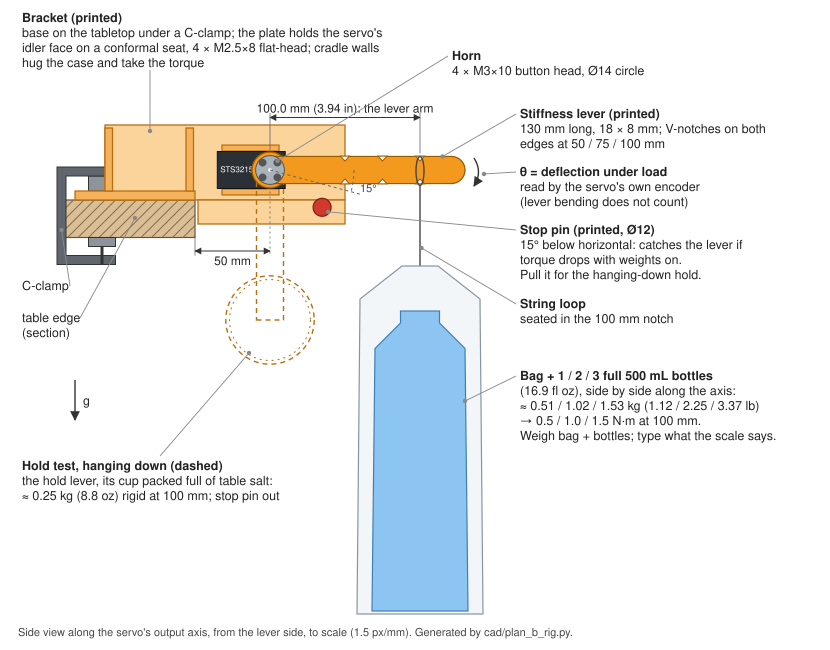
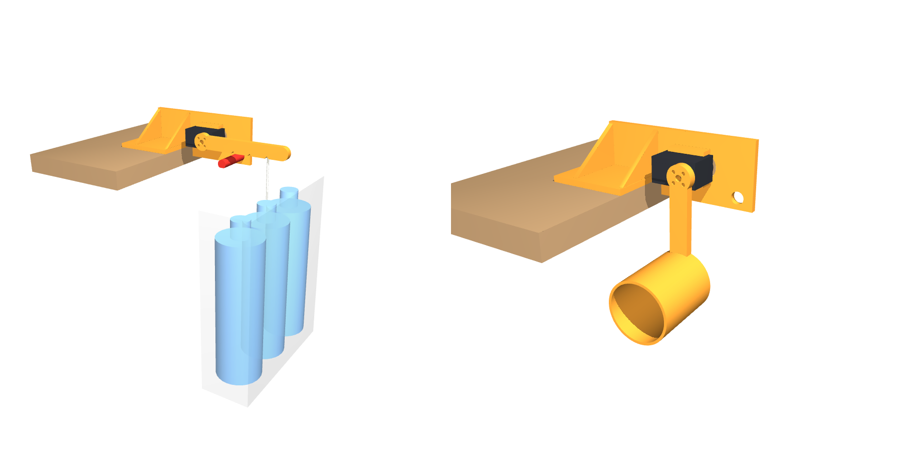

# Plan B bench rig: lever, weights and fixture for one STS3215 (#73)

**Status (2026-09-30):** designed and fit-checked in CAD. The hold procedure is
updated for `gain_bench.py` at main 9e98a96. The STLs are ready for
review in OrcaSlicer. Nothing is printed yet.

Step 0 of [#73](https://github.com/tomwhipple/biped-robot/issues/73) asks
whether raising the STS3215's position-loop P about 4× makes it about 4× stiffer
without buzzing. The bare-horn pass
([2026-09-30-plan-b-bench.md](2026-09-30-plan-b-bench.md)) found no buzz at any
rung up to P 160, but with nothing on the horn it could not measure stiffness.
This rig adds the load: a known torque on a lever for `gain_bench.py stiffness`,
and a leg-like inertia for `gain_bench.py hold`.

Everything the servo touches is printed. The weights are water bottles and table
salt. The geometry is `cad/plan_b_rig.py`, which writes the STLs, runs the fit
checks, and draws both figures below from the same constants.

## How it works

- **Servo position.** The servo sits on its back (idler) face against a printed
  bracket clamped to a table edge. Its output axis is horizontal and parallel to
  the edge, 50 mm out past the edge and 20 mm above the tabletop. The lever
  swings in a vertical plane clear of the table, so weights hang straight down
  past the edge.
- **Torque.** Torque = hung mass × g × 100 mm. The hanging mass stays vertical,
  so the arm stays 100 mm to within cos 5° (0.4 %) over the few degrees the
  lever deflects.
- **What is measured.** The servo reads its own output angle (Present Position).
  Deflection is the servo's position error under load: the P-loop stiffness this
  test is about. How much the lever itself bends does not enter.
- **Pass criterion.** The result is the ratio of stiffness at each P to the
  stiffness at P 32, on the same rig. So each weight only needs to be known to
  the kitchen scale, not to a target. The tool asks for the mass actually hung,
  and a constant offset (such as the lever's own weight) drops out of the fit.

## Loads

The hook is the 100 mm notch (3.94 in from the axis).

| Test | Torque | Total hung mass | lb | oz | Use |
|---|---|---|---|---|---|
| stiffness, load 1 | 0.5 N·m | 0.51 kg | 1.12 | 18.0 | bag + 1 full 500 mL (16.9 fl oz) water bottle |
| stiffness, load 2 | 1.0 N·m | 1.02 kg | 2.25 | 36.0 | bag + 2 bottles |
| stiffness, load 3 | 1.5 N·m | 1.53 kg | 3.37 | 54.0 | bag + 3 bottles |
| hold | leg-like inertia | ≈ 0.25 kg at 100 mm | 0.55 | 8.8 | the hold lever's cup, packed full of table salt |

**Bottles.** A full 500 mL bottle is roughly 18 oz. That estimate comes from
500 g of water plus the bottle, and is not weighed. At 100 mm, one bottle is
almost exactly 0.5 N·m. Weigh the bag with its bottles on the kitchen scale and
type that number at the prompt.

**Inertia.** The inertia must be **rigid**. A weight on a string swings on its
own and would hide the limit cycle the hold test is looking for. It also can't
be anything that sloshes. So the hold lever carries a cup at 100 mm:

- **Cup size:** 54 mm inside diameter, 70 mm deep, 160 cm³.
- **Filling:** pack it full and press the lid on, so nothing inside can shift.
  Tape the lid.
- **Mass:** table salt at about 1.2 g/cm³ gives about 190 g. The cup, lid and
  lever add about 60–85 g, depending on infill, so the total comes to about
  0.25 kg.
- **Other fillings:** dry sand gives about 240 g. Steel screws or nuts work, with
  salt poured in to lock them. Rice at 0.8 g/cm³ gives only about 130 g, which is
  too light.

These densities are typical values, not measured. Weigh the filled lever and
record the actual mass in the `--inertia` label.

**Torque margin.** At 1.5 N·m the servo carries about 51 % of the 2.94 N·m stall
figure in `docs/servo-map.md` §5. The servo's overload protection starts at 80 %
(register 36 = 80, read 2026-09-30), so the heaviest load should not trip it.
The test is also meant to confirm that.

## Printed parts

The files are in `cad/stl/`, already in print orientation. Volumes are for a
solid part; weights assume PLA at 1.24 g/cm³ and 100 % infill.

| File | Part | On the bed | Solid | Print notes |
|---|---|---|---|---|
| `plan_b_bracket.stl` | bracket: base, plate, 2 gussets, 2 pads, cradle | 66 × 180 × 68 mm | 100 cm³ (~125 g) | Back face down. The countersinks open at the bed; the base and cradle rise from the plate. 4+ walls, 40 % infill: the plate carries the 1.5 N·m reaction |
| `plan_b_lever_stiff.stl` | stiffness lever, notches both edges at 50 / 75 / 100 mm | 142 × 24 × 8 mm | 20 cm³ (~25 g) | Flat. The horn face is the bed face |
| `plan_b_lever_hold.stl` | hold lever with the salt cup at 100 mm | 142 × 59 × 73 mm | 51 cm³ (~63 g) | Flat. The cup rises from the bed; no supports |
| `plan_b_lid.stl` | press-fit lid for the cup (0.2 mm clearance) | 59 × 59 × 7 mm | 17 cm³ | Spigot up |
| `plan_b_stop_pin.stl` | removable stop pin, Ø12 | 18 × 60 × 14 mm | 7 cm³ | Lying on its 1 mm flat, so the layers run along the pin: strong in bending |

## Hardware and supplies

- **Servo to bracket:** 2 × M2.5×8 flat-head self-tapping screws, the robot's
  stock screws. They pass through 5.2 mm of plastic and enter the case 2.8 mm,
  the same stack as the yaw carrier (`cad/fasteners.py`, `yaw_wall_screws`).
- **Lever to horn:** 4 × M3×10 button-head screws. They pass through the 8 mm
  lever pad and enter the horn's 2.5 mm thread by 2.0 mm (the minimum is 1.5,
  `cad/dimensions.py`).
- **Clamping:** 1 C-clamp that reaches the base's back strip (6 mm base + table
  thickness). A second clamp helps.
- **Weights and measuring:**
  - 3 full 500 mL water bottles, a plastic bag, and a string loop (or an S-hook)
  - about 200 g of table salt (or sand, or steel hardware), plus tape for the lid
  - a kitchen scale

## Seating the servo

`check_assembly.servo_mock`, measured off the vendor STEP, shows the back of the
servo is not flat:

- The back-cover platform stands 1.90 mm proud of the case face, the idler disc
  2.05 mm, and its hub 2.60 mm. The disc and hub **rotate**.
- The 8.30 mm row of case holes carries the servo's own case screws. Their heads
  stand 1.65 mm proud.

So the plate stands off on two 2.5 mm pads at the free 32.75 mm row. That is the
same row the leg's idler grip plate uses. The plate clears everything else by at
least 0.6 mm, and a Ø24 relief lets the disc turn. Two cradle walls hug the
case's long sides (0.25 mm clearance each side), so the lever torque is taken in
bearing, not by two self-tappers.

## Fit checks

`cad/plan_b_rig.py` intersects the solids against the repo's conservative servo
mock and a table slab. Each line reports the overlap in mm³:

- bracket vs servo, bracket vs table, servo vs table: **0**
- stiffness lever and hold lever, horizontal and hanging down, against the
  servo, the bracket and the table: **0**
- both levers against the stop pin, horizontal and 5° down: **0**
- both levers at 16° down: **touch the pin**, as intended

Caveats:

- The servo mock is square-cornered. Everything else comes from the vendor
  STEP, but the pad positions have not been test-fitted on a real servo.
- The lever must point **away from the table**. Pointed back over the table, it
  hits the gussets.
- The horn's four screw holes let the lever go on in four positions, 90° apart.
  If `gain_bench.py` refuses a hold goal as too close to the encoder's 0/4095
  wrap, move the lever one hole position.

## Procedure

1. **Assemble.**
   - Screw the servo onto the bracket's pads through the cradle.
   - Clamp the bracket to the table edge, with the servo past the edge.
   - Bolt the stiffness lever to the horn, pointing away from the table.
   - Push the stop pin in.
2. **Move the servo to ID 30** for the session; Tom OKed this 2026-09-30. On
   ID 11 the firmware limits every `move` to the right ankle roll's ±25° band.
   That band does not include "hanging down", which is 90° from horizontal. On
   ID 30 the only limit is the encoder's rollover, which the tool checks. Move it
   back to ID 11 at the end. The ID write may report `timeout` even though it
   landed, and can leave the EEPROM unlocked (#101). After each rename, check
   `scan` and `reg 30 55` (it should be 1). The first gains write re-locks it
   anyway. ID 30 is off the robot's bus map, so no `--allow-bus-id` is needed.
   Only the wrap margin applies: a goal around 2050, and "down" about 1024
   ticks away, are both clear. Run everything in a real terminal (tmux).
3. **Stiffness:** `tools/gain_bench.py stiffness 30 --lever-m 0.100 --settle 5`.
   The ladder is P 32 / 64 / 96 / 128 / 160. At each P:
   - With torque off, set the lever horizontal and type `go`.
   - Hang 1, 2 and 3 bottles, typing the scale reading at each prompt. A bag on
     a string swings: steady it before pressing enter. A swinging bag shows up
     as a hold range above 2 counts in that load's row.
   - Take the bottles off.
   - Each P takes about 2–3 min. Tom types every `go`: his "move at will"
     covered the loose servo, not one carrying 1.5 kg.
   - **Watch the pin.** At P 32 with 1.53 kg, expect 5–7° of deflection
     (k 12–17 N·m/rad, the laptop session's estimate). If a load row shows
     more than about 10° (about 114 ticks), check the lever isn't resting on
     the stop pin. Pin contact would inflate the P 32 stiffness and shrink
     every ratio.
4. **Hold:** swap to the hold lever with its cup filled, and weigh it first.
   Run it as **one** invocation:
   `tools/gain_bench.py hold 30 --inertia "<m> kg salt cup at 0.10 m"`.
   The default orientations are hanging down, then horizontal.
   - **Pull the stop pin** before the first prompt ("HANG STRAIGHT DOWN"). The
     lever reaches vertical by swinging down past the pin.
   - **Refit the pin** at the "HORIZONTAL" prompt; torque is off at that point.
   - **Hold the lever level by hand** when the tool reads the horizontal goal.
     Loaded, it carries about 0.28 N·m (0.245 from the cup, about 0.04 from
     the lever). That is about the gearbox's back-drive friction (0.235 N·m
     measured powered, 0.35 assumed unpowered in sim). Let go, and it may
     settle onto the pin, and the pin would damp the very limit cycle the test
     looks for.
   - Between rungs the servo is released for the gain write, and the lever may
     creep down; 15° to the pin is 171 ticks. Since 9e98a96 the torque-on `go`
     lifts it back by up to 200 ticks at 100 steps/s. Beyond that the tool asks
     for a re-seat by hand, then aborts.
   - Listen for a buzz or whine at each rung.
   - Two hold runs in one session directory leave only the last `hold.json` in
     the report. If the run must be split, give each part its own `--session`.
5. **Record:** run `tools/gain_bench.py report --md docs/design-v6/<date>-plan-b-bench.md`.

## What to expect, and the pass line

- **Pass:** stiffness at P 128 at least 4× that at P 32, and a hold within ±1
  count. **Conditional pass:** 3× and quiet (see #73).
- **Size of the readings:** the laptop session estimates k 12–17 N·m/rad at
  P 32; the tool's simulated servo uses 17. That range is **not measured**. If
  it holds, P 32 deflects roughly 1.7–7° across the three loads, and a 4× stiffer
  P 128 about 5–7 encoder ticks at 0.5 N·m and 14–20 at 1.5 N·m
  (1 tick = 0.088°).
- **Resolution:** at P 128 the encoder's resolution is the limit, which is why
  the 1.5 N·m load matters. If three bottles are too much for some reason, the
  75 mm notch gives 0.75× the torque with the same bottles; pass
  `--lever-m 0.075`.

## Before printing

Tom checks the STLs in OrcaSlicer on the Mac first. What to look at:

- the bracket's countersinks and the cradle's inside width:
  24.72 + 2 × 0.25 = 25.22 mm
- the hold lever's cup walls, 2.5 mm
- the lid spigot fit, 0.2 mm clearance
- the stop pin's 1 mm flat sitting on the bed
