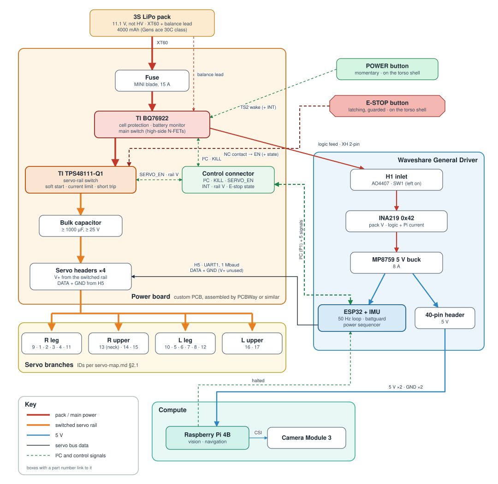

# Power circuit: design for milestone 2 (2026-10-06)

The design for the **Power circuit** milestone: #106 (power path and automatic
shut-off), #107 (pack), #108 (torso room), #109 (battery telemetry), the power
side of #87 (Pi and camera) and the E-stop button of #25.

Tom decided the points marked **decided** on 2026-10-06. Everything else is
**proposed**. [§11](#11-decisions) lists the design decisions: which Tom
made, and which are working defaults he deferred to Claude. Once
the design is agreed, DESIGN.md §6, [wiring.md](../wiring.md) and
[bom.md](../bom.md) take the result ([§12](#12-what-changes-in-the-design-documents)).
Every part, pack and ready-made board considered is listed with a link in
[§13](#13-parts-and-options-with-links).

## 1. What the circuit has to do

| | requirement | source |
|---|---|---|
| P1 | Power 17 servos (two of them STS3250 hip rolls), the Pi 4B with the Camera Module 3, and the General Driver | milestone; #74 for the STS3250s |
| P2 | **≥ 45 min of continuous walking** on one pack | **decided** |
| P3 | A cut-off that protects the cells and works with no firmware running | milestone, #106 |
| P4 | **After a low-battery landing, the robot turns itself off.** The Pi halts cleanly, then the power path opens | **decided** |
| P5 | **The E-stop cuts servo power only.** It is an external, guarded button. The Pi and the ESP32 stay up, and a second press restores servo power | **decided** (#25) |
| P6 | Servo transients must not brown out the Pi or the ESP32 | #106, #87 |
| P7 | Battery state reaches the operator and the Pi, independent of the servo bus | #109 |
| P8 | **A buy-ready pack**, with no pack building. **A custom power board** holds the control circuitry; it is designed here and made and assembled by PCBWay or similar. Every part on it has a manufacturer datasheet | **decided**; AGENTS.md sourcing |
| P9 | It fits the torso. **Redesigning the torso to house it is accepted** | **decided** (#108) |
| P10 | **The Pi runs from the General Driver's 5 V** through the 40-pin header | **decided** |

## 2. Loads

| load | figure | source |
|---|---|---|
| servo bus, walking (5 gate cases) | mean **3.05 A** upper / **1.0 A** lower model; RMS 3.11 / 1.0; peak 4.74 / 1.7 | `current_budget_v6.txt` on branch `sims-overload-prone-current` (6c43d78), **not merged** |
| servo bus, get-ups (seat push, from a fall, from prone) | peak **9.4–11.8 A** / 4.6–6.7 A; worst 2 s 5.0–7.6 / 2.0–3.4 A | same |
| servo branch (one leg), walking | peak 3.7 A, RMS 1.6 A (upper) | same |
| Pi 4B | 0.6 A idle, 1.25 A maximum under stress, at 5 V; under-voltage flagged below 4.63 V | Raspberry Pi documentation, *power supplies* |
| Camera Module 3 | 0.25 A at 5 V ("The Camera Module requires 250mA") | same |
| General Driver logic (ESP32, IMU) | not measured | the INA219 measures it (§8) |
| STS3215 | 2.7 A stall, 0.18 A no load, 0.03 A idle | ST-3215-C018 datasheet |
| STS3250 (hip rolls, IDs 1 and 5) | 4.2 A stall at 12 V | retailer listings only: **unverified** |

What the numbers mean:

- The upper and lower models bracket the supply current of a PWM bridge. The
  first powered run measures which end is true (§10, V7).
- **The budget is on an unmerged branch, and it models 17 × STS3215.** It has to
  be re-run with STS3250s at IDs 1 and 5 once a Feetech document gives their
  current.
- **The Pi is not the biggest draw while the robot walks.** Walking, the
  servos take 11–34 W (1.0–3.05 A at 11.1 V). The Pi, the camera and the General Driver
  take about 5–9 W. Standing still, the comparison is close: 17 idle servos draw
  0.5 A (5.7 W) before any holding torque. The power board measures both
  (§8), which settles it.

## 3. Runtime and the pack (#107)

Charge needed for 45 min of walking, at 11.1 V:

| | upper model | lower model |
|---|---|---|
| servos, walking mean | 3.05 A | 1.0 A |
| Pi + camera + General Driver, after its buck | ≈ 0.87 A | ≈ 0.48 A |
| total | ≈ 3.9 A | ≈ 1.5 A |
| charge for 45 min | 2.9 Ah | 1.1 Ah |
| **pack, if 80 % is usable before the landing line** | **3.7 Ah** | **1.4 Ah** |
| minutes from a 2200 mAh pack | 27 | 70 |
| minutes from a 4000 mAh pack | 49 | 128 |

Assumptions, each replaced by a measurement on the first powered runs:

- the General Driver's logic draws 1 W at the upper end and 0.5 W at the lower;
- the General Driver's buck is 90 % efficient;
- 80 % of the rated capacity is usable before battguard lands the robot.
  No manufacturer discharge curve for a 3S LiPo was found to set this number.

Pack options:

| | 2200 mAh class | 4000 mAh class |
|---|---|---|
| example (maker's own page) | [Gens ace 60C 2200](https://gensace.de/products/gea223s60x6sgt): 90 × 43 × 19 mm, 158 g, XT60 | [Gens ace 30C 4000](https://gensace.de/products/gea403s30x6gt): 137 × 42 × 23 mm, 284 g, XT60 |
| meets 45 min | only under the lower model | under both |
| torso | fits a re-drawn bay easily | 137 mm is longer than the pelvis housing is wide inside (≈ 118 mm), so the bay must be re-planned |

**Decided (Tom, 2026-10-06): a 4000 mAh 3S LiPo.** It meets 45 min under both
current models (49 and 128 min). The battery bay is drawn for its envelope
(≈ 137 × 43 × 26 mm, ≈ 290 g), and the gates are re-run on that mass (S2 in §9).
The power board's coulomb counter measures the real walking mean, which
settles the runtime.

The chemistry stays 3S LiPo, not HV: an HV pack charges to 13.05 V, above the
General Driver's 12.6 V silkscreen. The battguard thresholds and the 11.1 V gate voltage
carry over unchanged. A 3S1P pack of [Molicel P45B](https://www.molicel.com/wp-content/uploads/INR21700P45B_1.2_Product-Data-Sheet-of-INR-21700-P45B-80109.pdf)
21700 cells (4.5 Ah, ≤ 70 g per cell) would be lighter, but it has to be
built, and P8 rules that out.

## 4. Architecture

*The power architecture. Boxes with a part number link to the maker's page in the SVG. Drawn by [`figs/power_architecture.py`](figs/power_architecture.py), which places every box by hand; re-render with `python docs/design-v6/figs/power_architecture.py`.*

What changes from the path in [wiring.md](../wiring.md):

- **No servo current crosses the General Driver.** H1 (a 3 A XH contact),
  SW1 (unrated), the AO4407 and H5/H6 carry only the logic and the Pi. The
  Waveshare FAQ's 5 A servo-path limit stops binding.
- **The inline fuse, protection board and switch become one custom board.** It
  also carries the E-stop switch, the current sensing and the servo splitter.
  The "passive 3-way splitter" in [servo-map.md §2.1](../servo-map.md) is now
  part of this board. The ID map does not change.
- **The Pi is fed from the General Driver's MP8759 buck.** That drops the D24V50F5,
  along with its 8.8 mm thickness and M2 holes.
- **The General Driver's SW1 stays on.** It now switches only the logic.

## 5. The power board

One custom PCB, designed here (KiCad, proposed under `pcb/power-board/`) and
made and assembled by PCBWay or similar. Every IC on it has a manufacturer
datasheet. It sits in the redrawn torso (#108).

### 5.1 What is on it

| block | function | proposed part | why |
|---|---|---|---|
| pack input | XT60 from the pack; the 4-pin balance lead | Amass XT60 (35 A at 12 AWG); JST XH 4-pin | the packs come with both |
| fuse | backup for a hard short if the protection fails | Littelfuse MINI 15 A in a PCB holder | 0.15–5 s to open at 200 %; the protection IC's short-circuit trip acts first |
| **cell protection, battery monitor and main switch** | cell cut-off with no firmware; per-cell voltage, pack current and charge over I²C; pushbutton wake; host shutdown | **TI BQ76922** with high-side N-FETs and a low-side sense resistor | one IC covers P3, P4 and P7 (§5.2) |
| POWER button | wakes the BQ76922; tells the ESP32 when pressed while on | momentary panel button, off-board | |
| logic output | to the General Driver's H1 | JST XH 2-pin, 22 AWG pigtail | |
| **servo-rail switch** | soft start into the bulk capacitor, current limit, fast off | high-side switch controller + N-FET (§5.3) | P5, and protects the servo harness |
| E-STOP button | latching; a normally-closed contact holds the rail's enable | latching panel button, off-board, recessed or guarded | it switches a logic signal, so any small documented latching button qualifies |
| bulk capacitor | sources servo current steps at the servos' end | ≥ 1000 µF, ≥ 25 V, low-ESR, 105 °C (Panasonic FR or Nichicon HE class) | |
| servo outputs | four branches: R leg, R upper, L leg, L upper | 3-pin headers that mate the servos' Molex 5264-class plugs | §5.4 |
| data input | the bus from the General Driver's H5 | 3-pin header with **pin 2 (V+) left unconnected**, so a stock servo lead fits | keeps the General Driver's `DC_IN` off the servo rail |
| control connector | I²C (3V3, GND, SDA, SCL) to P1; `KILL`, `SERVO_EN`, `INT`, the rail voltage, E-stop state | locking 2.0 mm or 1.25 mm connector (JST PH/GH) | |

### 5.2 Cell protection and battery state: the options

Tom asked for detail before deciding on per-cell voltages. Every cell-level
cut-off needs the balance lead on the power board. Once it is there, per-cell
readings come with the right IC at no extra cost.

| | option | cut-off without firmware | cells | current, charge | power on / off | parts | catch |
|---|---|---|---|---|---|---|---|
| **A** | **[TI BQ76922](https://www.ti.com/product/BQ76922)** monitor and protector (proposed); ready-made [BQ76922EVM](https://www.ti.com/tool/BQ76922EVM) for bring-up | cell UV/OV, discharge over-current, short-circuit, autonomous once its OTP is programmed | yes | coulomb counter | TS2 pushbutton wake from a 1 µA SHUTDOWN; host shutdown by I²C or the `RST_SHUT` pin | 1 IC (QFN-32 4 × 4), 2–3 N-FETs, sense resistor | OTP is one-time (§5.5); out of stock on ti.com when checked |
| B | [Renesas ISL94202](https://www.renesas.com/en/products/isl94202) standalone + [INA228](https://www.ti.com/product/INA228) | same, from EEPROM programmed over I²C | yes | INA228 | no pushbutton wake: only a charger exits power-down, so an extra wake circuit is needed | 2 ICs (TQFN-48 6 × 6) | no coulomb counter of its own |
| C | pack-level only: voltage supervisor + pushbutton controller ([ADI LTC2955](https://www.analog.com/en/products/ltc2955.html) class) + INA228 | pack total only; no balance lead | no | INA228 | the controller | ~3 ICs | blind to one weak cell inside a normal pack voltage |
| D | off-the-shelf [JBD smart BMS](https://www.lithiumbatterypcb.com/product/3s-12-6v-or-4s-lifepo4-14-6v-16-8v-lithium-ion-smart-bluetooth-bms-with-uart-and-rs-485-communication-function/) ([UART protocol](https://www.lithiumbatterypcb.com/wp-content/uploads/2023/05/RS485-UART-RS232-Communication-protocol.pdf)) | cells, 2.7 V default (adjustable) | yes, over UART | yes | FET off by UART command | a 123 × 63 × 12 mm module | wider than the pelvis inside; takes the last free UART; < 30 mA running |
| E | off-the-shelf [JBD 3S protection board](https://www.lithiumbatterypcb.com/product/3s-led-power-supplier-li-ion-or-lithium-12v-battery-pcm-or-bms-with-10a-15a-20a-25a-constant-current/) + on-board current sensor | cells, cuts at 2.7 V, releases at 3.0 V | no | INA228 | still needs a separate soft switch | module, size not confirmed | two boards instead of one |

**Option A, the BQ76922:**

- **What it is.** It handles 3–5 cells and drives the charge and discharge
  N-FETs on the **high side**, with its own charge pump.
  - The robot's ground stays the battery negative.
  - A low-side protector (the BQ76905 or BQ7791x) would put a switch between
    the battery negative and the ground that the I²C host, the Pi and a
    USB-connected laptop all share.
- **The I²C interface** is at 0x08, free on the robot's bus. It gives the cell
  voltages, the stack voltage, the current, the coulomb counter, the
  temperatures and the protection flags.
- **The main switch.** Its discharge FET is the robot's main switch, so no
  separate pushbutton controller is needed.
  - **POWER** pulls TS2 low and wakes it from SHUTDOWN (1 µA typical, 3.1 µA
    maximum). The FETs come on about 280 ms later.
  - **`KILL`** is `RST_SHUT`: held high for 1 s, it shuts the device down. The
    I²C shutdown subcommand does the same.
  - A pre-discharge path can charge the downstream capacitance gently at turn-on.
- **Its modes.**
  - In NORMAL it draws about 0.25–0.29 mA, which is negligible against the load.
  - In SLEEP it draws 23–38 µA, and its protections still run.
  - It can also shut itself down on a minimum-cell or stack-voltage threshold.
    That makes a second, firmware-independent auto-off below battguard's line.

### 5.3 The servo-rail switch

- **The part.** A TI **TPS48111-Q1** high-side switch controller drives N-FETs
  (TI CSD17556Q5B class: 30 V, 1.2 mΩ at 10 V) through a sense resistor. From
  its datasheet:
  - 3.5–80 V in, with a 12 V charge pump.
  - Two-level over-current protection with a circuit-breaker timer.
  - A short-circuit trip in 1.2 µs, at a threshold set by one resistor (the
    datasheet's example sets 20 A).
  - An `IMON` current output, and 1.6 µA in shutdown.
  - Its pre-charge driver brings the rail up gently into the bulk capacitor.
    The datasheet recommends this variant for large capacitive loads.
- **The E-stop acts in hardware.** `EN/UVLO` switches the controller on above
  1 V and off below 0.3 V, and pulls itself low if left floating. The E-stop's
  normally-closed contact sits in series with that pin's pull-up. Pressing
  the button, or a broken wire, turns the rail off with no firmware involved.
- **The ESP32's control.**
  - `SERVO_EN` drives the controller's `INP`. The ESP32 can open the rail, but
    it cannot close it while the button is latched.
  - `SERVO_EN` is pulled low, so the rail stays off until the firmware enables it.
- **The rail's state** reaches the ESP32 two ways:
  - a divider from the rail to GPIO 34, an ADC input;
  - the E-stop's second contact, on its own input.
- **A rail stuck on is caught.** With the E-stop pressed and the rail still up,
  the firmware reports the fault and opens the main switch (the BQ76922's
  discharge FET). That is a second switch in series, so one failed FET does
  not defeat the stop.
- **Turn-off spike.** A TVS on the rail clamps the spike when 12 A is
  interrupted. A 30 V FET needs that clamp; a 40 V FET adds margin.
- **The fallback** is the TI LM5069. Its 9 V minimum input equals the pack's
  floor, and it has no separate gate input for the ESP32.
- **Why not a relay or a Pololu switch:**
  - A relay (Panasonic CB1a: 40 A at 14 V DC) draws 1.4 W through its coil
    for as long as the rail is on.
  - Pololu's pages say not to use their switches as an emergency cutoff.
  - No latching pushbutton rated ≥ 10 A DC was found with a maker datasheet,
    so the button cannot carry the current itself.

### 5.4 Servo distribution and the data line

- **Four branches** follow the ID map in [servo-map.md §2.1](../servo-map.md):
  R leg (9 1 2 3 4 11), R upper (13 14 15), L leg (10 5 6 7 8 12) and L upper
  (16 17).
- **The first lead of each branch carries that branch's current.** In the
  upper model the leg branch peaks at 3.7 A with 1.6 A RMS walking. A Molex
  5264 contact is rated about 2.5 A at 24 AWG (Molex PS-5264, not opened
  directly). The RMS fits, and the peaks exceed it for moments. §10 V8 checks
  lead temperature.
- **DATA is one net.** H5 and H6 carry the same three nets on the General
  Driver, so one lead from H5 feeds all four branches; H6 is a spare.
- **That lead brings DATA and GND only.** Its V+ pin lands on an unconnected
  pad, so the General Driver's `DC_IN` is never tied to the switched servo
  rail.
- **Ground.** The two rails share one ground at the power board's input. The H5
  lead's ground is the data reference; it carries a negligible share of the
  return current, because the power board's own ground is the short path.

### 5.5 Design rules for the schematic

- **The OTP is written once, at bring-up.** First test the configuration in
  RAM, written by the ESP32 over I²C. Then program it with BAT at 10–12 V,
  which a 3S pack at storage charge (3.8 V/cell, 11.4 V) satisfies.
  - The ESP32 runs on USB while it does this.
  - A blank part keeps its FETs off, so an unprogrammed board stays off
    rather than unprotected.
  - Keep a spare IC for a mistaken burn.
- **3S wiring of the unused cell inputs** follows the BQ76922 datasheet.
- **TS2 is both the wake pin and a thermistor input.** The POWER button and
  any thermistor are designed together. A thermistor sits on TS1 or TS3.
- **No board part may load the I²C bus while it is unpowered.** The ESP32 runs
  on USB with the pack off, and its IMU shares the bus. Check each part's I/O
  structure, or isolate the power board's I²C with a buffer that is powered from the
  board side.
- **Series resistors on every ESP32 ↔ board signal**, for the same reason.
- **Protection thresholds** must clear the get-up peaks: discharge
  over-current ≥ 20 A with a delay, short-circuit well above that. Cell UV ≈
  3.0 V for LiPo, below battguard's 3.3 V/cell landing line.
- **Copper and FETs** are sized for 15 A continuous, so the fuse is the limit.
  Test points go on every rail, the sense resistor and the I²C.

### 5.6 Making it

- **KiCad**, under `pcb/power-board/`: the schematic, the layout, a BOM with
  each part's datasheet link, and the fab and assembly outputs.
- **Generated outputs** (Gerbers, pick-and-place) are rebuilt from the KiCad
  source, not hand-edited.
- **Ordering:** PCBWay or similar, assembled. The BQ76922's stock is checked
  before the layout is committed.
- **Before it exists**, the bring-up can use the BQ76922EVM. Its user's guide
  (SLVU957A) has the schematic the design starts from.

## 6. The logic rail: the General Driver and the Pi

- **The Pi's 5 V** comes from the General Driver's MP8759 through the 40-pin
  header. The MP8759 is rated 26 V and 8 A (MPS datasheet), behind an
  ideal-diode FET (schematic M1). Waveshare's wiki describes the header as
  "powering the host computer" and the regulator as "Power supply for host
  computers such as Raspberry Pi or Jetson nano".
- **The INA219 then measures the Pi as well.** R11 sits upstream of the
  MP8759, so its current is the General Driver's logic plus the Pi plus the camera.
- **H1 carries ≤ ~1 A** at 11.1 V (≈ 1.1 A at a 9 V pack), under its 3 A contact rating.
- **Brown-out margin.** Servo current no longer flows through the General
  Driver, so its input sags only with the shared pack and harness
  resistance. The MP8759 regulates while its input stays above 5 V plus its
  dropout, and a 3S pack in use sits at 9–12.6 V (its UVLO is 4.25 V). §10 V6
  checks this under a get-up.
- **What the 40-pin feed bypasses.** Power on the Pi's 5 V pins skips its
  USB-C input protection. Raspberry Pi's own magazine says "There is no
  regulation or fuse protection on the GPIO". The MP8759 is regulated, and the
  Pi's absolute maximum on 5 V is 6.0 V (Pi 4B datasheet).
- **The harness** runs General Driver 40-pin → Pi 40-pin: 5 V × 2 and GND × 2.
  It also carries `P_TX`/`P_RX` if the Pi link is the wired UART0 (#87).
  - Which physical corner of the General Driver's header is pin 1 is unverified
    ([sensor-expansion.md §1](../sensor-expansion.md)). **Check the pins with a
    meter before the Pi is connected.**
- **The ESP32's I²C bus** (GPIO 32/33, on P1) reaches the power board's
  monitor ICs through the control connector (§5).

## 7. Sequences

**Power on.**

1. Press POWER. TS2 wakes the BQ76922, and about 280 ms later its FETs
   close. The General Driver and the Pi boot.
2. The ESP32's boot releases every servo, then sets `SERVO_EN`.
3. The servo rail soft-starts into its bulk capacitor, and the rail divider
   on GPIO 34 reports it up.
4. The servos power up with torque off; check this on the bench (§10). The
   robot stays in `BENCH` until it is armed.

**POWER pressed while on** (an orderly shutdown):

1. `INT` tells the ESP32.
2. If the robot is armed, it lands as for a low battery (`VLAND`, then `VSAFE`).
3. The ESP32 tells the Pi to halt (beacon state or link command, #87).
4. The Pi's `gpio-poweroff` line rises when it has halted, or a 60 s timeout
   expires, or no Pi is fitted.
5. The ESP32 asserts `KILL`, which holds `RST_SHUT` high for 1 s. The
   BQ76922 shuts down, opening its FETs, and draws 1–3 µA.
6. **Holding POWER for about 5 s** drives `RST_SHUT` through an RC delay. That
   forces the robot off in hardware, independent of the firmware. The circuit
   is to be confirmed in the schematic.

**Low battery** (P4):

1. Warn at ≤ 10.5 V: a flag only; the operator lands the robot.
2. `VLAND` at ≤ 9.9 V for 0.5 s: stop travelling, crouch under control.
3. `VSAFE` 1.5 s later: torque off, latched.
4. Then steps 3–5 above: the Pi halts and the switch opens.
   - The robot is then off, drawing only the power board's off-state current.
   - battguard reads the INA219 (§8), so this also runs on the bench, not only armed.

**Backstops**, in order, if the firmware never acts:

1. The BQ76922's own automatic shutdown on a minimum cell or stack voltage
   (OTP-set, below battguard's line).
2. Its cell under-voltage protection.

Both are uncontrolled: the robot drops, and the Pi loses power without
halting. Unplug the pack after use regardless. A pack left connected keeps a
small drain on it.

**E-stop** (P5):

1. Press the E-stop button; it latches. Its normally-closed contact opens the
   servo-rail switch's enable **in hardware**, regardless of the ESP32.
2. The servo rail drops, and the ESP32 sees it on GPIO 34. The Pi, the ESP32 and the telemetry
   stay up.
3. The firmware latches a hardware E-stop state. Proposed: `PWR_ESTOP`,
   appended to the link enum as 8, so a hardware stop reads differently from
   the radio's `ESTOP`.
4. Press again; the button unlatches. The rail soft-starts, and the servos
   come up with torque off.
5. The state clears only through a frame with `ENABLE` off, as `ESTOP` does,
   so a released button cannot re-arm the robot straight into motion.

The ESP32 can open the servo rail with `SERVO_EN`, but it cannot close it
while the button is latched.

## 8. Telemetry (#109)

| what | from | rate | notes |
|---|---|---|---|
| pack voltage at the General Driver | INA219 bus voltage (0x42) | every 20 ms tick | independent of the servo bus; valid armed, benched and with torque off |
| logic + Pi + camera current | INA219 shunt (R11, 0.01 Ω) | every tick | the "Pi is the biggest draw?" measurement |
| pack current, charge used | the BQ76922 (0x08) current and coulomb counter | 10 Hz | gives the remaining charge, and the walking mean for §3 |
| servo current | the TPS48111 `IMON`, or pack current − INA219 current | every tick | the shunt check of §10 V7 |
| servo rail voltage, E-stop latched | the rail divider on GPIO 34; the E-stop's second contact | every tick | |
| cell voltages, protection flags | the BQ76922 | 1 Hz | free with option A; Tom accepted dropping them, and the options are in §5.2 |
| reset reason | `esp_reset_reason()` | once at boot | makes a brown-out reset visible (#106) |

- **battguard's source moves from servo register 62 to the INA219.** It then
  guards in every mode, not only while armed. Register 62 stays as a
  cross-check.
- **The beacon:**
  - The base frame keeps `vbat` and its layout; the value now comes from the
    INA219.
  - A new optional block, requested by a new flag bit (bits 0–5 are in use),
    carries the rest, as `kFlagPose` and `kFlagAtt` do today.
  - Its layout is pinned in `protocol.h` / `link/protocol.py`, the generated
    protocol vectors and the host tests.
- **The Pi** reads the same beacon over its link (#87) and halts on `VSAFE` or
  on a shutdown request.
- **`bimo_gui` / `bimo_tui`** show the pack current, the charge used and the rail state.

## 9. Firmware and host work

| | work | issue |
|---|---|---|
| F1 | INA219 driver, on the I²C helpers in `qmi8658_idf.cpp` | #109 |
| F2 | BQ76922 driver: read cells, current and charge; write the configuration to RAM at bring-up; the one-time OTP burn as a guarded CLI command | #109, #106 |
| F3 | battguard: the INA219 as its source, guarding in bench mode, a host test | #109 |
| F4 | power sequencer: `INT`, `KILL`, `SERVO_EN`, the rail voltage, the E-stop state, the Pi-halted input; a stuck-on rail opens the main switch; a pure module with a host test, like battguard | #106 |
| F5 | the `PWR_ESTOP` state: enum, watchdog, consoles, tests | #106 |
| F6 | the beacon's battery block, protocol vectors, `tests/test_protocol.py`, `firmware/host/test_protocol.cpp` | #109 |
| F7 | consoles: `bimo_gui`, `bimo_tui`, `commander.py` | #109 |
| F8 | the Pi's shutdown daemon and the `gpio-poweroff` overlay | #87 |
| F9 | reset reason in the CLI and the beacon | #106 |
| S1 | re-run `current_budget_v6` with STS3250s at IDs 1 and 5; merge the budget branch | #106 |
| S2 | re-run the plant and the gates on the new pack mass and torso | #108 |

Proposed ESP32 pins, to confirm in the schematic:

- `KILL` → IO27 (P3 pin 5);
- `SERVO_EN` → IO16 (P3 pin 4);
- `INT` ← GPIO 35 and the rail voltage ← GPIO 34 (H3; both input-only, and 34 is an ADC);
- Pi-halted ← IO5 (P3 pin 1; a strapping pin, so input only);
- E-stop state ← IO4 (H2, which the firmware now names `kRgbLed`).

Notes:

- IO16 and IO27 also appear on H4, which stays unused.
- The I²C goes to P1.
- UART2 stays free for the Pi link (#87), because the BQ76922 is on I²C.

## 10. Verification

The bench rules in [AGENTS.md](../../AGENTS.md#bench-safety) apply: film the
session, current-limit the first power, and give one go per motion.

| | check | pass |
|---|---|---|
| V1 | Power board alone, from a current-limited supply: button on/off, `KILL`, off-state current | the switch obeys; off-state current as designed |
| V2 | Cell cut-off, first with the configuration in RAM, then after the OTP burn: pull one cell tap below the threshold (a divider rig on the balance input) | the pack path opens with the ESP32 halted; the release behaves as the datasheet says |
| V3 | Low-battery sequence: ramp the supply down through 10.5 / 9.9 V | warn → `VLAND` → `VSAFE` → Pi halts → off |
| V4 | E-stop: press, release | rail at 0 V, `PWR_ESTOP` latched, Pi and ESP32 up; on release the servos return with torque off and do not move until armed |
| V5 | Inrush: E-stop release and power-on with the bulk capacitor fitted | no protection trip; the soft start holds the peak |
| V6 | Brown-out: servo-loaded pose and the scripted get-up over the tether | no under-voltage flag from `vcgencmd get_throttled`; clean ESP32 reset reason; INA219 minimum logged |
| V7 | Shunt: pack current every tick through the floor sequence and the get-up | settles the upper/lower model; sets the fuse (stay at 15 A, or drop) and the pack size |
| V8 | Thermal: the power board, the servo headers and the first lead of each branch after a series of get-ups | within the parts' ratings |
| V9 | Runtime: walk one pack down to `VLAND` | measured minutes; the usable fraction for §3 |

## 11. Decisions

Tom decided D1 and D5 on 2026-10-06. He deferred the rest to Claude, so the
recommended option is the working design until there is a reason to change it.

| | decision | status | choice | alternatives |
|---|---|---|---|---|
| D1 | Pack capacity (§3) | **decided** | a 4000 mAh 3S LiPo; the bay is drawn for it | 2200 mAh, which meets 45 min only under the lower current model |
| D2 | Cell protection and battery state (§5.2) | working default | option A, the BQ76922 (per-cell voltages come with it) | B (ISL94202 + INA228), C (pack-level only), D/E (JBD modules) |
| D3 | Servo-rail switch / E-stop (§5.3) | working default | the TPS48111-Q1 with the button's NC contact on `EN` | a relay switched by the button (fail-safe contacts, but a 1.4 W coil); the LM5069 |
| D4 | POWER button behaviour (§7) | working default | press: on; press while on: orderly shutdown; hold ≈ 5 s: forced off | no hardware hold-off (unplug the pack instead) |
| D5 | Who draws the power board | **decided** | KiCad; Claude drafts the schematic and layout in `pcb/power-board/`, and Tom reviews before ordering | an outside designer from this spec |
| D6 | Order of work | working default | the schematic first, with the BQ76922EVM on the bench to test the configuration and the sequences while the power board is made | wait for the power board |
| D7 | Fuse | working default | 15 A until §10 V7 measures the peak | — |

A new issue would track the power board (schematic, layout, order, bring-up), with
#106 depending on it.

## 12. What changes in the design documents

When this is agreed:

- **DESIGN.md §6:** the power path (the custom board, the servo rail fed
  around the General Driver, the Pi on the General Driver's 5 V), the E-stop and the
  auto-off.
- **[wiring.md](../wiring.md):**
  - Power path, Pack, Protection board, Fuse, Switch, Inlet, Bulk capacitor,
    Pi supply: replaced by the power board.
  - What the INA219 measures: the Pi is now included.
  - Battery protection: battguard's source, and the auto-off.
- **[bom.md §3–4](../bom.md):**
  - Added: the pack spec, the power board, the buttons and the harness.
  - Removed: the D24V50F5, the inline fuse holder, the inline switch, the
    separate protection board and the balance-lead alarm.
- **[datasheets/](../datasheets/README.md):** the BQ76922, TPS48111-Q1,
  CSD17556Q5B, MP8759 and Molex 5264 datasheets, kept with the project record.
- **[control-channel.md](../control-channel.md):** `PWR_ESTOP`; the hardware
  E-stop replaces "the real E-stop is the inline battery switch".
- **[servo-map.md §2.1](../servo-map.md):** the splitter is the power board.
- **[sensor-expansion.md](../sensor-expansion.md):** the Pi is powered from
  the 40-pin header.
- Issues: #106–#109 and #87 updated (through Aime); a new issue for the power board's
  schematic, layout and order.

## 13. Parts and options, with links

Every link answered on 2026-10-06 except analog.com, which did not respond
from this machine.

**Packs**

| part | role | status | link |
|---|---|---|---|
| Gens ace 3S 4000 mAh 30C, 137 × 42 × 23 mm, 284 g, XT60 | the pack; the battery bay is drawn for it | decided (D1) | [gensace.de](https://gensace.de/products/gea403s30x6gt) |
| Gens ace 3S 2200 mAh 60C, 90 × 43 × 19 mm, 158 g, XT60 | smaller pack | not taken: 45 min only under the lower current model | [gensace.de](https://gensace.de/products/gea223s60x6sgt) |
| Molicel P45B 21700 cell, 4.5 Ah, 45 A | a 3S1P pack would be lighter, but has to be built | not taken (P8) | [datasheet](https://www.molicel.com/wp-content/uploads/INR21700P45B_1.2_Product-Data-Sheet-of-INR-21700-P45B-80109.pdf) |

**On the power board**

| part | role | status | link |
|---|---|---|---|
| TI BQ76922 | cell protection, battery monitor, main switch | proposed (D2, option A) | [product](https://www.ti.com/product/BQ76922) · [datasheet](https://www.ti.com/lit/ds/symlink/bq76922.pdf) |
| TI TPS48111-Q1 (TPS4811-Q1 family) | servo-rail switch, E-stop | proposed (D3) | [product](https://www.ti.com/product/TPS4811-Q1) · [datasheet](https://www.ti.com/lit/ds/symlink/tps4811-q1.pdf) |
| TI CSD17556Q5B | N-FET class for both switches | proposed | [product](https://www.ti.com/product/CSD17556Q5B) |
| TI LM5069 | servo-rail switch fallback | alternative (D3) | [product](https://www.ti.com/product/LM5069) |
| Renesas ISL94202 | standalone protector | option B | [product](https://www.renesas.com/en/products/isl94202) |
| TI INA228 | current and charge monitor | options B, C, E | [product](https://www.ti.com/product/INA228) |
| ADI LTC2955 | pushbutton on/off controller | option C | [product](https://www.analog.com/en/products/ltc2955.html) (not reachable from here) |
| Bourns CSS2H-2512, 2 mΩ | shunt for an INA228 | options B, C, E | [datasheet](https://www.bourns.com/docs/product-datasheets/css2h-2512.pdf) |
| Amass XT60 | pack connector | proposed | [Amass](https://www.china-amass.com/biao/267.html) |

**Ready-made boards and modules**

| part | role | status | link |
|---|---|---|---|
| TI BQ76922EVM | the BQ76922 on a ready-made board, to test its configuration and the sequences before the power board exists | proposed for bring-up (D6) | [TI](https://www.ti.com/tool/BQ76922EVM) |
| JBD 3S/4S smart BMS, UART, 123 × 63 × 12 mm | ready-made protection with per-cell readings | option D | [JBD](https://www.lithiumbatterypcb.com/product/3s-12-6v-or-4s-lifepo4-14-6v-16-8v-lithium-ion-smart-bluetooth-bms-with-uart-and-rs-485-communication-function/) · [protocol](https://www.lithiumbatterypcb.com/wp-content/uploads/2023/05/RS485-UART-RS232-Communication-protocol.pdf) |
| JBD 3S protection board, 10–25 A | ready-made cut-off, no telemetry | option E | [JBD](https://www.lithiumbatterypcb.com/product/3s-led-power-supplier-li-ion-or-lithium-12v-battery-pcm-or-bms-with-10a-15a-20a-25a-constant-current/) |
| Pololu Big Pushbutton Power Switch HP (#2813) | soft power switch | not taken: its maker says not to use it as an emergency cutoff | [Pololu](https://www.pololu.com/product/2813) |
| Panasonic CB1a-T-12V relay, 40 A at 14 V DC, 1.4 W coil | E-stop by relay | alternative (D3) | [Panasonic](https://industry.panasonic.com/ap/en/products/control/relay/vehicle/number/acb36201) |
| Adafruit INA260 breakout, 15 A | servo-rail current sensor, had the board not been custom | superseded by the BQ76922 and the TPS48111's `IMON` | [Adafruit](https://www.adafruit.com/product/4226) |
| Adafruit INA228 breakout, 10 A | pack current and charge | superseded; its 15 mΩ shunt clips near 11 A | [Adafruit](https://www.adafruit.com/product/5832) |

**Already in the robot**

| part | role | link |
|---|---|---|
| Waveshare General Driver for Robots | controller; its MP8759 now feeds the Pi | [wiki](https://www.waveshare.com/wiki/General_Driver_for_Robots) · [mirrored documents](../datasheets/general-driver/README.md) |
| MPS MP8759 | the General Driver's 5 V buck, 26 V / 8 A | [MPS](https://www.monolithicpower.com/en/mp8759.html) |
| TI INA219 | the General Driver's monitor at 0x42 | [TI](https://www.ti.com/product/INA219) |
| Raspberry Pi 4B | compute | [datasheet](https://datasheets.raspberrypi.com/rpi4/raspberry-pi-4-datasheet.pdf) |
| Raspberry Pi Camera Module 3 | head camera | [product brief](https://datasheets.raspberrypi.com/camera/camera-module-3-product-brief.pdf) |

## Sources

- General Driver schematic and wiki: [datasheets/general-driver/](../datasheets/general-driver/README.md).
- MPS MP8759 datasheet: "26V, 8A … Synchronous, Step-Down Converter", UVLO 4.25 V rising.
- Raspberry Pi documentation, `computers/raspberry-pi/power-supplies.adoc`; Pi 4B datasheet (RP-008341-DS); Raspberry Pi Official Magazine, *power supply*.
- Gens ace product pages (gensace.de): 2200 mAh 60C, 4000 mAh 30C.
- Molicel INR21700-P45B datasheet.
- ST-3215-C018 datasheet: [datasheets/st3215/](../datasheets/st3215/).
- Current budget: `docs/design-v6/current_budget_v6.txt` and `sim/current_budget_v6.py`, branch `sims-overload-prone-current` @ 6c43d78.
- Littelfuse MINI 297 datasheet (opening times); Amass XT30U / XT60 pages; JST XH datasheet.
- TI BQ76922 datasheet SLUSE86A; BQ76922EVM user's guide SLVU957A; BQ76952 technical reference manual SLUUBY2B (FET_EN default, for the sister part).
- TI TPS4811-Q1 datasheet (TPS48111-Q1); TI CSD17556Q5B datasheet; TI LM5069 datasheet.
- Renesas ISL94202 datasheet; TI INA228 datasheet; Bourns CSS2H-2512 datasheet (shunt for options B/C/E).
- JBD (lithiumbatterypcb.com) 3S/4S smart BMS specification image; JBD General Protocol V4; JBD 3S PCM product page.
- Pololu items 2812 and 2813 (the emergency-cutoff warning); Panasonic CB1a-T-12V relay page.
