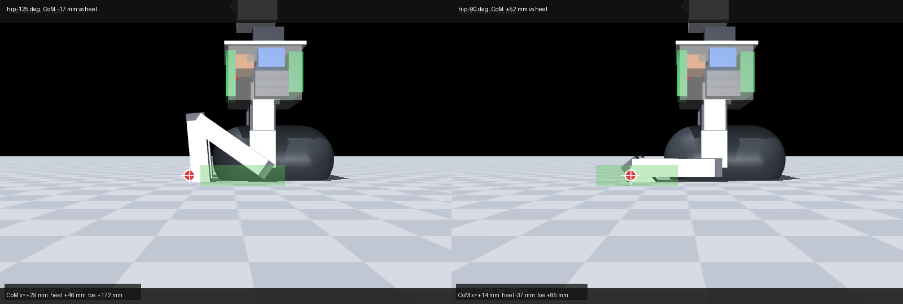
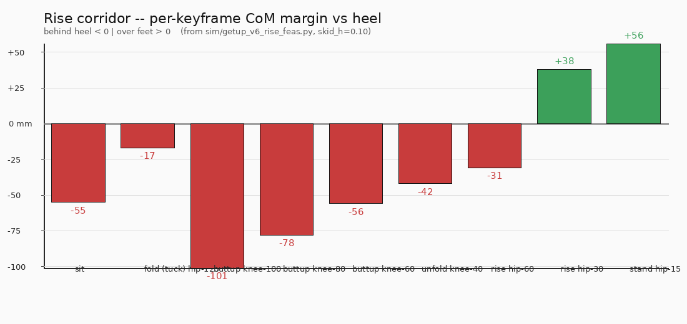
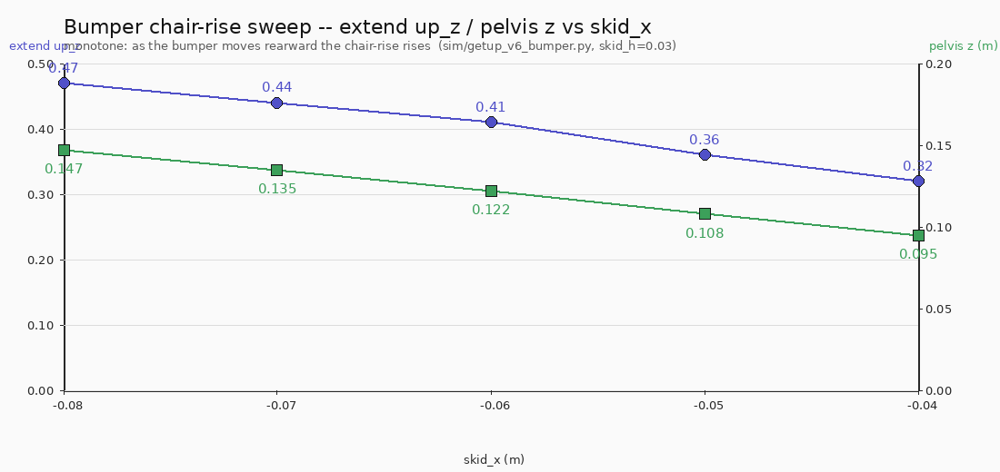

# No-appendage fall-recovery search on the v6 body (2026-09-14 / 15)

> Dated record: accurate as of its date; the current design is [DESIGN.md](../../DESIGN.md). The chosen get-up is the arm-assisted seat push.

Tom: *"return the robot (v6/v7) to standing if it falls ... without the tail
or arms ... thinking creatively, remembering the robot can rotate most of its
joints further than humans."*

**Status (verified in sim under the deploy servo model, STS3250 rolls+knees,
2 Hz shaper, 80 ms dead time): a robust no-appendage open-loop rise does not
exist on the bare body, but a passive pelvis skid does carry the robot to a
fully-upright crouch (up_z 1.00), and a rear-extended skid bumper converts the
finish into a genuine chair-rise halfway to standing — the strongest no-
appendage lever yet, and a concrete target for a learned RL rise.**

## Backdrop: what the appendage study already established (§12, §12.1)

On the bare v6 body (knee −130, hip −125, no appendage):
- supine → **sit** is easy (up_z 0.99); **prone → side → back** is solved with
  legs alone (§12.1). **supine → standing** is the unsolved step.
- From the seated crouch the hip joints sit 4 cm off the floor, the CoM is 8 cm
  behind the feet, and the rise corridor is ±20–28 mm CoP on a 90–116 mm foot —
  the torso tips backward mid-rise. §11.3's deep-ROM body (130/125) did not
  change it: **0/32**, including with a pelvis skid.

## What this session swept (verified, not just designed)

| family | idea (the beyond-human lever) | result / failure mode |
|---|---|---|
| **tripod** wide-splay | splay both legs 45° abduct into a wide A | 0/27. Torso tips backward; wide feet don't move the CoM forward over them. |
| **kneel** high-seat | deep ROM raises the seat so CoM crosses high | 0/16. Tucking settles back to the floor. |
| **kip** backward somersault | whip legs over the head, roll over shoulders onto a crouch | 0/18. peak_up ~0.4–0.7; the deploy 2 Hz bandwidth can't supply angular momentum. |
| **kip-from-sit / rock** | rock back, whip legs down-under | 0/8. max_tau ~1.3–1.8 N·m of ~4 N·m stall → **bandwidth-bound, not torque-bound**. |
| **side / prone bear-plant** | plant feet as hand-like contacts, press up | side 0/108, prone 0/96. Press lifts pelvis 0.10–0.14 m but the **head leads** / the near foot can't reach the floor behind the torso. |
| **heel self-push** | heel-to-buttock plant as a self-made tail | 0/N. The planted foot stays ≥23 mm off the floor behind the hips — not long enough to be the far-behind third contact. |

## The physics wall (confirmed)

**No far-behind third contact → no pelvis lift.** Without a tail/arm the CoM
cannot be held forward of the heels through the rise corridor; every family
either pikes the torso onto its head, can't reach the floor far enough behind,
or can't move the CoM over the feet from the 4 cm seat. The 2 Hz servo makes
dynamic kip momentum infeasible.

## The two verified levers

**1. Passive pelvis skid → upright crouch (works).** `gen_plant_v6.py` now has
`skid=True / skid_h / skid_x / skid_len / skid_w` (default-off ⇒ plant
unchanged). Verified: at **skid_h ≤ 0.06**, `sit → fold → butt-up` drives the
torso **fully upright** (up_z 1.00, pelvis 0.104, feet+thighs only) at ~0.7 N·m
— a tenth of the servo's capability. At **skid_h ≥ 0.10** the skid parks the
robot **prone** and nothing recovers (skid acts as a rocker).

**2. Novel kinematic finding — full-flexion tuck is self-defeating.** The
record's flex130 study always tucked to hip **−125°**, which itself parks the
CoM **17 mm behind the heel**. Static CoM sweeps show holding hip **−90…−100°**
keeps the CoM **+33…+69 mm over the feet** — a margin-positive crouch the record
never tried.

*Same camera, same body. **Left (hip −125°):** heels pulled forward under the
pelvis; CoM marker lands **17 mm behind the heel** (outside the shaded heel→toe
span). **Right (hip −90°):** CoM marker lands **+52 mm over the feet** (deep
inside the shaded span). Marker = CoM projected on the floor; shaded band =
heel→toe contact span. Numbers in `sim/getup_v6_seated_feas.py`.*

*Per-keyframe CoM margin from `sim/getup_v6_rise_feas.py`: 7 of 9 keyframes
are BEHIND HEEL (buttup knee-100 = −101 mm … rise hip-45 = −31 mm). Only the
last two rise keyframes are margin-positive (+38, +56 mm) once the pelvis is
already high — the corridor the open-loop rise cannot cross.*

**3. Rear-extended skid bumper → chair-rise (the strongest lever).** Testing the
body-mod idea directly: moving the skid rearward (`skid_x` −0.04→−0.08) turns
the unfold into a **chair-rise** — "lean forward onto the toes, then push off
the seat and extend." The torso stays up far higher (extend up 0.31→**0.47**,
pelvis z 0.095→**0.147 m**) as the bumper moves rearward — a genuine monotone
improvement, ~halfway to standing, versus the bare body's 0.23 collapse.
Longer heel and longer toe sweeps both did **nothing** to the unfold (the pivot
is the heel; foot-length levers miss it), which isolates exactly what the rear
bumper fixes.

*From `sim/getup_v6_bumper.py` (skid_h=0.03): the chair-rise is monotone in
`skid_x` — extend up_z 0.32→**0.47**, pelvis z 0.095→**0.147 m** as the bumper
moves rearward (−0.04→−0.08 m). The rear bumper is the lever that turns a seat
into a chair.*

## Recommendation (the no-appendage path worth building)

The passive pelvis skid (30 g, belt/screw-on, a seat below the hips) **plus** a
**learned RL rise** is the first no-appendage path that isn't statically
impossible: the skid removes the 4 cm-seat blocker and the upright crouch is a
clean, cheap target; a policy with BNO085 IMU feedback can hold the CoM through
the narrow corridor that kills open-loop keyframes. The rear bumper extends the
corridor (chair-rise to pelvis 0.147), so **a bumper + skid is the body
modification to print**. If RL isn't wanted, the tail remains the complete
drop-in answer (5/5 standing).

## Artifacts

- `sim/gen_plant_v6.py` — passive pelvis `skid` (+`skid_x/len/w`), backward-compat.
- `sim/getup_v6_seated_feas.py`, `getup_v6_rise_feas.py` — static CoM feasibility.
- `sim/getup_v6_noappendage.py`, `getup_v6_bear.py`, `getup_v6_crow.py`,
  `getup_v6_bridge.py`, `getup_v6_kip*.py`, `getup_v6_skid.py`,
  `getup_v6_skid_rise.py`, `getup_v6_rockrise.py` — the swept families.
- `sim/getup_v6_toesweep.py` — toe/heel foot-length sweep (negative).
- `sim/getup_v6_bumper.py` — rear-skid chair-rise sweep (positive lever).
- `sim/renders/v6_getup_noappendage_skid.mp4` (gitignored) — the upright-crouch
  render.
