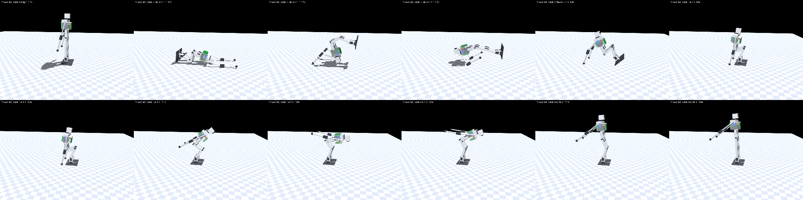

# Get-up from prone with the arms (2026-09-29)

> Dated record for issue #85, with a finding for #84: accurate as of its date;
> the current design is [DESIGN.md](../../DESIGN.md). Simulation only.

Forward falls end prone. The legs-only roll prone → side → supine (design record
§12.1) fails 0/6 on the as-drawn robot with the arms folded up, whatever the
servos ([no3250_getup.txt](no3250_getup.txt)). This study searched for a path
back to standing from prone that uses the arms.

**Result.** It stands, robust 12/12: every robustness condition, at the
searched pace and 3× slower, with the servo overload cutoff enforced and no
servo tripping. The path:

1. brace the left arm forward-down under the chest and raise the right one
   back, out of the way;
2. roll onto the back over the right side with the legs;
3. fold both arms up as it lands;
4. then the recommended seat push.

The study also found a flaw in the scripted get-up from a *backward* fall,
and a fix that is also robust 12/12 (§2).

## 1. Method

The method is getup-decision-2026-09-17.md §4:

- **Search**: a continuous search, never a hand-built grid. A cross-entropy
  (CEM) search runs over five free keyframes. Each keyframe has every leg joint
  and every arm joint, within the as-drawn ranges (DESIGN.md §3), and a move
  and hold time.
- **Physics**: `self_collide=True`, and the deploy servo model under Plan B
  (STS3215 everywhere, P × 4 on the rolls and knees).
- **Plant**: `r5_asdrawn_rom120`, the lumped as-drawn robot with the girdle
  and arms (2.10 kg, hip −120), with the elbow's drawn stops (−100 … +10°).
  The plant otherwise draws ±150.
- **Start**: the state a forward fall leaves. The robot is settled prone, arms
  at the walk's idle pose (shoulder +15°, elbow 0), legs straight.
- **Verification**: every winner is re-run in the six robustness conditions
  (play 3/5°, μ 0.3/0.7/1.0, servos 100/80/65 %), at the searched pace and
  3× slower. The STS overload cutoff is enforced
  ([getup-overload-2026-09-29.md](getup-overload-2026-09-29.md)).

The script is `sim/getup_v6_prone.py`; its docstring lists the families and
modes. The searches ran on mira (12 cores by day, 24 at night) and on the
laptop.

The recorded dead ends were not re-run: a prone push-up to kneel, the one-arm
side-seat push, a third shoulder DOF, and legs-only paths.

## 2. First, a flaw in the scripted seat push: it assumes the arms are already folded

The recommended seat push (DESIGN.md §9) starts with the arms folded up along
the torso (shoulder 180°). Its first keyframe puts them there in 0.5 s.

A real backward fall does not land that way. The robot walks with its arms at
+15°. The shoulder range is −90 … +200°, so every path from +15° to 180°
passes +90°, "straight back". On the back, straight back points into the floor.

The arm sweep levers the robot over its head onto its front, and the get-up
fails **0/6** ([getup_prone_entry_probe.txt](getup_prone_entry_probe.txt)).
Starting with the arms at 0° or −90° fails the same way. Only the start the
script was verified from, arms already at 180°, stands.


That changes both get-ups:

- **From prone**, the roll has to reach the back with the arms *already*
  folded. So the arms must be at 180° before the body lands, while they still
  swing in free air.
- **From supine** (#84), the seat push needs an entry that starts from the
  idle pose.

**The supine entry, searched.** The search covered the arm path and the hip
flexion through four keyframes (lie, prop, sit up, fold), before the
recommended brace. Every candidate was also scored 3× slower, so that the
winner is quasi-static ([getup_prone_entry_search.txt](getup_prone_entry_search.txt),
[getup_prone_entry_search2.txt](getup_prone_entry_search2.txt)).

The first, 9-parameter round found an entry that stands 6/6 at the searched
pace but **0/6** 3× slower: it throws the torso up. The widened round's
propped-on-the-forearms family passes. Restart 1's first population already
held 7 candidates that stood in all four scored runs, so the search was
stopped there. The candidates were regenerated from the search's own random
stream (seed 1007), and the first one verified.

**Prop up on the elbows** does this:

- the arms go to the idle pose with the elbows fully bent (−100°);
- the upper arms rotate to 85° to prop the torso up on the elbows;
- the robot sits up (hip −76°) on the propped elbows;
- the arms fold up (130° / −78°) while the hips tuck to −118°;
- the recommended brace, tuck, push and rise follow.

It stands **12/12**, six conditions × both paces, with the cutoff enforced and
no trip ([getup_prone_verify_entry.txt](getup_prone_verify_entry.txt)). The
shoulder peaks at 2.02 N·m (74 % of stall) at full strength. With the servos
at 65 %, the shoulder reaches 99 % of its weakened maximum, for 0.9 s.


Parameters (degrees, seconds):

```
{"l_sh": 5.86, "l_el": -100.0, "l_t": 1.04, "p_hip": 0.0, "p_sh": 85.19, "p_el": -100.0, "p_t": 1.5,
 "su_hip": -75.67, "su_sh": 80.56, "su_el": -88.05, "su_t": 1.25, "f_hip": -117.69, "f_sh": 130.25,
 "f_el": -77.77, "f_t": 0.88, "b_t": 1.43}
```

## 3. Prone → back: the candidates

**A probe first**, to shape the search; not a verdict. The §12.1 legs-only
roll, with the arms held at a grid of poses
([getup_prone_probe.txt](getup_prone_probe.txt)):

- It fails with the arms at the idle pose (+15), at 0, at 90, and folded (180,
  200). That reproduces no3250_getup.txt.
- It **reaches the back with the arms held forward** (−90, or −45 with the
  elbow bent). Forward is down into the floor when prone, so the arms push
  the chest up and the legs roll the body over.

Every family below was searched by CEM: 6 restarts × 40 iterations × 48
candidates. Restart 0 was seeded from the §12.1 roll; the others were
uniformly random. Every restart's winner is then verified, because the
search's own score is a nominal run and does not rank robustness.

| family | what is free | reaches the back (nominal) | verified |
|---|---|---|---|
| **stow** (candidate 1): arms held at one searched pose, legs roll | the stow pose + every leg joint per keyframe | 6 of 6 restarts | ends with the arms idle. The best winner reaches the back 12/12, but chained onto the §2 entry it stands only 1/6 and 0/6: its roll holds the hip roll and pitch at stall long enough to trip them, and the tripped hips fail the seat push ([getup_prone_roll_stow.txt](getup_prone_roll_stow.txt), [getup_prone_verify_stow_entry.txt](getup_prone_verify_stow_entry.txt)) |
| **stow_fold** (candidate 1, ending folded) | the same, and the roll must end with the arms at 180 | 6 of 6 restarts | **restart 0: 12/12 standing**; restart 2: 11/12; the other four 2–7/12 ([getup_prone_verifyall_stow_fold.txt](getup_prone_verifyall_stow_fold.txt)) |
| onearm: the left arm free, the right arm held, legs free | | 6 of 6 restarts | not chained (ends with the arms idle) ([getup_prone_roll_onearm.txt](getup_prone_roll_onearm.txt)) |
| **arm1_fold** (candidate 3): legs straight, one arm rolls the robot | the left arm per keyframe + the right arm's pose | 5 of 6 restarts | no winner is robust. Three winners reach 9/12 (5/6 at pace ×1, 4/6 at ×3), and every one fails the weak-servo conditions: the rolling shoulder runs at 94–100 % of stall. The other three reach 0–7/12 ([getup_prone_roll_arm1_fold.txt](getup_prone_roll_arm1_fold.txt), [getup_prone_verifyall_arm1_fold.txt](getup_prone_verifyall_arm1_fold.txt)) |

**The first verified path (stow_fold, restart 0 of the nominal search)**
holds the left arm at 73° and the right at 90°: straight back, pointing at the
sky while prone. The legs roll the body over its right side, and the arms fold
to 180° as it lands on its back; then comes the recommended seat push.

- It stands **12/12** ([getup_prone_verify_stow_fold.txt](getup_prone_verify_stow_fold.txt)).
- But the roll drives the hip roll and hip yaw to stall in bursts: up to
  1.7 s above 80 % with the servos at 65 %.
- At 3× slower with weak servos they trip the cutoff, though it still stands.
- It peaks at 15.9 A on the bus in the upper current model.

**So the search was re-run for margin.** `PRONE_MARGIN=1 PRONE_ROBUST=1`:

- every candidate runs with the cutoff enforced, and four times (nominal,
  μ 0.3, servos 65 %, nominal 3× slower);
- it scores its worst run, minus 0.3 × the worst servo's seconds above 80 % of
  stall and 0.5 × any trip.

The log is [getup_prone_roll_stow_fold_robust.txt](getup_prone_roll_stow_fold_robust.txt).
Its restart-1 winner is **the recommended prone path**
(`getup_v6_prone.ROLL_STOW_FOLD`):

- **The arms**: the left arm is braced forward-down under the chest (−77°,
  elbow −93°), the right raised back past vertical (119°, elbow −81°). The
  legs roll the body over the right side. The arms fold up as the back lands.
- **12/12 standing, no trip**, in the six conditions at both paces
  ([getup_prone_verify_stow_fold_robust.txt](getup_prone_verify_stow_fold_robust.txt)).
- **The roll stays below stall.** At full strength the worst servo in the
  whole chain peaks at 62–68 % of stall, the shoulder in the seat push. At
  servos 65 % and 3× slower, a hip pitch spends 0.18 s above 80 %.
- On the stricter duty reading it stands 11/12. With the servos at 65 %, the
  shoulders trip in the seat push part
  ([…_robust_duty.txt](getup_prone_verify_stow_fold_robust_duty.txt)).
- **Current**: 8.8 / 3.8 A peak and 5.5 / 1.9 A over the worst 2 s (upper /
  lower model), against 15.9 / 11.6 A for the first path
  ([current_budget_v6.txt](current_budget_v6.txt)).
- ROBUST_PLACEHOLDER


## 4. Catching a forward fall on the hands (candidate 2): a forward roll instead

The search starts from **standing**, with the arms idle, and kicks the robot
forward at 1.0, 1.5 and 2.0 × its tip speed (0.50 m/s). When the torso pitches
past a searched angle, the reaction begins:

- a searched arm-and-leg "catch" pose;
- three searched push-back keyframes into the seat push's crouch;
- then the seat push's rise.

It ran as a CEM search, 6 restarts × 40 iterations × 48, scored on the worst
kick ([getup_prone_catch_search.txt](getup_prone_catch_search.txt)). One
restart (4) stands at all three kicks.

**It is not a catch on the hands.** Traced over time, the winner does this:

- at 15° of pitch it throws the arms up and drops into a deep squat;
- it lands face-down on its shins and head;
- the push-back keyframes then **roll it forward over its head** onto its
  back, travelling 0.6 m;
- it sits up onto its feet with the forearms on the floor, into the crouch.

Nothing in 6 restarts found a hands-first catch that holds.

Its own rise from that crouch (the seat push's) stands 13/30 at the searched
pace and 0/30 3× slower ([getup_prone_verify_catch.txt](getup_prone_verify_catch.txt)).
The crouch is reached in 25/30 and 29/30. So a second search, `catchrise`,
kept the fall-and-roll fixed and searched the rise: three free keyframes, each
candidate run at three kicks, μ 0.3 and 1.0, and 3× slower
([getup_prone_catchrise.txt](getup_prone_catchrise.txt)).

With that rise the fall-and-roll stands **54/60**
([getup_prone_verify_catch_rise.txt](getup_prone_verify_catch_rise.txt)):

- six conditions × two paces × five kicks (1.0 / 1.5 / 2.0 × the tip speed
  straight ahead, and 1.5 × at ±20°);
- it fails only with the servos at 65 %, at the searched pace (5 of 5), where
  the shoulders trip the cutoff.

It is not the recommended path:

- it is not robust at 65 % strength;
- it needs a reflex triggered at 15° of pitch, which the firmware does not
  have (it disarms on a fall, up_z < 0.4);
- the forward roll puts the robot's weight on its head, where the camera and
  the neck servo are. The model does not score what that does to them.

It is the one path found that starts from the fall itself rather than from a
settled prone robot.



## 5. What it says

1. **Prone has a sim-robust path with margin.**
   - The arms clear the §12.1 leg roll when one braces forward under the
     chest and the other is raised back. They blocked it when both lay folded
     up beside the head.
   - Folding the arms up as the body lands gives the seat push its start.
   - Searched for margin, the roll no longer needs stall anywhere.
2. **The scripted seat push only works if the arms are already folded.**
   - From a real backward fall they are not, and the fold flips the robot onto
     its front.
   - The propped-on-the-elbows entry fixes it, robust 12/12 on both readings
     of the servo's load. This belongs in #84's hardware sequence.
3. **A one-arm roll is torque-bound**: 9/12, at stall. It is not the path.
4. **A search's nominal winner is not a robust winner.** 1 of 6 nominal-scored
   restart winners verified 12/12. Scoring the worst of four runs, with the
   cutoff enforced, found one that holds 12/12 with margin. Verify every
   restart's winner.

**What the firmware needs** (FIRMWARE track, #81/#84):

- A fall that ends prone is now recoverable. The fall guard currently
  disarms the robot at up_z < 0.4. The recovery would start from the disarmed,
  settled state, with the robot re-armed into the stow pose. That is a
  sequencing decision, not a new control law.
- The sequences are keyframe lists at the shaper's pace, like the seat push.

**What the bench owes:**

- the same "one motion per go, on the floor" rule;
- the seat-push entry first (supine is the more common landing), then the
  prone roll;
- log the hip and shoulder loads (Present Load / Current) through the roll
  and the push.

## Files

- `sim/getup_v6_prone.py`:
  - `probe` and `entryprobe`;
  - `rollsearch <family>`, `entrysearch` and `catchsearch`;
  - `verify` and `verifylog`;
  - `render`, which writes an mp4 and a contact sheet (the mp4 is not
    committed).
- Logs: `getup_prone_*.txt`. Figures: `figs/getup_prone_chain_sheet.png`,
  `figs/getup_supine_entry_sheet.png`, `figs/getup_supine_armsidle_flip_sheet.png`.
