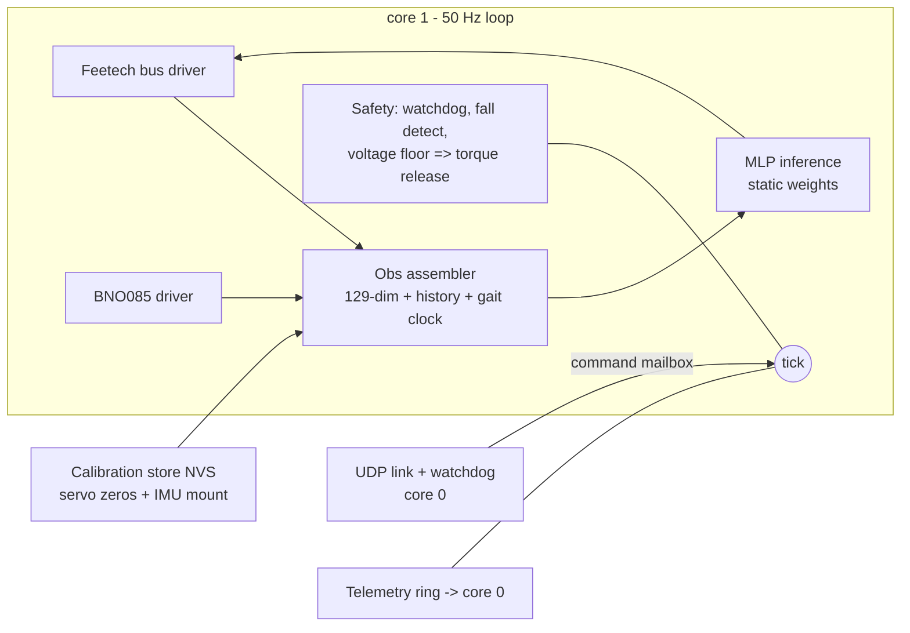

# Firmware design — Waveshare ESP32 servo board

**Status:** design, 2026-07-22. No firmware exists yet; this document defines
what gets built so bring-up day is "flash and calibrate," not "start coding."
Companion docs: [control-channel.md](control-channel.md) (the wireless
protocol this firmware implements), [wiring.md](wiring.md) (electrical + bus
timing), [controls-and-training-overview.md](controls-and-training-overview.md)
(what the policy is).

## 1. Job description

The board runs the robot. Once per **20 ms tick (50 Hz)** it must:

1. read all 8 servo positions (+ velocities derived or read) off the
   1 Mbaud Feetech bus,
2. read the BNO085 (fused orientation → gravity vector, plus gyro rates),
3. assemble the policy observation exactly as the simulator defines it,
4. run the policy network,
5. write 8 position targets back to the bus (sync write),
6. service the wireless command link and its watchdog (link dead ⇒ torque
   release — the robot goes limp rather than cooking servos; it is 34 cm
   tall and falls better than it overheats).

Non-goals for v1: navigation/odometry (command-conditioned only — field
standard, see plan v2), camera anything, OTA model updates mid-run, logging
at full rate.

## 2. Language decision: C++17 on ESP-IDF

| Option | Verdict | Why |
|---|---|---|
| **C++17 (ESP-IDF)** | **chosen** | First-class on ESP-IDF; the vendor ecosystem we want to reuse (Waveshare's ST3215/SCServo servo library, the Adafruit BNO08x/sh2 driver) is already C++; zero-cost abstractions fit a hard-real-time loop (namespaces, `std::array`, templates for the MLP dims — no heap needed); single toolchain, no glue. |
| C | viable fallback | Everything works, but we'd hand-roll abstractions C++ gives free, and we'd wrap the C++ servo lib anyway. Used at the boundary where ESP-IDF APIs are C. |
| Rust (esp-rs) | rejected for v1 | Genuinely maturing, but: Xtensa needs Espressif's forked toolchain; every driver we'd otherwise reuse (SCServo, BNO055) would be rewritten; and our safety story is dominated by *timing* and *torque-release semantics*, not memory bugs — the loop is small, statically allocated, and heap-free after init, which mutes Rust's core advantage. Worth revisiting if the firmware grows past ~5 kLOC. |
| Go (TinyGo) | rejected | No mature ESP32/Xtensa support, and a garbage collector inside a 20 ms hard loop is disqualifying regardless. |

House rules that buy most of Rust's safety in C++: **no heap after init**
(all buffers static), `-Werror -Wall -Wextra`, no exceptions/RTTI, every
shared datum between cores goes through a FreeRTOS queue or an atomic,
fixed-size types only, and the pure modules (§5) compile on the host under
sanitizers.

Framework: **ESP-IDF, not the Arduino core** — deterministic task control,
proper dual-core pinning, and first-party UART/I2C/timer APIs. Arduino-only
vendor snippets get ported into thin IDF components.

## 3. Hardware assumptions (verify on delivery)

- Waveshare ESP32 servo-driver board (BOM): ESP32-WROOM class — **~520 KB
  SRAM, no PSRAM assumed**, single-precision HW FPU, dual LX6 cores.
- Feetech STS3215 bus @ 1 Mbaud half-duplex on one UART (board has the
  direction circuitry).
- **IMU: QMI8658C, on the General Driver board itself** — 2026-08-14,
  superseding the external GY-BNO085 breakout (and the BNO055 before it).
  No part to buy, no carrier to print, no wires: it is already on the
  board's I²C bus at **0x6B, GPIO 32/33**, verified at 400 kHz alongside
  the AK09918C (0x0C) and INA219 (0x42). *(Bench note: the BMP280 our own
  notes place at 0x77 did NOT answer — it is not on this board revision.)*

  **The consequence is real work, not a driver swap.** The BNO085 was a
  sensor *hub* that fused on-chip and returned a quaternion; the QMI8658C
  is raw. The fusion moves onto the ESP32 — `imu::Fusion`, a complementary
  filter over accel + gyro, host-tested in `firmware/host/test_fusion.cpp`.

  Two things that bite, both measured rather than assumed:

  - **Gyro bias is not optional.** Untrimmed zero-rate offset on this part
    is ~0.45 rad/s on x. Against the filter's 0.5/s correction gain that
    settles at sin(e) = 0.9 — about **64° of steady-state attitude error**.
    Bias is calibrated by `imu bias` and persisted to NVS; a boot without
    it is reported, not silently tolerated.

    **Calibrate it on the robot, in the standing pose — not on the bench.**
    Bias is orientation- and temperature-dependent, so it does not survive
    being moved. Measured 2026-08-14: a calibration taken flat on a desk,
    then bolted upright into the pelvis, was off by 0.0187 rad/s on the
    sensor's y axis. The mount maps sensor y onto body z, so that landed
    entirely in **yaw — the one axis gravity cannot correct** — as ~1°/s of
    heading drift, 29° over a 30 s run, with the tilt magnitude meanwhile
    rock steady. Recalibrating in place cut it to 0.07°/s (2.2° per 30 s).
    A drift of constant `up[2]` with a rotating horizontal component is the
    signature; `imu` prints the drift estimate directly. Measured end state
    on the standing robot: **0.0038 over 30 s, which is the noise floor** —
    it wobbles rather than creeping, so there is no systematic yaw error
    left to speak of. That is ~100x better than the bench calibration.
  - **The AttitudeEngine does not work on this silicon.** The part
    advertises an on-chip 1 kHz coning/sculling-compensated quaternion
    increment, which would have been strictly better than 50 Hz sampling.
    Enabling it (CTRL7 sEN + CTRL6 sMoD, `CTRL_CMD_REQ_MoD`) leaves the
    dQ/dV registers holding **static bytes that never change between
    reads** and decode to |dQ| = 0.05 and dV = −25.7 m/s at rest. That is
    uninitialised memory, not motion. Our datasheet copy is QST rev 0.6,
    stamped ADVANCE INFORMATION, and the part reports revision 0x7C rather
    than the documented 0x79. `imu ae` re-runs this check in one command.
    The driver probes for AE at init and falls back to the raw path on its
    own, so if a later part does support it, nothing else changes.

  **Mount, measured on the robot 2026-08-14:** `0.505654 0.494116 0.485838
  0.513931` (w x y z, sensor→body), in NVS via `imu mount`. The chip's **+Y
  points up** and its **+Z points FORWARD** — note the second half, because
  CAD reasoning from "components face aft" (`cad/dimensions.py:999`) gives
  the opposite and is *wrong*. Gravity alone cannot tell the two apart: they
  differ by 180° about the vertical, and both map an upright stance to
  (0,0,1) exactly. Only a deliberate tilt separates them. Leaning the robot
  forward must send `projgrav.x` negative and `up.x` positive; with the
  flipped mount it reads a forward lean as a backward one, and the policy
  corrects the wrong way on its first step. `imu` prints both vectors and
  the filter quaternion so the check is a look, not an argument.

  The BNO085 stays the documented upgrade path onto header P1 (0x4A/0x4B
  are reserved for it) — a driver change plus one 4-wire cable, no CAD.
- WiFi UDP for the command link (the protocol in control-channel.md).

## 4. The 20 ms tick budget (from wiring.md's analysis)

| Step | Budget | **Measured 2026-07-26** | Notes |
|---|---|---|---|
| Sync-read servo positions | ~3.5 ms (8) / ~4.3 ms (10) | **2.80 ms** | one SYNC READ transaction + replies @1 Mbaud, 10 servos |
| QMI8658C read + fusion | ~0.5 ms | **0.47 ms** | one 12-byte I²C burst @400 kHz plus a quaternion update. Measured 2026-08-14 over 50 reads (`imu`), first time this row has ever been anything but an estimate — nothing was fitted before |
| Obs assembly + history push | ~0.1 ms | **0.02 ms** | pure math |
| Policy inference | ~2–4 ms | **0.88 ms** | placeholder 147→32→32→20; see caveat below |
| Sync-write targets | ~0.7 ms | **0.07 ms** | one SYNC WRITE, no replies |
| Link service + watchdog | ~0.2 ms | **0.07 ms** | drain mailbox, stamp liveness |
| **Total** | **~8–10 ms** | **3.9 ms typ / 4.58 ms worst** | 40 s soak, 3922 ticks, **0 late**, servo_err 0x0000 |

The budget was pessimistic almost everywhere; real headroom in the 20 ms tick
is ~4.4×, not ~2×.

**Two caveats on that number.**

1. **Inference will grow.** 0.88 ms is the *placeholder* net (147→32→32→20,
   ~6.4 k MACs). §6's recommended distilled 128×128 is ~37.8 k MACs — roughly
   6× — so expect ~5 ms and a ~8 ms total. Still inside budget, but the
   4.4× headroom becomes ~2.5×. Worth re-measuring the moment real weights
   exist. (0.88 ms for 6.4 k MACs on a 240 MHz FPU is itself ~30× slower than
   one-MAC-per-cycle, which suggests the weights are being fetched from flash
   through the cache rather than sitting in IRAM — an easy win if inference
   ever becomes the binding constraint.)
2. **The IMU line is untested.** Nothing is fitted, so the stub returns
   instantly; the ~1.0 ms estimate stands unverified.

### The bug this table replaced

The first hardware run measured **29.9 ms** for the sync read alone — a 32 ms
tick against a 20 ms period, every tick late, and yet `servo_err 0x0000`.

`Bus::syncReadFeedback` asked `port_.read()` for *the whole remaining buffer*,
and `uart_read_bytes()` returns only when it has the requested count or the
timeout expires. The request could never be satisfied, so every read slept out
its full `reply_timeout_us × n` = 30 ms deadline — while the ten replies had
actually landed in ~1.4 ms and parsed fine, which is exactly why no fault bit
was ever set. The fix is to request only the bytes still outstanding
(`(n - answered) * kSyncReplyLen`), capped by buffer space.

**The lesson generalises:** a phase that always costs the same as its timeout
is not slow, it is waiting on a condition that cannot occur. Per-phase timing
found this in one run after a session of guessing at it.

Core split: **core 1 = control task only** (pinned, highest priority,
tick-timer driven, owns bus + I2C). **Core 0 = WiFi stack, UDP link,
telemetry, CLI** — communicates with core 1 via a single-slot command
mailbox (latest-wins) and a telemetry queue. Nothing on core 0 can block
the loop.

### FreeRTOS usage (brief)

ESP-IDF *is* a FreeRTOS application — the dual-core SMP FreeRTOS fork is
the substrate under everything (WiFi stack included). We use it
deliberately and minimally:

- **Tasks (all created once at init, statically allocated):**
  `ctrl` (core 1, highest app priority — the entire §1 loop),
  `link` (core 0, blocks on the UDP socket, decodes commands),
  `housekeeping` (core 0, low priority — telemetry drain, CLI, voltage).
  WiFi/LwIP tasks are IDF-managed and stay on core 0, so nothing they do
  can preempt `ctrl` on core 1.
- **Tick pacing:** a hardware `esp_timer` fires every 20 ms and sends a
  **direct-to-task notification** to `ctrl` (`vTaskNotifyGiveFromISR`) —
  the task blocks on `ulTaskNotifyTake`, giving jitter of microseconds,
  not scheduler ticks. `ctrl` timestamps each wake and logs any overrun.
- **Inter-core traffic:** the command mailbox is a **length-1 queue
  written with `xQueueOverwrite`** (latest command wins; stale commands
  can never pile up), read non-blocking by `ctrl` each tick. Telemetry
  goes the other way through a drop-oldest ring buffer; the watchdog
  liveness stamp is a single `std::atomic<uint32_t>` tick count. **No
  mutexes anywhere in the control path** — every shared object has one
  writer.
- **Supervision:** the IDF Task Watchdog is armed on `ctrl`; a tick
  overrunning ~2 periods trips torque-release before reset, and the
  link-watchdog (protocol-level, from control-channel.md) is checked
  inside `ctrl` itself so its timeout action runs in the loop that owns
  the bus.
- **Not used:** dynamic task creation after init, software timers in the
  control path, `vTaskDelay` for pacing (drifts), or core-0 work of any
  kind that holds a resource `ctrl` needs.

## 5. Modules

- **bus/**: Feetech SCS protocol — SYNC WRITE targets, SYNC READ positions,
  torque enable/release register broadcast, per-servo error flags. Port of
  Waveshare's C++ library into an IDF component with our timing.
- **imu/**: QMI8658C over I²C plus the attitude fusion the part does not
  do for us. Split three ways on purpose: `imu.cpp` (frame maths) and
  `fusion.cpp` (the complementary filter) are pure and host-tested;
  `qmi8658_idf.cpp` is the only file with I²C in it. Mounting rotation and
  gyro bias both come from NVS (`ImuCalBlob`) — on this robot the board
  stands vertical and transverse in the pelvis recess, so the mount is a
  ~90° rotation, not a trim.
- **obs/**: byte-exact reimplementation of the simulator's `_obs()` frame
  (encoders, encoder-derived velocities, gravity vector, gyro, previous
  action, gait-clock sin/cos advanced on-board, command channels) + the
  3-frame history ring. The obs SPEC (ordering, scaling, history depth) is
  exported from the sim as a generated header so it cannot drift by hand.
- **policy/**: static float32 MLP (weights compiled in as a generated
  header from the training checkpoint; normalizer folded into layer 0).
  Supports up to 3 resident specialist nets (loco/skills/getup) selected by
  command type; tanh/identity activations to match brax exactly.
- **link/**: C port of `link/protocol.py` decode + the Watchdog semantics,
  validated against golden vectors generated by the Python reference.
- **safety/**: link-watchdog timeout ⇒ torque release; tilt beyond the
  policy's trained envelope ⇒ (v1) torque release, (later) switch to the
  getup specialist; pack-voltage floor ⇒ release + beep.
- **idle torque-off (power saving):** when the command is *stand still* and the
  robot has been quiet for a short debounce, **release servo torque** to stop
  the standing servos drawing hold current, then **re-engage** on the next
  motion command or on a disturbance (wake-on-command, or wake-on-IMU-delta:
  a tilt/gyro excursion past a small threshold re-asserts torque and hands
  back to the loco policy). The CPU referee's `stand_off` scenario says this
  is feasible in sim — the biped stays standing on passive joint friction
  alone with drift < 10 cm and essentially zero electrical draw (vs ~0.3 W
  holding powered). **Caveat — measured-on-arrival:** the sim models the
  unpowered STS3215 as a raised joint frictionloss (`off_frictionloss`, est.
  0.35 N·m from the ~1:345 gear-train class); feasibility flips *off* below
  ~0.25 N·m.

  **Status 2026-07-27: v1 ships with idle torque-off DISABLED.** Powered
  friction measured **0.235 N·m** (8.0 % of stall; four servos, steady
  200 steps/s, tight spread). That is a *lower bound* on the unpowered
  backdrive figure — back-driving a ~1:345 reduction is far less efficient
  than forward-driving it — and it sits too close to the 0.25 N·m threshold
  to call either way. No bench tools for the spring-scale test, and none are
  needed: the deciding experiment is this scenario itself, run on the
  assembled robot. Stand it up, release torque, watch. Holds ⇒ ship the
  feature; collapses or drifts > 10 cm ⇒ do not. The robot's own ~0.9 kg
  applies exactly the joint torques in question. Fold it into the on-target
  bring-up (§7) torque-release drills; see docs/bringup-day1.md §4.
- **cal/**: NVS-stored per-servo zero offsets + IMU mounting quaternion;
  a guided calibration CLI over USB serial (ToddlerBot's zero-point lesson).

## 6. Fitting the network (decision needed before export)

The current training nets (512,256,128) are ~232k params ≈ **930 KB fp32 —
they do not fit** WROOM SRAM. Options:

1. **Distill to a deployment net (~128×128 ≈ 88 KB) — recommended.** Train
   big, distill small (sim/distill.py machinery exists); 3 specialists
   resident = ~264 KB, fine. Inference ~1 ms.
2. int8 quantization of the big net (~232 KB) — fits, but quantization
   error on a balance-critical policy needs its own referee pass.
3. PSRAM board variant — hardware change; keep as escape hatch.

Either way the **referee gates the deployed artifact**: the exported
(distilled/quantized) net re-runs the full scenario suite on the CPU
referee before it is ever flashed.

## 7. Deployment + test pipeline (host-first, hardware-last)

1. `sim/export_policy.py` (to be written): checkpoint → obs-spec header +
   weights header + golden I/O vectors (1000 obs→action pairs from JAX).
2. **Host builds** of obs/, policy/, link/ as native binaries with unit
   tests: policy output must match JAX golden vectors to 1e-6; protocol
   decode must match Python reference vectors; obs assembler tested against
   recorded sim traces. All runnable in CI today, zero hardware.
3. On-target bring-up order (when servos arrive): bus echo test → single
   servo → 8-servo sync loop timing capture → IMU cal → torque-release
   drills → policy loop with props off the ground → floor.

## 7b. Changelog — decisions made while building v1 (2026-07-26)

The firmware skeleton now exists (`firmware/`, see its README for what is real
vs. scaffolded). Five things in this document turned out to be wrong or
under-specified; recorded here rather than silently edited above.

- **Pinout confirmed** against Waveshare's schematic, user manual and firmware
  source (URLs in `firmware/main/board.h`): servo bus is UART1 at 1 Mbaud with
  **GPIO 18 = RX, GPIO 19 = TX**; I2C is GPIO 21/22 at 0x3C for a 128×32
  SSD1306. Two corrections to wiring.md: the half-duplex direction is switched
  **in hardware** (a PNP off the TX line drives the transceiver OE pins — there
  is no direction GPIO), and **there is no IMU and no battery-voltage ADC on
  the board**. Pack voltage therefore comes from a servo's register 62 at 0.1 V
  resolution, and the BNO085 is an external breakout sharing the OLED's pins.
- **Joint count is 10, not 8.** All sims run on `bimo_biped_v3yaw.xml`, so the
  obs, action vector and bus map are 10-wide. It is a compile-time constant in
  a generated header (`obs/obs_spec.h` from `tools/gen_obs_spec.py`), not a
  literal. wiring.md's "maps to IDs 1–8 with no permutation table" no longer
  holds: the sim's action order starts at `L_hip_yaw` (index 0) but that servo
  is bus ID 9, so there **is** a permutation and it is generated and tested.
- **Obs is 147-dim, not 129** — §5's figure predates the plant change. The
  deployed `loco_v5t` frame is 49 wide (10 q + 10 dq + 3 up + 3 linvel + 3 gyro
  + 10 prev-action + 1 height + 2 phase + 7 ext-cmd) × 3 history frames. Torso
  linear velocity and height are hard zeros, matching the `imu_obs=True`
  training config.
- **§5's "tanh/identity activations to match brax exactly" is wrong.** brax's
  `make_ppo_networks` defaults to **`linen.swish`** for hidden layers; the
  output layer is linear and `2 × action_size` wide (mean ‖ log-std), and the
  only tanh is `NormalTanhDistribution.mode() = tanh(mean)` at inference. The C
  port implements that, checked against numpy golden vectors.
- **§6 stands, and it is the v1 blocker for the policy.** The deployed net is
  (512, 256, 128); the firmware ships a placeholder weights header at the real
  147→…→20 widths so the forward pass and its test harness are real code. The
  distillation + `sim/export_policy.py` are the v2 seam.
- **Bus ownership** is not in §4: the bring-up CLI lives on core 0 but needs
  the bus. Rather than a mutex in the control path, the board boots into a
  `bench` mode where `ctrl` releases torque and gives up the bus, and `run`
  hands it back. Single owner at all times, no lock.

## 7c. Command shaping — C2 targets + goal-speed streaming (2026-08-02)

The v1 act path wrote each 50 Hz position target raw: goal time 0, goal speed
0 (**unlimited**), acceleration 0. The servo executed every tick as a
max-speed slam toward the new target (~3000 steps/s, measured 2026-07-26),
arriving mid-tick and stopping dead — a 50 Hz velocity square wave on every
joint. That is the "jerking": velocity was discontinuous at every tick and
the acceleration impulsive.

Two changes, both in the components the SIL library compiles verbatim, so
sim validation covers the deployed plant:

- **`obs::CommandShaper`** (`obs/actuation.h`): the policy's raw targets go
  through three cascaded first-order lags, all poles at 10 Hz. Each stage is
  the exact ZOH discretization (stable for any pole/dt, no overshoot, output
  stays in the hull of its inputs), and each adds one derivative of
  smoothness — the commanded trajectory has continuous velocity **and
  acceleration** (finite jerk, i.e. the second derivative is continuous).
  The shaper reseeds from **measured** q on every torque (re)engage or bus
  handover, so the first shaped target after an engage can never be a jump.
  `prev_action` stays the RAW policy output — that is what the policy saw in
  training.
- **Per-servo goal speed** (reg 46, `Bus::syncWritePositions` overload): each
  SYNC WRITE carries the speed that closes the gap from the joint's measured
  position to the shaped target in one tick, ×1.25 headroom, floored at 50
  (never 0 — 0 means unlimited) and clamped at the servo's 3400. While
  tracking this is the trajectory's own speed; under a disturbance the error
  term grows it back to the old max-speed behaviour, so smoothing costs no
  stiffness.

The pole is the plant-vs-policy tradeoff and was picked by closed-loop
referee sweep through the SIL stack (loco_v8foot, 8 seeds): `stand_10s` and
`line_1m` 8/8 at every pole tried; `goal_home` python 7/8 vs SIL raw 5/8,
16 Hz 7/8, **10 Hz 6/8**, 8 Hz 4/8 (outside the parity budget — too much lag
for the policy). 10 Hz is the strongest smoothing that keeps referee parity.
Live-tunable from the CLI: `shape [hz]`, 0 = off (raw/legacy); the SIL twin
is `sil_set_shaper()` and the pytest gate re-runs the referee against it.

## 7d. §6 closed — the real weights are compiled in (2026-08-03)

The v1 policy blocker is done. Option 1 (distil, not quantise) was taken as
written; nothing in §6 needed revising.

- **`sim/mjx/distill_student.py`** is the brax-era replacement for the day-5
  `sim/distill.py`: DAgger on the GPU MJX env, rebuilt from the teacher run's
  own `config.json` so the state distribution is the plant/DR/command
  curriculum the teacher trained on. The label is the teacher's deterministic
  action, `tanh(mean)`, and the regression is done in tanh space — a saturated
  logit of 4 and one of 40 are the same command, and only the first is
  learnable at 128 wide. Round 0 is pure BC; from round 1 a decaying fraction
  β of the env slots are teacher-driven and the rest run the student's own
  actions **for whole trajectories**, which is what puts its compounding
  mistakes in the dataset.
- **The teacher's normaliser is reused verbatim and frozen.** The firmware net
  consumes normalised obs and ships the normaliser beside the weights; a
  refitted one would mean re-deriving the frozen-channel analysis
  (sil-harness.md finding 2) for no gain.
- **`loco_v12knee_warm` (512, 256, 128) → `loco_v12knee_warm_s128`
  (128, 128)**: 38 036 weights, 150 KB fp32, 1.57 M env steps of DAgger over
  12 rounds, holdout action MAE 0.033 on a ±1 action.
- **The referee gate was the point, and the student did not merely survive
  it.** Both columns, 8 seeds, 11 scenarios, hardware-claim plant:

  | column | teacher | student (128,128) |
  |---|---|---|
  | python | 51/88 | **52/88** |
  | SIL (firmware stack) | 37/88 | **48/88** |

  The python column is a wash (`stand_off` 4→6 and `line_1m` 6→7 pay for
  `backward_1m` 8→7 and `goal_home` 1→0). The **SIL column is +11 seeds**, and
  that is the number that matters, because it is the one the robot runs.
  Distillation acted as a regulariser against exactly the plant/quantiser
  mismatch the SIL leg exposes: `stand_off` 3→8, `backward_1m` 1→3,
  `line_rough` 5→7, `line_1m` 4→6. Watts fell 10.4→8.4 and falls 34→22 %.
  The four goal-relative scenarios (`turn_180`, `square_return`,
  `circle_return`, `goal_home`) are 0/8 for teacher and student alike — a
  teacher deficit, faithfully inherited, not a distillation loss.
- **The student is a normal brax run dir.** It is saved as
  `(normalizer, policy, value)` in `params.pkl`, so `eval_precision.py`,
  `eval_precision.py --sil` and `tools/export_policy_weights.py` load it with
  no shim — `_hidden_sizes()` already derived the widths from the checkpoint.
- **`tools/gen_policy_weights.py` grew a real mode** (`--run <run>` /
  `--silw <path>`) that reads the exported `.silw`, cross-checks its sidecar,
  and emits the same header contract with `kWeightsArePlaceholder = false`
  plus a new `kWeightsRun`. `test_policy` now asserts both, that
  `kWeightsRun == obs::kRunName`, and that the net is neither the scaffold nor
  degenerate. The placeholder is still regenerable (`--placeholder`) and turns
  that test red on purpose; the tool no longer has an argument-less default,
  because that default used to be "silently un-deploy the policy".
- **Flash, not SRAM, as §6 predicted.** The image went 0x3cce0 → 0x60d20
  (62 % of the app partition still free); the weights are `constexpr` in flash
  `.rodata` and DRAM did not move (17.5 %).
- **Gait clock confirmed, not changed.** `ctrl_task.cpp` runs
  `obs::GaitClock g_clock(1.5f)`; training draws `gait_freq ~ U(1.25, 1.75)`
  per episode in both envs, so 1.5 Hz is the midpoint of the distribution the
  policy was trained across, and it is what both SIL columns were scored at.
  §8's "fixed 1.5 Hz vs commanded" question is unaffected.

## 7e. `obsdump` — reading the observation off the armed robot (2026-08-30)

The deployed policy walks in SIL and produces garbage motion on hardware.
SIL (docs/sil-harness.md) runs the firmware's **own** assembler, history ring,
quantiser and network, so every layer from the observation to the servo write
is already covered by a green gate. The one thing it cannot supply is the
numbers the **real sensors** put into `obs::Inputs`. A degrees-for-radians
scale error, a sign flip, a swapped IMU axis and a permuted joint index all
look identical from outside — the loop runs, the servos move, the robot falls
— so the difference has to be **measured**, not reasoned about.

- **`main/obs_dump.h`** publishes, once per tick and only when a dump is
  enabled, one `ObsRecord`: `tick`, the raw `obs::Inputs` (`q[10]`, `dq[10]`,
  `up[3]`, `gyro[3]`, `phase`, `cmd[7]`) **and** the assembled `kFrameDim`
  frame. Both halves, because they answer different questions: the raw block
  catches a sensor/unit fault, the frame block catches an assembler fault
  (a section at the wrong offset, a stale `prev_action`).
- **Ownership follows §4 exactly.** ctrl writes the buffer and only *reads*
  the mode; housekeeping writes the mode (`obsdump on|off|once`) and only
  *reads* the buffer. No lock in the tick, no allocation. The payload is too
  big to tear harmlessly — tick *t*'s `q` beside tick *t+1*'s frame would
  manufacture the very disagreement the dump exists to find — so unlike
  `TelemetrySnapshot` it is **double-buffered**: two slots plus a sequence
  counter, ctrl writes the slot the reader is not in, and a copy the writer
  overran is **dropped**, never reported torn.
- **The publish is the last thing in the tick**, after the servos already have
  their targets: a diagnostic must never sit between sensing and acting. Off
  it costs one relaxed load; on it costs ~350 bytes of copy, which lands in
  `stat`'s `us_other` rather than in any budgeted phase line.
- **Only while armed.** In bench mode `ctrl` warms the attitude filter and
  returns — no servo read, no `assembleFrame`, no observation. `obsdump on`
  while benched therefore refuses **and says that**, rather than streaming
  zeros that look like a dead sensor.
- **The wire format is text, on the tether, beside the binary telemetry.**
  `OBSHDR,tick,q_L_hip_yaw,…` once when a dump is enabled, then
  `OBS,<tick>,<83 values>` at **5 Hz** (a ~1.1 kB record at the loop's 50 Hz
  would be 550 kB/s into an 11.5 kB/s link; 5 Hz is about half of it, leaving
  room for the 10 Hz telemetry and typed commands). Both the records and the
  telemetry frames are written by the **one** housekeeping task, so a record
  is never split by a binary frame — but binary bytes do land between records,
  which is why the host tool finds records by their `OBS,` tag rather than by
  position. The WiFi wire format is untouched.
- **Column names come from the generated obs spec**, including the frame block
  (`f_q_*`, `f_dq_*`, `f_up_*`, `f_linvel_*`, `f_gyro_*`, `f_pa_*`,
  `f_height`, `f_sin`, `f_cos`, `f_cmd_*`). The host tool keeps no second copy
  of the joint order and refuses a capture with no header rather than guessing
  it.
- **`tools/obs_capture.py`** drives it: `off`, `on`, read for N seconds, `off`,
  write `captures/obs_<ts>.csv`, then print per-channel min/max/mean/RMS.
  `--compare A.csv B.csv` prints the per-channel **RMS ratio** of two
  captures — the hardware-vs-sim test, where ~57.3 is degrees where radians
  belong, ~1 is agreement, and 0 on one side is a channel not reaching the
  observation at all. Generating the sim-side capture is a separate job; the
  comparison mechanics work on any two CSVs the tool wrote. `--replay` parses
  a saved console log with no serial port, which is how the parser is
  exercised off-hardware.
- **Host gate:** `firmware/host/test_obsdump.cpp` covers the double buffer
  (empty read, round trip, the slot flip, sequence staleness) and the CSV
  writer (column count against `kObsDumpCols`, value round trip, header names
  against the generated offsets, truncation refusing rather than clipping, the
  worst-case line fitting, NaN surviving).

## 8. Open questions

- Exact Waveshare SKU on the BOM → confirm SRAM/PSRAM and UART wiring.
- Encoder velocity: read from servo registers vs finite-difference on
  positions (sim uses true qvel; ToddlerBot finite-differences — decide
  during sys-ID, and match the sim's DR to whichever ships).
- Whether specialist switching needs hysteresis/blending at boundaries
  (v1: switch only through a stand command).
- Gait-clock frequency source on hardware (fixed 1.5 Hz vs commanded).
