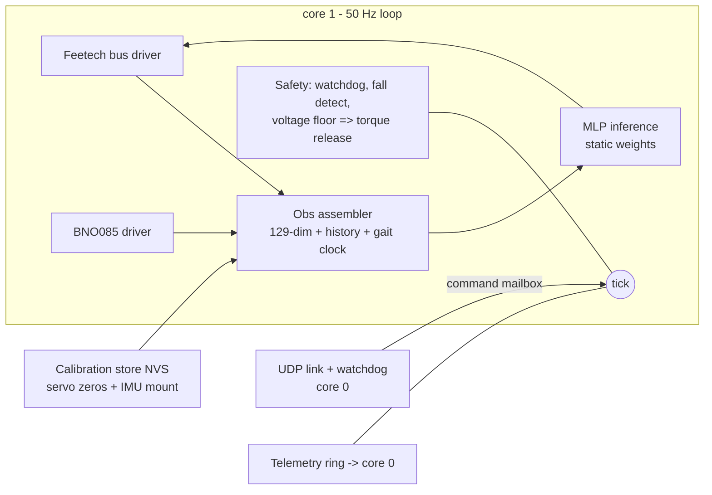

# Firmware design — Waveshare ESP32 servo board

**Status:** design, 2026-07-22. No firmware exists yet; this document defines
what gets built so bring-up day is "flash and calibrate," not "start coding."
Companion docs: [control-channel.md](control-channel.md) (the wireless
protocol this firmware implements), [wiring.md](wiring.md) (electrical + bus
timing), [controls-and-training-overview.md](controls-and-training-overview.md)
(what the policy is).

## 1. Job description

The board runs the robot. Once per **20 ms tick (50 Hz)** it must:

1. read all 8 servo positions (+ velocities derived or read) off the
   1 Mbaud Feetech bus,
2. read the BNO085 (fused orientation → gravity vector, plus gyro rates),
3. assemble the policy observation exactly as the simulator defines it,
4. run the policy network,
5. write 8 position targets back to the bus (sync write),
6. service the wireless command link and its watchdog (link dead ⇒ torque
   release — the robot goes limp rather than cooking servos; it is 34 cm
   tall and falls better than it overheats).

Non-goals for v1: navigation/odometry (command-conditioned only — field
standard, see plan v2), camera anything, OTA model updates mid-run, logging
at full rate.

## 2. Language decision: C++17 on ESP-IDF

| Option | Verdict | Why |
|---|---|---|
| **C++17 (ESP-IDF)** | **chosen** | First-class on ESP-IDF; the vendor ecosystem we want to reuse (Waveshare's ST3215/SCServo servo library, the Adafruit BNO08x/sh2 driver) is already C++; zero-cost abstractions fit a hard-real-time loop (namespaces, `std::array`, templates for the MLP dims — no heap needed); single toolchain, no glue. |
| C | viable fallback | Everything works, but we'd hand-roll abstractions C++ gives free, and we'd wrap the C++ servo lib anyway. Used at the boundary where ESP-IDF APIs are C. |
| Rust (esp-rs) | rejected for v1 | Genuinely maturing, but: Xtensa needs Espressif's forked toolchain; every driver we'd otherwise reuse (SCServo, BNO055) would be rewritten; and our safety story is dominated by *timing* and *torque-release semantics*, not memory bugs — the loop is small, statically allocated, and heap-free after init, which mutes Rust's core advantage. Worth revisiting if the firmware grows past ~5 kLOC. |
| Go (TinyGo) | rejected | No mature ESP32/Xtensa support, and a garbage collector inside a 20 ms hard loop is disqualifying regardless. |

House rules that buy most of Rust's safety in C++: **no heap after init**
(all buffers static), `-Werror -Wall -Wextra`, no exceptions/RTTI, every
shared datum between cores goes through a FreeRTOS queue or an atomic,
fixed-size types only, and the pure modules (§5) compile on the host under
sanitizers.

Framework: **ESP-IDF, not the Arduino core** — deterministic task control,
proper dual-core pinning, and first-party UART/I2C/timer APIs. Arduino-only
vendor snippets get ported into thin IDF components.

## 3. Hardware assumptions (verify on delivery)

- Waveshare ESP32 servo-driver board (BOM): ESP32-WROOM class — **~520 KB
  SRAM, no PSRAM assumed**, single-precision HW FPU, dual LX6 cores.
- Feetech STS3215 bus @ 1 Mbaud half-duplex on one UART (board has the
  direction circuitry).
- **IMU: GY-BNO085 (Teyleten, Amazon B0CL26J81F)** — user decision
  2026-07-22, replacing the earlier BNO055. Same on-chip fusion role but a
  DIFFERENT protocol: **SH-2 sensor-hub** (not a register map), I2C addr
  0x4A/0x4B @ 400 kHz, rotation-vector + calibrated-gyro reports at up to
  400 Hz. Driver: CEVA's reference `sh2` C library (as wrapped by the
  Adafruit BNO08x port) as an IDF component. Simpler fallback if SH-2
  fights us: **UART-RVC mode** (fixed 100 Hz yaw/pitch/roll stream,
  trivial parsing) — but it omits the gravity vector's full quaternion, so
  SH-2 is the primary plan. Board outline/holes unverified until the part
  arrives (carrier reprint expected — see cad/dimensions.py TODO).
- WiFi UDP for the command link (the protocol in control-channel.md).

## 4. The 20 ms tick budget (from wiring.md's analysis)

| Step | Budget | **Measured 2026-07-26** | Notes |
|---|---|---|---|
| Sync-read servo positions | ~3.5 ms (8) / ~4.3 ms (10) | **2.80 ms** | one SYNC READ transaction + replies @1 Mbaud, 10 servos |
| BNO085 read (SH-2 reports) | ~1.0 ms | *0.01 ms (stub)* | no IMU fitted yet — this line is still an estimate |
| Obs assembly + history push | ~0.1 ms | **0.02 ms** | pure math |
| Policy inference | ~2–4 ms | **0.88 ms** | placeholder 147→32→32→20; see caveat below |
| Sync-write targets | ~0.7 ms | **0.07 ms** | one SYNC WRITE, no replies |
| Link service + watchdog | ~0.2 ms | **0.07 ms** | drain mailbox, stamp liveness |
| **Total** | **~8–10 ms** | **3.9 ms typ / 4.58 ms worst** | 40 s soak, 3922 ticks, **0 late**, servo_err 0x0000 |

The budget was pessimistic almost everywhere; real headroom in the 20 ms tick
is ~4.4×, not ~2×.

**Two caveats on that number.**

1. **Inference will grow.** 0.88 ms is the *placeholder* net (147→32→32→20,
   ~6.4 k MACs). §6's recommended distilled 128×128 is ~37.8 k MACs — roughly
   6× — so expect ~5 ms and a ~8 ms total. Still inside budget, but the
   4.4× headroom becomes ~2.5×. Worth re-measuring the moment real weights
   exist. (0.88 ms for 6.4 k MACs on a 240 MHz FPU is itself ~30× slower than
   one-MAC-per-cycle, which suggests the weights are being fetched from flash
   through the cache rather than sitting in IRAM — an easy win if inference
   ever becomes the binding constraint.)
2. **The IMU line is untested.** Nothing is fitted, so the stub returns
   instantly; the ~1.0 ms estimate stands unverified.

### The bug this table replaced

The first hardware run measured **29.9 ms** for the sync read alone — a 32 ms
tick against a 20 ms period, every tick late, and yet `servo_err 0x0000`.

`Bus::syncReadFeedback` asked `port_.read()` for *the whole remaining buffer*,
and `uart_read_bytes()` returns only when it has the requested count or the
timeout expires. The request could never be satisfied, so every read slept out
its full `reply_timeout_us × n` = 30 ms deadline — while the ten replies had
actually landed in ~1.4 ms and parsed fine, which is exactly why no fault bit
was ever set. The fix is to request only the bytes still outstanding
(`(n - answered) * kSyncReplyLen`), capped by buffer space.

**The lesson generalises:** a phase that always costs the same as its timeout
is not slow, it is waiting on a condition that cannot occur. Per-phase timing
found this in one run after a session of guessing at it.

Core split: **core 1 = control task only** (pinned, highest priority,
tick-timer driven, owns bus + I2C). **Core 0 = WiFi stack, UDP link,
telemetry, CLI** — communicates with core 1 via a single-slot command
mailbox (latest-wins) and a telemetry queue. Nothing on core 0 can block
the loop.

### FreeRTOS usage (brief)

ESP-IDF *is* a FreeRTOS application — the dual-core SMP FreeRTOS fork is
the substrate under everything (WiFi stack included). We use it
deliberately and minimally:

- **Tasks (all created once at init, statically allocated):**
  `ctrl` (core 1, highest app priority — the entire §1 loop),
  `link` (core 0, blocks on the UDP socket, decodes commands),
  `housekeeping` (core 0, low priority — telemetry drain, CLI, voltage).
  WiFi/LwIP tasks are IDF-managed and stay on core 0, so nothing they do
  can preempt `ctrl` on core 1.
- **Tick pacing:** a hardware `esp_timer` fires every 20 ms and sends a
  **direct-to-task notification** to `ctrl` (`vTaskNotifyGiveFromISR`) —
  the task blocks on `ulTaskNotifyTake`, giving jitter of microseconds,
  not scheduler ticks. `ctrl` timestamps each wake and logs any overrun.
- **Inter-core traffic:** the command mailbox is a **length-1 queue
  written with `xQueueOverwrite`** (latest command wins; stale commands
  can never pile up), read non-blocking by `ctrl` each tick. Telemetry
  goes the other way through a drop-oldest ring buffer; the watchdog
  liveness stamp is a single `std::atomic<uint32_t>` tick count. **No
  mutexes anywhere in the control path** — every shared object has one
  writer.
- **Supervision:** the IDF Task Watchdog is armed on `ctrl`; a tick
  overrunning ~2 periods trips torque-release before reset, and the
  link-watchdog (protocol-level, from control-channel.md) is checked
  inside `ctrl` itself so its timeout action runs in the loop that owns
  the bus.
- **Not used:** dynamic task creation after init, software timers in the
  control path, `vTaskDelay` for pacing (drifts), or core-0 work of any
  kind that holds a resource `ctrl` needs.

## 5. Modules

- **bus/**: Feetech SCS protocol — SYNC WRITE targets, SYNC READ positions,
  torque enable/release register broadcast, per-servo error flags. Port of
  Waveshare's C++ library into an IDF component with our timing.
- **imu/**: BNO085 via SH-2 (game-rotation-vector + calibrated gyro
  reports), converted to the gravity vector + rates the obs needs;
  mounting-offset rotation applied from calibration (the Open Duck runtime
  applies a hand-measured mounting offset at deploy — plan for the same).
- **obs/**: byte-exact reimplementation of the simulator's `_obs()` frame
  (encoders, encoder-derived velocities, gravity vector, gyro, previous
  action, gait-clock sin/cos advanced on-board, command channels) + the
  3-frame history ring. The obs SPEC (ordering, scaling, history depth) is
  exported from the sim as a generated header so it cannot drift by hand.
- **policy/**: static float32 MLP (weights compiled in as a generated
  header from the training checkpoint; normalizer folded into layer 0).
  Supports up to 3 resident specialist nets (loco/skills/getup) selected by
  command type; tanh/identity activations to match brax exactly.
- **link/**: C port of `link/protocol.py` decode + the Watchdog semantics,
  validated against golden vectors generated by the Python reference.
- **safety/**: link-watchdog timeout ⇒ torque release; tilt beyond the
  policy's trained envelope ⇒ (v1) torque release, (later) switch to the
  getup specialist; pack-voltage floor ⇒ release + beep.
- **idle torque-off (power saving):** when the command is *stand still* and the
  robot has been quiet for a short debounce, **release servo torque** to stop
  the standing servos drawing hold current, then **re-engage** on the next
  motion command or on a disturbance (wake-on-command, or wake-on-IMU-delta:
  a tilt/gyro excursion past a small threshold re-asserts torque and hands
  back to the loco policy). The CPU referee's `stand_off` scenario says this
  is feasible in sim — the biped stays standing on passive joint friction
  alone with drift < 10 cm and essentially zero electrical draw (vs ~0.3 W
  holding powered). **Caveat — measured-on-arrival:** the sim models the
  unpowered STS3215 as a raised joint frictionloss (`off_frictionloss`, est.
  0.35 N·m from the ~1:345 gear-train class); feasibility flips *off* below
  ~0.25 N·m.

  **Status 2026-07-27: v1 ships with idle torque-off DISABLED.** Powered
  friction measured **0.235 N·m** (8.0 % of stall; four servos, steady
  200 steps/s, tight spread). That is a *lower bound* on the unpowered
  backdrive figure — back-driving a ~1:345 reduction is far less efficient
  than forward-driving it — and it sits too close to the 0.25 N·m threshold
  to call either way. No bench tools for the spring-scale test, and none are
  needed: the deciding experiment is this scenario itself, run on the
  assembled robot. Stand it up, release torque, watch. Holds ⇒ ship the
  feature; collapses or drifts > 10 cm ⇒ do not. The robot's own ~0.9 kg
  applies exactly the joint torques in question. Fold it into the on-target
  bring-up (§7) torque-release drills; see docs/bringup-day1.md §4.
- **cal/**: NVS-stored per-servo zero offsets + IMU mounting quaternion;
  a guided calibration CLI over USB serial (ToddlerBot's zero-point lesson).

## 6. Fitting the network (decision needed before export)

The current training nets (512,256,128) are ~232k params ≈ **930 KB fp32 —
they do not fit** WROOM SRAM. Options:

1. **Distill to a deployment net (~128×128 ≈ 88 KB) — recommended.** Train
   big, distill small (sim/distill.py machinery exists); 3 specialists
   resident = ~264 KB, fine. Inference ~1 ms.
2. int8 quantization of the big net (~232 KB) — fits, but quantization
   error on a balance-critical policy needs its own referee pass.
3. PSRAM board variant — hardware change; keep as escape hatch.

Either way the **referee gates the deployed artifact**: the exported
(distilled/quantized) net re-runs the full scenario suite on the CPU
referee before it is ever flashed.

## 7. Deployment + test pipeline (host-first, hardware-last)

1. `sim/export_policy.py` (to be written): checkpoint → obs-spec header +
   weights header + golden I/O vectors (1000 obs→action pairs from JAX).
2. **Host builds** of obs/, policy/, link/ as native binaries with unit
   tests: policy output must match JAX golden vectors to 1e-6; protocol
   decode must match Python reference vectors; obs assembler tested against
   recorded sim traces. All runnable in CI today, zero hardware.
3. On-target bring-up order (when servos arrive): bus echo test → single
   servo → 8-servo sync loop timing capture → IMU cal → torque-release
   drills → policy loop with props off the ground → floor.

## 7b. Changelog — decisions made while building v1 (2026-07-26)

The firmware skeleton now exists (`firmware/`, see its README for what is real
vs. scaffolded). Five things in this document turned out to be wrong or
under-specified; recorded here rather than silently edited above.

- **Pinout confirmed** against Waveshare's schematic, user manual and firmware
  source (URLs in `firmware/main/board.h`): servo bus is UART1 at 1 Mbaud with
  **GPIO 18 = RX, GPIO 19 = TX**; I2C is GPIO 21/22 at 0x3C for a 128×32
  SSD1306. Two corrections to wiring.md: the half-duplex direction is switched
  **in hardware** (a PNP off the TX line drives the transceiver OE pins — there
  is no direction GPIO), and **there is no IMU and no battery-voltage ADC on
  the board**. Pack voltage therefore comes from a servo's register 62 at 0.1 V
  resolution, and the BNO085 is an external breakout sharing the OLED's pins.
- **Joint count is 10, not 8.** All sims run on `bimo_biped_v3yaw.xml`, so the
  obs, action vector and bus map are 10-wide. It is a compile-time constant in
  a generated header (`obs/obs_spec.h` from `tools/gen_obs_spec.py`), not a
  literal. wiring.md's "maps to IDs 1–8 with no permutation table" no longer
  holds: the sim's action order starts at `L_hip_yaw` (index 0) but that servo
  is bus ID 9, so there **is** a permutation and it is generated and tested.
- **Obs is 147-dim, not 129** — §5's figure predates the plant change. The
  deployed `loco_v5t` frame is 49 wide (10 q + 10 dq + 3 up + 3 linvel + 3 gyro
  + 10 prev-action + 1 height + 2 phase + 7 ext-cmd) × 3 history frames. Torso
  linear velocity and height are hard zeros, matching the `imu_obs=True`
  training config.
- **§5's "tanh/identity activations to match brax exactly" is wrong.** brax's
  `make_ppo_networks` defaults to **`linen.swish`** for hidden layers; the
  output layer is linear and `2 × action_size` wide (mean ‖ log-std), and the
  only tanh is `NormalTanhDistribution.mode() = tanh(mean)` at inference. The C
  port implements that, checked against numpy golden vectors.
- **§6 stands, and it is the v1 blocker for the policy.** The deployed net is
  (512, 256, 128); the firmware ships a placeholder weights header at the real
  147→…→20 widths so the forward pass and its test harness are real code. The
  distillation + `sim/export_policy.py` are the v2 seam.
- **Bus ownership** is not in §4: the bring-up CLI lives on core 0 but needs
  the bus. Rather than a mutex in the control path, the board boots into a
  `bench` mode where `ctrl` releases torque and gives up the bus, and `run`
  hands it back. Single owner at all times, no lock.

## 8. Open questions

- Exact Waveshare SKU on the BOM → confirm SRAM/PSRAM and UART wiring.
- Encoder velocity: read from servo registers vs finite-difference on
  positions (sim uses true qvel; ToddlerBot finite-differences — decide
  during sys-ID, and match the sim's DR to whichever ships).
- Whether specialist switching needs hysteresis/blending at boundaries
  (v1: switch only through a stand command).
- Gait-clock frequency source on hardware (fixed 1.5 Hz vs commanded).
