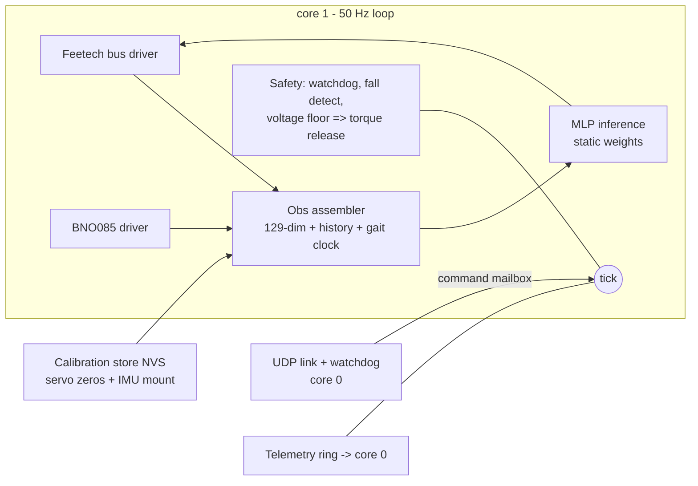

# Firmware design — Waveshare ESP32 servo board

**Status:** design, 2026-07-22. No firmware exists yet; this document defines
what gets built so bring-up day is "flash and calibrate," not "start coding."
Companion docs: [control-channel.md](control-channel.md) (the wireless
protocol this firmware implements), [wiring.md](wiring.md) (electrical + bus
timing), [controls-and-training-overview.md](controls-and-training-overview.md)
(what the policy is).

## 1. Job description

The board runs the robot. Once per **20 ms tick (50 Hz)** it must:

1. read all 8 servo positions (+ velocities derived or read) off the
   1 Mbaud Feetech bus,
2. read the BNO085 (fused orientation → gravity vector, plus gyro rates),
3. assemble the policy observation exactly as the simulator defines it,
4. run the policy network,
5. write 8 position targets back to the bus (sync write),
6. service the wireless command link and its watchdog (link dead ⇒ torque
   release — the robot goes limp rather than cooking servos; it is 34 cm
   tall and falls better than it overheats).

Non-goals for v1: navigation/odometry (command-conditioned only — field
standard, see plan v2), camera anything, OTA model updates mid-run, logging
at full rate.

## 2. Language decision: C++17 on ESP-IDF

| Option | Verdict | Why |
|---|---|---|
| **C++17 (ESP-IDF)** | **chosen** | First-class on ESP-IDF; the vendor ecosystem we want to reuse (Waveshare's ST3215/SCServo servo library, the Adafruit BNO08x/sh2 driver) is already C++; zero-cost abstractions fit a hard-real-time loop (namespaces, `std::array`, templates for the MLP dims — no heap needed); single toolchain, no glue. |
| C | viable fallback | Everything works, but we'd hand-roll abstractions C++ gives free, and we'd wrap the C++ servo lib anyway. Used at the boundary where ESP-IDF APIs are C. |
| Rust (esp-rs) | rejected for v1 | Genuinely maturing, but: Xtensa needs Espressif's forked toolchain; every driver we'd otherwise reuse (SCServo, BNO055) would be rewritten; and our safety story is dominated by *timing* and *torque-release semantics*, not memory bugs — the loop is small, statically allocated, and heap-free after init, which mutes Rust's core advantage. Worth revisiting if the firmware grows past ~5 kLOC. |
| Go (TinyGo) | rejected | No mature ESP32/Xtensa support, and a garbage collector inside a 20 ms hard loop is disqualifying regardless. |

House rules that buy most of Rust's safety in C++: **no heap after init**
(all buffers static), `-Werror -Wall -Wextra`, no exceptions/RTTI, every
shared datum between cores goes through a FreeRTOS queue or an atomic,
fixed-size types only, and the pure modules (§5) compile on the host under
sanitizers.

Framework: **ESP-IDF, not the Arduino core** — deterministic task control,
proper dual-core pinning, and first-party UART/I2C/timer APIs. Arduino-only
vendor snippets get ported into thin IDF components.

## 3. Hardware assumptions (verify on delivery)

- Waveshare ESP32 servo-driver board (BOM): ESP32-WROOM class — **~520 KB
  SRAM, no PSRAM assumed**, single-precision HW FPU, dual LX6 cores.
- Feetech STS3215 bus @ 1 Mbaud half-duplex on one UART (board has the
  direction circuitry).
- **IMU: GY-BNO085 (Teyleten, Amazon B0CL26J81F)** — user decision
  2026-07-22, replacing the earlier BNO055. Same on-chip fusion role but a
  DIFFERENT protocol: **SH-2 sensor-hub** (not a register map), I2C addr
  0x4A/0x4B @ 400 kHz, rotation-vector + calibrated-gyro reports at up to
  400 Hz. Driver: CEVA's reference `sh2` C library (as wrapped by the
  Adafruit BNO08x port) as an IDF component. Simpler fallback if SH-2
  fights us: **UART-RVC mode** (fixed 100 Hz yaw/pitch/roll stream,
  trivial parsing) — but it omits the gravity vector's full quaternion, so
  SH-2 is the primary plan. Board outline/holes unverified until the part
  arrives (carrier reprint expected — see cad/dimensions.py TODO).
- WiFi UDP for the command link (the protocol in control-channel.md).

## 4. The 20 ms tick budget (from wiring.md's analysis)

| Step | Budget | Notes |
|---|---|---|
| Sync-read 8 servo positions | ~3.5 ms | one SYNC READ transaction + replies @1 Mbaud |
| BNO085 read (SH-2 reports) | ~1.0 ms | rotation vector + gyro @400 kHz I2C |
| Obs assembly + history push | ~0.1 ms | pure math |
| Policy inference | ~2–4 ms | see §6 sizing |
| Sync-write 8 targets | ~0.7 ms | one SYNC WRITE, no replies |
| Link service + watchdog | ~0.2 ms | drain UDP queue, stamp liveness |
| **Total** | **~8–10 ms** | ~2× headroom in the 20 ms tick |

Core split: **core 1 = control task only** (pinned, highest priority,
tick-timer driven, owns bus + I2C). **Core 0 = WiFi stack, UDP link,
telemetry, CLI** — communicates with core 1 via a single-slot command
mailbox (latest-wins) and a telemetry queue. Nothing on core 0 can block
the loop.

## 5. Modules

- **bus/**: Feetech SCS protocol — SYNC WRITE targets, SYNC READ positions,
  torque enable/release register broadcast, per-servo error flags. Port of
  Waveshare's C++ library into an IDF component with our timing.
- **imu/**: BNO085 via SH-2 (game-rotation-vector + calibrated gyro
  reports), converted to the gravity vector + rates the obs needs;
  mounting-offset rotation applied from calibration (the Open Duck runtime
  applies a hand-measured mounting offset at deploy — plan for the same).
- **obs/**: byte-exact reimplementation of the simulator's `_obs()` frame
  (encoders, encoder-derived velocities, gravity vector, gyro, previous
  action, gait-clock sin/cos advanced on-board, command channels) + the
  3-frame history ring. The obs SPEC (ordering, scaling, history depth) is
  exported from the sim as a generated header so it cannot drift by hand.
- **policy/**: static float32 MLP (weights compiled in as a generated
  header from the training checkpoint; normalizer folded into layer 0).
  Supports up to 3 resident specialist nets (loco/skills/getup) selected by
  command type; tanh/identity activations to match brax exactly.
- **link/**: C port of `link/protocol.py` decode + the Watchdog semantics,
  validated against golden vectors generated by the Python reference.
- **safety/**: link-watchdog timeout ⇒ torque release; tilt beyond the
  policy's trained envelope ⇒ (v1) torque release, (later) switch to the
  getup specialist; pack-voltage floor ⇒ release + beep.
- **cal/**: NVS-stored per-servo zero offsets + IMU mounting quaternion;
  a guided calibration CLI over USB serial (ToddlerBot's zero-point lesson).

## 6. Fitting the network (decision needed before export)

The current training nets (512,256,128) are ~232k params ≈ **930 KB fp32 —
they do not fit** WROOM SRAM. Options:

1. **Distill to a deployment net (~128×128 ≈ 88 KB) — recommended.** Train
   big, distill small (sim/distill.py machinery exists); 3 specialists
   resident = ~264 KB, fine. Inference ~1 ms.
2. int8 quantization of the big net (~232 KB) — fits, but quantization
   error on a balance-critical policy needs its own referee pass.
3. PSRAM board variant — hardware change; keep as escape hatch.

Either way the **referee gates the deployed artifact**: the exported
(distilled/quantized) net re-runs the full scenario suite on the CPU
referee before it is ever flashed.

## 7. Deployment + test pipeline (host-first, hardware-last)

1. `sim/export_policy.py` (to be written): checkpoint → obs-spec header +
   weights header + golden I/O vectors (1000 obs→action pairs from JAX).
2. **Host builds** of obs/, policy/, link/ as native binaries with unit
   tests: policy output must match JAX golden vectors to 1e-6; protocol
   decode must match Python reference vectors; obs assembler tested against
   recorded sim traces. All runnable in CI today, zero hardware.
3. On-target bring-up order (when servos arrive): bus echo test → single
   servo → 8-servo sync loop timing capture → IMU cal → torque-release
   drills → policy loop with props off the ground → floor.

## 8. Open questions

- Exact Waveshare SKU on the BOM → confirm SRAM/PSRAM and UART wiring.
- Encoder velocity: read from servo registers vs finite-difference on
  positions (sim uses true qvel; ToddlerBot finite-differences — decide
  during sys-ID, and match the sim's DR to whichever ships).
- Whether specialist switching needs hysteresis/blending at boundaries
  (v1: switch only through a stand command).
- Gait-clock frequency source on hardware (fixed 1.5 Hz vs commanded).
