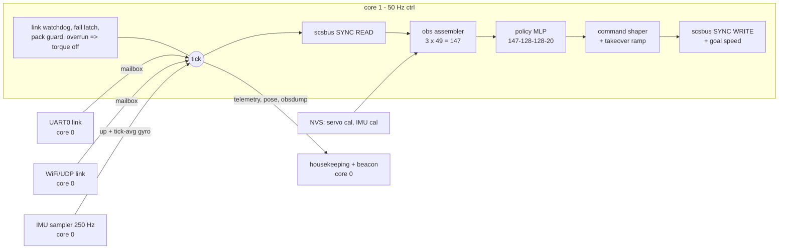

# Firmware design

*What runs on the ESP32 and why it is built the way it is. Usage (build,
flash, CLI, host tests) is [firmware/README.md](../firmware/README.md); the
wire protocol is [control-channel.md](control-channel.md); electrical is
[wiring.md](wiring.md); servo IDs and calibration values are
[servo-map.md](servo-map.md); first power-up is [bringup.md](bringup.md).*

**Status:** built, flashed and running on the prototype. Two joint sets
(§5.8):

- the **bus joint set** is the robot's 17 servos (`obs/bus_map.h`, the
  proposed ID map of [servo-map.md](servo-map.md) §2.1): calibration, the
  mechanical envelope, `pose`/`home`, the readback, the gain check, the
  telemetry joint block and the SIL arrays are all 17 wide;
- the **policy joint set** is what the compiled policy observes and commands:
  the prototype's 10 joints (5 per leg, plant `sim/bimo_biped_v5body.xml`,
  servo IDs 1–10), policy `loco_v41rsi_b_s128r24`.

The prototype carries IDs 1–10, and its calibration marks 11–17 not fitted.
The 17-joint port is done on the bus side and verified on the host (issue
#81); a 17-servo `pose` on the bench and a 17-joint policy (#86) are what
remain (§8).

## 1. Job description

The board runs the robot. Every 20 ms (50 Hz) the control task `ctrl`
(`main/ctrl_task.cpp`):

1. drains the command mailbox, feeding every frame to the arm and home
   latches (in both modes) and to the link watchdog (armed only);
2. reads every fitted servo's position and speed in one SYNC READ on the
   1 Mbaud servo bus;
3. takes the latest attitude and the tick-averaged gyro from the 250 Hz IMU
   sampler;
4. updates the pack guard (from servo register 62) and the fall latch;
5. if any safety state says limp — pack latched off, fallen, link `RELAX`,
   `ESTOP` — releases torque, reports, and stops there;
6. otherwise assembles the observation exactly as the simulator defines it,
   runs the policy, maps actions to joint angles, shapes them, blends them
   during the takeover ramp, and writes every target plus a per-servo goal
   speed in one SYNC WRITE, together with a hold target for every fitted
   servo the policy does not drive;
7. publishes telemetry, the measured pose for the beacon and, when enabled,
   the observation dump.

Benched, it does only steps 1 and 3 (so the attitude filter has converged by
the time the loop arms) and touches nothing else.

Non-goals: navigation or odometry (the robot is command-conditioned and has
no pose estimate), camera processing (the Pi's job), changing the policy
without a reflash, full-rate logging.

## 2. Language and house rules

**C++17 on ESP-IDF v5.4**, not the Arduino core: ESP-IDF gives deterministic
task control, dual-core pinning and first-party UART/I²C/timer APIs. The
safety story here is timing and torque-release semantics rather than memory
bugs, and the loop is small and heap-free, which is why the house rules
below are enough and Rust is not needed.

- **No heap after init.** Every task, queue and buffer is statically
  allocated in `app_main` or at file scope; driver allocation happens once at
  init.
- `-Wall -Wextra -Werror`, no exceptions, no RTTI (`firmware/CMakeLists.txt`,
  `sdkconfig.defaults`); the host build adds `-Wshadow -Wconversion
  -Wsign-conversion`.
- Every datum that crosses cores goes through a FreeRTOS queue or an atomic
  and has exactly one writer. No mutex in the control path.
- Fixed-size types only.
- The pure modules compile and run on the host under ASan/UBSan (§7).

## 3. Hardware

`main/board.h` is the authority and cites the vendor schematic.

| | |
|---|---|
| board | Waveshare **General Driver for Robots** rev 1.2; ESP32-D0WD-V3 rev 3.1, dual LX6 at 240 MHz, 4 MB flash, no PSRAM; partition table `firmware/partitions.csv` (a 3 MB app, NVS at the stock 0x9000) |
| servo bus | UART1, **GPIO 18 RX / GPIO 19 TX**, 1 Mbaud 8N1; half-duplex direction switched in hardware off the TX line (no direction GPIO). Feetech STS3215, ST protocol (little-endian) |
| host link | UART0 at 115200 over the CP2102N on the USB-C port silkscreened `USB`. The port silkscreened `LIDAR` is a second bridge that enumerates but never flashes |
| I²C | **GPIO 32 SDA / 33 SCL** at 400 kHz, also on header P1. QMI8658C IMU at 0x6B (used); AK09918C magnetometer at 0x0C (unused: beside the servos it measures their current, not north); BMP280 at 0x77 on the schematic (did not answer the bench scan; unused); INA219 power monitor at 0x42 (unused). 0x4A/0x4B are reserved for a BNO085 on P1 |
| pack voltage | servo register 62 (0.1 V), from the first servo that answers each tick. The INA219 sees the pack ahead of the buck but is not read yet (§8) |
| RGB LED | GPIO 4, header H2 |
| OLED, RTC | none; wall-clock time comes from SNTP ([control-channel.md](control-channel.md#time-on-the-wire)) |

`imu scan` lists what answers on the I²C bus.

### The IMU

The QMI8658C is a raw 6-axis part, so attitude fusion runs on the ESP32:
`imu::Fusion`, a complementary filter (accelerometer gain 0.5/s, crossover
near 0.08 Hz; the gravity correction is skipped whenever |accel| leaves
(1 ± 0.15) g, so a footfall does not drag the estimate). A core-0 task
(`main/imu_sampler.cpp`) reads the part and runs the filter every 4 ms
(250 Hz); the control tick takes the latest attitude plus the gyro
**averaged over the tick**, which anti-aliases it (`imu avg off` hands over
the latest 4 ms sample instead). Full scales are ±8 g and ±1024 °/s.

The policy's `up` is the torso z-axis in the **world** frame, the sim's
`framezaxis`. Gravity cannot observe yaw and no magnetometer is used, so the
fused yaw is a drifting gyro integral. The driver therefore strips the ZYX
yaw from the quaternion before taking `up`
(`imu::upYawStrippedFromQuaternion`), which equals the sim's `up` at zero
yaw, where every sim episode starts.

Calibration is stored in NVS (§5.4) and is specific to how the board is
mounted; the values below were measured on the prototype, and the robot's
board mount will need its own.

- **Gyro bias is not optional.** The untrimmed zero-rate offset is
  ~0.45 rad/s on x; against the 0.5/s filter gain that settles at about 64°
  of attitude error. Calibrate with `imu bias` **with the board installed,
  the body in the standing pose**: bias moves with orientation and
  temperature. A bench calibration later bolted into the prototype's pelvis
  left ~1°/s of heading drift; calibrated in place it is 0.07°/s.
- **Mount** (`imu mount`). In the prototype the board stands vertical and
  transverse in the pelvis, so sensor→body is a ~90° rotation, not a trim.
  Measured (w x y z): `0.505654 0.494116 0.485838 0.513931` — chip +Y up,
  chip +Z **forward**. Gravity alone cannot tell this from the same mount
  flipped 180° about the vertical; check any mount with a deliberate tilt.
  Leaning the body forward must give `projgrav.x` negative and `up.x`
  positive (`imu` prints both).
- **Gyro scale** (`imu gscale x y z`, its own NVS record, unity when absent).
  The sensor x gyro over-reads by 18 % against the accelerometer's tilt;
  y and z by 2–3 %.
- `applyImuCalFromNvs()` applies bias, mount and scale at boot and again
  after `imu reinit`.

Also:

- **The on-chip AttitudeEngine does not work on this silicon.** Enabling it
  leaves the dQ/dV registers holding static bytes. The part reports revision
  0x7C; the datasheet (QST rev 0.6, ADVANCE INFORMATION) documents 0x79. The
  driver probes for AE at init and falls back to the raw path; `imu ae`
  re-runs the check.
- **I²C bus recovery at init.** A reset that lands mid-transaction can leave
  the sensor holding SDA low; the driver clocks it free. If the part still
  does not answer, the loop runs on `imu::StubImu` (level and still) and the
  boot log names which one is live.
- The upgrade path is a BNO085 on P1: a driver change plus one 4-wire cable.

## 4. Tick budget, tasks and cores

| task | core | priority | job |
|---|---|---|---|
| `ctrl` | 1 | `configMAX_PRIORITIES - 2` | the §1 loop. An `esp_timer` fires every 20 ms and wakes it with `vTaskNotifyGiveFromISR`, so wake jitter is microseconds, not scheduler ticks |
| `link` | 0 | 5 | UART0 reader: demultiplexes binary command frames from CLI text lines |
| `wifi_link` | 0 | 5 | UDP command frames in on 4210; the 10 Hz telemetry beacon out on 4211 |
| `imu` | 0 | 4 | the 250 Hz IMU sampler and fusion |
| `housekeeping` | 0 | 2 | the CLI, arm and home requests, the home readback, pose streaming, UART telemetry, the observation dump |

The WiFi/LwIP tasks stay on core 0 (IDF default), so nothing they do can
preempt `ctrl`. All tasks are created once at init, and the control loop is
paced by the hardware timer, never by `vTaskDelay`.

How data crosses cores (`main/shared.h` states the rules beside each item):

- **Command mailbox**: a length-1 queue written with `xQueueOverwrite` by
  both link tasks and read non-blocking by `ctrl`. Latest command wins; a
  stale command can never queue up behind a late tick.
- **Telemetry snapshot**: atomics with `ctrl` as the single writer. A read
  may tear across fields; every reader is a 10 Hz human-facing report.
- **Payloads too big to tear harmlessly** (the observation dump, the measured
  pose for the beacon) are double-buffered with a sequence counter; `ctrl`
  writes the slot the reader is not in, and a copy the writer overran is
  dropped, never reported.
- **IMU sample**: the one lock the tick takes is the sampler's `portMUX`
  critical section around a sample copy.
- **Requests from the link** (arm and home edges) are counters bumped by
  `ctrl` and consumed by housekeeping, so each atomic keeps one writer.

Measured cost of each phase of the 20 ms tick, 10 servos, 240 MHz (`stat`
prints the live values — `us_read`, `us_imu`, `us_obs`, `us_net`,
`us_write`, `us_other` — plus overruns and the worst tick):

| phase | measured |
|---|---|
| SYNC READ, 10 servos | 2.80 ms |
| IMU burst read + fusion | 0.47 ms, in the sampler task; the tick only copies the sample |
| observation assembly + history | 0.02 ms |
| policy forward, 147 → 128 → 128 → 20 | 7.2 ms |
| SYNC WRITE | 0.07 ms |
| mailbox drain + watchdog | 0.07 ms |

About 10 ms of the 20 ms tick is used, with 0 % late ticks on the prototype.
The SYNC READ covers the fitted servos only; at the measured ~0.28 ms per
servo, 17 would take about 4.8 ms, which has not been measured (`stat` on the
robot will).

A phase that always costs exactly its timeout is not slow; it is waiting on
a condition that cannot occur. `Bus::syncReadFeedback` requests only the
bytes still outstanding, because `uart_read_bytes()` returns only when it
has the full count: asking for the whole buffer makes every read sleep out
its timeout while the replies have long since landed.

Supervision:

- A tick that takes longer than two periods (40 ms) releases torque on every
  servo with one broadcast frame: the loop is no longer in control.
- The IDF task watchdog watches `ctrl` with a 1 s timeout. It reports only
  (`CONFIG_ESP_TASK_WDT_PANIC` is off) and does not reset the board.

## 5. Modules



| module | what it is | on the host |
|---|---|---|
| `components/scsbus/` | Feetech SCS/STS protocol: packet codec and transactions (PING, READ/WRITE, REG WRITE + ACTION, RESET, SYNC READ, SYNC WRITE, torque enable incl. broadcast, EEPROM lock, ID change, set-middle, error-flag decode). The golden packets are the worked examples in Feetech's own protocol manual | tested against a scripted fake port |
| `components/linkproto/` | byte-exact port of `link/protocol.py`: frames, CRC, `Watchdog`, `ArmLatch`, `HomeLatch`, envelope clamps, the bench diagnostic, the UART demux | golden vectors from the Python reference |
| `components/obs/` | observation assembler, history ring, gait clock, action ↔ angle ↔ tick maps, `Calibration`, `CommandShaper`, goal speed, velocity estimator; the bus joint map `bus_map.h` (hand-written) and the policy spec `obs_spec.h` (generated) | vectors from real `walker_env._obs()` frames; the bus map |
| `components/policy/` | static MLP forward pass. `weights.h` is generated | numpy golden vectors |
| `components/imu/` | `Imu` interface, frame maths and `Fusion` (pure); `qmi8658_idf.cpp`, the only file with I²C in it; `StubImu` | frame maths + fusion |
| `components/battguard/` | pack under-voltage guard | yes |
| `main/` | everything that touches ESP-IDF: tasks, UART/WiFi/NVS/SNTP, the CLI (file list in [firmware/README.md](../firmware/README.md)) | the plain-data halves of `cal_store` and `obs_dump` |

### 5.1 Observation

The frame is the byte-exact on-board twin of `walker_env._obs()`. The obs
SPEC (ordering, scaling, history depth, joint table, action map, clock
flags) **is exported from the sim as a generated header so it cannot drift
by hand**: `tools/gen_obs_spec.py --run <run>` writes `obs/obs_spec.h` from
the run's `config.json` and MJCF. Nothing downstream hardcodes a width.

One frame is 49 floats, and the policy sees three of them, newest first
(147):

```
q(10) | dq(10) | up(3) | linvel(3) | gyro(3) | prev_action(10) | height(1) | sin,cos(2) | cmd(7)
```

- **q**: servo position through the calibration (`stepsToAngle`). A servo
  that does not answer keeps its last angle and sets its fault bit.
- **dq**: servo register 58 (steps/s, sign-magnitude) in rad/s. A filtered
  finite difference is computed beside it and not used (§8).
- **up, gyro**: from the IMU sampler (§3).
- **linvel, height**: hard zeros. The run trains with `imu_obs`, because the
  robot has no sensor for either.
- **prev_action**: the raw policy output of the previous tick, not the shaped
  or ramped target, because that is what the policy saw in training.
- **phase**: a gait clock at a base 1.5 Hz, the centre of training's
  per-episode draw U(1.25, 1.75). With `kSpeedClock` the rate is scaled by
  clip(sqrt(v / 0.35 m/s), 0.7, 1.25), v the commanded planar speed; with
  `kClockStandFreeze` the phase holds at a plain stand (|vx|, |vy|, |wz| ≤
  0.05 and |lift| < 0.5). Both flags come from the run, as in training.
- **cmd**: vx, vy, wz, crouch, lift, foot_dx, foot_dz (defaults 0, 0, 0, 1,
  0, 0, 0), from the watchdog: the operator's command only while `LIVE`,
  clamped to the trained envelope. Crouch is the lower of the link's value
  and the pack guard's landing ramp; the travel channels are zeroed while the
  guard is latched.
- The history ring is refilled with the first frame after every arm (as
  `walker_env.reset()` does) and pushed after the policy has been fed.

Actions map to angles with `action_map = "full"`: 0 is the standing pose
(`kJointDefault`), ±1 are the policy range `kJointLo`/`kJointHi`,
piecewise-linear on each side. Angles become ticks through the calibration
and are clamped to that range.

### 5.2 Policy

- The arithmetic is brax's: the `running_statistics` normaliser
  x = (obs − mean) / std (no clip), **swish** hidden layers, a linear head
  2 × act_dim wide (mean ‖ log-std), and the deterministic action
  tanh(mean). The normaliser ships in the header beside the weights.
- The compiled-in net is 147 → 128 → 128 → 20: 38 036 weights plus a
  147-wide normaliser, ~150 KB of fp32 `constexpr` in flash `.rodata`, so
  DRAM is unaffected.
- `weights.h` is written by `tools/gen_policy_weights.py --run <run>` from
  the run's exported `.silw`; there is no argument-less default.
  `test_policy` asserts `kWeightsArePlaceholder == false` and
  `kWeightsRun == obs::kRunName`: the net and the observation spec come from
  the same run.
- `policy::forwardNet` takes the weights as a parameter and `forward()`
  binds it to the generated header, so the SIL library runs an exported
  `.silw` through the identical arithmetic.

### 5.3 Command shaper and goal speed

Written raw with goal speed 0 (unlimited), each 50 Hz target makes a servo
slam toward it at full speed (~3000 steps/s measured) and stop mid-tick: a
50 Hz velocity square wave on every joint. The act path therefore has two
stages, both in `components/obs`, so the SIL library runs them too:

- **`obs::CommandShaper`** (`obs/actuation.h`): three cascaded first-order
  lags, all poles at 10 Hz, each the exact zero-order-hold discretisation
  (stable for any pole, no overshoot, output inside the hull of its inputs).
  The commanded trajectory has continuous velocity and acceleration. It is
  reseeded from **measured** q on every torque (re)engage or bus handover,
  so the first shaped target is never a jump.
- **Per-servo goal speed** (register 46) in the same SYNC WRITE: the speed
  that closes the gap from the measured position to the shaped target in one
  tick, × 1.25, floored at 50 steps/s (0 would mean unlimited) and capped at
  3400. While tracking, that is the trajectory's own speed; under a
  disturbance the error term grows it, so smoothing costs no stiffness.
- 10 Hz is the strongest smoothing that kept SIL-vs-python referee parity in
  a closed-loop pole sweep; 8 Hz measurably cost task performance.
- `shape [hz]` sets the pole live; `shape 0` writes raw targets at unlimited
  speed. The SIL equivalent is `sil_set_shaper()`.

### 5.4 Calibration in NVS

- **Two mechanisms, not interchangeable.** `middle <id>` writes the servo's
  own offset (register 40 ← 128); it lives in the servo's EEPROM and travels
  with the servo. `cal …` writes the firmware's per-joint `zero_steps` and
  `dir` to NVS; `dir` is something the servo cannot express. `middle` at the
  neutral pose first, then `cal zero` to absorb the residual the horn
  splines cannot. Procedure: [bringup.md](bringup.md); the values:
  [servo-map.md](servo-map.md).
- **Servo blob** (`main/cal_store.h`): magic `BMC1`, version 3, indexed by
  bus joint: the joint count (17), `zero_steps`, `dir` and `fitted` per bus
  joint, the bus map (`kBusServoId`) it was measured under, CRC-32. A
  joint-count or map mismatch rejects it: the robot boots uncalibrated and
  arming is refused.
- **Fitted** says which bus servos this robot carries. The loop, `pose`,
  `home`, `ping`, `volt` and the gain check touch fitted servos only, and
  `run` refuses unless every policy joint is fitted. `cal zero` over all
  joints sets it from who answers; `cal fit` sets it by hand.
- **Migration.** A version-2 blob (the prototype's: 10 policy joints with
  their servo map) proves its map, so boot migrates it exactly: each servo's
  zero and direction on its bus joint, IDs 1–10 fitted, 11–17 not, re-saved
  as v3 under the same key. No re-calibration. A version-1 blob, which
  carries no map, is adopted only if it equals the compiled as-built table
  exactly; `cal migrate` is the manual path.
- **`main/asbuilt_cal.h`** holds that as-built table as a reference for the
  migration check, not as a default. NVS is the runtime source of truth.
  Change it and [servo-map.md](servo-map.md) in the same commit.
- **IMU blob** (`BMI1`): gyro bias and mount quaternion, kept separate so a
  servo-map change does not discard them. The gyro scale is its own record.
- **WiFi credentials** are NVS strings (`wifi <ssid> <psk>`), never in git.
- All NVS writes are bench-only: a flash write stalls both cores' cache, and
  with them the control tick.

### 5.5 Modes, arming and handover

- **Two modes, one bus owner, no lock.** `kBench` (boot default): torque
  released, the CLI owns the bus, `ctrl` only drains the mailbox and keeps
  the IMU filter warm. `kRun`: `ctrl` owns the bus and bus-touching CLI
  commands are refused. The mode changes only between ticks; going to bench,
  `ctrl` releases torque and clears `g_ctrl_owns_bus` before the CLI may
  touch the bus.
- **One decision point.** `cmdMode()`, on the housekeeping task, decides every
  mode request: a typed `run`/`bench` and a wireless ARM edge alike. It
  refuses `run` without an as-built calibration from NVS, or unless every
  driven servo's position-loop gains read back as expected (§5.7), and
  records its verdict in `g_arm_result`, which the `BENCH` beacon carries.
- **Arming over the radio.** `ctrl` runs `linkproto::ArmLatch` on every
  drained frame in both modes and publishes each edge; housekeeping applies it
  between CLI lines, so a wireless arm never lands inside a bench-mode bus
  command. The latch outlives the watchdog, so it sees the 1 → 0 edge that
  ends a run.
- **Every arm starts clean**: a fresh watchdog, history ring, shaper, fall
  latch and takeover ramp.
- **Takeover ramp** (issue #29). For the first 1000 ms of acting ticks after
  an arm, the written targets blend from the pose measured at takeover to the
  policy's shaped targets. Without it the first acting tick snaps the joints
  from the bench hold to the policy's targets — a step training never
  produced — into an empty history. The ramp sits after the shaper and before
  the angle → tick map, so goal-speed streaming follows the blend;
  `prev_action` stays raw. It is not in the SIL library, which has no
  bench → run handover.
- **Home** (the wireless `HOME` edge, or typed `home`). Housekeeping benches
  the loop, waits for the handover, then — refused without calibration or
  while the pack guard holds torque off — enables torque and streams a
  minimum-jerk move of every fitted servo to its calibrated zero (clamped to
  the mechanical envelope; duration from the longest move at 300 steps/s,
  2.5–8 s). It then rolls each hip 5° out and back to take up roll play,
  reads every fitted servo back (±12 ticks) and **releases torque**; gear friction
  holds the stand. It reports `HOME_PENDING` while moving, then
  `DISARMED_HOME` or `HOME_NOT_REACHED`. It never arms.

### 5.6 Failsafes

In the order the tick applies them:

1. **Pack guard** (`components/battguard`). The only over-discharge
   protection: the pack has none, and the servos' own under-voltage flag
   trips near 6 V. On 3S it warns at 10.5 V and lands at 9.9 V held for 25
   ticks (0.5 s): travel commands go to zero and crouch ramps to 0.60 (the
   lowest trained stance) over 1.5 s (`VLAND`), then torque goes off
   (`VSAFE`), latched until `batt reset` (bench only, after a pack swap) or a
   power cycle. A tick with no servo reply is "no data", never 0 V.
   Thresholds and the power path: [wiring.md](wiring.md).
2. **Fall latch.** `up_z` below 0.4 (walker_env's `fall_up_z`) for 200 ms:
   report `FALLEN`, release torque, record `DISARMED_FALL` and bench the loop.
   Past that line the policy is outside anything it trained on, and holding
   torque only grinds the servos against the floor. There is no auto-clear;
   re-arming is a fresh ARM edge or `run`. `StubImu` pins `up_z` at 1, so an
   IMU-less board never trips it.
3. **Link watchdog** (`linkproto::Watchdog`, armed only): `STAND` after
   250 ms without a valid frame (the command decays to the trained stand),
   `RELAX` after 5 s (torque off), `ESTOP` on the operator's flag (torque
   off, latched until a frame with `ENABLE` off). See
   [control-channel.md](control-channel.md).
4. **Overrun**: a tick longer than 40 ms releases torque (§4).

Every limp state releases torque with one broadcast frame and invalidates
the shaper, so a re-engage reseeds from wherever the joints are.

The **mechanical envelope** (`main/mech_envelope.h`) is the per-bus-joint
measured or CAD-verified travel; the leg rows are the prototype's, and the
robot's legs need their own ([servo-map.md](servo-map.md) §3.3). Only the CLI's bench moves (`move`, `pose`,
`home`) clamp to it; the act path clamps to the policy range from
`obs_spec.h`. It pairs with [servo-map.md](servo-map.md). The CLI also
refuses a goal write to a servo whose torque is off (`torqueGate`), because
an STS goal write enables torque and moves the joint; `home` is the one
command that enables torque itself, by name. The bench rules are in
[AGENTS.md](../AGENTS.md).

### 5.7 Position-loop gains (Plan B)

Plan B raises the position-loop P (register 21, with D in 22) on the roll and
knee servos ([DESIGN.md](../DESIGN.md) §4). Those values live in each servo's
EEPROM, and a factory reset or a swapped spare comes back at P = 32 without a
word. Two pieces, both in `components/scsbus/gains.{h,cpp}` and host-tested
against a scripted port:

- **The arm gate** (`checkPositionGains`): one 2-byte read at register 21 per
  driven servo, compared with the compiled table `main/servo_gains.h` (per
  servo ID; factory 32/32 on every row until the bench test, issue #73,
  measures the raised values). It runs at boot, after the torque-off
  broadcast, and again inside `cmdMode()` before every arm. A difference or a
  silent servo refuses the arm with `ArmResult::kRefusedGains`, and a failed
  boot check puts that verdict on the `BENCH` beacon before anyone asks.
- **The write** (`gains <id> <P> <D>`, `writePositionGains`): bench mode, one
  servo by ID, and only if that servo reports torque off. It unlocks the
  EEPROM (55 ← 0), writes 21/22 in one frame, locks it again (also on every
  failure path), waits 2 s for the commit and reads the pair back. It writes
  no goal and no torque register: a gain write with torque off does not move
  the servo, and the torque gate keeps it that way.

The table is compiled in rather than kept in NVS because it is a design value
with evidence behind it; the procedure is [servo-map.md](servo-map.md) §4.

### 5.8 Bus joints and policy joints

The robot carries 17 servos; the policy it runs may drive fewer (the
prototype's 10 today, a 17-joint one after #86). So the firmware keeps two
joint sets and never confuses them:

| | bus joints | policy joints |
|---|---|---|
| defined by | `obs/bus_map.h`, hand-written: 17, index *b* = servo ID *b* + 1 | `obs/obs_spec.h`, generated from the deployed run: `kNumJoints`, sim actuator order |
| sized by it | the calibration blob, the envelope, `pose`/`home`/`ping`/`volt`, the gain check, the SYNC READ and WRITE, the telemetry joint block and `servo_err`, the SIL arrays | the observation, the action, the shaper, the takeover ramp, `obsdump` |
| mapping | `obs::policyToBus(j)` / `obs::busToPolicy(b)`, checked at compile time: every policy joint is a bus joint with the same name and servo | |

While armed, `ctrl` SYNC READs every fitted servo (the list is taken from
the calibration at the arm handover), feeds the policy its joints, and in
the SYNC WRITE sends the policy's targets plus a **hold** at the measured
takeover position for every fitted servo the policy does not drive, so the
robot's ankle rolls, neck and arms stay where they were under a 10-joint
policy. A held servo that has not answered since the arm is left off the
frame rather than sent a guess. The SIL library mirrors the hold (its
non-policy slots hold what they sensed on the first tick after a reset).

`pose` takes either 17 targets in servo-ID order or 10 in policy order (the
prototype's bench tools send that form; the other servos are left alone);
targets for servos that are not fitted are ignored.

## 6. Fitting the network

The training nets are (512, 256, 128): ~232 k parameters, ~930 KB of fp32.
That does not fit beside the application in the 1 MB app partition, and at
the measured forward-pass rate it would not fit the tick either. So the
deployed net is **distilled** to (128, 128): ~38 k parameters, ~150 KB,
7.2 ms per forward pass, resident in flash (§5.2).

Flash is not the constraint. `firmware/partitions.csv` gives the app 3 MB
of the 4 MB flash, with `nvs` and `phy_init` at the stock single-app offsets,
so the NVS calibration survives the table change. `idf.py -C firmware build`
gives a 1 012 832 B image (0xf7460) against the 0x300000 app partition: 68 %
free (2 132 896 B). A checkout whose gitignored `sdkconfig` predates the
table is refused at configure time with the fix (delete `firmware/sdkconfig`).
The distillation
(`sim/mjx/distill_student.py`, DAgger against the frozen teacher normaliser)
is described in [training.md](training.md) §9.

The referee gates the deployed artifact: the distilled net is scored on both
scorecard columns — the python referee and the SIL column through the
firmware's own code — before its headers are generated and flashed.

## 7. Test and deploy (host first, hardware last)

- **Host tests.** The pure modules compile on the host with the firmware's
  warnings plus `-Wshadow -Wconversion -Wsign-conversion`, under ASan/UBSan:
  `make -C firmware/host test`. The protocol vectors are generated by running
  `link/protocol.py`; the obs vectors are real `walker_env._obs()` frames; the
  policy vectors are numpy forward passes of the deployed weights. The target
  for the policy is 1e-6 against the golden vectors; the test allows 2e-6,
  because float32 accumulation order differs from numpy's over a 147-wide
  dot product. `main/cal_store.cpp` and `main/obs_dump.cpp` keep their
  ESP-IDF calls behind `#ifdef ESP_PLATFORM` or out of the file so their
  logic is covered too.
- **SIL.** The same component sources are linked into `libctrl_sil` and run
  against the CPU plant, scored by the same referee
  ([sil-harness.md](sil-harness.md)).
- **Deploy.** `make -C firmware/host deploy-headers RUN=<run>` regenerates
  `obs_spec.h` and `weights.h` (and their vectors) together, from one run;
  then `make -C firmware/host test`, `idf.py -C firmware build`, flash. The
  path from a trained run to the flash is [training.md](training.md) §9.
- **On the robot**: bring-up order and checks are
  [bringup.md](bringup.md).

### 7.1 `obsdump`: the observation off the armed robot

SIL covers every layer from `obs::Inputs` to the servo write. What it cannot
supply is the numbers the real sensors put into `obs::Inputs`; a
degrees-for-radians error, a sign flip, a swapped IMU axis and a permuted
joint all look the same from outside. `obsdump` measures them.

- `main/obs_dump.h` publishes, once per tick while enabled, one record: the
  tick, the raw `obs::Inputs` (q, dq, up, gyro, phase, cmd) and the
  assembled 49-float frame. The raw half catches sensor and unit faults; the
  frame half catches assembler faults.
- It is double-buffered with a sequence counter (§4) and published **last**
  in the tick, after the servos have their targets. Off, it costs one relaxed
  load; on, ~350 bytes of copy, which lands in `us_other`.
- Armed only. Benched, the loop reads no servos and assembles nothing, so
  `obsdump on` refuses and says so.
- Output is text on the tether beside the binary telemetry: `OBSHDR,…` once,
  then `OBS,<tick>,…` at 5 Hz. Housekeeping writes both, so a record is
  never split, and host tools find records by their `OBS,` tag. Column names
  come from the generated obs spec.
- `tools/obs_capture.py` drives it and writes `captures/obs_<ts>.csv` with
  per-channel statistics; `--compare A.csv B.csv` prints per-channel RMS
  ratios, where ~57.3 means degrees where radians belong and 0 on one side a
  channel that never reaches the observation. `sim/sil_twin.py --obs-csv`
  writes the sim side in the same format.
- `obsfreeze [none|up|gyro|imu|dq|gain=k]` pins parts of the observation at
  nominal (or scales the gyro) while the beacon and the guards keep the real
  values; it does not persist.
- `firmware/host/test_obsdump.cpp` covers the double buffer and the CSV
  writer.

## 8. Open questions

- **Velocity source.** The loop feeds register 58; a filtered finite
  difference is computed beside it (`obs::VelocityEstimator`), so the switch
  is one branch in `ctrl_task.cpp`. A bench check put the reported/differenced
  slope at 0.69: a scale question, not a unit error. The sim uses true
  `qvel`; decide in sys-ID and match the sim's randomisation to whichever
  ships.
- **Gait base frequency.** Fixed at 1.5 Hz, speed-scaled (§5.1). A commanded
  frequency is not on the wire.
- **Pack sense.** `battguard` reads register 62 (0.1 V, and only while a
  servo answers). The INA219 sees the pack even with the bus released;
  switching to it is not done.
- **Telemetry gaps.** The firmware does not estimate `vx_est`/`wz_est` (it
  sends 0).
- **Idle torque-off** while standing still is not implemented. Powered
  friction measures 0.235 N·m (8 % of stall at 200 steps/s), a lower bound on
  unpowered backdrive; `home` already ends with torque released and friction
  holding the stand.
- **What the 17-joint port still needs** (issue #81):
  - the owner's sign-off on the ID map (#77) -- the bus map is compiled in
    as proposed;
  - a 17-servo `pose` and `home` on the bench, and the 17-servo SYNC READ
    time from `stat`;
  - the robot's leg rows in the mechanical envelope, and every direction
    sign, measured on the robot (the leg rows are the prototype's);
  - a 17-joint policy (#86): `obs_spec.h` then generates 17 policy joints,
    and the hold path covers nothing;
  - the Plan B gain values (#73) in `main/servo_gains.h`;
  - the bench tools in `tools/` that hard-code the prototype's calibration.
