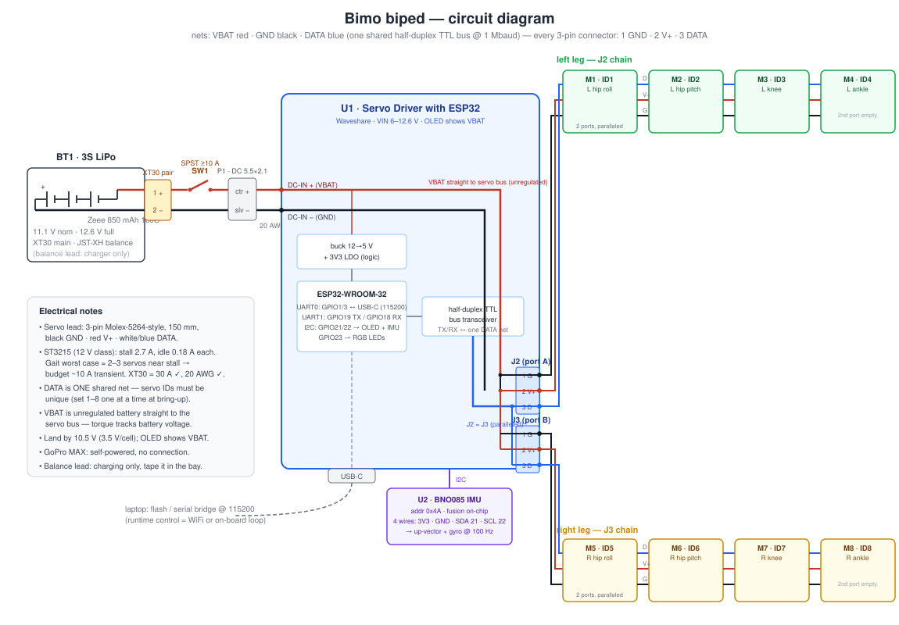

# Wiring & control architecture

*Status 2026-07-11. One serial bus, one battery, no custom electronics —
the entire harness is the servo leads that ship in the box plus one XT30
pigtail and a switch.*

**Circuit diagram** (pin-level: connectors, nets, wire colors):



**System block diagram** (physical layout view of the same thing):


**Connector field guide** (photos, pinouts, counts, measured hop lengths):
[connector-guide.html](connector-guide.html) — self-contained, open in a browser.

## Power path

```
3S LiPo (XT30) ── inline switch ── screw terminal / DC 5.5×2.1 on driver board
                                        │
                                        └── servo bus V+ (battery voltage,
                                            passed straight through to all 8)
```

- The battery is a 3S 850 mAh XT30 pack — BOM pick
  [Tattu 75C](https://www.amazon.com/s?k=Tattu+850mAh+3S+75C+XT30) (decided
  2026-07-11, re-sourced 2026-07-15; buy two, so one charges while one flies).
  Any pack passing the `bom-by-vendor.md` spec filter works — **11.1 V, not
  11.4 V HV**, which would exceed the servos' 12.6 V ceiling. It swaps
  tool-free through the window in the rear tower wall: peel the belt, tug the
  pull-ribbon, tilt the pack out; reverse to insert (lead-end toward whichever
  y-pocket the XT30 pigtail lives in).
- The **Servo Driver with ESP32** accepts 6–12.6 V, so it runs directly from
  2S (7.4 V) or 3S (11.1 V, 12.6 V fully charged) — no regulator needed. Its
  logic is powered from an onboard buck; the servo bus carries raw battery
  voltage, which is what sets torque (the whole 2S/3S performance story in
  [hardware-order.md](hardware-order.md)).
- **Current sizing**: each ST3215 can pull ~2.5–3 A at stall; the gait
  gauntlet shows only 2–3 joints near peak torque simultaneously, so budget
  ~10 A transient. XT30 (30 A) and 20 AWG battery leads are comfortable;
  this is why JST-terminated packs (~3 A) are ruled out.
- The board's OLED shows measured bus voltage — but it faces the deck once
  the board is mounted, so it's a **bench-side** tool (bring-up, servo IDs).
  In operation the low-battery check is the bus voltage in the 10 Hz radio
  telemetry ([control-channel.md](control-channel.md)). Land the robot by
  **10.5 V on 3S** (3.5 V/cell) / 7.0 V on 2S. (A tower viewing window for
  the OLED is filed as a future improvement.)
- GoPro MAX is self-powered; zero wiring to the robot.

## Servo bus

- 3-pin daisy chain, half-duplex TTL at **1 Mbaud** (driver board UART1,
  GPIO 18/19). Pin order on every connector (Molex-5264-style): **1 GND
  (black) · 2 V+ (red) · 3 DATA (white/blue)**. Every ST3215 has two
  identical, internally-paralleled ports, so chains just hop case to case
  with the included 150 mm leads.
- Per-servo current (12 V class): **2.7 A stall, 0.18 A idle** — the ~10 A
  transient budget in the circuit diagram comes from 2–3 joints near stall
  simultaneously in the gauntlet's worst gaits.
- The board's two bus ports are **electrically the same bus** — we use one
  per leg purely for cable routing:
  - **Port A → left leg**: ID 1 hip roll → ID 2 hip pitch → ID 3 knee → ID 4 ankle
  - **Port B → right leg**: ID 5 hip roll → ID 6 hip pitch → ID 7 knee → ID 8 ankle
- ID order matches the sim's joint order in `sim/walker_env.py`
  (left leg then right, proximal to distal), so the policy's action vector
  maps to IDs 1–8 with no permutation table.
- Servos ship with ID 1: at bring-up, connect **one at a time** and assign
  IDs via the board's web UI (AP mode, `192.168.4.1`), then chain them.
  Two same-ID servos on the bus fail to enumerate.
- **Segment lengths** (worst pose over the full ROM, measured on the routed
  paths in `cad/dress.py`, slack loops included — 2026-07-16):

  | Hop | Worst routed | Lead |
  |---|---|---|
  | board → hip-roll | 33 mm | stock 150 mm (coil excess in the tower) |
  | hip-roll → hip-pitch | **170 mm** | **≥200 mm extension required** (BOM item 19) — crosses both the roll and hip-pitch joints; longest at the knee-flexion pose |
  | hip-pitch → knee | 111 mm | stock 150 mm (~35 % slack) |
  | knee → ankle | 82 mm | stock 150 mm (worst at ankle −40°) |

  The routed paths already include the service loops, so the stock-lead
  margins above are true flex margin, not taut-string numbers. An earlier
  guess here that shin→ankle was the long run was wrong — it's the shortest
  joint-crossing hop.

## IMU (torso attitude feedback)

- **BNO085 breakout** on the ESP32's I2C bus (GPIO 21 SDA / 22 SCL — shared
  with the OLED; the BNO085 defaults to address 0x4A, no conflict). 4 wires:
  3V3, GND, SDA, SCL. Mounts **on top of the tower's top plate at the rear**
  (foam tape, long axis on y — no interior flat fits the 25.4 × 17.8 board;
  see [assembly.md §9b](assembly.md) for the exact footprint). Silkscreen
  +X arrow points robot-left (+y); firmware remap `x_r = −y_imu`,
  `y_r = +x_imu`, `z_r = z_imu`.
- Why: the policy's observation vector needs the torso **up-vector and
  angular velocity** — servo encoders only cover the 8 joints. The BNO085
  does sensor fusion on-chip and outputs the orientation quaternion directly
  at 100+ Hz, so the ESP32's 50 Hz loop just reads it.
- Torso *linear velocity* and *height* have no direct sensor — see the
  observation-ablation results in DESIGN.md for how much they matter.

## Control path (and where latency lives)

| Link | Rate | Role |
|---|---|---|
| Laptop ↔ ESP32 WiFi | 20 Hz cmd / 10 Hz telemetry | **the control channel**: high-level `(vx, yaw_rate)` intent + telemetry — [control-channel.md](control-channel.md) |
| Laptop ↔ USB-C (UART0) | 115200 | flashing, serial bridge, tethered debug |
| ESP32 ↔ servos (UART1) | 1,000,000 | position commands + state readback |

The latency work in DESIGN.md bears directly on this: at 115200 baud a full
8-servo command + state readback cycle eats most of a 20 ms control tick,
and WiFi adds jitter on top. The servo bus itself at 1 Mbaud is ~10× faster
than the link to the laptop. So the plan of record is the one the latency
sims validated: **run the 50 Hz policy loop on the ESP32**. No parts change —
the ESP32 on the order sheet does both jobs.

That decision is also what makes the robot **untethered**: with the policy
loop on-board, the radio never carries joint angles. It carries only the
`(vx, yaw_rate)` command the policy already consumes, 14 bytes at 20 Hz, so a
dropped packet costs staleness rather than a bad servo target — and a link
that goes quiet decays to the zero command, which is a *trained* stand
(`cmd_stand_prob`), not a bolted-on emergency pose. USB-C is for flashing and
debug; nothing about operating the robot needs it. Protocol, failsafe
timings, and the sim-verified loss measurements are in
[control-channel.md](control-channel.md).

## Bring-up checklist

1. Bench-power the bare board (no servos), confirm OLED + web UI.
2. Set servo IDs 1–8 one at a time via web UI; label each case.
3. Chain one leg at a time; confirm enumeration count on the OLED.
4. Torque-off ("Release") all servos, assemble, then use "Set Middle
   Position" at the CAD-neutral pose before first powered stand.
5. Bring up the command link before the first walk: with the robot on a
   stand (feet off the floor), run `link/commander.py --host <ip> --source
   script --script stand` and confirm telemetry comes back, then walk the
   watchdog through its states — kill the commander and check the servos
   release ~5 s later. [control-channel.md](control-channel.md).
