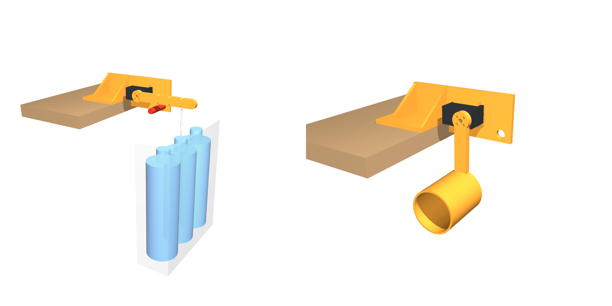

# Plan B bench rig: lever, weights and fixture for one STS3215 (#73)

**Status (2026-10-01):** designed and fit-checked in CAD. The hold procedure is
updated for `gain_bench.py` at main 9e98a96. The STLs are ready for
review in OrcaSlicer.

Step 0 of [#73](https://github.com/tomwhipple/biped-robot/issues/73) asks
whether raising the STS3215's position-loop P about 4× makes it about 4× stiffer
without buzzing. The bare-horn pass
([2026-09-30-plan-b-bench.md](2026-09-30-plan-b-bench.md)) found no buzz at any
rung up to P 160, but with nothing on the horn it could not measure stiffness.
This rig adds the load: a known torque on a lever for `gain_bench.py stiffness`,
and a leg-like inertia for `gain_bench.py hold`.

Everything the servo touches is printed. The weights are 12 fl oz drink bottles
and table salt. The geometry is `plan_b_rig.py` in this folder, which writes the STLs, runs the fit
checks, and draws both figures below from the same constants.

## How it works

- **Servo position.** The servo sits on its back (idler) face against a printed
  bracket clamped to a table edge. Its output axis is horizontal and parallel to
  the edge, 50 mm out past the edge and 20 mm above the tabletop. The lever
  swings in a vertical plane clear of the table, so weights hang straight down
  past the edge.
- **Torque.** Torque = hung mass × g × 100 mm. The hanging mass stays vertical,
  so the arm stays 100 mm to within cos 5° (0.4 %) over the few degrees the
  lever deflects.
- **What is measured.** The servo reads its own output angle (Present Position).
  Deflection is the servo's position error under load: the P-loop stiffness this
  test is about. How much the lever itself bends does not enter.
- **Pass criterion.** The result is the ratio of stiffness at each P to the
  stiffness at P 32, on the same rig. So each weight only needs to be known to
  the kitchen scale, not to a target. The tool asks for the mass actually hung,
  and a constant offset (such as the lever's own weight) drops out of the fit.

## Loads

The hook is the 100 mm notch (3.94 in from the axis). The weights are full
12 fl oz (355 mL) Gatorade bottles in a bag.

| Test              | Torque           | Total hung mass     | lb   | oz   | Use                                             |
| ----------------- | ---------------- | ------------------- | ---- | ---- | ----------------------------------------------- |
| stiffness, load 1 | 0.38 N·m         | ≈ 0.39 kg           | 0.86 | 13.8 | bag + 1 full 12 fl oz (355 mL) bottle           |
| stiffness, load 2 | 0.77 N·m         | ≈ 0.78 kg           | 1.72 | 27.5 | bag + 2 bottles                                 |
| stiffness, load 3 | 1.15 N·m         | ≈ 1.17 kg           | 2.58 | 41.3 | bag + 3 bottles                                 |
| stiffness, load 4 | 1.53 N·m         | ≈ 1.56 kg           | 3.44 | 55.0 | bag + 4 bottles                                 |
| hold              | leg-like inertia | ≈ 0.25 kg at 100 mm | 0.55 | 8.8  | the hold lever's cup, packed full of table salt |

**Bottles.** A full 12 fl oz bottle is about 0.39 kg: 355 mL at about
1.03 g/mL, plus the bottle. That is an estimate, not weighed. Weigh the bag with
its bottles on the kitchen scale and type that number at the prompt. The tool
fits the mass actually hung, so the bottles only need weighing, not matching
to a target.

**How many.** Use 1–4 bottles. Five and six (1.9 and 2.3 N·m, 65 and 78 % of
stall) are too close to the overload protection (see the torque margin below).
Four loaded points also fit the slope better than three.

**Inertia.** The inertia must be **rigid**. A weight on a string swings on its
own and would hide the limit cycle the hold test is looking for. It also can't
be anything that sloshes. So the hold lever carries a cup at 100 mm:

- **Cup size:** 54 mm inside diameter, 70 mm deep, 160 cm³.
- **Filling:** pack it full and press the lid on, so nothing inside can shift.
  Tape the lid.
- **Mass:** table salt at about 1.2 g/cm³ gives about 190 g. The cup, lid and
  lever add about 60–85 g, depending on infill, so the total comes to about
  0.25 kg.
- **Other fillings:** dry sand gives about 240 g. Steel screws or nuts work, with
  salt poured in to lock them. Rice at 0.8 g/cm³ gives only about 130 g, which is
  too light.

These densities are typical values, not measured. Weigh the filled lever and
record the actual mass in the `--inertia` label.

**Torque margin.** One to four bottles are 13 / 26 / 39 / 52 % of the 2.94 N·m
stall figure in `docs/servo-map.md` §5. The servo's overload protection acts
above 80 % (register 36 = 80, read 2026-09-30): held there for 2 s, it drops the
output to 20 % torque. So the heaviest load should not trip it. The test is
also meant to confirm that.

## Printed parts

The files are in `stl/` in this folder, already in print orientation. Volumes are for a
solid part; weights assume PLA at 1.24 g/cm³ and 100 % infill.

| File                     | Part                                                    | On the bed       | Solid            | Print notes                                                                                                                                              |
| ------------------------ | ------------------------------------------------------- | ---------------- | ---------------- | -------------------------------------------------------------------------------------------------------------------------------------------------------- |
| `plan_b_bracket.stl`     | bracket: base, plate, gusset, conformal idler seat, cradle | 63 × 179 × 69 mm | 76 cm³ (~95 g)   | Back face down. The screw access holes open at the bed; the seat, base, gusset and cradle walls rise from the plate. 4+ walls, 40 % infill: the plate carries the 1.5 N·m reaction |
| `plan_b_lever_stiff.stl` | stiffness lever, notches both edges at 50 / 75 / 100 mm | 142 × 24 × 8 mm  | 20 cm³ (~25 g)   | Flat. The horn face is the bed face                                                                                                                      |
| `plan_b_lever_hold.stl`  | hold lever with the salt cup at 100 mm                  | 142 × 59 × 73 mm | 51 cm³ (~63 g)   | Flat. The cup rises from the bed; no supports                                                                                                            |
| `plan_b_lid.stl`         | press-fit lid for the cup (0.2 mm clearance)            | 59 × 59 × 7 mm   | 17 cm³           | Spigot up                                                                                                                                                |
| `plan_b_stop_pin.stl`    | removable stop pin, Ø12                                 | 18 × 60 × 14 mm  | 7 cm³            | Lying on its 1 mm flat, so the layers run along the pin: strong in bending                                                                               |

**The bracket** is cut to its load path. Its plate is one 6 mm profile:

- **Past the table edge,** a band round the seat and the cradle. It runs 3 mm
  past each cradle wall's root chamfer (z −3.6 to 43.6 mm) and out past the
  seat's output end.
- **The stop-pin boss,** with 8 mm of plate all round the pin's hole. The band
  tapers into it.
- **Over the table,** a web. It is full height at the gusset and tapers to
  12 mm at its rear end, near the clamp, where the overturning moment it
  carries runs out.

One gusset at the table edge braces the plate against the lever's side load:
the lever hangs 45 mm in front of the plate's mid-plane. The base stays a solid
69 × 80 mm plate. It carries that side load's twist back to the clamp, and
behind the gusset it is clear for the clamp.

## Hardware and supplies

- **Servo to bracket:** 4 × M2.5×8 flat-head self-tapping screws, the robot's
  stock screws, in all four of the idler face's case holes. The holes sit in
  rows 8.30 and 32.75 mm behind the axis, ±10.25 mm across (the ST3215 outline
  drawing). Each head sits flush in a countersink at the bottom of an access
  hole in the plate's back face. The screw bites about 4.9 mm into the case, the
  same stack as the leg link's idler grip plate.
- **Lever to horn:** 4 × M3×10 button-head screws. They pass through the 8 mm
  lever pad and enter the horn's 2.5 mm thread by 2.0 mm (the minimum is 1.5,
  `cad/dimensions.py`).
- **Clamping:** 1 C-clamp on the base behind the gusset, near its back end
  (about 60 mm in from the table edge, as drawn). It has to open to the 6 mm
  base plus the table's thickness. A second clamp helps.
- **Weights and measuring:**
  - 4 full 12 fl oz (355 mL) Gatorade bottles (of the 6 on hand), a plastic
    bag, and a string loop (or an S-hook)
  - about 200 g of table salt (or sand, or steel hardware), plus tape for the lid
  - a kitchen scale

## Seating the servo

The servo is screwed to **one face of the bracket, by its idler face**, through
all four of that face's case holes. That face is not flat
(`check_assembly.servo_mock`, measured off the vendor STEP):

- The back-cover platform stands 1.90 mm proud of the case face, the idler disc
  2.05 mm, and its hub 2.60 mm. The disc and hub **rotate**.
- The connector sockets open out of a trench across the face, 11.75–16.35 mm
  from the axis.

So the seat is **conformal**. It is the leg link's idler grip plate
(`parts.leg_link`), with the same expressions in `idler_seat()`, run the whole
length of the case so that it takes both hole rows:

- It bears on the real case face with 0.15 mm of clearance.
- It has a detent over the platform.
- The screws are countersunk flush in teardrop bores, with head and driver
  access from the plate's back face.

Past the leg link's footprint, the seat adds three things:

- a pocket around the disc and hub (R 10.3 mm, 0.3 mm past the hub);
- a window over the connector trench, through the seat and the plate, the same
  as the robot's roll bay (±11.4 mm across, 0.45 and 1.0 mm margins). The plugs
  and leads pass through it;
- the cradle: two walls hug the case's long sides with 0.25 mm of clearance
  each side, so the lever torque is taken in bearing as well as by the screws.
  Each wall is rooted on the plate across its whole thickness: it runs back
  beside the seat to the plate's face, with a 4 mm 45° chamfer on its outer
  side. Its root on the plate is 8 mm deep, twice the wall's 4 mm.

## Fit checks

`plan_b_rig.py` intersects the solids against the repo's conservative servo
mock and a table slab. Each line reports the overlap in mm³:

- bracket vs servo, bracket vs table, servo vs table: **0**
- each cradle wall's root: the weakest section of the bracket between the
  plate's face and the seat face is **189 mm²** (299 mm² at the plate's face),
  against the free wall's 152 mm² (38 × 4 mm). The check fails if any section
  of the root is smaller than the wall itself
- the trimmed plate outline backs the whole seat and both walls' roots: **0**
  mm³ unbacked
- the stop-pin hole has its 8 mm ring of plate all round: **0** mm³ missing
- the seat **bears** on the idler case face: with the servo moved 0.2 mm toward
  it, the overlap is 16.1 mm³, which is the 0.15 mm seat across the whole face
- the servo lifted off the face along its axis, from 0.5 to 20 mm: **0** at
  every step. This is its way on
- the seat against `parts.leg_link`'s idler grip plate, over that plate's
  footprint below the connector window: **0** difference
- the stiffness lever's notches, at 50 / 75 / 100 mm on both edges: all six cut
- stiffness lever and hold lever, horizontal and hanging down, against the
  servo, the bracket and the table: **0**
- both levers against the stop pin, horizontal and 5° down: **0**
- both levers at 16° down: **touch the pin**, as intended

Caveats:

- The servo mock is square-cornered. The seat is the leg link's, which has been
  fitted on the robot. Its extension over the 8.30 mm row, the disc pocket and
  the connector window come from the vendor STEP and the outline drawing, and
  have not yet been test-fitted.
- The lever must point **away from the table**. Pointed back over the table, it
  hits the gusset.
- The horn's four screw holes let the lever go on in four positions, 90° apart.
  If `gain_bench.py` refuses a hold goal as too close to the encoder's 0/4095
  wrap, move the lever one hole position.

## Procedure

**Never release torque with a load hung, or with a loaded lever unsupported.**
Released, a lever loaded off the vertical back-drives the gearbox and falls.

- `gain_bench.py stiffness` has every weight taken off before each release.
- `gain_bench.py hold` asks you to support the lever by hand before each
  release off the vertical (the "SUPPORT the lever" prompt).
- The stop pin catches an abort. It is not a stop for every rung.
- A hand-written script must do the same: take the load off or support the
  lever, then release.

1. **Assemble.**
   
   - The idler face's four holes are empty mounting holes. In the ST3215
     outline drawing (`docs/datasheets/st3215/ST3215-outline-drawing.dxf`) all
     four are the same Ø1.6/Ø2.0 hole, and the case's own B-PA2.0 screws are on
     the **horn** face, at its four corners (ST-3215-C018 datasheet §9). The
     note in `cad/dimensions.py` that puts case screws in the 8.30 mm row is
     not what the drawing shows.
   - Set the servo onto the seat between the cradle walls, idler face first,
     with nothing plugged in.
   - Drive the 4 screws through the access holes in the bracket's back face.
   - Plug the lead in from behind, through the window in the plate.
   
   - Clamp the bracket to the table edge, with the servo past the edge.
   
   - Bolt the stiffness lever to the horn, pointing away from the table.
   
   - Push the stop pin in.
2. **Move the servo to ID 30** for the session; Tom OKed this 2026-09-30. On
   ID 11 the firmware limits every `move` to the right ankle roll's ±25° band.
   That band does not include "hanging down", which is 90° from horizontal. On
   ID 30 the only limit is the encoder's rollover, which the tool checks. Move it
   back to ID 11 at the end. The ID write may report `timeout` even though it
   landed, and can leave the EEPROM unlocked (#101). After each rename, check
   `scan` and `reg 30 55` (it should be 1). The first gains write re-locks it
   anyway. ID 30 is off the robot's bus map, so no `--allow-bus-id` is needed.
   Only the wrap margin applies: a goal around 2050, and "down" about 1024
   ticks away, are both clear. Run everything in a real terminal (tmux).
3. **Stiffness:** `experiments/plan-b-bench/gain_bench.py stiffness 30 --goal 2057 --rest 3081 --lever-m 0.100 --loads 0.38,0.77,1.15,1.53 --settle 5`.
   The servo does all the positioning; nobody holds the lever. `--goal` is the
   lever straight out and `--rest` the bare lever hanging straight down, both
   in ticks. REST is the only place torque is released or gains written.
   The run starts with the bare lever hanging released within 150 ticks of
   REST, which allows for a released lever stopping short of plumb. The ladder
   is P 32 / 64 / 96 / 128 / 160. At each P:
   
   - The gains are written at REST. The first `go` takes torque and raises the
     bare lever to straight out at 100 steps/s.
   
   - Hang 1, 2, 3 and 4 bottles, typing the scale reading at each prompt. A bag
     on a string swings: steady it before pressing enter. A swinging bag shows
     up as a hold range above 2 counts in that load's row.
   
   - Lift the bag off. The second `go` lowers the bare lever to REST at
     100 steps/s, and torque is released there. If anything aborts away from
     REST, torque stays on and the tool prints how to lower the lever under
     torque.
   
   - Each P takes about 3–4 min. Tom types every `go`: his "move at will"
     covered the loose servo, not one carrying 1.5 kg.
   
   - **Watch the pin.** At P 32 with four bottles (1.53 N·m), expect 5–7° of deflection
     (k 12–17 N·m/rad, the laptop session's estimate). If a load row shows
     more than about 10° (about 114 ticks), check the lever isn't resting on
     the stop pin. Pin contact would inflate the P 32 stiffness and shrink
     every ratio.
4. **Hold:** swap to the hold lever with its cup filled, and weigh it first.
   Run it as **one** invocation:
   `experiments/plan-b-bench/gain_bench.py hold 30 --inertia "<m> kg salt cup at 0.10 m"`.
   The default orientations are hanging down, then horizontal.
   
   - **Pull the stop pin** before the first prompt ("HANG STRAIGHT DOWN"). The
     lever reaches vertical by swinging down past the pin.
   
   - **Refit the pin** at the "HORIZONTAL" prompt; torque is off at that point.
   
   - **Hold the lever level by hand** when the tool reads the horizontal goal.
     Loaded, it carries about 0.28 N·m (0.245 from the cup, about 0.04 from
     the lever). That is about the gearbox's back-drive friction (0.235 N·m
     measured powered, 0.35 assumed unpowered in sim). Let go, and it may
     settle onto the pin, and the pin would damp the very limit cycle the test
     looks for.
   
   - Between rungs the servo is released for the gain write. Off the vertical,
     the tool first asks you to **SUPPORT the lever**: hold it from that prompt
     until the next `go`. If it still creeps down, 15° to the pin is 171 ticks. Since 9e98a96 the torque-on `go`
     lifts it back by up to 200 ticks at 100 steps/s. Beyond that the tool asks
     for a re-seat by hand, then aborts.
   
   - Listen for a buzz or whine at each rung.
   
   - Two hold runs in one session directory leave only the last `hold.json` in
     the report. If the run must be split, give each part its own `--session`.
5. **Record:** run `experiments/plan-b-bench/gain_bench.py report --md experiments/plan-b-bench/<date>-plan-b-bench.md`.

## What to expect, and the pass line

- **Pass:** stiffness at P 128 at least 4× that at P 32, and a hold within ±1
  count. **Conditional pass:** 3× and quiet (see #73).
- **Size of the readings:** the laptop session estimates k 12–17 N·m/rad at
  P 32; the tool's simulated servo uses 17. That range is **not measured**. If
  it holds, P 32 deflects roughly 1.3–7° across the four loads, and a 4× stiffer
  P 128 about 4–5 encoder ticks at 0.38 N·m and 15–21 at 1.53 N·m
  (1 tick = 0.088°).
- **Resolution:** at P 128 the encoder's resolution is the limit, which is why
  the four-bottle load matters. If four bottles are too much for some reason,
  the 75 mm notch gives 0.75× the torque with the same bottles; pass
  `--lever-m 0.075 --loads 0.29,0.57,0.86,1.15`.

## Before printing

Tom checks the STLs in OrcaSlicer on the Mac first. What to look at:

- the 4 countersinks at the bottom of the access holes, and the cradle's
  inside width: 24.72 + 2 × 0.25 = 25.22 mm
- each cradle wall joined to the plate along its whole length, with its root
  chamfer
- the stiffness lever's V-notches on **both** edges
- the hold lever's cup walls, 2.5 mm
- the lid spigot fit, 0.2 mm clearance
- the stop pin's 1 mm flat sitting on the bed
